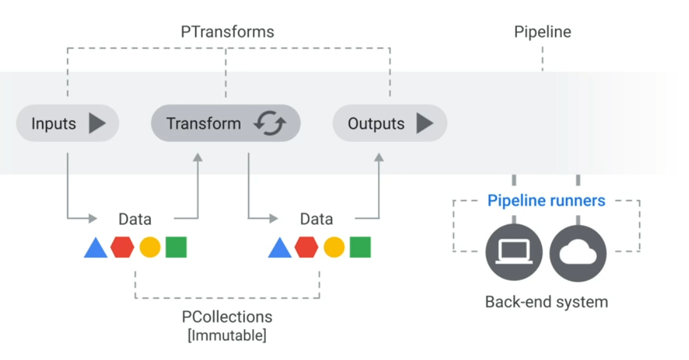
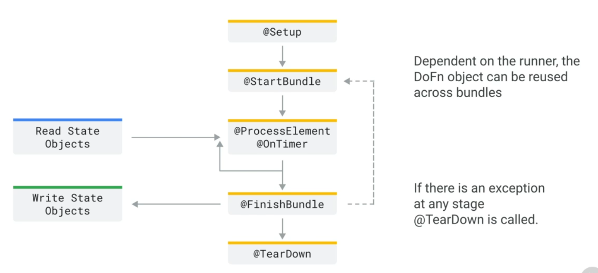
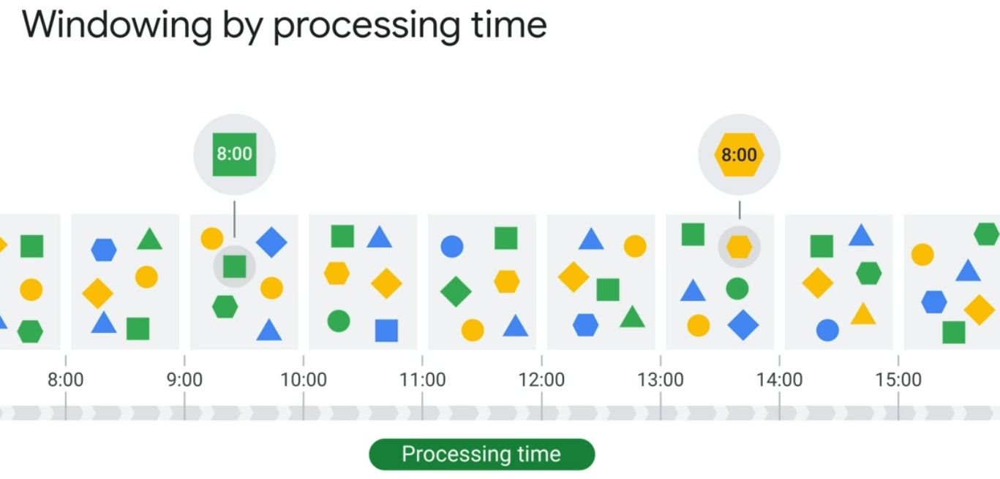
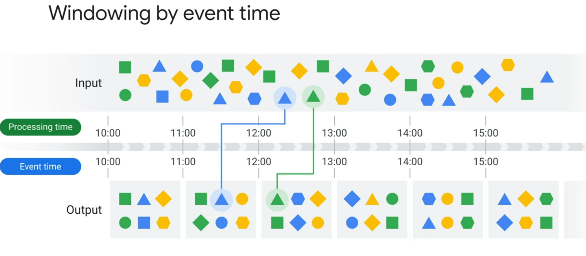
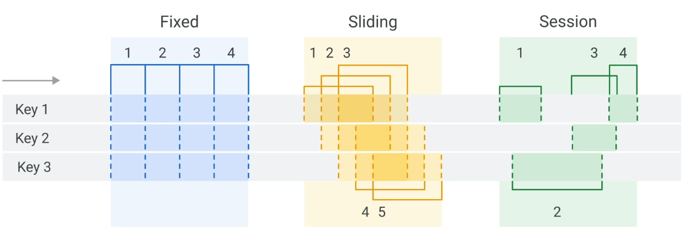
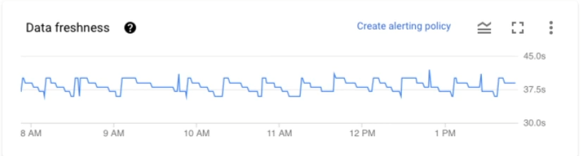
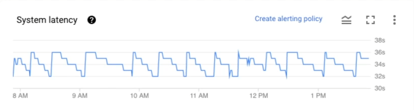
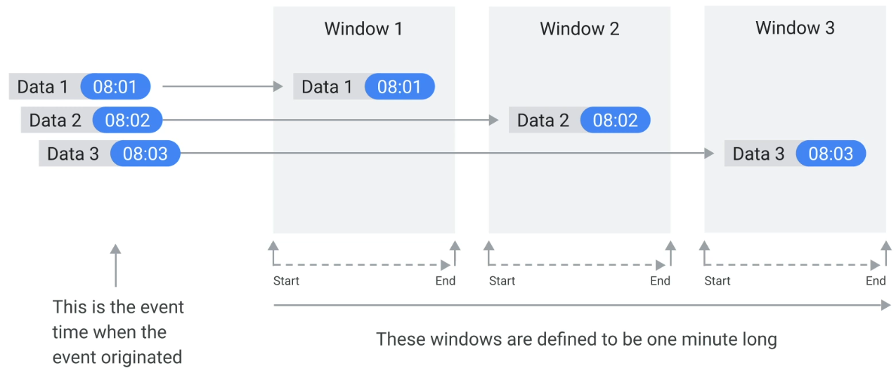
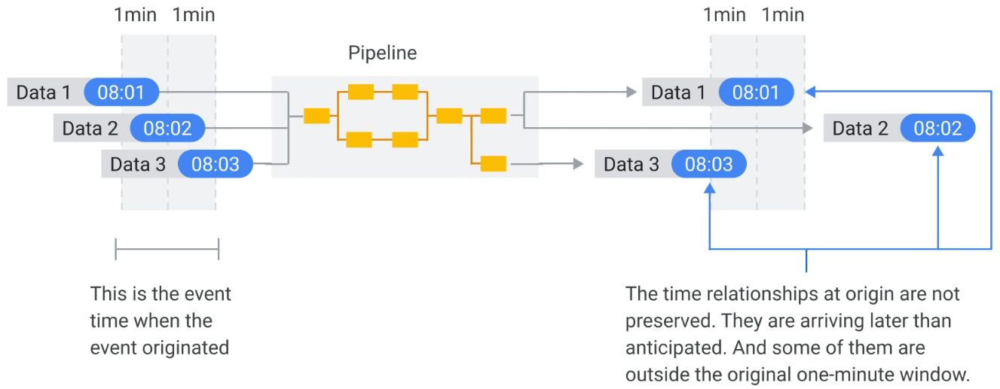
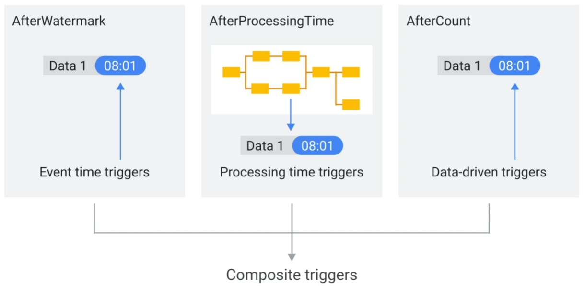

+++
title = "Apache Beam - Dataflow"
tags = [ "apache beam", "dataflow", "serverless" ]
author = "Me"
showToc = true
TocOpen = false
draft = false
hidemeta = false
comments = false
disableShare = false
disableHLJS = false
hideSummary = false
searchHidden = true
ShowReadingTime = true
ShowBreadCrumbs = true
ShowPostNavLinks = true
ShowWordCount = true
ShowRssButtonInSectionTermList = true
UseHugoToc = true
weight= 10
+++


## For Updates

- [Apache Beam Blog and Release](https://beam.apache.org/blog/)
- [Beam Learning Resources](https://beam.apache.org/documentation/resources/learning-resources)
- [Java Examples](https://github.com/apache/beam/tree/master/examples)
- [Beam Katas Learnings](https://github.com/apache/beam/tree/master/learning/katas)
- [Quick Python Snippets/Examples](https://github.com/apache/beam/tree/master/sdks/python/apache_beam/examples)

# Apache Beam

Apache Beam = **B**atch + Str**eam**

# Designing Pipelines

## What to consider

- Source: Messages, Database, Files, etc.
- Data Schema: The structure of the data (preferably lowest granularity). Data is represented as PCollection.
- Transforms: How to manipulate the data? transform, combine, filter, etc. Transforms on data is called PTransforms.
- Sink: Where to store the data? S3, BigQuery, etc.
- Runner: The execution environment. ([Look into compatibility matrix](https://beam.apache.org/documentation/runners/capability-matrix/))

## Beam Model



### Pipeline

A pipeline is a graph of transformations that a user constructs that defines the data processing they want to do.

### PCollection

Data being processed in a pipeline is part of a PCollection. Types of PCollections based on data source are:

- **Bounded**: it is finite and you know it, as in batch use cases
- **Unbounded**: it may never end, you don’t know, as in streaming use cases

Characteristics of PCollection:

- **Immutable**: State cannot change after it is constructed.
- **Serializable**: State of an object can be serialized and transferred in distributed ecosystem.

### PTransforms

The operations executed within a pipeline. These are best thought of as operations on PCollections.

### SDK

A language-specific library for pipeline authors (we often call them “users” even though we have many kinds of users) to build transforms, construct their pipelines and submit them to a runner

### Runner

You are going to write a piece of software called a runner that takes a Beam pipeline and executes it using the capabilities of your data processing engine.

:exclamation: **Note:** Apache beam supports multiple backend like Dataflow, Spark, Flink, etc. [Apache Beam feature compatibility matrix](https://beam.apache.org/documentation/runners/capability-matrix/) :exclamation:

## Transforms

Transforms are what change your data.

```sh
[Final Output PCollection] = [Initial Input PCollection].apply([First Transform])
    .apply([Second Transform])
    .apply([Third Transform]);
```

[Java Transform Catalog](https://beam.apache.org/documentation/transforms/java/overview/)
[Python Transfrom Catalog](https://beam.apache.org/documentation/transforms/python/overview/)

### ParDo

ParDo is a Beam transform for generic parallel processing. The ParDo processing paradigm is similar to the “Map” phase of a Map/Shuffle/Reduce-style algorithm.

ParDo is useful for a variety of common data processing operations, including:

- Filtering a data set.
- Formatting or type-converting each element in a data set.
- Extracting parts of each element in a data set.
- Performing computations on each element in a data set.

#### DoFn Lifecycle



```python
class DoFn(beam.DoFn):
    def setup(self):
      pass
    def startBundle(self):
      pass
    def process(self, element):
      pass
    def finishBundle(self):
      pass
    def teardown(self):
      pass
```

### Branching

Single PCollection output to multiple PCollections.

```python
numbers = p | beam.Create([1, 2, 3, 4, 5])

    mult5_results = numbers | beam.Map(lambda num: num * 5)
    mult10_results = numbers | beam.Map(lambda num: num * 10)

    mult5_results | "Log multiply 5" >> LogElements(prefix="Multiplied by 5: ")
    mult10_results | "Log multiply 10" >> LogElements(prefix="Multiplied by 10: ")
```

Output:

```sh
Multiplied by 10: 10
Multiplied by 5: 5
Multiplied by 10: 20
Multiplied by 5: 10
Multiplied by 10: 30
Multiplied by 5: 15
Multiplied by 10: 40
Multiplied by 5: 20
Multiplied by 10: 50
Multiplied by 5: 25
```

### GroupByKey

```python
        p
        | beam.Create(["apple", "ball", "car", "bear", "cheetah", "ant"])
        | beam.Map(lambda word: (word[0], word))
        | beam.GroupByKey()
        | LogElements()
```

Output:

```sh
('a', ['apple', 'ant'])
('b', ['ball', 'bear'])
('c', ['car', 'cheetah'])
```

### CoGroupByKey

Group By Key for multiple List of Key Value Pairs.

```python
def apply_transforms(fruits, countries):
    def map_to_alphabet_kv(word):
        return (word[0], word)

    def cogbk_result_to_wordsalphabet(cgbk_result):
        (alphabet, words) = cgbk_result
        return WordsAlphabet(alphabet, words["fruits"], words["countries"][0])

    fruits_kv = fruits | "Fruit to KV" >> beam.Map(map_to_alphabet_kv)
    countries_kv = countries | "Country to KV" >> beam.Map(map_to_alphabet_kv)

    return (
        {"fruits": fruits_kv, "countries": countries_kv}
        | beam.CoGroupByKey()
        | beam.Map(cogbk_result_to_wordsalphabet)
    )


with beam.Pipeline() as p:

    fruits = p | "Fruits" >> beam.Create(
        ["apple", "banana", "cherry", "apricot", "b-fruit"]
    )
    countries = p | "Countries" >> beam.Create(["australia", "brazil", "canada"])

    (apply_transforms(fruits, countries) | LogElements())
```

Output:

```sh
WordsAlphabet(alphabet:'a', fruit='['apple', 'apricot']', country='australia')
WordsAlphabet(alphabet:'b', fruit='['banana', 'b-fruit']', country='brazil')
WordsAlphabet(alphabet:'c', fruit='['cherry']', country='canada')
```

### Partition

```python
def partition_fn(number, num_partitions):
    if number > 100:
        return 0
    else:
        return 1


with beam.Pipeline() as p:

    results = (
        p
        | beam.Create([1, 2, 3, 4, 5, 100, 110, 150, 250])
        | beam.Partition(partition_fn, 2)
    )

    results[0] | "Log numbers > 100" >> LogElements(prefix="Number > 100: ")
    results[1] | "Log numbers <= 100" >> LogElements(prefix="Number <= 100: ")
```

Output:

```
Number <= 100: 1
Number <= 100: 2
Number <= 100: 3
Number <= 100: 4
Number <= 100: 5
Number <= 100: 100
Number > 100: 110
Number > 100: 150
Number > 100: 250
```

### Aggregation

Aggregation - Count

```python
p | beam.Create(range(1, 11)) | beam.combiners.Count.Globally() | LogElements()
```

Output:

```sh
10
```

Aggregation - Average

```python
p | beam.Create(range(1, 11)) | beam.combiners.Mean.Globally() | LogElements()
```

Output:

```sh
5.5
```

### Combine

```python
PLAYER_1 = "Player 1"
PLAYER_2 = "Player 2"
PLAYER_3 = "Player 3"

with beam.Pipeline() as p:

    (
        p
        | beam.Create(
            [
                (PLAYER_1, 15),
                (PLAYER_2, 10),
                (PLAYER_1, 100),
                (PLAYER_3, 25),
                (PLAYER_2, 75),
            ]
        )
        | beam.CombinePerKey(sum)
        | LogElements()
    )
```

Output:

```sh
('Player 1', 115)
('Player 2', 85)
('Player 3', 25)
```

### Side Input

```python
with beam.Pipeline() as p:

    cities_to_countries = {
        "Beijing": "China",
        "London": "United Kingdom",
        "San Francisco": "United States",
        "Singapore": "Singapore",
        "Sydney": "Australia",
    }

    persons = [
        Person("Henry", "Singapore"),
        Person("Jane", "San Francisco"),
        Person("Lee", "Beijing"),
        Person("John", "Sydney"),
        Person("Alfred", "London"),
    ]

    (
        p
        | beam.Create(persons)
        | beam.ParDo(EnrichCountryDoFn(), cities_to_countries)
        | LogElements()
    )
```

Output:

```sh
Person[Henry,Singapore,Singapore]
Person[Jane,San Francisco,United States]
Person[Lee,Beijing,China]
Person[John,Sydney,Australia]
Person[Alfred,London,United Kingdom]
```

### Side Output

```sh
with beam.Pipeline() as p:

    results = (
        p
        | beam.Create([10, 50, 120, 20, 200, 0])
        | beam.ParDo(ProcessNumbersDoFn()).with_outputs(
            num_above_100_tag, main=num_below_100_tag
        )
    )

    results[num_below_100_tag] | "Log numbers <= 100" >> LogElements(
        prefix="Number <= 100: "
    )
    results[num_above_100_tag] | "Log numbers > 100" >> LogElements(
        prefix="Number > 100: "
    )
```

Output:

```sh
Number <= 100: 10
Number <= 100: 50
Number > 100: 120
Number <= 100: 20
Number > 100: 200
Number <= 100: 0
```

## Composite Transforms

Adding Multiple transforms, Creating your own transforms.

```python
class ExtractAndMultiplyNumbers(beam.PTransform):
    def expand(self, pcoll):
        return (
            pcoll
            | beam.FlatMap(lambda line: map(int, line.split(",")))
            | beam.Map(lambda num: num * 10)
        )


with beam.Pipeline() as p:

    (
        p
        | beam.Create(["1,2,3,4,5", "6,7,8,9,10"])
        | ExtractAndMultiplyNumbers()
        | LogElements()
    )
```

Output:

```sh
10
20
30
40
50
60
70
80
90
100
```

## Windowing

Windowing is very useful

- Batch Processing:
  - Handling Chunked data.
- Streaming Processing:
  - Dealing with out of order data.

Grouping operations work on windows, for example:

- Bounded data source, can wait till it receives all elements (not memory efficient though)
- GroupByKey, Combine operations from unbounded data is split into windows for processing. (memory efficient)

Windowing is performed on timestamps.





- We can assign our own timestamp to each element. i.e. Processing Time
- We can use the event time if already present in the element. i.e. Event Time
  - Late arriving data is placed in correct global windows (In order output)

> :exclamation: Note: Beam’s default windowing behavior is to assign all elements of a PCollection to a single, global window and discard late data, even for unbounded PCollections. Before you use a grouping transform such as GroupByKey on an unbounded PCollection, you must do at least one of the following:
>
> - Set a non-global windowing function. See Setting your PCollection’s windowing function.
> - Set a non-default trigger. This allows the global window to emit results under other conditions, since the default windowing behavior (waiting for all data to arrive) will never occur. :exclamation:



### Fixed Time Windows

Window to divide a PCollection into fixed windows, each 60 seconds in length

```python
from apache_beam import window
fixed_windowed_items = (
    items | 'window' >> beam.WindowInto(window.FixedWindows(60)))
```

### Sliding Time Windows

Window to divide a PCollection into sliding time windows. Each window is 30 seconds in length, and a new window begins every five seconds

```python
from apache_beam import window
sliding_windowed_items = (
    items | 'window' >> beam.WindowInto(window.SlidingWindows(30, 5)))
```

### Session Windows

Window to divide a PCollection into session windows, where each session must be separated by a time gap of at least 10 minutes (600 seconds), These are **data dependent** windows.

```python
from apache_beam import window
session_windowed_items = (
    items | 'window' >> beam.WindowInto(window.Sessions(10 * 60)))
```

### Single Global Window

If your PCollection is bounded (the size is fixed), you can assign all the elements to a single global window. The following example code shows how to set a single global window for a PCollection

```python
from apache_beam import window
global_windowed_items = (
    items | 'window' >> beam.WindowInto(window.GlobalWindows()))
```

### Data Freshness and System latency

Data freshness is the amount of time between the real time and the output watermark (oldest unprocessed element).



System latency is the current maximum duration that an item of data has been processing or awaiting processing.



#### Data flow Autoscaling Metric

|                                | Stable Data freshness                          | Ever Increasing data freshness                                               |
| ------------------------------ | ---------------------------------------------- | ---------------------------------------------------------------------------- |
| Stable System Latency          | Good Pace (Relax)                              | Data Accumulation (High Backlog Autoscale)                                   |
| Ever increasing system latency | Complex Processing, (High CPU Usage Autoscale) | Complex Processing and Data Accumulation (High Backlog & High CPU Autoscale) |

## Watermarks

Watermark is a timestamp that is used to determine the close of a window.

Window = [Start Time, End Time]
Watermark = [Start Time, End Time + Max Allowed Lag time]

Just in Time: Within the watermark.
Late Data: Outside the watermark.

### Ideal Window Processing



### Latency in data

Latency in data may occur due to various reasons:

- Late arrival - network latency
- Different data processing times.etc...

**Lag Time**: Its is defined as the difference in time it is expected to arrive and when it actually arrives.



#### Managing Late Data

A windowing strategy that will allow late data up to two days after the end of a window.

```python
  pc | beam.WindowInto(
              FixedWindows(60),
              trigger=trigger_fn,
              accumulation_mode=accumulation_mode,
              timestamp_combiner=timestamp_combiner,
              allowed_lateness=Duration(seconds=2*24*60*60)) # 2 days
```

### Adding timestamps to raw data

```python
class AddTimestampDoFn(beam.DoFn):
  def process(self, element):
    # Extract the numeric Unix seconds-since-epoch timestamp to be
    # associated with the current log entry.
    unix_timestamp = extract_timestamp_from_log_entry(element)
    # Wrap and emit the current entry and new timestamp in a
    # TimestampedValue.
    yield beam.window.TimestampedValue(element, unix_timestamp)

timestamped_items = items | 'timestamp' >> beam.ParDo(AddTimestampDoFn())
```

## Triggers

Triggers determine when to emit aggregated results(pane) from a window.



### Event Time Triggers

Operate on event time.

### Processing Time Triggers

Operate on processing time.

### Data Driven Triggers

Operates by examining the data arrives and firing when it meets a certain condition.

### Composite Triggers

Combination of multiple triggers.
Composite trigger that fires whenever the pane has at least 100 elements, or after a minute.

```python
pcollection | WindowInto(
    FixedWindows(1 * 60),
    trigger=Repeatedly(
        AfterAny(AfterCount(100), AfterProcessingTime(1 * 60))),
    accumulation_mode=AccumulationMode.DISCARDING)
```

#### Window Accumulation Modes

Accumulated triggered data and resend or drop already triggered data.

#### Accumulation Mode

```python
pcollection | WindowInto(  # Sliding windows of 1 minute, every 5 seconds
  SlidingWindows(60, 5),   # Relative to watermark, trigger:
  trigger=AfterWatermark(
    early=AfterProcessingTime(delay=30),  # -- fires 30 seconds after pipeline start
    late=AfterCount(1)),  # -- fires when at least one element is late
  accumulation_mode=AccumulationMode.ACCUMULATING) # the pane should have all elements
```

#### Discarding Mode

```python
pcollection | WindowInto(  # Fixed windows of 60 seconds
  FixedWindows(60),
  trigger=Repeatedly(
    AfterAny(AfterCount(100), AfterProcessingTime(1 * 60))), # -- fires after 100 elements or 1 minute
  accumulation_mode=AccumulationMode.DISCARDING)  # trigger on new records
  allowed_lateness=Duration(seconds=2*24*60*60)) # 2 days
```

## Sources and Sinks (IO)

Source: Input data
Sink: Output data

Bounded Sources (Batch): BigQuery, Cloud Storage, Cloud Spanner

- Split work into smaller chunks, known as bundles.
- Provide estimate of progress.
- Track if units of work can be broken into smaller bundles (**Dynamic work rebalancing**).

Unbounded Sources (Stream): Pub/Sub

- Checkpointing not to read same data.
- Provide data to service on what point the data is complete using watermarks.
- Deduping data using record/message ID.

[List of Beam IO](https://beam.apache.org/documentation/io/built-in/)
[Developing Custom IO](https://github.com/apache/beam/tree/master/website/www/site/content/en/documentation/io)

### Text IO

```python
# Read from text
    (
        p
        | beam.io.ReadFromText(file_path)
        | beam.Map(lambda country: country.upper())
        | LogElements()
    )

# File io reading with file names
with beam.Pipeline() as p:
  read_pipeline = (
      p
      | fileio.MatchFiles(file_pattern) # match file patter like hdfs://path/to/*.txt
      | fileio.ReadMatches() # read file
      | beam.Reshuffle() # shuffle data
  file_and_metadata = (
      read_pipeline
      | beam.Map(lambda x: (x.metadata.path, x.read_utf8())) # Access file metadata

# FileIO processing files as they arrive
p.apply(
  FileIO.match()
    .file_pattern(file_pattern)
    .continuously(  # continuously read files
      Duration.standardSeconds(30),
      Watch.Growth.afterTimeSinceNewOutput(Duration.standardHours(1)) # Every 30 seconds for 1 hour
    )

# GCS Buckets have watch functionality to monitor for new files and send a notification to a topic
with beam.Pipeline() as p:
  read_files = (
    p
    | beam.io.ReadFromPubSub(subscription_details)
    | <decode file name>

  files_and_content = (
    read_files | ReadAllFromText())

# Write to file
csv.apply(
  "Write to storage",
  TextIO.write().to(file_path).withSuffix(".csv")

# Writing to dynamic destination
my_pcollection
| beam.io.fileio.WriteToFiles(
  path='/my/file/path',
  destination=lambda record: 'avro'
    if record['type'] == 'A' else 'csv'
  sink=lambda destination, AvroSink()
    if destination == 'avro' else CsvSink(),  file_naming=beam.io.fileio.destination_prefix_naming())
```

### BigQueryIO

```python
# Read from BigQuery (Using query)
max_temparatures = (
  p
  | 'QueryTable' >> beam.io.ReadFromBigQuery(query='SELECT max_temperature FROM clouddataflow-readonly.samples.weather_stations', use_standard_sql=True) # Source using big query
  | 'ExtractMaxTemp' >> beam.Map(lambda row: (row['max_temperature'])) # Map results
)
```

```java
// Read from BigQuery (Using BigQuery Storage API)
pipeline.apply("Read from BiqQuery table",
  BigQueryIO.readTableRows()
    .from(String.format("%s:%s.%s", projectId, datasetId, tableId))
      .withMethod(BigQueryIO.Read.Method.DIRECT_READ)
        .withRowRestriction
        .withSelectedFields(Arrays.asList("max_temperature")))
    .apply("TableRows to MyData",
      MapElements.into(TypeDescriptors.of(MyData.class))
      .via(MyData::fromTableRow));
```

```python
# BigQuery IO Write - Dynamic destination
def table_fn(element, fictional_characters):
  if element in fictional_characters:
    return 'my_dataset.fictional_quotes'
  else:
    return 'my_dataset.real_quotes'

quotes | 'WriteWithDynamicDestination' >> beam.io.WriteToBigQuery(
  table_fn,
  schema=table_schema, #'quote:STRING,author:STRING,length:INTEGER'
  table_side_inputs=fictional_characters_view,)
```

### PubSub IO

```python
# reading from pubsub topic
p.apply("Read from PubSub",
  PubsubIO.ReadStrings().from_topic(topic_name))
.apply(WindowInto(FixedWindows.of(Duration.standardMinutes(window_size))))
```

### Kafka IO

```java
// Read from Kafka topics
PCollection<KV<String, String>> kafka_messages =
  pipeline.apply("Read from Kafka",
    KafkaIO.<String, String>read()
      .withConsumerConfigUpdates(ImmutableMap.of(
        ConsumerConfig.AUTO_OFFSET_RESET_CONFIG, "earliest"
      ))
      .withBootstrapServers(options.get("bootstrap.servers")) // "localhost:9092"
      .withTopics(list_of_topics) // "my-topic"
      .withKeyDeserializerAndCoder(CustomKeyDeserializer.class)
      .withValueDeserializerAndCoder(CustomValueDeserializer.class));
      .withoutMetadata());
```

> Note: KafkaIO is built in java for python it uses cross language transforms.

```python
# read from a kafka topic
pipeline | 'Read from Kafka' >> beam.io.ReadFromKafka(
  consumer_config={
    'bootstrap.servers': bootstrap_servers,
    topics: [topic],
  },
)
```

### BigTable IO

```java
// Read from big table with row filter
PCollection<BigTableWriteResults> writeResults =  p.apply("Read from BigTable",
  BigtableIO.Read()
    .withProjectId(project_id)
    .withInstanceId(instance_id)
    .withTableId(table_id)
    .withRowFilter(RowFilter.chain()));

// Read with column filter and ByteKeyRange is also available.

// BigTable IO Writing with additional actions
PCollection<T> moreData = ...;
moreData.apply("wait for writes", Wait.on(writeResults))
  .apply("Do Something", ParDo.of(customOperation()));
```

## Schema

A schema describes a type in terms of fields and its values.

- Fields can have string names or numeric indices.
- Field can be one of primitive types (string, int, float, bool, bytes) or a composite type (a list or a map).
- Fields can be optional, repeated, or nullable.

Schemas can be Avro, ProtoBuf, or JSON.

```java
// Schemas can be inferred at the sources
PCollection<Purchase> purchase = p.apply(PubSubIO.readAvros(Purchase.class).from_topic(topic_name));

// With Schema filtering purchases in a geographic region
purchase.apply(
  Filter.whereFieldName("location.lat",(double lat) -> lat > 40.0 && lat < 45.0)
  .whereFieldName("location.lon",(double lon) -> lon > -74.0 && lon < -70.0);

// Total purchase per transaction
PCollection<UserPurchases> userSums =  purchase.apply(Join.innerJoin(transactions).using(transactionId))
  .apply(Select.fieldNames("lhs.userId", "rhs.totalPurchase"))
  .apply(Group.ByField("userId").aggregate(Sum.ofLongs(), "totalPurchase"));
```

## State and Timers

Stateful Transformations in ParDo

- The input collection needs to be a PCollection of KV<>.
- Any Stateful computations are stored in a local persistent mutable state, it is partitioned by key and window.

Types of State Variables:

- Value: Read/Write any value (but always the whole value).
- Bag: Cheap Append no ordering on read.
- Combining: Associative and Commutative compaction.
- Map: Read/Write just keys you specify.
- Set: Membership Checking.

Timers ensure the state is cleared in regular intervals. Using

- Event time Timers
  - Output based on completeness of data
  - Absolute times(at 5 AM)
  - Final/Authoritative output
- Processing time Timers
  - Timeouts
  - Relative Times (every 5 mins)
  - Periodic output based on state


```python
# Stateful Buffering
class StatefulBufferingFn(beam.DoFn):
  MAX_BUFFER_SIZE = 500;
  BUFFER_STATE = BagStateSpec('buffer', EventCoder())
  COUNT_STATE = CombiningValueStateSpec('count',
                                        VarIntCoder(),
                                        combiners.SumCombineFn())

  def process(self, element,
              buffer_state=beam.DoFn.StateParam(BUFFER_STATE),
              count_state=beam.DoFn.StateParam(COUNT_STATE)):

    buffer_state.add(element)

    count_state.add(1)
    count = count_state.read()

    if count >= MAX_BUFFER_SIZE:
      for event in buffer_state.read():
        yield event
      count_state.clear()
      buffer_state.clear()

# Stateful Buffering with Event Time timer
class StatefulBufferingFn(beam.DoFn):
  EXPIRY_TIMER = TimerSpec('expiry', TimeDomain.WATERMARK)

  def process(self, element,
              w=beam.DoFn.WindowParam,
              buffer_state=beam.DoFn.StateParam(BUFFER_STATE),
              count_state=beam.DoFn.StateParam(COUNT_STATE),
              expiry_timer=beam.DoFn.TimerParam(EXPIRY_TIMER)):

    expiry_timer.set(w.end + ALLOWED_LATENESS)

    … same logic as above …

  @on_timer(EXPIRY_TIMER)
  def expiry(self,
             buffer_state=beam.DoFn.StateParam(BUFFER_STATE),
             count_state=beam.DoFn.StateParam(COUNT_STATE)):
    events = buffer_state.read()

    for event in events:
      yield event

    buffer_state.clear()
    count_state.clear()

# Stateful processing with Processing time timer
class StatefulBufferingFn(beam.DoFn):
  STALE_TIMER = TimerSpec('stale', TimeDomain.REAL_TIME)

  MAX_BUFFER_DURATION = 1

  def process(self, element,
              w=beam.DoFn.WindowParam,
              buffer_state=beam.DoFn.StateParam(BUFFER_STATE),
              count_state=beam.DoFn.StateParam(COUNT_STATE),
              expiry_timer=beam.DoFn.TimerParam(EXPIRY_TIMER),
              stale_timer=beam.DoFn.TimerParam(STALE_TIMER)):

    if count_state.read() == 0:
      stale_timer.set(time.time() + StatefulBufferingFn.MAX_BUFFER_DURATION)

    … same logic as above …

  @on_timer(STALE_TIMER)
  def stale(self,
            buffer_state=beam.DoFn.StateParam(BUFFER_STATE),
            count_state=beam.DoFn.StateParam(COUNT_STATE)):
    events = buffer_state.read()

    for event in events:
      yield event

    buffer_state.clear()
    count_state.clear()

```

Use Cases:

- Domain Specific triggering ("output when five people who live in Seattle have check in")
- Slowly Changing Dimensions("Update FX rates for a currency")
- Streaming Joins
- Fine Grained Aggregations
- Per key workflows

[Timely Processing](https://beam.apache.org/blog/timely-processing/)

## [Splittable DoFn](https://beam.apache.org/blog/splittable-do-fn/)


With Spilttable DoFn's the processing can be split into bundles based on backlog, this unifies batch and stream processing and doesn't differentiate between bounded and unbounded source.

The SourceIO is responsible for providing backlog estimate and watermark checkpoints, the runner can use this information to tune its execution and performance.

```python
class FileToWordsRestrictionProvider(beam.transforms.core.RestrictionProvider
                                       ):
    def initial_restriction(self, file_name):
      return OffsetRange(0, os.stat(file_name).st_size)

    def create_tracker(self, restriction):
      return beam.io.restriction_trackers.OffsetRestrictionTracker()

    def split(self, file_name, restriction):
      # Compute and output 64 MiB size ranges to process in parallel
      split_size = 64 * (1 << 20)
      i = restriction.start
      while i < restriction.end - split_size:
        yield OffsetRange(i, i + split_size)
        i += split_size
      yield OffsetRange(i, restriction.end)

  class FileToWordsFn(beam.DoFn):
    def process(
        self,
        file_name,
        # Alternatively, we can let FileToWordsFn itself inherit from
        # RestrictionProvider, implement the required methods and let
        # tracker=beam.DoFn.RestrictionParam() which will use self as
        # the provider.
        tracker=beam.DoFn.RestrictionParam(FileToWordsRestrictionProvider())):
      with open(file_name) as file_handle:
        file_handle.seek(tracker.current_restriction.start())
        while tracker.try_claim(file_handle.tell()):
          yield read_next_record(file_handle)

    # Providing the coder is only necessary if it can not be inferred at
    # runtime.
    def restriction_coder(self):
      return ...
```

# Cross Language Transforms

Transforms can be shared among SDKs in different languages.


# Best Practices

## AutoValue generation

```java
// use AutoValue Class builder to generate POJO's when not using beam schemas
@DefaultSchema(AutoValueSchema.class)
@AutoValue
public abstract class TransactionValue {
  public abstract String getBank();
  public abstract double getPurchaseAmount();
}
```

## Using Schema

Use Schemas to define the schema of the PCollection.

```python
import typing

class Purchase(typing.NamedTuple):
  user_id: str  # The id of the user who made the purchase.
  item_id: int  # The identifier of the item that was purchased.
  shipping_address: ShippingAddress  # The shipping address, a nested type.
  cost_cents: int  # The cost of the item
  transactions: typing.Sequence[Transaction]  # The transactions that paid for this purchase (a list, since the purchase might be spread out over multiple credit cards).
```

## Dead Lettering

In message queueing the dead letter queue is a service implementation to store messages that meet one or more of the following criteria:

- Message that is sent to a queue that does not exist.
- Queue length limit exceeded.
- Message length limit exceeded.
- Message is rejected by another queue exchange.
- Message reaches a threshold read counter number, because it is not consumed. Sometimes this is called a "back out queue".
- The message expires due to per-message TTL (time to live)
- Message is not processed successfully.

Dead letter queue storing of these messages allows developers to look for common patterns and potential software problems

```java
final TupleTag<String> deadLetterTag = new TupleTag<>("deadLetter");
final TupleTag<String> successTag = new TupleTag<>("success");

PCollection input =/**/;

PCollectionTuple output = input.apply(ParDo.of(new DoFn<String, String>() {
  @ProcessElement
  public void processElement(ProcessContext c) {
    String element = c.element();
    try{
      c.output(process(c.element()));
    } catch (Exception e) {
      c.sideOutput(deadLetterTag, c.element);
    }
  }
})).writeOutPutTags(successTag, TupleTagList.of(deadLetterTag));

// Write dead letter elements to separate sink (Preferred BigQuery sink)
output.get(deadLetterTag).apply(TextIO.write().to("/tmp/deadLetter"));

// Process the successful elements
output.get(successTag).apply(TextIO.write().to("/tmp/success"));
```

## Json Data Handling

```java
// AutoValue Schema for Person
@DefaultSchema(AutoValueSchema.class)
@AutoValue
abstract static class Person {
  public static Person of(String name, Integer height, Boolean knowsJavascript) {
    return new AutoValue_ToJsonTest_Person(name, height, knowsJavascript);
  }
  public abstract String getName();
  public abstract Integer getHeight();
  public abstract Boolean getKnowsJavascript();
}
// Schema for Person
Schema personSchema =
      Schema.builder()
          .addStringField("name")
          .addInt32Field("height")
          .addBooleanField("knowsJavascript")
          .build();

// Convert Person to Json
  PCollection<Row> personRows =
      persons.apply(ToJson.of()).apply(JsonToRow.withSchema(personSchema));

// Convert Json to Person
PCollection<Person> persons = json.apply(
    JsonToRow.withSchema(personSchema)).apply(Convert.to(Person.class));

// Use dead letter sink for failed messages
```

[JsonUtils.java](https://github.com/GoogleCloudPlatform/dataflow-sample-applications/blob/master/retail/retail-java-applications/data-engineering-dept/business-logic/src/main/java/com/google/dataflow/sample/retail/businesslogic/core/utils/JSONUtils.java)

## Utilize DoFn LifeCycle

Use DoFn for micro batching

```python
class DoFn(beam.DoFn):
    def setup(self):
      pass
    def startBundle(self):
      # Start Micro batch operations to external services
      pass
    def process(self, element):
      pass
    def finishBundle(self):
      # Finish Micro batch operations to external services
      pass
    def teardown(self):
      pass
```

## Performance Considerations/Optimizations

- Move steps that reduce data up the pipeline to reduce data volume, like filtering.
- Apply data transforms serially and let Dataflow optimize the DAG, multiple steps can be fused in a single stage for execution in the same worker node.
- External systems
  - look out for back pressure, ensure system is configured for peak volume
  - Enable autoscaling to downscale if workers are underutilized.
- Use Efficient Coders, i.e, when only part of the data needs to be deserialized for the pipeline and other information can be masked, use such coder's like AvroCoders and ProtoCoders.
- Use Window + Combine using keys when dealing with large windowed aggregations.
- Use Reshuffling and SideInputs to next steps in dataflow during Fan out operations (One element generates multiple elements), These reshuffling work re-balancing to kick in without any fusion operation which may act as a bottleneck on executing that in a single worker.
- Use less logging, and dead letter patterns for error logging with count. i.e, Request to /api/service failed 10 times, rather than writing the log 10 times.
- [Data Skew](https://cloud.google.com/blog/products/gcp/writing-dataflow-pipelines-with-scalability-in-mind) in keys may cause high load on few workers, like null key may have 500elements/sec and other keys may be significantly less. Use **enableHotKeyLogging** to detect these keys and try using fan outs and reshuffling.
- Key Space and Parallelism
  - Low Parallelism (Too Few Keys) - Use Window + Key
  - High Parallelism (Too Many keys) - use hashing and decrease keys
- Don't use compressed text files as a source this clogs source
  - Only one machine can read compressed file.
  - Fused stages will need to run on the same worker.
  - A single machine will need to push data from the file to all other machines.
- Collocation of other services helps in performance (Same region/zone)
- Use Dataflow Shuffle/FlexRs for Batch and Use Streaming Engine for Streaming pipelines.

[Dataflow Patterns - 1](https://cloud.google.com/blog/products/data-analytics/guide-to-common-cloud-dataflow-use-case-patterns-part-1)
[Dataflow Patterns - 2](https://cloud.google.com/blog/products/data-analytics/guide-to-common-cloud-dataflow-use-case-patterns-part-2)
[Beam pipeline patterns](https://beam.apache.org/documentation/patterns/overview/)

# Beam SQL

Beam SQL allows a Beam user (currently only available in Beam Java and Python) to query bounded and unbounded PCollections with SQL statements.

Features:

- Works on stream and batch inputs.
- Can be embedded in an existing pipeline using SqlTransform, which can be mixed with PTransforms.
- Supports User defined functions.
- Supports multiple dialects
  - Beam Calcite SQL (OSS SQL dialect Compatibility)
  - Google ZetaSQL (BigQuery compatible)
- Integrated with Schema.
- Stream aggregation supports windowing.

## Components

| Name            | Description                             |
| --------------- | --------------------------------------- |
| BigQuery UI     | Analytical Queries over historical data |
| Dataflow SQL UI | Analytical Queries over real-time data  |
| Beam SQL        | Integrating SQL within Beam Pipelines   |

```java
// Updating SQL statements in existing Beam SQL pipeline
String sql = "SELECT MY_FUNC(c1), c2 FROM PCOLLECTION";
PColl<Row> result = pipeline.apply(SqlTransform.query(sql)
    .addUdf(MY_FUNC, MyFunc.class));

// Dataflow SQL Template
Pipeline pipeline = Pipeline.create();

DataCatalogTableProvider tableProvider = DataCatalogTableProvider.create(options);

SqlTransform sqlTransform = p.apply(SqlTransform.query(options.getQueryString()).withDefaultTableProvider(tableProvider));

for(Output output : options.getOutputs()) {
  sqlTransform.apply(createSink(output, tableProvider));
}

pipeline.run();
```

## [Dataflow SQL](https://cloud.google.com/dataflow/docs/guides/sql/dataflow-sql-intro)

Features:

- Beam ZetaSQL SqlTransform in Dataflow flex template
- Acts as an optional engine for long running batch jobs.

Syntax:

```
# We can specify other dataflow pipeline options also
gcloud dataflow sql query \
  --job-name=JOB_NAME \
  --region=REGION \
  --bigquery-table=BIGQUERY_TABLE \
  --bigquery-dataset=BIGQUERY_DATASET \
  --bigquery-project=BIGQUERY_PROJECT \
  --parameter=NAME:TYPE:VALUE \
'SQL_QUERY'
```

```sh
# Sample Queries with parameters
gcloud dataflow sql query \
  --job-name=job-name \
  --region=region \
  --bigquery-dataset=destination-dataset \
  --bigquery-table=destination-table \
  --parameter=status:STRING:dropoff \
  --parameter=price_min:FLOAT64:5.5 \
'SELECT *
FROM pubsub.topic.`pubsub-public-data`.`taxirides-realtime`
WHERE
  ride_status = @status
  AND meter_reading >= @price_min'

# With Arrays
gcloud dataflow sql query \
  --job-name=job-name
  --region=region
  --bigquery-dataset=destination-dataset \
  --bigquery-table=destination-table \
  --parameter='status:ARRAY<STRING>:["pickup", "enroute", "dropoff"]' \
'SELECT *
FROM pubsub.topic.`pubsub-public-data`.`taxirides-realtime`
WHERE
  ride_status IN UNNEST(@status)'

# With Structs
gcloud dataflow sql query \
  --job-name=job-name \
  --region=region \
  --bigquery-dataset=destination-dataset \
  --bigquery-table=destination-table \
  --parameter='date_min:STRING:2020-01-01 00:00:00.000 UTC' \
'SELECT *
FROM pubsub.topic.`pubsub-public-data`.`taxirides-realtime`
WHERE
  event_timestamp >= TIMESTAMP (@date_min)'
```

[Creating external Table](https://beam.apache.org/documentation/dsls/sql/extensions/create-external-table/)

[Data Sources and Destinations](https://cloud.google.com/dataflow/docs/guides/sql/data-sources-destinations)

### Windowing

```sql
-- Fixed Windows
SELECT productid,
       Tumble_start(timestamp, INTERVAL 10 second) AS window_start,
       Count(transactionid)                        AS num_purchases
FROM   pubsub.topic.`instant-insights`.`retaildemo-online-purchase-json` AS pr
GROUP  BY productid,
          Tumble(timestamp, INTERVAL 10 second);

-- Sliding/Hopping windows
SELECT productid,
       Hop_start(timestamp, INTERVAL 10 second, INTERVAL 20 second) AS window_start,
       Hop_end(timestamp, INTERVAL 10 second, INTERVAL 20 second)   AS window_end,
       Count(transactionid)                                         AS num_purchases
FROM   pubsub.topic.`instant-insights`.`retaildemo-online-purchase-json` AS pr
GROUP  BY productid,
          Hop(timestamp, INTERVAL 10 second, INTERVAL 20 second);

-- Session Windows
SELECT userid,
       Session_start(timestamp, INTERVAL 10 minute) AS window_start,
       Session_end(timestamp, INTERVAL 10 minute)   AS window_end,
       Count(transactionid)                         AS num_transactions
FROM   pubsub.topic.`instant-insights`.`retaildemo-online-purchase-json` AS pr
GROUP  BY userid,
          Session(timestamp, INTERVAL 10 minute);
```

## [Beam DataFrames](https://beam.apache.org/documentation/dsls/dataframes/overview/#:~:text=The%20Apache%20Beam%20Python%20SDK,on%20the%20Pandas%20DataFrame%20API.)

# [Beam Notebooks](https://cloud.google.com/dataflow/docs/guides/interactive-pipeline-development)

# Dataflow


## [Developing and Testing Pipelines](https://cloud.google.com/architecture/building-production-ready-data-pipelines-using-dataflow-developing-and-testing)

- Developing Pipelines
- Testing Pipelines (CI/CD)
  - Unit Testing
  - Integration Testing
  - End To End Testing

### Pipeline Options

## [Deploying Pipelines](https://cloud.google.com/architecture/building-production-ready-data-pipelines-using-dataflow-deploying)

- Dataflow Snapshots
- Updating pipelines

## [Dataflow Flex Templates](https://cloud.google.com/dataflow/docs/guides/templates/using-flex-templates)

Google provides and list of [Steaming, Batch and other utility templates](https://cloud.google.com/dataflow/docs/guides/templates/provided-templates), Flex templates are a way of creating your custom pipeline and building a template using it for reusability.

## Network and Security

### Data locality

Regional endpoints

Features:

- Backend that deploys and controls Dataflow workers (Available in only few regions).
- Information flow -> Health Checks, Work Items, Autoscaling, Self healing, Failures, Job Metadata.

Use cases:

- Security and Compliance needs (Data should not leave the country).
- Minimize network latency and transport costs

Use Pipeline Options to specify --region and --zone endpoints.

### Configure Networking

#### Shared VPC

- Dataflow can use its own network or a subnet from host project.
- Number of VM's is constrained by IP block size. /29 subnet - max workers is 4.
- Dataflow requires Compute Network User role.
- Configurable by using --network and --subnet pipeline options(use one).

#### IP

- Use private IP's to secure data processing infrastructure. Block internet access.
- Access control is limited to
  - Same VPC Network
  - Other VPC Networks - VPC Peering.
- Pipeline options
  - Python: --no_use_public_ips
  - Java: usePublicIps=false.

### Encryption

Understanding datastore associated with Dataflow:

- Persistent Disks
- Storage Buckets
- Dataflow Shuffle Backend - Batch Jobs
- Streaming Engine Backend - Streaming Jobs

Encryption:

- Google Managed Encryption Key - Job metadata
- Customer Managed Encryption Key - Data keys stored in grouping operations use encryption

Cloud KMS CryptoKey Encrypter/Decrypter Role is required for Dataflow Service account.

Pipeline options

- Python: `--dataflow_kms_key=projects/$PROJECT/locations/$REGION/keyRings/$KEY_RING/cryptoKeys/$Key`
- Java: `--dataflowKmsKey=projects/$PROJECT/locations/$REGION/keyRings/$KEY_RING/cryptoKeys/$Key`

> Note: Only regional keys are supported, No Global keys.

## Reliability

Batch Pipelines

- Rerun the job if it fails
- Source data is not lost, and partial data written to sinks can be re-written

Stream Pipelines

- Protection against failure modes
  - User Code Failure
    - Transient Errors
    - Data Corruption
  - Service Failure
  - Zonal Failure
  - Regional Failure

### [Handling Failures](https://cloud.google.com/architecture/building-production-ready-data-pipelines-using-dataflow-deploying#pipeline_reliability_best_practices)

- A Batch pipeline get retried up to 4 times, until its marked ad failed.
- A Streaming pipeline can stall indefinitely, Handle Failures using
  - Monitoring pipeline metrics, data freshness, error log count, set up alerting polices.
  - Implement Dead Letter Sinks.
  - Dataflow is a regional service, avoid specifying zones, as it can avoid zonal outages. (Only on job start, a region or zone is immutable after job start)
  - Isolate data processing to one region or use multi regional source (US) and sinks(US) (Data will be synced later if there is any regional outage). Using a source(US-Central) in one region and sink(Us-West) in another have multiple point of failures due to cross regional dependency.
  - Use Pubsub Snapshots as a disaster recovery strategy to avoid data loss.
    - Reconciliation of data written in sinks
    - Message Reprocessing
    - Disrupts exactly once processing
  - Use Dataflow Snapshots
    - Restart a pipeline without reprocessing in-flight data
    - No data loss with minimum downtimes.
    - Options to create snapshot with pubsub source.
  - Snapshots are regional, we should wait for a region to come back online to restart processing.
  - Use High availability configurations considering downtime, data loss and cost.

## Dataflow Shuffle Service: Batch


Features:

- Faster Execution Time of batch pipeline.
- Reduced consumption on worker's CPU, memory and storage.
- Better autoscaling
- Better Fault tolerance

### Flexible Resource Scheduling (FlexRS)

Features:

- Reduce batch processing costs because of
  - Advanced Scheduling.
  - Dataflow Shuffle service.
  - Mix of preemptive and Standard VMs.
- Execution within 6 hours of job creation
- Suitable for non time-critical workloads.
- Early validation run at job submission.

## Dataflow Streaming Service


Features:

- Reduced consumption of worker CPU, memory and storage.
- Lower resource and quota consumption.
- More responsive to autoscaling
- Improved supportability

## [Monitoring and Debugging Pipelines](https://cloud.google.com/architecture/building-production-ready-data-pipelines-using-dataflow-monitoring)

# Further Reading

- [Beam Programming Guide](https://beam.apache.org/documentation/programming-guide/)
- [Streaming 101 World beyond batch](https://www.oreilly.com/radar/the-world-beyond-batch-streaming-101/)
- [Streaming 102 World beyond batch](https://www.oreilly.com/radar/the-world-beyond-batch-streaming-102/)
- [Understanding Watermarks](https://www.youtube.com/watch?v=TWxSLmkWPm4)
- [Cloud Dataflow How To](https://cloud.google.com/dataflow/docs/how-to)
