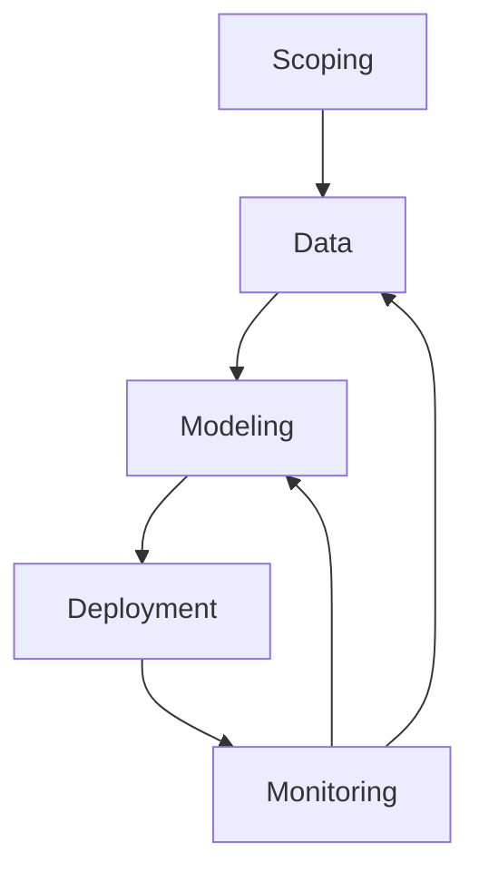

# Machine Learning

Machine Learning systems require more than just building accurate models—they need comprehensive lifecycle management, robust deployment strategies, and continuous monitoring to maintain performance in production. This section covers both the foundational algorithms and the systems engineering challenges of real-world ML applications.

## ML Systems Overview

Building successful ML systems involves four interconnected phases:



- **Scoping**: Define project goals, metrics, and constraints
- **Data**: Collect, clean, and prepare training data
- **Modeling**: Select architectures and train performant models
- **Deployment**: Launch with appropriate automation and rollback strategies
- **Monitoring**: Track performance, detect drift, and maintain systems

```{mermaid
graph LR
    subgraph "ML Challenges"
        F[Concept Drift]
        G[Data Drift]
        H[Software Engineering]
    end

    subgraph "Deployment Patterns"
        I[Shadow Mode]
        J[Canary]
        K[Blue-Green]
    end

    subgraph "Monitoring"
        L[Software Metrics]
        M[Input/Output Metrics]
        N[Pipeline Health]
    end

    F --> O[Addressed in Deployment]
    G --> O
    H --> O
    I --> P[Managed in Patterns]
    J --> P
    K --> P
    L --> Q[Tracked in Monitoring]
    M --> Q
    N --> Q
```

## Main Topics

### Systems & Deployment
- [ML Lifecycle](lifecycle/): Complete project management framework
- [Deployment Strategies](deployment/): Patterns, automation, and challenges
- [Monitoring Systems](monitoring/): Metrics, pipelines, and drift detection
- [Practical Examples](examples/): Real-world application case studies

### Technical Foundations
- [Feature Engineering](feature-engineering/): Data preprocessing and feature creation
- [Generative AI](genai/): Advanced models and applications
- [Optimization Techniques](optimization/): Gradient descent and hyperparameter tuning
- [Mathematics](math/): Core mathematical concepts

## Getting Started

Begin with the [ML Lifecycle](lifecycle/) to understand systematic ML system development, then explore [deployment challenges](deployment/) and [monitoring strategies](monitoring/) for production systems.



```markmap
# Machine Learning
  - **Fundamentals**
    - Supervised Learning
      - Classification vs Regression
      - Common Algorithms
        - Linear Regression
        - Logistic Regression
        - Decision Trees
        - Random Forest
        - Support Vector Machines (SVM)
        - k-Nearest Neighbors (kNN)
    - Unsupervised Learning
      - Clustering (K-Means, DBSCAN, Hierarchical)
      - Dimensionality Reduction (PCA, t-SNE, UMAP)
      - Anomaly Detection
    - Reinforcement Learning
      - Markov Decision Processes (MDP)
      - Q-Learning
      - Deep Q-Networks (DQN)

  - **Model Evaluation & Validation**
    - Performance Metrics
      - Accuracy, Precision, Recall, F1-Score
      - ROC Curve & AUC
      - Mean Squared Error (MSE), R² Score
    - Cross-Validation
      - K-Fold Cross Validation
      - Leave-One-Out Cross Validation
    - Bias-Variance Tradeoff
    - Overfitting & Underfitting

  - **Feature Engineering**
    - Feature Selection & Extraction
    - Handling Missing Data
    - Encoding Categorical Variables (One-Hot, Label Encoding)
    - Scaling & Normalization (MinMax, Standardization)

  - **Neural Networks & Deep Learning**
    - Artificial Neural Networks (ANN)
      - Activation Functions (ReLU, Sigmoid, Tanh)
      - Loss Functions (MSE, Cross-Entropy)
      - Backpropagation & Gradient Descent
    - Convolutional Neural Networks (CNN)
      - Image Processing with CNNs
      - Common Architectures (LeNet, AlexNet, VGG, ResNet)
    - Recurrent Neural Networks (RNN)
      - Long Short-Term Memory (LSTM)
      - Gated Recurrent Unit (GRU)
      - Sequence Prediction & Time Series
    - Transformers & Attention Mechanisms
      - Self-Attention & Multi-Head Attention
      - BERT, GPT, T5, LLaMA

  - **Optimization Techniques**
    - Gradient Descent (SGD, Momentum, Adam, RMSProp)
    - Hyperparameter Tuning
      - Grid Search
      - Random Search
      - Bayesian Optimization

  - **Machine Learning in Production**
    - Model Deployment
      - Flask/FastAPI for ML APIs
      - TensorFlow Serving & TorchServe
      - Model Deployment on Cloud (AWS, GCP, Azure)
    - Model Monitoring & Logging
      - Drift Detection
      - A/B Testing
      - Model Explainability (SHAP, LIME)

  - **Big Data & Scalable ML**
    - Distributed Training (Horovod, TensorFlow Distributed)
    - ML on Spark (MLlib, Databricks)
    - AutoML & No-Code ML

  - **Ethics & Bias in AI**
    - Explainability & Fairness
    - Bias Detection & Mitigation
    - AI Regulations & Compliance

  - **Future Trends in ML**
    - Generative AI (GANs, Diffusion Models)
    - Large Language Models (LLMs)
    - AI for Edge Devices & TinyML
    - Quantum Machine Learning

```


