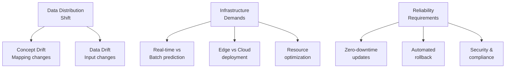

# ML Model Deployment

Machine learning deployment bridges the gap between data science experimentation and production software engineering. Unlike traditional software, ML systems face unique challenges from statistical drift, scalability requirements, and the need to maintain model performance over time.

## Why Deployment Matters

Successful ML deployment requires balancing:
- **Statistical Stability**: Models trained on historical data face concept and data drift in production
- **Engineering Scale**: Moving from notebook experiments to high-throughput serving
- **Operational Reliability**: Rollback capabilities, monitoring, and automated updates
- **Business Alignment**: Translating accuracy metrics to business outcomes

Production ML systems often serve millions of predictions daily, with response time requirements as low as milliseconds.

## Core Deployment Challenges

## Deployment Patterns & Strategies

### Risk-Managed Rollout
- **Shadow Mode**: Parallel operation with human oversight for validation
- **Canary Deployment**: Gradual traffic increases to catch issues early
- **Blue-Green**: Instant switching between model versions for high availability

### Automation Levels
- **Human-in-the-Loop**: Manual review for high-stakes decisions
- **Partial Automation**: AI handles routine cases, humans review edge cases
- **Full Automation**: Autonomous operation for high-volume, low-risk applications

## Learning Objectives

This guide covers practical strategies for:
- Understanding deployment-specific ML challenges
- Choosing appropriate patterns for your use case
- Implementing gradual rollout and rollback mechanisms
- Balancing automation with reliability requirements

## Key Resources

- [Deployment Challenges](challenges/) - Understanding statistical and engineering hurdles
- [Deployment Patterns](patterns/) - Risk-mitigated rollout strategies
- [Automation Degrees](automation/) - Choosing the right level of human involvement
- [ML Monitoring](../monitoring/) - Tracking model performance in production
- [Speech Recognition Example](../examples/speech-recognition) - Real-world deployment case study

## Next Steps

Start with [deployment challenges](challenges/) to understand the landscape, then explore specific patterns based on your application's requirements.
