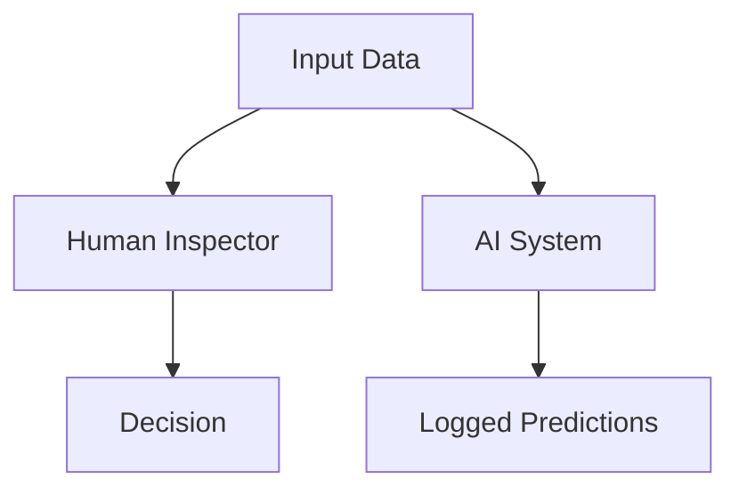
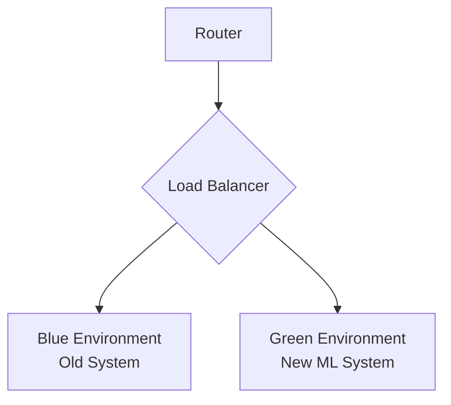

# Deployment Patterns

Different ML deployment scenarios require different strategies. Patterns help manage risk and enable gradual rollout.

## Common Deployment Scenarios

### New Product/Service
When offering ML capabilities for the first time. Use gradual ramp-up patterns.

### Automating Human Tasks
When humans currently perform the task (e.g., inspectors). Shadow mode leverages existing human judgments.

### Model Replacement
When replacing an existing ML system with an improved version. Use canary or blue-green patterns.

## Key Patterns

### Shadow Mode Deployment
- Run ML system in parallel with human operators
- AI outputs are logged but not used for decisions
- Verify AI accuracy against human judgments
- Ideal when replacing existing human processes



### Canary Deployment
- Start with small percentage of traffic (5%)
- Monitor performance metrics closely
- Gradually increase traffic if performing well
- Easy rollback if issues emerge
- Reference to "canary in coal mine" for early problem detection

### Blue-Green Deployment
- Maintain two production environments
- **Blue**: Current/previous system
- **Green**: New ML system
- Switch traffic instantly from blue to green
- Keep blue running for immediate rollback
- Full or gradual traffic shifting



## Pattern Selection

- **New systems**: Start with canary deployment
- **Replacing humans**: Use shadow mode for validation
- **System updates**: Blue-green for instant rollback capability
- **High-risk applications**: Prefer human-in-the-loop patterns

## Implementation Considerations

### Gradual Rollout Strategy
- Start with 1-5% traffic in canary deployments
- Monitor both ML metrics and system performance
- Implement automated rollback triggers
- Use feature flags for fine-grained control

### Infrastructure Requirements
- Container orchestration (Kubernetes) for blue-green
- Load balancers supporting weight-based routing
- Monitoring and alerting systems for automated rollbacks

## Code Examples

### Shadow Mode Implementation

```python
import requests
import json
from datetime import datetime

class ShadowModePredictor:
    def __init__(self, production_url, shadow_url):
        self.production_url = production_url
        self.shadow_url = shadow_url
        self.log_file = "shadow_predictions.log"

    def predict(self, input_data, human_decision=None):
        # Get human decision for comparison
        if human_decision is None:
            human_decision = self.get_human_judgment(input_data)

        # Shadow prediction (non-blocking)
        try:
            shadow_response = requests.post(
                self.shadow_url,
                json=input_data,
                timeout=1.0  # Short timeout to avoid blocking
            )
            shadow_result = shadow_response.json()
        except:
            shadow_result = {"error": "shadow_timeout"}

        # Log shadow prediction with human decision
        log_entry = {
            "timestamp": datetime.now().isoformat(),
            "input": input_data,
            "human_decision": human_decision,
            "shadow_result": shadow_result
        }

        with open(self.log_file, "a") as f:
            f.write(json.dumps(log_entry) + "\n")

        return human_decision

    def get_human_judgment(self, input_data):
        # Placeholder - replace with actual human interface
        return input("Human decision: ")
```

### Canary Deployment with Feature Flags

```python
import random

class CanaryDeployment:
    def __init__(self, v1_predictor, v2_predictor, canary_percentage=5):
        self.v1 = v1_predictor
        self.v2 = v2_predictor
        self.canary_percent = canary_percentage
        self.metrics = {"v1_requests": 0, "v2_requests": 0, "errors": 0}

    def predict(self, input_data):
        # Route to canary based on percentage
        if random.randint(1, 100) <= self.canary_percent:
            return self._predict_v2(input_data)
        else:
            return self._predict_v1(input_data)

    def _predict_v1(self, input_data):
        try:
            result = self.v1.predict(input_data)
            self.metrics["v1_requests"] += 1
            return result
        except Exception as e:
            self.metrics["errors"] += 1
            raise e

    def _predict_v2(self, input_data):
        try:
            result = self.v2.predict(input_data)
            self.metrics["v2_requests"] += 1
            return result
        except Exception as e:
            self.metrics["errors"] += 1
            # Fallback to v1 on errors
            return self._predict_v1(input_data)

    def get_metrics(self):
        return self.metrics.copy()
```

### Simple Blue-Green Toggle

```python
class BlueGreenDeployment:
    def __init__(self, blue_predictor, green_predictor):
        self.blue = blue_predictor
        self.green = green_predictor
        self.active = "blue"  # or "green"

    def switch_to_green(self):
        # Run health checks on green
        if self._health_check(self.green):
            self.active = "green"
            return True
        return False

    def switch_to_blue(self):
        self.active = "blue"
        return True

    def predict(self, input_data):
        predictor = self.green if self.active == "green" else self.blue
        return predictor.predict(input_data)

    def _health_check(self, predictor):
        try:
            # Simple health check with test input
            result = predictor.predict({"test": "data"})
            return isinstance(result, dict) and "prediction" in result
        except:
            return False
```

## Performance Optimization Techniques

### Model Compression & Acceleration
- **Quantization**: Reduce precision (FP32 → INT8) for faster inference
- **Pruning**: Remove redundant parameters to reduce model size
- **Knowledge Distillation**: Train smaller models to mimic larger ones
- **ONNX Runtime**: Cross-platform acceleration with optimized kernels

### Infrastructure Optimization
- **GPU Utilization**: Batch requests for GPU-accelerated prediction
- **Caching**: Cache frequent predictions to reduce compute load
- **Load Balancing**: Distribute requests across multiple model instances
- **Resource Scaling**: Auto-scale based on request patterns

### Latency Reduction Strategies
- **Edge Deployment**: Process data closer to source when possible
- **Request Batching**: Group multiple predictions to utilize vectorization
- **Model Warmup**: Pre-load models in memory for instant availability
- **Connection Pooling**: Reuse connections in high-throughput scenarios

## Troubleshooting Common Issues

### Performance Degradation Problems
- **Memory Leaks**: Monitor process memory usage over time
- **GPU Memory Fragmentation**: Restart services periodically
- **Cold Starts**: Implement model warming strategies

### Accuracy Degradation Issues
- **Data Drift**: Compare training vs production distributions
- **Concept Drift**: Monitor prediction confidence scores
- **Input Validation**: Check for unexpected input formats or ranges

### Infrastructure & Reliability Issues
- **Network Timeouts**: Increase timeouts and implement retry logic
- **Resource Constraints**: Monitor CPU/GPU utilization and scale accordingly
- **Dependency Failures**: Implement circuit breakers for external services

### Deployment-Rollback Anti-Patterns
- **Big Bang Deployment**: Full switch without validation (avoid!)
- **No Monitoring**: Deploying without proper observability
- **Manual Rollbacks**: Relying on complex manual processes
- **Ignoring Validation**: Skipping automated tests before deployment

## Real-World Case Studies

### Netflix Recommendation System
**Challenge**: Deploying personalized recommendation models serving >100M users
**Solution**: Used canary deployments starting with 1% traffic, monitoring engagement metrics
**Results**: 3-5% improvement in user engagement with 99.9% uptime
**Lessons**: Automated rollback on accuracy drop >0.1%, A/B testing integration

### Waymo Autonomous Driving
**Challenge**: Ultra-high-stakes deployment in self-driving vehicles
**Solution**: Extensive shadow mode testing followed by gradual rollout with human monitoring
**Results**: Millions of safe miles driven before full automation in controlled areas
**Lessons**: Safety metrics take precedence over accuracy, continuous human validation

### Airbnb Search Ranking
**Challenge**: Real-time search results for millions of listings worldwide
**Solution**: Blue-green deployment for instant rollback capability, continuous A/B testing
**Results**: 10-20% improvement in booking conversion rates
**Lessons**: Feature flags for gradual feature rollout, comprehensive metrics monitoring

### Practical Implementation Framework

```python
# Example deployment pipeline using MLflow and Kubernetes
import mlflow
import kubernetes

class MLDeploymentPipeline:
    def deploy_with_canary(self, new_model_uri):
        # 1. Deploy to canary environment
        canary_deployment = self.create_canary_deployment(new_model_uri)

        # 2. Route 5% traffic to canary
        self.update_traffic_routing(canary_weight=5)

        # 3. Monitor for 24 hours
        metrics = self.monitor_canary_performance()

        if metrics["accuracy_drop"] < 0.01 and metrics["latency_increase"] < 50:
            # 4. Gradually roll out to 100%
            self.gradual_rollout(canary_deployment)
            return {"status": "success"}
        else:
            # 5. Rollback to previous version
            self.rollback_to_previous()
            return {"status": "rollback", "reason": "performance_degraded"}

    def monitor_canary_performance(self):
        # Track accuracy, latency, error rates for 24+ hours
        return self.collect_metrics(hours=24)
```

## Related Topics

- [Deployment Challenges](../challenges)
- [Degrees of Automation](../automation)
- [Speech Recognition Deployment](../../examples/speech-recognition)
- [Monitoring Dashboards](../../monitoring/metrics)
