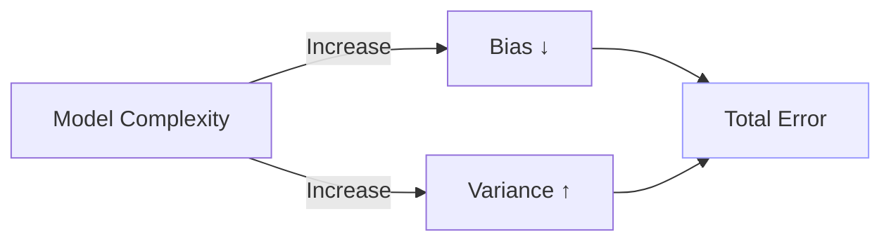

Model evaluation is about turning model quality into measurable, decision-ready signals. The right approach depends on the problem (classification vs. regression), data properties (imbalance, temporal ordering, groups), and operational constraints (latency, interpretability, cost-of-errors). This guide focuses on metrics that reflect business impact and validation schemes that yield trustworthy estimates of out-of-sample performance.

## What you'll learn
- How to choose metrics that reflect actual costs and goals
- How to evaluate classification and regression models beyond accuracy
- How to set up robust cross-validation tailored to your data
- How to reason about bias–variance, overfitting, and underfitting
- How to report results credibly for stakeholders and production

---

## Metric selection as an engineering decision

Pick metrics that align with the real objective.

- Optimize for the decision boundary and cost structure, not just “score.”  
- Define the primary metric and a small set of secondary guardrails.  
- Consider calibration (probabilities should be meaningful) when predictions drive downstream policies (risk scoring, triage, pricing).  
- Use threshold-free metrics (AUC) to compare models; use thresholded metrics (Precision/Recall/F1) to operate models.

A practical framing:
- If positives are rare and costly to miss (fraud, disease) → prioritize Recall, monitor Precision; use PR AUC.
- If false positives are costly (alerts, customer friction) → prioritize Precision at a target Recall, or Precision@K.
- If you care about ranking quality (top-N offers) → use AUC, PR AUC, or ranking metrics (NDCG, MAP).
- If predictions drive calibrated actions (approval limits) → measure calibration (Brier score, reliability curves).

---

## Classification metrics

### Confusion matrix terms
- True Positive (TP), False Positive (FP), True Negative (TN), False Negative (FN)

### Core metrics
- Accuracy = (TP + TN) / (TP + FP + TN + FN)  
  - Not reliable under class imbalance.
- Precision = TP / (TP + FP)  
  - “Of the predicted positives, how many are correct?”
- Recall (Sensitivity, TPR) = TP / (TP + FN)  
  - “Of all actual positives, how many did we capture?”
- F1-score = harmonic mean(Precision, Recall)  
  - Balances Precision and Recall when both matter; use Fβ to weight Recall more (β>1).

### Curves and AUCs
- ROC Curve: TPR vs. FPR across thresholds; **ROC AUC** is threshold-independent.  
  - Useful when classes are relatively balanced and costs symmetric.
- Precision–Recall (PR) Curve: Precision vs. Recall across thresholds; **PR AUC** is more informative for imbalanced problems.

### Multi-class
- Macro average: unweighted mean of per-class metrics (treats classes equally).  
- Weighted average: weighted by support per class (reflects class frequency).  
- Micro average: global across all instances (good when class imbalance is high).

### Example (scikit-learn)
```python
from sklearn.metrics import (
    accuracy_score, precision_recall_fscore_support,
    roc_auc_score, average_precision_score, classification_report
)

y_true = ...
y_prob = ...  # predicted probabilities for the positive class
y_pred = (y_prob >= 0.5).astype(int)

acc = accuracy_score(y_true, y_pred)
prec, rec, f1, _ = precision_recall_fscore_support(y_true, y_pred, average="binary")
roc = roc_auc_score(y_true, y_prob)                      # binary ROC AUC
pr_auc = average_precision_score(y_true, y_prob)         # PR AUC

print(f"Acc={acc:.3f} Prec={prec:.3f} Rec={rec:.3f} F1={f1:.3f} ROC_AUC={roc:.3f} PR_AUC={pr_auc:.3f}")
print(classification_report(y_true, y_pred, digits=3))
```

---

## Regression metrics

- Mean Squared Error (MSE): penalizes large errors; differentiable and standard.  
- Root MSE (RMSE): interpretable in target units.  
- Mean Absolute Error (MAE): robust to outliers; sparse error penalties.  
- R² (Coefficient of Determination): proportion of variance explained; can be negative out-of-sample.  
- MAPE: percentage error; avoid if targets can be 0 or near-0.

When to prefer:
- Heavy-tailed noise or outliers → MAE.  
- Smooth optimization and Gaussian-like residuals → MSE/RMSE.  
- Stakeholders want “how much of variance we explain” → R² (with caveats).

```python
from sklearn.metrics import mean_squared_error, mean_absolute_error, r2_score
import numpy as np

y_true = ...
y_pred = ...
mse = mean_squared_error(y_true, y_pred)
rmse = np.sqrt(mse)
mae = mean_absolute_error(y_true, y_pred)
r2 = r2_score(y_true, y_pred)
print(f"RMSE={rmse:.2f} MAE={mae:.2f} R2={r2:.3f}")
```

---

## Cross-validation that reflects data realities

Holdout validation is often too optimistic or too pessimistic depending on the split. Prefer cross-validation aligned to data generation.

- K-Fold CV: default for IID tabular data.  
- Stratified K-Fold (classification): preserves class proportions per fold.  
- Group K-Fold: prevents leakage when multiple samples share a group (user, session, patient).  
- TimeSeriesSplit: respects temporal order; train on past, validate on future (rolling window).  
- Leave-One-Out (LOOCV): high variance, computationally expensive; rarely necessary in production.

Key principles:
- Avoid leakage by including all preprocessing inside Pipelines.  
- Keep folds independent with respect to leakage sources (time, geography, groups).  
- Use nested CV for unbiased model selection when you tune hyperparameters heavily.

```python
from sklearn.model_selection import StratifiedKFold, cross_val_score
from sklearn.pipeline import Pipeline
from sklearn.preprocessing import StandardScaler
from sklearn.linear_model import LogisticRegression

X, y = ...
pipe = Pipeline([
    ("scaler", StandardScaler()),
    ("clf", LogisticRegression(max_iter=1000))
])

cv = StratifiedKFold(n_splits=5, shuffle=True, random_state=42)
scores = cross_val_score(pipe, X, y, cv=cv, scoring="f1")  # or "roc_auc"
print(f"CV F1: mean={scores.mean():.3f} ± {scores.std():.3f}")
```

Time series example:
```python
from sklearn.model_selection import TimeSeriesSplit, cross_val_score
from sklearn.linear_model import Ridge

tscv = TimeSeriesSplit(n_splits=5)
scores = cross_val_score(Ridge(), X, y, cv=tscv, scoring="neg_mean_absolute_error")
print(f"MAE: {-scores.mean():.3f} ± {scores.std():.3f}")
```

---

## Bias–variance tradeoff

Underfitting: high bias, low variance. Overfitting: low bias on training, high variance on validation. Aim for the sweet spot where total error is minimized.



Levers:
- Reduce bias (underfitting): increase model capacity, engineer features, reduce regularization.  
- Reduce variance (overfitting): simplify model, increase regularization, get more data, augment data, early stopping, dropout/ensembling.

---

## Overfitting & underfitting in practice

Symptoms:
- Training loss ≪ validation loss → overfitting.
- Both losses high → underfitting or optimization issues.

Mitigations:
- Regularization: L1/L2, dropout, weight decay.  
- Data: more samples, augmentation, de-noising, better labeling.  
- Model: constrain capacity, early stopping, pruning.  
- Validation: time-aware splits, leakage checks, robust CV.  
- Ensembling: bagging (reduce variance), boosting (bias and variance).

Early stopping example (Keras):
```python
import tensorflow as tf

model = tf.keras.Sequential([...])
model.compile(optimizer="adam", loss="binary_crossentropy", metrics=["AUC"])
early = tf.keras.callbacks.EarlyStopping(monitor="val_auc", patience=3, mode="max", restore_best_weights=True)
hist = model.fit(X_train, y_train, validation_data=(X_val, y_val), epochs=50, callbacks=[early])
```

---

## Reporting results credibly

- Use repeated CV or bootstrapping to obtain confidence intervals.  
- Report mean ± std across folds; include best/worst to show stability.  
- Compare models with paired tests across identical folds (e.g., Wilcoxon).  
- Show threshold–metric curves and calibration plots when operating at fixed thresholds.  
- Track dataset versions, splits, and seeds for reproducibility.

Calibration quick check:
```python
from sklearn.calibration import calibration_curve
prob_true, prob_pred = calibration_curve(y_true, y_prob, n_bins=10, strategy="quantile")
```

---

## Quick reference

- Classification: Avoid accuracy under imbalance; prefer ROC AUC for ranking and PR AUC when positives are rare. Choose a working threshold and track Precision/Recall at that threshold.  
- Regression: RMSE for magnitude-sensitive errors; MAE for robustness; always check residuals.  
- Validation: Align CV with data generating process (stratified/groups/temporal). Avoid leakage with Pipelines.  
- Over/Underfitting: Balance capacity and regularization; validate the validation.
