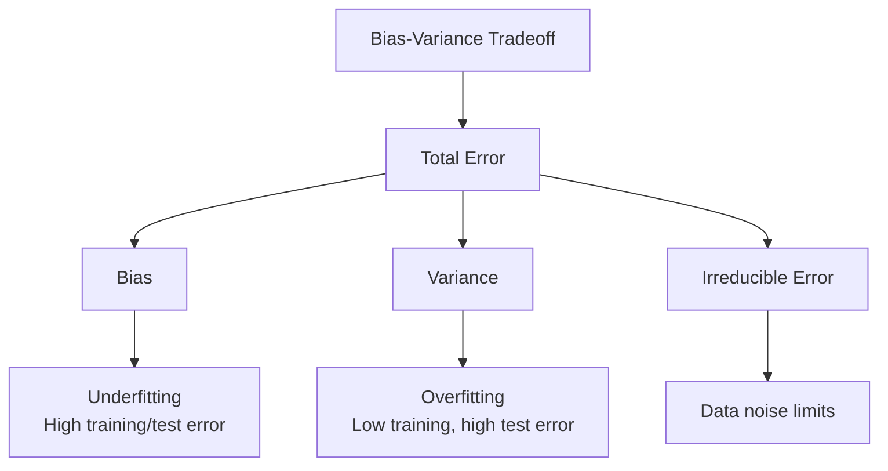
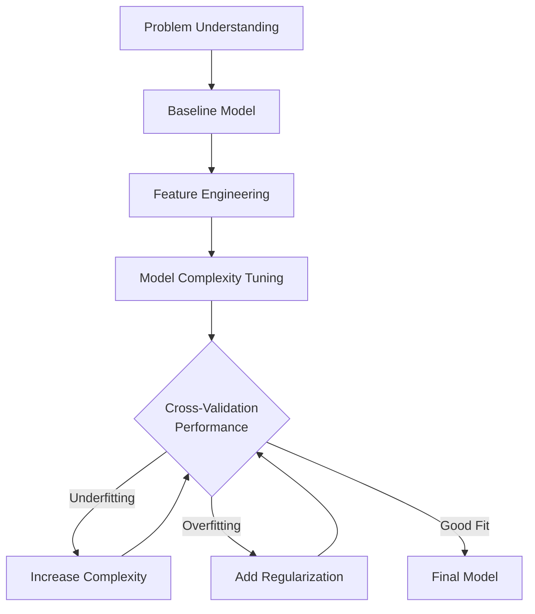

# Model Evaluation & Validation

Evaluating machine learning models requires rigorous methodologies to ensure they perform well on unseen data and meet real-world requirements. This section covers performance metrics, validation techniques, and the fundamental trade-offs between bias and variance that affect all ML systems.

## Performance Metrics

### Classification Metrics

**Accuracy**: Simple proportion of correct predictions, but misleading for imbalanced datasets.

**Precision**: True Positives / (True Positives + False Positives)  
- Measures exactness of positive predictions
- Important when false positives are costly

**Recall (Sensitivity)**: True Positives / (True Positives + False Negatives)
- Measures completeness of positive predictions
- Critical when missing positives is expensive

**F1-Score**: Harmonic mean of precision and recall
- Balances precision and recall trade-offs
- Useful for imbalanced datasets

```python
from sklearn.metrics import classification_report, confusion_matrix

# Example prediction results
y_true = [0, 0, 1, 1, 1, 0, 1, 0, 0, 1]
y_pred = [0, 1, 1, 1, 0, 0, 1, 0, 1, 1]

print("Classification Report:")
print(classification_report(y_true, y_pred))

# Confusion Matrix
# [[TN, FP]
#  [FN, TP]]
cm = confusion_matrix(y_true, y_pred)
print("Confusion Matrix:")
print(cm)
```

### ROC Curve & AUC

**ROC (Receiver Operating Characteristic)**: Plots True Positive Rate vs False Positive Rate at different classification thresholds.

**AUC (Area Under Curve)**: Scalar metric summarizing ROC performance
- 0.5 = random classifier
- 1.0 = perfect classifier
- Additional interpretation for multiclass problems

```python
from sklearn.metrics import roc_curve, auc
import matplotlib.pyplot as plt

# Binary classification probabilities
y_scores = [0.1, 0.4, 0.35, 0.8, 0.65, 0.2, 0.9, 0.15, 0.3, 0.85]

# Calculate ROC curve
fpr, tpr, thresholds = roc_curve(y_true, y_scores)
roc_auc = auc(fpr, tpr)

# Plot ROC curve
plt.figure()
plt.plot(fpr, tpr, color='darkorange', lw=2, label=f'ROC curve (AUC = {roc_auc:.2f})')
plt.plot([0, 1], [0, 1], color='navy', lw=2, linestyle='--')
plt.xlabel('False Positive Rate')
plt.ylabel('True Positive Rate')
plt.title('Receiver Operating Characteristic (ROC)')
plt.legend()
plt.show()
```

### Regression Metrics

**Mean Squared Error (MSE)**: Average of squared differences between predictions and actuals

**Root Mean Squared Error (RMSE)**: Square root of MSE, in same units as target variable

**Mean Absolute Error (MAE)**: Average of absolute differences

**R² Score (Coefficient of Determination)**: Proportion of variance explained by model
- Range: -∞ to 1
- 1.0 = perfect fit
- 0.0 = mean prediction
- Negative = worse than mean

```python
from sklearn.metrics import mean_squared_error, mean_absolute_error, r2_score

# Regression predictions
y_true_reg = [2.5, 7.8, 10.2, 4.3, 9.1]
y_pred_reg = [2.8, 7.2, 9.8, 4.1, 8.9]

# Calculate metrics
mse = mean_squared_error(y_true_reg, y_pred_reg)
mae = mean_absolute_error(y_true_reg, y_pred_reg)
r2 = r2_score(y_true_reg, y_pred_reg)

print(f"MSE: {mse:.3f}")
print(f"MAE: {mae:.3f}")
print(f"R²: {r2:.3f}")
```

## Cross-Validation

### K-Fold Cross Validation

Divides dataset into k equal folds. Each fold serves as test set once, others as training.

** advantages**
- Better use of limited data
- More reliable performance estimates
- Reduces overfitting to specific train/test splits

**Implementation**
```python
from sklearn.model_selection import cross_val_score
from sklearn.linear_model import LogisticRegression

# K-fold cross validation
model = LogisticRegression()
scores = cross_val_score(model, X, y, cv=5, scoring='accuracy')
print(f"5-fold CV accuracy: {scores.mean():.3f} (+/- {scores.std()*2:.3f})")
```

### Leave-One-Out Cross Validation

Each sample serves as test set once. Most computationally expensive but maximizes training data.

**Use cases**
- Small datasets
- When every training sample is precious
- Research settings more than production

### Stratified Cross Validation

Maintains class distribution in each fold. Essential for imbalanced datasets.

```python
from sklearn.model_selection import StratifiedKFold

# Stratified K-fold for classification
skf = StratifiedKFold(n_splits=5, shuffle=True, random_state=42)

for train_index, test_index in skf.split(X, y):
    X_train, X_test = X[train_index], X[test_index]
    y_train, y_test = y[train_index], y[test_index]
    # Train and evaluate model
```

## Bias-Variance Tradeoff

### Core Concepts

**Bias**: Systematic error from simplifying assumptions
- High bias → underfitting
- Models too simple to capture patterns

**Variance**: Sensitivity to training data fluctuations
- High variance → overfitting
- Models too complex, memorize noise



### Diagnostic Techniques

**Learning Curves**: Plot performance vs training size
```python
from sklearn.model_selection import learning_curve

train_sizes, train_scores, valid_scores = learning_curve(
    estimator=model,
    X=X_train,
    y=y_train,
    train_sizes=np.linspace(0.1, 1.0, 10),
    cv=5
)

train_mean = np.mean(train_scores, axis=1)
train_std = np.std(train_scores, axis=1)
valid_mean = np.mean(valid_scores, axis=1)
valid_std = np.std(valid_scores, axis=1)

plt.fill_between(train_sizes, train_mean - train_std,
                 train_mean + train_std, alpha=0.1, color="blue")
plt.fill_between(train_sizes, valid_mean - valid_std,
                 valid_mean + valid_std, alpha=0.1, color="orange")
plt.plot(train_sizes, train_mean, color="blue", label="Training score")
plt.plot(train_sizes, valid_mean, color="orange", label="Validation score")
plt.show()
```

**Validation vs Test Error Gap**: Large gaps indicate overfitting
**Training Error**: Should decrease as model capacity increases
**Cross-Validation Gap**: Monitors generalization ability

## Overfitting & Underfitting

### Overfitting Detection

**Symptoms**:
- Excellent training performance, poor validation/test performance
- Complex models with many parameters
- Learning curves show diverging training/validation error

**Prevention Strategies**:

```python
# Early stopping
from sklearn.callbacks import EarlyStopping

early_stopping = EarlyStopping(monitor='val_loss', patience=10)

# Regularization techniques
from sklearn.linear_model import Ridge, Lasso

# L2 regularization (Ridge)
ridge = Ridge(alpha=0.1)

# L1 regularization (Lasso)
lasso = Lasso(alpha=0.1)

# Dropout in neural networks
# Implemented in PyTorch/TensorFlow layers
```

### Underfitting Detection

**Symptoms**:
- Poor performance on both training and validation sets
- High bias, low variance
- Models too simple for data complexity

**Solutions**:
- Increase model capacity (more layers, features)
- Use more complex algorithms
- Reduce regularization
- Better feature engineering

### Practical Guidelines

**Model Selection Workflow**:



**Common Pitfalls**:
- Hyperparameter optimization without proper validation
- Data leakage between train/validation/test sets
- Ignoring domain knowledge in metric selection
- Over-reliance on single metrics

**Production Considerations**:
- Model performance degrades over time (data drift)
- Monitor prediction distributions, not just aggregate metrics
- Regular retraining pipelines essential
- A/B testing for model updates

Proper evaluation ensures models deliver reliable performance in real-world applications, balancing the complex trade-offs between fitting training data and maintaining generalization ability.
