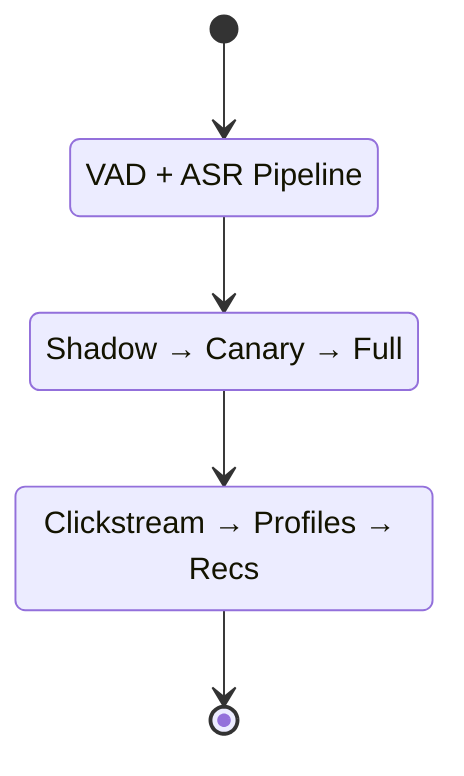

# ML Examples

Real-world examples demonstrate how ML lifecycle concepts apply in practice. These case studies show common challenges and solutions.

## Featured Examples

- **Speech Recognition**: End-to-end deployment with VAD, cloud inference, and monitoring
- **Visual Inspection**: Factory line defect detection with gradual automation
- **User Profiling**: Building recommendation systems with ML pipelines

## Related Topics

- [ML Lifecycle](../lifecycle/)
- [Deployment Patterns](../deployment/)
- [Monitoring Strategies](../monitoring/)
