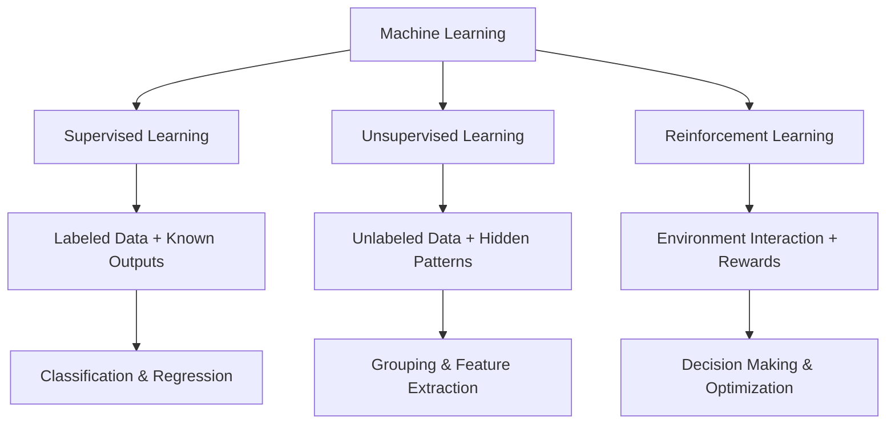
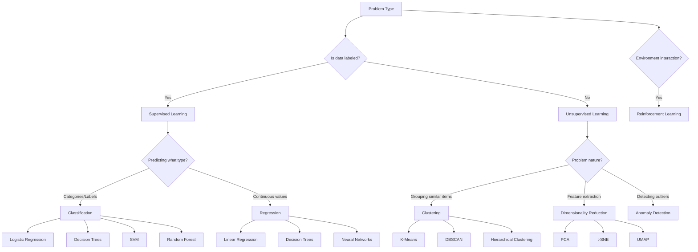

# Machine Learning Fundamentals

Machine learning provides systems the ability to learn from data and improve performance without explicit reprogramming. This foundation consists of three primary learning paradigms, each addressing different problem types and providing unique insights into data patterns.

## Learning Paradigms Overview

Machine learning approaches vary fundamentally based on available supervision and problem type:

### Supervised Learning

Works with labeled datasets where each example provides input features and corresponding correct outputs. Algorithms learn mapping functions that generalize to predict labels for new, unseen data.

**Core Problems:**
- **Classification**: Categorical prediction (spam/not-spam, image classes)
- **Regression**: Continuous value prediction (prices, temperatures)

**Practical Applications:**
- Email filtering and recommendation systems
- Medical diagnosis and risk assessment
- Financial market prediction and fraud detection

### Unsupervised Learning

Extracts meaningful patterns from unlabeled data without ground truth guidance. Reveals inherent structure through grouping, simplification, or anomaly identification.

**Core Problems:**
- **Clustering**: Grouping similar instances together
- **Dimensionality Reduction**: Simplifying complex data structures
- **Anomaly Detection**: Identifying unusual patterns

**Practical Applications:**
- Customer segmentation and market analysis
- Data compression and feature engineering preprocessing
- Network security and quality control monitoring

### Reinforcement Learning

Learns optimal behaviors through interaction-based trial and error. Agents receive feedback signals (rewards/punishments) while navigating environment state spaces.

**Core Problems:**
- **Sequential Decision Making**: Planning actions in time-ordered scenarios
- **Policy Optimization**: Finding best action sequences under uncertainty
- **Credit Assignment**: Determining which actions deserve blame/credit

**Practical Applications:**
- Game-playing agents and autonomous robotics
- Resource allocation and supply chain optimization
- Autonomous vehicles and traffic management

## Mathematical Foundations

All paradigms build upon core mathematical concepts that enable learning from data:

### Probability & Statistics
- **Conditional Probability**: P(y|x) outcomes given conditions
- **Expected Value**: Long-term average outcomes
- **Maximum Likelihood Estimation**: Optimal parameter fitting
- **Bayesian Methods**: Updating beliefs with evidence

### Linear Algebra
- **Vectors & Matrices**: Data representation and transformations
- **Eigenvalues & Eigenvectors**: Dimensionality reduction fundamentals
- **Gradient Operations**: Optimization core operations

### Calculus
- **Derivatives & Gradients**: Rate-of-change computation
- **Chain Rule**: Complex function differentiation
- **Convex Optimization**: Guaranteed minimum-finding algorithms

## Algorithm Selection Framework

Choosing appropriate algorithms depends on multiple factors:

## Implementation Considerations

### Data Quality
**Garbage in, garbage out** - ML performance directly depends on training data quality:

- **Complete**: Sufficient samples for generalization
- **Correct**: Accurate, unbiased ground truth labels
- **Representative**: Matches production data distribution
- **Balanced**: Adequate representation across classes/outcomes

### Hyperparameter Tuning
Algorithms contain adjustable parameters requiring systematic optimization:

- **Grid Search**: Exhaustive parameter space exploration
- **Random Search**: Stochastic parameter sampling
- **Bayesian Optimization**: Informed parameter selection using past results
- **Cross-Validation**: Robust performance estimation techniques

### Computational Complexity
Algorithm choices involve time-space trade-offs:

- **Training Time**: Offline model development costs
- **Inference Time**: Online prediction latency requirements
- **Memory Usage**: Scalability limitations
- **Scalability**: Handling massive datasets effectively

## Evaluation & Validation

Measuring model quality requires appropriate metrics:

### Classification Metrics
- **Accuracy**: Overall correct predictions proportion
- **Precision**: True positives among predicted positives
- **Recall**: True positives among actual positives
- **F1-Score**: Precision/recall harmonic mean
- **ROC-AUC**: Decision threshold independence measure

### Regression Metrics
- **Mean Squared Error (MSE)**: Average squared prediction errors
- **Root Mean Squared Error (RMSE)**: Square root of MSE
- **Mean Absolute Error (MAE)**: Average absolute errors
- **R² Score**: Explained variance proportion

### Validation Techniques
- **Holdout Validation**: Fixed train/validation/test splits
- **K-Fold Cross-Validation**: Repeated sampling for robust estimates
- **Stratified Sampling**: Maintaining class distributions in splits

## Common Pitfalls & Best Practices

### Overfitting Prevention
- **Regularization**: Penalizing model complexity (L1/L2 penalties)
- **Early Stopping**: Monitoring validation performance during training
- **Ensemble Methods**: Combining multiple weak models
- **Data Augmentation**: Artificially expanding training datasets

### Feature Engineering
- **Domain Knowledge**: Incorporating expert understanding
- **Scaling Standardization**: Consistent feature ranges
- **Categorical Encoding**: Transforming non-numeric data
- **Interaction Terms**: Capturing feature relationships

### Ethics & Fairness
- **Bias Detection**: Measuring algorithmic fairness across demographics
- **Explainability**: Understanding and justifying model decisions
- **Privacy Protection**: Safeguarding sensitive information
- **Transparency**: Making AI systems accountable

## Practical Implementation

Developing robust ML systems requires systematic approaches:

### Development Workflow
1. **Problem Definition**: Clearly establish success criteria
2. **Data Collection**: Gather relevant, high-quality training data
3. **Exploratory Analysis**: Understand data characteristics and distributions
4. **Feature Engineering**: Transform raw data into meaningful inputs
5. **Model Selection**: Choose appropriate algorithms for problem type
6. **Training & Validation**: Build and thoroughly test models
7. **Deployment Planning**: Design for production scalability and reliability

### Tooling Landscape
- **Libraries**: scikit-learn, TensorFlow, PyTorch, XGBoost
- **Platforms**: Google Cloud AI, AWS SageMaker, Azure Machine Learning
- **Versioning**: Git for code, DVC for data/model tracking
- **Monitoring**: Production model performance alerting systems

The fundamentals covered in this section form the intellectual foundation for applying machine learning effectively. Each paradigm offers unique advantages for specific problem types, requiring careful selection based on data availability, problem characteristics, and computational constraints.
