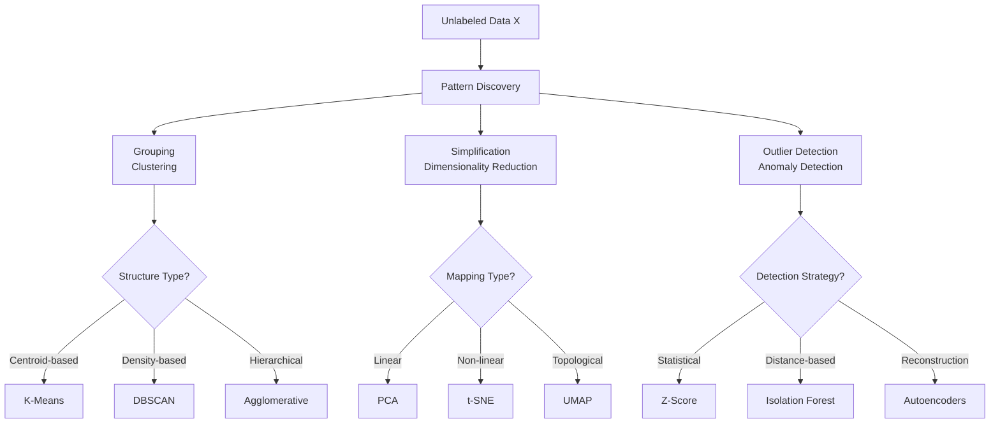

# Unsupervised Learning

Unsupervised learning discovers underlying structures in unlabeled data through pattern recognition and feature extraction. Without explicit target labels, algorithms identify similarities, groupings, and regularities that reveal meaningful representations. This paradigm enables exploratory data analysis, compression, and automatic feature learning.

## Core Principles

### Structure Discovery

Unsupervised learning reveals hidden data properties through various mechanisms:



### Representation Learning

Unsupervised methods create meaningful data representations:

**Bottom-Up Discovery:**
- Identify low-level patterns and regularities
- Build hierarchical abstractions from observations
- Construct increasingly complex feature representations

**Principal Components:**
- **Encoding**: Find compact data descriptions
- **Compression**: Reduce dimensionality while preserving information
- **Visualization**: Project high-dimensional data to low-dimensional views

### Information Bottleneck

Many unsupervised approaches operate as information bottlenecks:

```python
# Conceptual representation learning
def information_bottleneck(X, bottleneck_dim):
    """
    Compress information while preserving critical structure
    """
    # Find optimal representation Z that captures X's essential properties
    Z = encoder(X)  # map to lower-dimensional space

    # Minimize reconstruction loss while maintaining meaningful structure
    reconstruction_loss = loss_function(X, decoder(Z))

    # Key property: preserve mutual information I(X; Z) while compressing
    return Z
```

## Clustering Algorithms

Clustering partitions data into meaningful groups based on similarity measures.

### Distance Metrics

Similarity quantification forms clustering foundations:

**Euclidean Distance:**
- δ(x,x') = √Σ(xᵢ - x'ᵢ)²
- Standard geometric distance in cartesian space
- Sensitive to different feature scales

**Manhattan Distance:**
- δ(x,x') = Σ|xᵢ - x'ᵢ|
- Sum of absolute coordinate differences
- Robust to outliers in coordinate directions

**Cosine Similarity:**
- cos(θ) = (x·x') / (||x|| ||x'||)
- Measures angular separation independent of magnitude
- Valuable for text and high-dimensional sparse data

**Jaccard Distance (Sets):**
- 1 - |A∩B| / |A∪B|
- Similarity between binary feature sets
- Effective for sparse, categorical, or binary data

### K-Means Clustering

Partition data into k spherical clusters by minimizing sum of squared distances.

**Algorithm Steps:**
1. **Initialize centroids**: Randomly select k initial cluster centers
2. **Assignment Step**: Allocate each point to nearest centroid
3. **Update Step**: Recalculate centroids as cluster member means
4. **Convergence Check**: Repeat until centroids stabilize

**Mathematical Formulation:**
- Minimize within-cluster sum of squares (WCSS)
- WCSS = Σ Σ ||xⁱ - μⱼ||² for all clusters j and points i ∈ cluster j

```python
import numpy as np
from sklearn.cluster import KMeans

class CustomKMeans:
    def __init__(self, k, max_iters=100):
        self.k = k
        self.max_iters = max_iters

    def fit(self, X):
        # Random centroid initialization
        n_samples, n_features = X.shape
        self.centroids = X[np.random.choice(n_samples, self.k, replace=False)]

        for _ in range(self.max_iters):
            # Assignment step: closest centroid
            distances = np.linalg.norm(X[:, np.newaxis] - self.centroids, axis=2)
            self.labels = np.argmin(distances, axis=1)

            # Update step: mean of assigned points
            new_centroids = np.array([X[self.labels == i].mean(axis=0) for i in range(self.k)])

            # Check convergence
            if np.allclose(self.centroids, new_centroids):
                break
            self.centroids = new_centroids

# Practical usage
kmeans = KMeans(n_clusters=3, init='k-means++', random_state=42)
clusters = kmeans.fit_predict(X_normalized)
```

**Strengths & Weaknesses:**
- **Scalable** to large datasets through vectorized implementations
- **Interpretability** provided by centroid coordinates
- **Limitations**: Assumes spherical clusters, sensitive to initialization, requires specified k

### DBSCAN (Density-Based Spatial Clustering)

Groups points into dense regions separated by sparse regions. Discovers arbitrary cluster shapes.

**Core Concepts:**
- **ε (eps)**: Maximum neighborhood distance
- **MinPts**: Minimum points required to form dense region
- **Core Point**: Has at least MinPts within ε
- **Border Point**: Within ε of core point but not core itself
- **Noise Point**: Neither core nor border (outliers)

**Algorithm Approach:**
1. Start with unvisited point
2. Find ε-neighbors and determine core points
3. If core point, expand cluster through density-reachability
4. Continue until all points processed

```python
from sklearn.cluster import DBSCAN

# DBSCAN clustering
dbscan = DBSCAN(
    eps=0.3,           # Neighborhood radius
    min_samples=5,     # Minimum core points
    metric='euclidean' # Distance metric
)
clusters = dbscan.fit_predict(X)

# Core points, border points, noise identification
core_samples_mask = np.zeros_like(dbscan.labels_, dtype=bool)
core_samples_mask[dbscan.core_sample_indices_] = True
```

**Strengths & Weaknesses:**
- **Shape Flexibility**: Discovers arbitrary cluster shapes
- **Parameter Insensitivity**: Requires tuning only two parameters instead of k
- **Noise Handling**: Automatically identifies outliers
- **Computational Complexity**: O(n²) in worst case, benefits from spatial indexing

### Hierarchical Clustering

Constructs nested cluster hierarchies through progressive merging or splitting.

**Agglomerative (Bottom-Up):**
1. Start with each point as separate cluster
2. Find most similar pair of clusters
3. Merge clusters iteratively until single cluster remains

**Linkage Criteria:**
- **Single Linkage**: Minimum distance between cluster points
- **Complete Linkage**: Maximum distance between cluster points
- **Average Linkage**: Average distance between cluster points
- **Ward Linkage**: Minimize within-cluster variance increase

```python
from scipy.cluster.hierarchy import linkage, fcluster, dendrogram
import matplotlib.pyplot as plt

# Agglomerative hierarchical clustering
def hierarchical_clustering(X, n_clusters):
    # Create linkage matrix
    Z = linkage(X, method='ward', metric='euclidean')

    # Cut dendrogram at desired cluster count
    clusters = fcluster(Z, t=n_clusters, criterion='maxclust')

    # Visualize dendrogram
    plt.figure(figsize=(10, 6))
    dendrogram(Z, truncate_mode='level', p=3)
    plt.show()

    return clusters
```

**Dendrogram Analysis:**
- Height shows merge similarity
- Cutting at different levels produces different clusterings
- Provides hierarchical cluster relationships

## Dimensionality Reduction

Reduces high-dimensional data to meaningful lower-dimensional representations while preserving essential properties.

### Principal Component Analysis (PCA)

Finds orthogonal directions capturing maximum data variance through eigenvalue decomposition.

**Mathematical Foundation:**
- **Covariance Matrix**: C = (1/n) Σ(xᵢ - μ)(xᵢ - μ)^T
- **Eigendecomposition**: Eigenvalues (λ₁ ≥ λ₂ ≥ ... ≥ λₖ) represent variance magnitudes
- **Principal Components**: Corresponding eigenvectors define new coordinate system

**Feature Selection vs Extraction:**
- **Selection**: Choose most important original features
- **Extraction**: Create new derived features as component combinations

```python
from sklearn.decomposition import PCA

# PCA dimensionality reduction
def perform_pca(X, explained_variance_threshold=0.95):
    pca = PCA(n_components=explained_variance_threshold)

    # Fit and transform
    X_pca = pca.fit_transform(X)

    # Analyze results
    explained_variance = pca.explained_variance_ratio_
    cumulative_variance = np.cumsum(explained_variance)

    print(f"Components: {pca.n_components_}")
    print(f"Explained variance per component: {explained_variance}")
    print(f"Cumulative explained variance: {cumulative_variance}")

    return X_pca, pca
```

**Reconstruction Error:**
Reconstructing original data from reduced representation measures information loss magnitude.

### t-Distributed Stochastic Neighbor Embedding (t-SNE)

Preserves local structure by modeling high-dimensional neighbor relationships as low-dimensional t-distributions.

**Algorithm Steps:**
1. **In High Dimensions**: Compute conditional probabilities pᵢ|ⱼ representing neighboring relationships
2. **In Low Dimensions**: Compute similar probabilities qᵢ|ⱼ using Student's t-distribution
3. **Optimization**: Minimize Kullback-Leibler divergence between p and q distributions

**Mathematical Details:**
- **Student's t-distribution**: Tail heavier than Gaussian, reducing crowding
- **Perplexity**: Effective local neighborhood size (typically 5-50)
- **Symmetrization**: Convert asymmetric pᵢ|ⱼ to symmetric pᵢⱼ

```python
from sklearn.manifold import TSNE

# t-SNE for visualization
tsne = TSNE(
    n_components=2,
    perplexity=30.0,    # Neighborhood size
    early_exaggeration=12.0,  # Initial cluster separation
    learning_rate=200.0,
    random_state=42
)
X_tsne = tsne.fit_transform(X_high_dim)
```

**Parameter Sensitivity:**
- **Perplexity**: Low values focus on local structure, high values on global structure
- **Learning Rate**: Affects optimization stability
- **Early Exaggeration**: Controls initial cluster formation

### Uniform Manifold Approximation and Projection (UMAP)

Topological approach preserving both local and global manifold structure through simplicial complexes.

**Theoretical Foundation:**
- **Riemannian Manifold Assumptions**: Data lies on low-dimensional manifolds
- **Topological Data Analysis**: Focus on manifold shape preservation
- **Fuzzy Topological Representations**: Weighted local neighborhood relationships

**Algorithm Components:**
- **Graph Construction**: k-nearest neighbor graph for local relationships
- **Manifold Modeling**: Abstract finite simplicial complex representation
- **Optimization**: Adam descent with negative sampling

```python
import umap

# UMAP dimensionality reduction
reducer = umap.UMAP(
    n_neighbors=15,     # Local neighborhood size
    min_dist=0.1,       # Minimum distance in low-dimensional space
    n_components=2,     # Target dimensionality
    random_state=42
)
X_umap = reducer.fit_transform(X_high_dim)
```

**UMAP vs t-SNE:**
- **Scalability**: More efficient for large datasets
- **Global Structure**: Better preservation of inter-cluster relationships
- **Parameter Interpretation**: More intuitive parameter meanings

## Anomaly Detection

Identifies data points significantly deviating from normal patterns.

### Statistical Methods

Distribution-based anomaly detection assumes data follows specific distributions:

**Parametric Approaches:**
- **Gaussian Singling Variable**: Anomaly if p(x) < threshold
- **Multivariate Gaussian**: Mahalanobis distance from mean
- **Gamma Distribution**: Effective for exponential tail behavior

**Non-Parametric Approaches:**
- **Histogram Thresholding**: Anomalous if falls in low-density bins
- **Local Outlier Factor (LOF)**: Ratio of local density to neighbor densities

### Machine Learning Methods

**Supervised Detection:**
- Treat as classification problem with highly imbalanced classes
- Use resampling techniques (SMOTE, ADASYN) for balanced training

**Semi-Supervised Detection:**
- Train on normal examples only
- Flag deviations from learned normal distribution

```python
from sklearn.ensemble import IsolationForest
from sklearn.svm import OneClassSVM
from sklearn.covariance import EllipticEnvelope

# Isolation Forest
isolation_forest = IsolationForest(
    n_estimators=100,
    contamination='auto',  # Estimated anomaly proportion
    random_state=42
)
anomalies_if = isolation_forest.fit_predict(X)

# One-Class SVM
one_class_svm = OneClassSVM(
    kernel='rbf',
    gamma='scale',
    nu=0.1  # Expected anomaly proportion
)
anomalies_svm = one_class_svm.fit_predict(X)

# Statistical approach (Mahalanobis distance)
from scipy.spatial import distance

cov_matrix = np.cov(X.T)
inv_cov_matrix = np.linalg.inv(cov_matrix)
mean = np.mean(X, axis=0)

mahalanobis = [distance.mahalanobis(x, mean, inv_cov_matrix) for x in X]
threshold = np.percentile(mahalanobis, 99)  # 99th percentile
anomalies_stat = [dist > threshold for dist in mahalanobis]
```

**Ensemble Methods:**
- **Feature Bagging**: Apply detection to random feature subsets
- **Isolation Forest Extensions**: Build multiple forests
- **Boosting Approaches**: FFRE (Feature Bagging Robust Ensemble)

### Reconstruction Error Approaches

Autoencoders learn compact representations and detect anomalies through reconstruction errors:

**Autoencoder Architecture:**
- **Encoder**: Compress input to bottleneck representation
- **Decoder**: Reconstruct original input from compressed representation
- **Anomaly Score**: Reconstruction loss magnitude

```python
import torch
import torch.nn as nn

class Autoencoder(nn.Module):
    def __init__(self, input_dim, bottleneck_dim):
        super().__init__()
        # Encoder
        self.encoder = nn.Sequential(
            nn.Linear(input_dim, input_dim//2),
            nn.ReLU(),
            nn.Linear(input_dim//2, bottleneck_dim)
        )
        # Decoder
        self.decoder = nn.Sequential(
            nn.Linear(bottleneck_dim, input_dim//2),
            nn.ReLU(),
            nn.Linear(input_dim//2, input_dim)
        )

    def forward(self, x):
        encoded = self.encoder(x)
        decoded = self.decoder(encoded)
        return decoded

def anomaly_score(autoencoder, X):
    """Compute reconstruction errors as anomaly scores"""
    autoencoder.eval()
    with torch.no_grad():
        reconstructions = autoencoder(X)
        losses = torch.mean((X - reconstructions) ** 2, dim=1)
    return losses.numpy()
```

## Advanced Techniques & Challenges

### Gaussian Mixture Models (GMMs)

Model data as mixture of Gaussian distributions using expectation-maximization:

**Mathematical Framework:**
- **Expectation**: Compute posterior probabilities for component membership
- **Maximization**: Update mixture weights, means, and covariances
- **Soft Clustering**: Each point has probabilistic cluster membership

```python
from sklearn.mixture import GaussianMixture

# GMM clustering
gmm = GaussianMixture(
    n_components=3,      # Number of mixture components
    covariance_type='full',  # Free covariance matrices
    random_state=42
)
clusters = gmm.fit_predict(X)
proba = gmm.predict_proba(X)  # Soft clustering probabilities
```

### Manifold Learning

Discover and represent data manifold geometric properties:

**Geodesic Distances:**
- Intrinsic distances along manifold surface
- More informative than Euclidean distance for curved data

**Isometric Mapping (Isomap):**
- Preserve geodesic distances in low dimensions
- Effective for rolled-up manifolds like Swiss roll

### Computational Challenges

**Curse of Dimensionality:**
- Distance concentration reduces discriminatory power
- Relative neighbor distances become uniform

**Scalability Issues:**
- Many methods require O(n²) time or space
- Approximation techniques enable larger scale algorithms

### Evaluation Metrics

**Clustering Quality:**
- **Silhouette Coefficient**: Measure of cluster cohesion and separation
- **Adjusted Rand Index**: Agreement between true and predicted clustering
- **Calinski-Harabasz Index**: Ratio of within-cluster to between-cluster dispersion

**Dimension Reduction Evaluation:**
- **Reconstruction Error**: How well low-dimensional data represents original
- **Trustworthiness/Continuity**: Preservation of local/global neighborhood structure

Unsupervised learning provides powerful tools for understanding data structure when labeled information is unavailable. Method selection depends on data characteristics, computational constraints, and target applications—balancing interpretability with mathematical sophistication enables effective pattern discovery.
