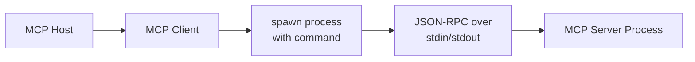
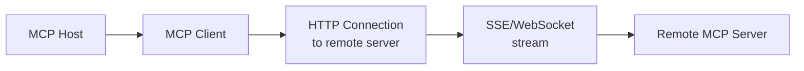

# Core Concepts of MCP

Understanding MCP requires grasping its fundamental architecture and communication patterns. This document explains the three main components, transport mechanisms, and how they work together to create a standardized tool ecosystem.

## The Three Core Components

MCP architecture revolves around three interconnected components that work together to enable seamless tool integration.

### MCP Host
The **MCP Host** is the application where your AI agent lives. This could be:

- **Claude Desktop** - Anthropic's desktop application with native MCP support
- **Agent Framework Applications** - Custom applications built with OpenAI Agents SDK, Crew AI, Autogen, or Landgraff
- **Integrated Development Environments** - Editors and IDEs that include agent capabilities

The host provides the runtime environment for AI agents and manages MCP client connections. From the host's perspective, MCP tools appear as native capabilities - the protocol abstraction handles all the complexity of remote tool integration.

### MCP Client
Every MCP client acts as a **bridge between the host and a single MCP server**. The client:

- **Manages the connection** to the MCP server using either Stdio or SSE transport
- **Translates protocol messages** between the host's agent framework and the MCP server
- **Handles communication reliability**, including error handling and reconnection logic
- **Provides tool discovery** by querying servers for available capabilities

In OpenAI Agents SDK, creating an MCP client and connecting to a server is as simple as:

```python
from openai_agent_sdk import MCPClient

async def setup_mcp_client():
    client = MCPClient.for_stdio_server(
        command="npx",
        args=["-y", "@modelcontextprotocol/server-fetch"],
        timeout=60
    )

    available_tools = await client.list_tools()
    return client, available_tools
```

### MCP Server
The **MCP Server** is an independent process that **exposes tools, resources, and prompts** to connecting clients. Servers can be:

- **Python packages** installed via pip (like `mcp-server-fetch`)
- **Node.js applications** run through npm (like `@modelcontextprotocol/server-filesystem`)
- **Custom binaries** written in any language that implement the MCP protocol
- **Remote services** accessible over HTTP for SSE-based communication

Servers are responsible for:
- **Tool execution logic** - What the tool does and how it works
- **Parameter validation** - Ensuring inputs match tool requirements
- **Result formatting** - Returning data in protocol-compatible formats
- **Resource management** - Handling connection lifecycle and cleanup

## Transport Mechanisms

MCP supports two transport mechanisms with different deployment characteristics and use cases.

### Stdio (Standard Input/Output)

**What it is**: Communication through standard Unix pipes (stdin/stdout)

**How it works**: The MCP host spawns the server as a child process and communicates via text streams. Messages are JSON-RPC formatted and exchanged through the process's standard input/output channels.

**Primary use case**: **Local MCP servers running on your machine**



**Advantages**:
- No network configuration required
- Servers automatically isolated in their own processes
- Simple to debug and monitor
- Preferred for most development and local deployments

**Disadvantages**:
- Cannot communicate across network boundaries
- Requires server to run on same machine as host
- Process management overhead

### SSE (Server-Sent Events)

**What it is**: HTTP-based communication using Server-Sent Events over WebSockets or standard HTTP

**How it works**: Clients make HTTP connections to remote MCP servers, which push events containing tool calls and responses. Based on standard web technologies like EventSource API.

**Primary use case**: **Remote MCP servers hosted as web services**



**Advantages**:
- Enables remote, hosted MCP servers
- Network-compatible for distributed deployments
- Can implement authentication and authorization
- Scales horizontally across multiple server instances

**Disadvantages**:
- Additional complexity of HTTP server setup
- Network configuration and firewall considerations
- Additional network latency
- Less established ecosystem (primarily remote/server implementations)

## Data Flow and Message Format

All MCP communication follows a **JSON-RPC 2.0** structure, wrapped in transport-specific envelopes. Here's how a typical tool execution works:

1. **Tool Discovery**: Client queries server with `tools/list` request
2. **Capability Negotiation**: Server responds with available tools and their schemas
3. **Tool Execution**: Client sends `tools/call` request with parameters
4. **Result Processing**: Server responds with execution results

Message structure example:
```json
{
  "jsonrpc": "2.0",
  "id": 1,
  "method": "tools/call",
  "params": {
    "name": "calculate_sum",
    "arguments": {
      "numbers": [1, 2, 3, 4, 5]
    }
  }
}
```

## Security and Isolation

MCP servers run with the same security characteristics as any code you execute. **Local Stdio servers** execute within their own process space:

- Tool code has standard OS process isolation
- File system access limited to process permissions
- Network access dependent on server implementation
- No direct memory sharing with host application

**Remote SSE servers** can implement additional security layers:

- HTTPS/SSL encryption for data in transit
- Authentication tokens and session management
- Rate limiting and request validation
- Service-level isolation through containerization

## Configuration Patterns

MCP server configuration typically involves specifying connection parameters:

```python
# Example Stdio configuration
fetch_server_config = {
    "command": "uvx",
    "args": ["mcp-server-fetch"],
    "timeout": 60
}

# Example SSE configuration
remote_server_config = {
    "url": "https://api.example.com/mcp",
    "headers": {
        "Authorization": "Bearer token123",
        "Content-Type": "application/json"
    }
}
```

## Common Deployment Configurations

### Local Development Setup
```
┌─────────────────┐    ┌─────────────────┐    ┌─────────────────┐
│   Claude Desktop │◄──►│   MCP Client    │◄──►│ Local MCP Server│
│                 │    │   (Stdio)       │    │  (Fetch tool)   │
└─────────────────┘    └─────────────────┘    └─────────────────┘
```

### Production Agent Service
```
┌─────────────────┐    ┌─────────────────┐    ┌─────────────────┐
│ Agent Framework │◄──►│   MCP Client    │◄──►│ MCP Server Pool │
│   (OpenAI SDK)  │    │   (Stdio)       │    │ (Docker containers)│
└─────────────────┘    └─────────────────┘    └─────────────────┘
```

### Hybrid Cloud Setup
```
┌─────────────────┐    ┌─────────────────┐    ┌─────────────────┐
│   Agent App     │◄──►│   MCP Client    │◄──►│    Remote MCP   │
│   (Local)       │    │    (SSE)        │    │  Server (Cloud) │
└─────────────────┘    └─────────────────┘    └─────────────────┘
```

Understanding these core components and their relationships provides the foundation for building MCP-integrated agent applications. The protocol's strength lies in this simple but powerful architecture that enables standardized tool integration across diverse agent frameworks.
