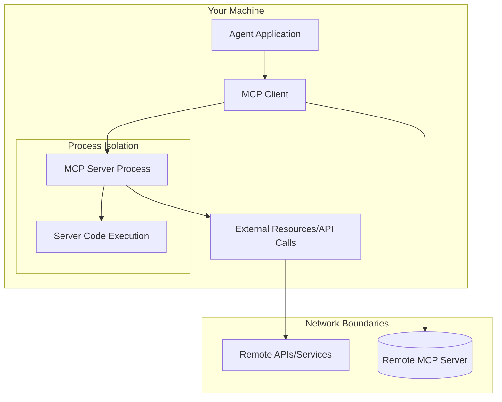

# MCP Security Practices

Security in MCP deployments requires careful consideration of trust boundaries, sandboxing, and risk management. Unlike traditional API integrations, MCP servers execute on your infrastructure with varying levels of isolation.

## Security Fundamentals

### Trust Boundaries in MCP Architecture

MCP introduces multiple trust boundaries that must be carefully managed:



**Key Security Considerations:**
1. **Server execution environment** - What can the server process access?
2. **Network communications** - What external services does the server contact?
3. **Data handling** - How are sensitive data processed and stored?
4. **Authentication/authorization** - Can we verify server identity and capabilities?

### Local MCP Server Security

**Stdio (Standard Input/Output) Servers** run with the same permissions as your agent application:

```python
# Dangerous configuration - inherits your user privileges
dangerous_config = {
    "command": "npx",
    "args": ["-y", "@dangerous/mcp-server"],
    # Server can access all your files, network, etc.
}

# Safer configuration - sandboxed execution
safe_app_config = {
    "command": "docker",
    "args": ["run", "--rm", "-v", "./sandbox:/data", "safe-mcp-server"],
    # Container limits filesystem and network access
}
```

**Filesystem Access Patterns:**
```python
# Sandboxed filesystem server - recommended for production
sandbox_config = {
    "command": "npx",
    "args": [
        "-y", "@modelcontextprotocol/server-filesystem",
        "--allowed-directory", "/app/sandbox",  # Limited path
        "--max-file-size", "10MB",              # Size limits
        "--read-only",                          # Optional read-only mode
    ]
}

# Containerized filesystem isolation
container_config = {
    "command": "docker",
    "args": [
        "run", "--rm",
        "-v", "./agent-data:/data:ro",          # Read-only volume mount
        "mcp-filesystem-server",
        "/data"
    ]
}
```

### Network Security Considerations

**Outbound Connections:** MCP servers frequently make internet requests:

```python
# Monitor network access patterns
import subprocess
import psutil

def monitor_mcp_network_activity(pid: int):
    """Monitor network connections for a MCP server process"""

    process = psutil.Process(pid)
    connections = process.connections()

    suspicious_patterns = [
        "untrusted-domain.com",
        "malicious-api.example"
    ]

    for conn in connections:
        remote_ip = conn.raddr.ip if conn.raddr else None
        if any(pattern in str(remote_ip) for pattern in suspicious_patterns):
            alert_security_team(f"Suspicious connection: {conn}")
```

**HTTPS/TLS Enforcement:**
```python
# Configure servers to enforce secure communications
secure_server_config = {
    "command": "npx",
    "args": ["-y", "secure-mcp-server"],
    "env": {
        "NODE_TLS_REJECT_UNAUTHORIZED": "1",     # Strict TLS checking
        "REQUIRE_HTTPS": "true",                 # Refuse HTTP URLs
        "ALLOWED_DOMAINS": "trusted-api.com,api.example.org"
    }
}
```

## Trust and Risk Assessment Framework

### MCP Server Trust Levels

```python
# Trust level assessment matrix
trust_levels = {
    "level_1_official": {
        "description": "Official Anthropic/Microsoft servers",
        "risk_level": "LOW",
        "vetting_required": False,
        "examples": ["@modelcontextprotocol/server-fetch"]
    },
    "level_2_verified": {
        "description": "Well-maintained by known publishers",
        "risk_level": "MEDIUM",
        "vetting_required": True,
        "examples": ["@company/server-official"]
    },
    "level_3_community": {
        "description": "Popular community servers with reviews",
        "risk_level": "HIGH",
        "vetting_required": True,
        "examples": ["popular-author/mcp-tool"]
    },
    "level_4_unknown": {
        "description": "Unverified or new servers",
        "risk_level": "CRITICAL",
        "vetting_required": True,
        "use_case": "Sandbox testing only"
    }
}
```

### Security Vetting Checklist

Before deploying any MCP server to production:

```python
def security_audit_checklist(server_source: str) -> dict:
    """Automated security assessment for MCP servers"""

    checks = {
        "source_verified": check_github_official(server_source),
        "dependencies_clean": audit_package_dependencies(server_source),
        "active_maintenance": verify_recent_commits(server_source),
        "security_issues": scan_for_vulnerabilities(server_source),
        "license_compatible": verify_open_source_license(server_source),
        "sandboxed_execution": supports_containerization(server_source)
    }

    scores = {
        "critical": sum(checks.values()),  # All checks must pass
        "warnings": sum(1 for check in checks.values() if not check)
    }

    return {
        "approved": scores["critical"] == len(checks),
        "warnings": scores["warnings"],
        "recommendations": generate_security_recommendations(checks)
    }
```

### Marketplace Security Ratings

Understanding Gloria marketplace security assessments:

```python
# Gloria security rating breakdown
gloria_ratings = {
    "A": {
        "meaning": "Production ready with comprehensive security",
        "requirements": [
            "Static analysis passed",
            "Dependency scanning clean",
            "Regular security audits",
            "Container-ready deployment"
        ]
    },
    "B": {
        "meaning": "Good security with minor concerns",
        "requirements": [
            "Most static analysis passed",
            "Only low-risk dependency issues",
            "Active maintenance"
        ]
    },
    "C": {
        "meaning": "Acceptable but with caveats",
        "requirements": [
            "Basic security practices",
            "Some dependency vulnerabilities addressed"
        ]
    },
    "D": {
        "meaning": "Significant security concerns",
        "recommendation": "Avoid for production"
    },
    "F": {
        "meaning": "Unacceptable security posture",
        "recommendation": "Do not use"
    }
}
```

## Sandboxing and Isolation Strategies

### Docker Container Security

```dockerfile
# Secure MCP server containerization
FROM node:18-alpine AS base

# Install dependencies in non-root user context
RUN addgroup -g 1001 -S appuser && \
    adduser -S -D -H -u 1001 -h /app -s /sbin/nologin -G appuser -g appuser appuser

WORKDIR /app
COPY package*.json ./
RUN npm ci --only=production --ignore-scripts

# Multi-stage build for security
FROM node:18-alpine AS production
RUN apk add --no-cache dumb-init

COPY --from=base --chown=appuser:appuser /app /app
USER appuser

# Security hardening
ENV NODE_ENV=production
ENV NODE_OPTIONS="--max-old-space-size=512"

EXPOSE 3000
CMD ["dumb-init", "node", "server.js"]
```

### Process Isolation with Firejail

```bash
# Run MCP server in restricted process sandbox
firejail --noprofile \
    --caps.drop=all \
    --netfilter \
    --read-only=/ \
    --tmpfs=/tmp \
    --private \
    --private-dev \
    --nonewprivs \
    npx @mcp/server-restricted-tool
```

### Network Namespace Isolation

```python
import subprocess
import threading

def run_isolated_mcp_server(command: list, network_ns: str = "mcp-net"):
    """Run MCP server in isolated network namespace"""

    # Create network namespace
    subprocess.run(["ip", "netns", "add", network_ns])

    # Setup restrictive network rules
    subprocess.run([
        "ip", "netns", "exec", network_ns,
        "iptables", "-P", "OUTPUT", "DROP"  # Block all outbound by default
    ])

    # Allow specific destinations
    allowed_domains = ["api.trusted-service.com", "cdn.example.org"]
    for domain in allowed_domains:
        subprocess.run([
            "ip", "netns", "exec", network_ns,
            "iptables", "-A", "OUTPUT", "-d", domain, "-j", "ACCEPT"
        ])

    # Run server in namespace
    server_process = subprocess.Popen(
        command,
        # Execute in network namespace
        preexec_fn=lambda: subprocess.call(["ip", "netns", "exec", network_ns]),
        # Other security options...
    )

    return server_process
```

## Authentication and Authorization

### Server Authentication Patterns

```python
# Authenticate remote MCP servers
async def authenticated_mcp_connection(host_url: str, credentials: dict):
    """Establish authenticated connection to remote MCP server"""

    # Client certificate authentication
    ssl_context = ssl.create_default_context()
    ssl_context.load_cert_chain(
        certfile=credentials["client_cert"],
        keyfile=credentials["client_key"]
    )

    # Verify server certificate
    ssl_context.check_hostname = True
    ssl_context.verify_mode = ssl.CERT_REQUIRED

    client = MCPClient.for_sse_server(
        url=host_url,
        headers={
            "Authorization": f"Bearer {credentials['token']}",
            "X-Client-Version": "1.0.0"
        },
        ssl=ssl_context
    )

    # Additional authentication steps
    await client.authenticate()
    return client
```

### Tool-Level Access Control

```python
class SecureMCPServer:
    """MCP server with fine-grained access controls"""

    def __init__(self, user_permissions: dict):
        self.user_permissions = user_permissions
        self.allowed_tools = self._filter_tools_by_permissions()

    def has_permission(self, tool_name: str, user_id: str) -> bool:
        user_perms = self.user_permissions.get(user_id, [])
        return self._tool_permission_check(tool_name, user_perms)

    async def execute_tool(self, tool_name: str, params: dict, user_id: str):
        if not self.has_permission(tool_name, user_id):
            raise PermissionDeniedError(f"Access denied to {tool_name}")

        # Execute tool with additional security checks
        result = await self._execute_with_limits(tool_name, params)
        return result
```

## Monitoring and Incident Response

### Security Monitoring Setup

```python
import logging
import time
from typing import Dict, Callable

class MCPSecurityMonitor:
    """Monitor MCP server security events"""

    def __init__(self):
        self.anomaly_detectors = {}
        self.alert_callbacks: List[Callable] = []
        self.baseline_metrics = {}

    def register_anomaly_detector(
        self,
        metric_name: str,
        detector_fn: Callable[[dict], bool],
        alert_message: str
    ):
        self.anomaly_detectors[metric_name] = {
            "detector": detector_fn,
            "alert_msg": alert_message
        }

    def monitor_server(self, server_id: str, metrics: dict):
        """Monitor ongoing server activity"""

        for metric_name, value in metrics.items():
            if metric_name in self.anomaly_detectors:
                detector = self.anomaly_detectors[metric_name]

                if detector["detector"](value):
                    self._trigger_alert(
                        server_id,
                        detector["alert_msg"],
                        {metric_name: value}
                    )

        self._update_baseline_metrics(metrics)

    def _trigger_alert(self, server_id: str, message: str, context: dict):
        logging.warning(f"Security alert for {server_id}: {message} | {context}")

        for callback in self.alert_callbacks:
            try:
                callback(server_id, message, context)
            except Exception as e:
                logging.error(f"Alert callback failed: {e}")
```

### Incident Response Plan

```python
def emergency_mcp_shutdown(incident_details: dict):
    """Emergency shutdown procedure for MCP security incidents"""

    # Log incident
    logging.critical(f"MCP Security Incident: {incident_details}")

    # Isolate affected components
    quarantine_processes = [
        "kill_mcp_servers_with_pattern('compromised')",
        "block_network_access_to_suspicious_domains"
    ]

    # Preserve evidence
    evidence_collection = [
        "capture_process_memory_dumps()",
        "log_all_recent_mcp_interactions()",
        "snapshot_current_system_state()"
    ]

    # Notification
    alert_security_team(incident_details)

    # Recovery procedures
    recovery_steps = [
        "deploy_clean_containers()",
        "restore_from_secure_backup()",
        "verify_integrity_of_remaining_components()"
    ]
```

## Best Practices Summary

**🛡️ Always implement minimum viable access:**
- Use containerization for added process isolation
- Configure network restrictions and monitoring
- Implement timeouts and resource limits

**🔍 Conduct thorough security reviews:**
- Audit third-party servers before production use
- Monitor server behavior and network access
- Implement anomaly detection and alerting

**📝 Maintain clear security boundaries:**
- Separate production and development environments
- Use different trust levels for different deployment stages
- Document all security assumptions and restrictions

**🚨 Prepare for incidents:**
- Have automated shutdown procedures
- Implement comprehensive logging and monitoring
- Develop and test incident response plans

Security in MCP ecosystems requires balancing powerful functionality with prudent risk management. Start with restrictive configurations and gradually increase access based on demonstrated reliability and verified security practices.
