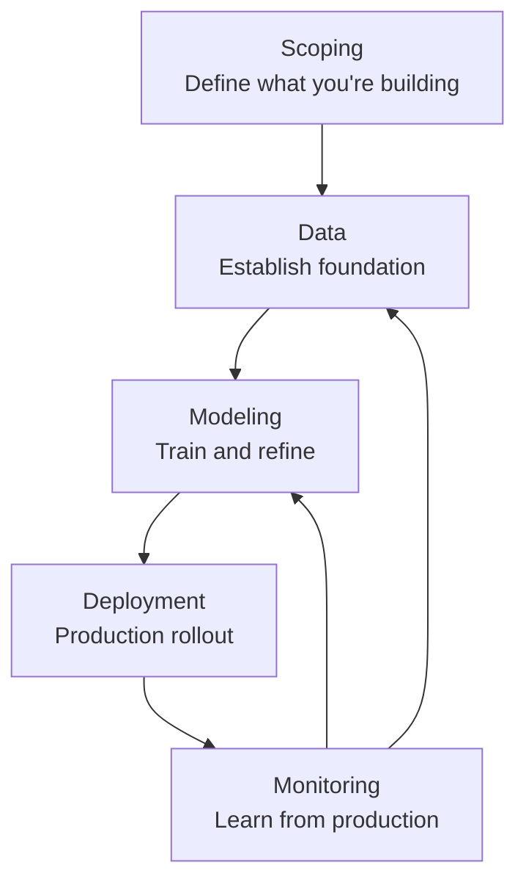

# The ML Project Lifecycle: Building Production-Ready Systems

Machine learning projects have a nasty tendency to fail spectacularly—not because the algorithms are flawed, but because teams skip the foundational work that turns promising research into reliable systems. Without a systematic approach to defining what you're building, ensuring data quality, iterating on models effectively, and maintaining performance in production, most ML initiatives will stagnate at the proof-of-concept stage or crumble under real-world pressures.

The ML lifecycle provides that framework: a proven methodology that guides you from initial concept to production deployment and continuous improvement. Think of it as the blueprint that transforms brilliant ideas into systems your users can actually depend on.

## Why This Matters: From Research to Reality

In academia or research environments, success often means publishing papers with impressive benchmarks. But production ML demands different priorities—reliability, scalability, cost-efficiency, and the ability to evolve as your data and requirements change. The lifecycle ensures you start with these realities in mind, rather than trying to retrofit them later when it matters most.

Consider a speech recognition system: A research team might achieve 95% accuracy on a carefully curated academic dataset. But when deployed to handle diverse accents, background noise, and real-time processing constraints, that same system might degrade to 70% accuracy and require 10 seconds per query. The lifecycle helps you identify these gaps early and build systems that work in the wild.

## The Core Flow: Iterative Learning and Improvement

Your ML system's journey follows this fundamental pattern:

This isn't a strict linear progression—it's cyclical, with production feedback continuously improving your models and data strategies. Each phase informs the next, creating systems that get better over time rather than deteriorating.

## Scoping: Starting with Clarity

Before writing a single line of code, you need a brutally honest assessment of what's actually possible and worth doing. This means defining not just the technical objectives, but the business constraints, success metrics, and resource requirements that will make or break your project. Poor scoping often reveals itself six months in, when you realize the "perfect" accuracy target was completely unrealistic for your use case.

## Data: Building on Solid Foundations

You can't out-train bad data. Yet in the excitement of new ML projects, data preparation often gets short shrift. This phase is about establishing rigorous data collection, labeling, and quality assurance processes that will scale. It's where you set up the baseline that all your future improvements will build upon.

## Modeling: The Art of Systematic Iteration

With solid data in hand, you enter the modeling phase—not as a quest for the perfect architecture, but as an analytical process of training, evaluating, and improving through targeted data and code changes. This is where experience matters most; junior teams might jump between exotic architectures, while veterans focus on error analysis to identify exactly what their models need.

## Deployment and Beyond: Production as the Ultimate Test

Once your model performs well in development, the real challenges begin—serving predictions at scale, maintaining performance as data evolves, and handling edge cases your training data didn't anticipate. This phase transforms your research artifact into a production service that creates value.

But deployment isn't the end; it's where the learning accelerates. Production systems generate feedback you can never simulate in development—drift patterns, usage patterns, performance under real loads. This continuous loop of monitoring and improvement turns your ML system into one that grows more capable over time.

## Production ML: A Different Mindset

Throughout this lifecycle, you'll notice a recurring theme: pragmatism over perfection. Research often pursues the theoretical optimum; production pursues what's good enough while maximizing reliability and efficiency. The key decisions that distinguish successful systems include:

- Prioritizing data quality over architectural sophistication
- Building monitoring and automated improvement systems upfront
- Treating deployment constraints as first-class design requirements
- Planning for iteration rather than one-shot perfection

## Getting Started

The lifecycle sections that follow provide deep dives into each phase, with real-world considerations that matter in production environments. Whether you're starting a new ML initiative or rescuing one that's stalled, these insights will help you build systems that actually deliver value.

Ready to dive deeper? Start with [scoping](scoping) to understand how to properly define what you're building.

## Related Topics

- [Deployment Patterns](../deployment/) - Production rollout strategies
- [Monitoring Strategies](../monitoring/) - Keeping systems healthy in production
- [Speech Recognition Example](../examples/speech-recognition) - A complete lifecycle walkthrough
