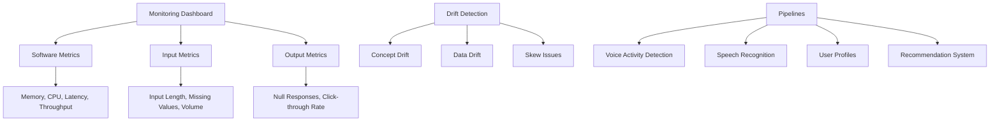

# ML Monitoring

Monitoring is crucial for maintaining ML system performance over time. This includes tracking software metrics, input/output distributions, and pipeline health.



## Comprehensive Monitoring Coverage

The monitoring section provides end-to-end guidance for maintaining ML system reliability:

- **[Metrics](metrics/)**: Software, input, and output monitoring with production-ready implementation examples
- **[Drift](drift/)**: Concept vs data drift detection with statistical tools and alerting strategies
- **[Pipelines](pipelines/)**: Multi-stage ML system monitoring with domain-specific templates
- **Integrated Examples**: Real-world implementations using Prometheus, Grafana, and ELK stack

## Quick Implementation Templates

### Automated Drift Detection Setup
```python
from monitoring.drift_detector import DriftDetector

# Initialize detector for numeric features
detector = DriftDetector(['feature1', 'feature2'])
detector.establish_baseline(training_data)

# Production monitoring
def monitor_predictions(input_data, model):
    drift_report = detector.detect_data_drift(input_data)

    for feature, results in drift_report.items():
        if results['drift_detected']:
            alert_stakeholders(f"Drift in {feature}, triggering retraining")

    return model.predict(input_data)
```

### ML API Metrics Dashboard
```yaml
# prometheus.yml additions
scrape_configs:
  - job_name: 'ml-api'
    metrics_path: '/metrics'
    static_configs:
      - targets: ['your-ml-service:8080']
```

## Tool Integration Examples

### Prometheus + Grafana Stack

**Automatic Alert Rules**:
```yaml
groups:
  - name: ml-performance-alerts
    rules:
      - alert: HighModelErrorRate
        expr: rate(ml_errors_total[5m]) / rate(ml_predictions_total[5m]) > 0.05
        for: 10m
        annotations:
          summary: "ML model error rate elevated"
```

**Dashboard Configuration**:
```json
{
  "dashboard": {
    "title": "ML Service Health",
    "panels": [
      {
        "title": "Prediction Latency P95",
        "type": "graph",
        "targets": [{
          "expr": "histogram_quantile(0.95, rate(ml_prediction_latency_seconds_bucket[5m]))"
        }]
      },
      {
        "title": "Error Rate Trend",
        "type": "graph",
        "targets": [{
          "expr": "rate(ml_errors_total[5m]) / rate(ml_predictions_total[5m])"
        }]
      }
    ]
  }
}
```

## Pipeline-Specific Quick Starts

| Pipeline Type      | Key Monitoring Points                  | Alert Thresholds             |
| ------------------ | -------------------------------------- | ---------------------------- |
| Speech Recognition | VAD accuracy, ASR latency              | 5% error rate, 500ms latency |
| Recommendations    | Profile confidence, click-through rate | 80% confidence, <0.1 CTR     |
| Computer Vision    | Image quality, detection accuracy      | SSD <80%, FID >10            |

## Related Topics

- [ML Lifecycle](../lifecycle/)
- [Deployment Patterns](../deployment/)
- [Speech Recognition Monitoring](../examples/speech-recognition)
