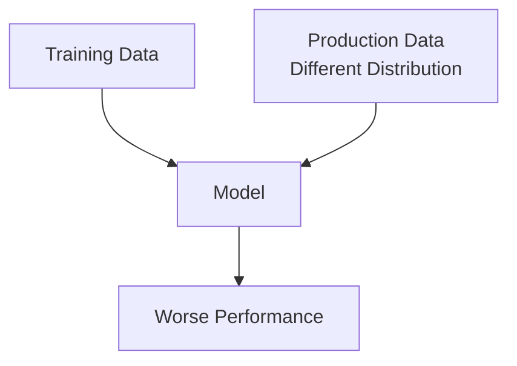
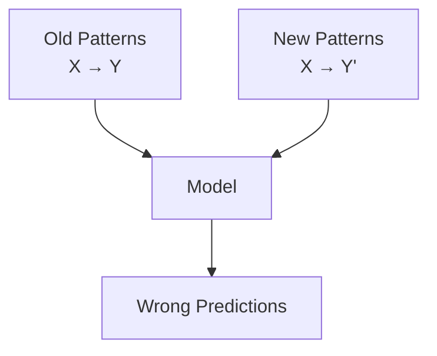

# Concept and Data Drift

ML models degrade over time as the world changes. Drift refers to the gap between the model's learned patterns and current reality. All models decay—some in weeks, others in years.

## Model Decay

Model staleness affects accuracy, precision, F1-score, or business KPIs. Speed varies by domain:

- **Long-lasting**: Vision/NLP models (years)
- **Short-lived**: Recommender/fraud systems (weekly/daily)

## Two Types of Drift

### Data Drift (Feature Shift/Covariate Shift)
Input distribution changes while patterns remain similar:

- **Demographics**: New user segment joins (e.g., Facebook ads attracting different users)
- **Technical**: Hardware upgrades change sensor inputs
- **Geographic**: Model applied in new region



### Concept Drift (Label Shift/Target Shift)
Patterns themselves change while inputs stay similar:

- **Marketing**: Competitors launch new products, changing demand
- **Finance**: Economic conditions shift default rates
- **Manufacturing**: Equipment wear changes failure modes



## Concept Drift Flavors

### Gradual Drift
- Slow, expected changes
- Can observe feature-level shifts
- Seasonal patterns, market evolution

### Sudden Drift
- Abrupt shocks
- COVID-19 mobility changes
- Interest rate adjustments
- App interface updates

### Recurring Drift (Seasonal)
- Predictable cyclic changes
- Black Friday shopping spikes
- Holiday patterns

## Dealing with Drift

### Detection Strategies
- Compare inputs: Statistical tests (t-tests, KS-tests)
- Monitor output distributions
- Track performance metrics over time

### Response Approaches
- **Retrain**: New data with recent emphasis
- **Domain adaptation**: Transfer learning approaches
- **Model mixing**: Ensemble old/new models
- **Scope changes**: Shorter horizons, more frequent updates

### Risk Management
- **Process alignment**: Coordinate with business on planned changes
- **Fallback strategies**: Rules-based fallbacks during retraining
- **Feedback loops**: Production data improves future models

## Training vs Serving Skew

Mismatch at launch, not gradual change:
- **Artificial training data**: Doesn't match real-world diversity
- **Tabular data**: Invoice recognition example
- **Imaging**: Retina scans in poor conditions

## Implementation: Drift Detection

Here's a Python implementation for detecting data drift in numeric features using statistical tests:

```python
import pandas as pd
from scipy import stats
import numpy as np
from typing import Dict, List
import warnings

class DriftDetector:
    def __init__(self, feature_names: List[str], threshold: float = 0.05):
        self.feature_names = feature_names
        self.threshold = threshold
        self.baseline_stats = {}

    def establish_baseline(self, baseline_data: pd.DataFrame):
        """Calculate baseline statistics from training/production data."""
        for feature in self.feature_names:
            if feature not in baseline_data.columns:
                raise ValueError(f"Feature {feature} not found in data")

            data = baseline_data[feature].dropna()
            self.baseline_stats[feature] = {
                'mean': data.mean(),
                'std': data.std(),
                'median': data.median(),
                'skewness': stats.skew(data),
                'kurtosis': stats.kurtosis(data)
            }

    def detect_data_drift(self, current_data: pd.DataFrame) -> Dict[str, Dict]:
        """Detect drift by comparing current data against baseline."""
        drift_results = {}

        for feature in self.feature_names:
            if feature not in current_data.columns:
                drift_results[feature] = {'drift_detected': True, 'error': 'feature_missing'}
                continue

            baseline = self.baseline_stats[feature]
            current_vals = current_data[feature].dropna()

            if len(current_vals) < 10:
                drift_results[feature] = {'drift_detected': 'insufficient_data', 'reason': 'small_sample'}
                continue

            # Z-test for mean difference
            z_score = abs(current_vals.mean() - baseline['mean']) / (baseline['std'] / np.sqrt(len(current_vals)))
            mean_drift_p_value = 2 * (1 - stats.norm.cdf(z_score))

            # KS-test for distribution difference
            try:
                # Create baseline distribution sample for KS test
                base_sample = np.random.normal(baseline['mean'], baseline['std'], len(current_vals))
                ks_stat, ks_p_value = stats.ks_2samp(current_vals, base_sample)
            except Exception:
                ks_stat, ks_p_value = None, None

            drift_detected = (mean_drift_p_value < self.threshold) or (ks_p_value and ks_p_value < self.threshold)

            drift_results[feature] = {
                'drift_detected': bool(drift_detected),
                'mean_drift_p_value': float(mean_drift_p_value),
                'ks_p_value': float(ks_p_value) if ks_p_value else None,
                'current_mean': float(current_vals.mean()),
                'baseline_mean': float(baseline['mean']),
                'drift_magnitude': abs(current_vals.mean() - baseline['mean']) / baseline['std']
            }

        return drift_results

    def plot_drift_comparison(self, current_data: pd.DataFrame, save_path: str = None):
        """Visualize drift by plotting distributions."""
        import matplotlib.pyplot as plt

        n_features = len(self.feature_names)
        fig, axes = plt.subplots(n_features, 1, figsize=(10, 4*n_features))

        for idx, feature in enumerate(self.feature_names):
            if n_features == 1:
                ax = axes
            else:
                ax = axes[idx]

            baseline = self.baseline_stats[feature]
            current_vals = current_data[feature].dropna()

            # Plot distributions
            ax.hist(current_vals, alpha=0.7, label='Current', bins=30)
            x = np.linspace(min(current_vals), max(current_vals), 100)
            y = stats.norm.pdf(x, baseline['mean'], baseline['std'])
            ax.plot(x, y, 'r-', label='Baseline Expected', linewidth=2)
            ax.set_title(f'Feature: {feature}')
            ax.legend()

        plt.tight_layout()
        if save_path:
            plt.savefig(save_path)
        plt.show()

# Usage example
drift_detector = DriftDetector(['feature1', 'feature2', 'feature3'])

# Establish baseline from training data
training_data = pd.DataFrame({...})  # Your training data
drift_detector.establish_baseline(training_data)

# Monitor production data
production_data = pd.DataFrame({...})  # Current production inputs
drift_report = drift_detector.detect_data_drift(production_data)

# Check for drift
for feature, results in drift_report.items():
    if results['drift_detected']:
        print(f"⚠️  Drift detected in {feature}")
        print(f"   P-value: {results.get('mean_drift_p_value', 'N/A')}")
        print(f"   Magnitude: {results.get('drift_magnitude', 'N/A'):.2f} std deviations")

# Optional: Visualize distributions
drift_detector.plot_drift_comparison(production_data)
```

### Concept Drift Detection Example

For concept drift (where the prediction relationship changes), monitor prediction accuracy over time:

```python
def monitor_concept_drift(predictions, actuals, timestamps, window_size=1000):
    """Monitor prediction accuracy windows for concept drift signals."""
    from collections import deque
    import pandas as pd

    accuracy_windows = []
    current_window_preds = deque()
    current_window_actuals = deque()

    for pred, actual in zip(predictions, actuals):
        current_window_preds.append(pred)
        current_window_actuals.append(actual)

        if len(current_window_preds) >= window_size:
            window_accuracy = np.mean([p == a for p, a in zip(current_window_preds, current_window_actuals)])
            accuracy_windows.append(window_accuracy)

            # Remove oldest items to maintain window size
            current_window_preds.popleft()
            current_window_actuals.popleft()

    # Plot accuracy trend
    plt.figure(figsize=(12, 6))
    plt.plot(accuracy_windows)
    plt.title('Rolling Prediction Accuracy')
    plt.xlabel('Time Window')
    plt.ylabel('Accuracy')
    plt.axhline(y=np.mean(accuracy_windows), color='red', linestyle='--', label='Overall Mean')
    plt.legend()
    plt.grid(True)
    plt.show()

    # Detect significant drops
    recent_avg = np.mean(accuracy_windows[-10:])  # Last 10 windows
    overall_avg = np.mean(accuracy_windows)
    drift_ratio = recent_avg / overall_avg

    if drift_ratio < 0.8:  # 20% drop
        print(".2f"
# Usage
predictions = [...]  # Model predictions
actuals = [...]      # Ground truth
timestamps = [...]   # Time series

monitor_concept_drift(predictions, actuals, timestamps)
```

## Implementation Tips

- **Estimate decay rate**: Test on historical data with different retraining frequencies
- **Set baselines**: Establish expected ranges for inputs/outputs
- **Automate alerts**: Threshold-based notifications for drift detection
- **Version control**: Track model and data lineage

## Why It Matters

Unmonitored drift leads to:
- **Silent failures**: Models appear working but don't add value
- **Regulatory risks**: Especially in healthcare/finance
- **Business impact**: Lost revenue, customer dissatisfaction

## Related Topics

- [Monitoring Metrics](../metrics)
- [Deployment Challenges](../../deployment/challenges/#concept-drift)
- [Pipelines](../pipelines)
