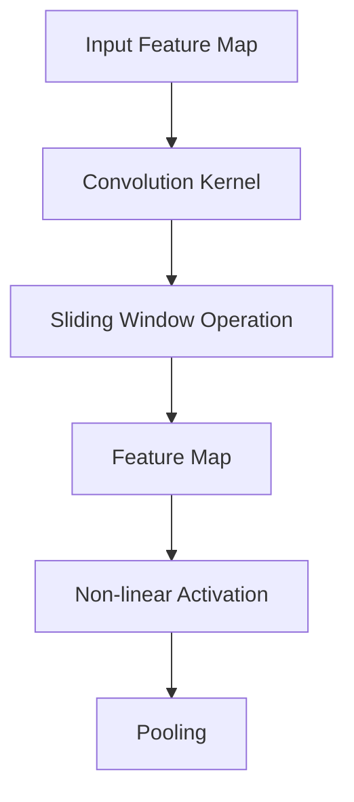

# Convolutional Neural Networks (CNN)

Convolutional Neural Networks revolutionized computer vision by enabling machines to automatically learn hierarchical visual features. Unlike traditional ANNs that treat all inputs equally, CNNs exploit spatial relationships in data through specialized layers that efficiently process grid-structured information like images.

## The Convolutional Operation

The core innovation of CNNs is the convolution operation, which applies learnable filters across input data to extract local patterns.



### How Convolution Works

A convolution kernel (filter) slides across the input, computing dot products at each position:

**2D Convolution Formula:**
```
output[i,j] = Σ Σ kernel[m,n] × input[i+m,j+n]
```

**Key Parameters:**
- **Kernel Size**: Filter dimensions (e.g., 3×3, 5×5)
- **Stride**: How much the kernel moves between computations
- **Padding**: Zero values added around input borders

```python
import torch.nn as nn

# Basic convolution layer
conv_layer = nn.Conv2d(
    in_channels=3,      # RGB image: 3 channels
    out_channels=64,    # 64 feature maps
    kernel_size=3,      # 3×3 kernel
    stride=1,           # Move by 1 pixel
    padding=1           # Maintain spatial dimensions
)
```

## Pooling Layers

Pooling layers reduce spatial dimensions and computational complexity while preserving important features.

### Max Pooling

Selects the maximum value in each window, capturing the most prominent features.

```python
# Max pooling layer
max_pool = nn.MaxPool2d(kernel_size=2, stride=2)
# Reduces spatial dimensions by factor of 2
```

### Average Pooling

Computes the average value, useful for downsampling while smoothing noise.

### Global Average Pooling

Computes average across entire feature maps, commonly used before classification layers.

**Benefits:**
- Translation invariance
- Reduced computation
- Control overfitting by forcing parameter sharing

## CNN Architecture Patterns

### Layer Progression

Typical CNN progression:
1. **Convolution + Activation**: Extract local features
2. **Pooling**: Reduce spatial size
3. **Repeat**: Deeper feature extraction
4. **Fully Connected**: Classification/regression

```python
import torch
import torch.nn as nn

class CNN(nn.Module):
    def __init__(self):
        super(CNN, self).__init__()
        # Feature extraction
        self.conv1 = nn.Conv2d(3, 32, kernel_size=3, padding=1)
        self.pool = nn.MaxPool2d(2, 2)

        # Deeper features
        self.conv2 = nn.Conv2d(32, 64, kernel_size=3, padding=1)
        self.conv3 = nn.Conv2d(64, 128, kernel_size=3, padding=1)

        # Classification head
        self.fc1 = nn.Linear(128 * 4 * 4, 512)  # Assumes 32x32 -> 4x4 after 3 poolings
        self.fc2 = nn.Linear(512, 10)  # 10 classes

    def forward(self, x):
        # Convolutional layers
        x = torch.relu(self.conv1(x))
        x = self.pool(x)

        x = torch.relu(self.conv2(x))
        x = self.pool(x)

        x = torch.relu(self.conv3(x))
        x = self.pool(x)

        # Flatten
        x = x.view(-1, 128 * 4 * 4)

        # Fully connected
        x = torch.relu(self.fc1(x))
        x = self.fc2(x)
        return x
```

## Understanding Image Processing with CNNs

CNNs excel at computer vision tasks because they learn hierarchical representations:

- **Low-level features**: Edges, corners, colors
- **Mid-level features**: Textures, shapes, parts
- **High-level features**: Objects, scenes, semantic concepts

```python
# Visualize convolutional features
import matplotlib.pyplot as plt

def visualize_features(model, input_image):
    """Extract and display feature maps from different layers"""

    # Get feature maps from each conv layer
    with torch.no_grad():
        features = []
        x = input_image

        x = torch.relu(model.conv1(x))
        features.append(x.cpu().numpy())

        x = model.pool(x)
        x = torch.relu(model.conv2(x))
        features.append(x.cpu().numpy())

        # Display feature maps
        for i, feature_map in enumerate(features):
            # Show first 16 feature maps
            fig, axes = plt.subplots(4, 4, figsize=(8, 8))
            for j in range(16):
                ax = axes[j//4, j%4]
                ax.imshow(feature_map[0, j], cmap='viridis')
                ax.axis('off')
            plt.suptitle(f'Layer {i+1} Feature Maps')
            plt.show()
```

## Common Architectures

### LeNet-5 (1998)

The pioneering CNN architecture by Yann LeCun for handwritten digit recognition.

```python
class LeNet5(nn.Module):
    def __init__(self):
        super(LeNet5, self).__init__()
        self.conv1 = nn.Conv2d(1, 6, kernel_size=5)  # 28x28 -> 24x24
        self.pool1 = nn.AvgPool2d(2, 2)              # 24x24 -> 12x12
        self.conv2 = nn.Conv2d(6, 16, kernel_size=5)  # 12x12 -> 8x8
        self.pool2 = nn.AvgPool2d(2, 2)               # 8x8 -> 4x4

        self.fc1 = nn.Linear(16 * 4 * 4, 120)
        self.fc2 = nn.Linear(120, 84)
        self.fc3 = nn.Linear(84, 10)

    def forward(self, x):
        x = torch.tanh(self.conv1(x))
        x = self.pool1(x)

        x = torch.tanh(self.conv2(x))
        x = self.pool2(x)

        x = x.view(-1, 16 * 4 * 4)
        x = torch.tanh(self.fc1(x))
        x = torch.tanh(self.fc2(x))
        x = self.fc3(x)
        return x
```

**Key Design Choices:**
- Average pooling instead of max pooling
- Sigmoid/tanh activations
- Multiple fully connected layers

### AlexNet (2012)

Won ImageNet 2012, demonstrating CNNs' power on large-scale image classification.

**Innovations:**
- Deep architecture (8 layers)
- ReLU activations
- Dropout regularization
- Data augmentation
- Parallel training on GPUs

```python
class AlexNet(nn.Module):
    def __init__(self):
        super(AlexNet, self).__init__()
        self.features = nn.Sequential(
            nn.Conv2d(3, 96, kernel_size=11, stride=4),  # 224x224 -> 55x55
            nn.ReLU(inplace=True),
            nn.MaxPool2d(3, 2),                           # 55x55 -> 27x27

            nn.Conv2d(96, 256, 5, padding=2),
            nn.ReLU(inplace=True),
            nn.MaxPool2d(3, 2),                           # 27x27 -> 13x13

            nn.Conv2d(256, 384, 3, padding=1),
            nn.ReLU(inplace=True),

            nn.Conv2d(384, 384, 3, padding=1),
            nn.ReLU(inplace=True),

            nn.Conv2d(384, 256, 3, padding=1),
            nn.ReLU(inplace=True),
            nn.MaxPool2d(3, 2),                           # 13x13 -> 6x6
        )

        self.classifier = nn.Sequential(
            nn.Dropout(),
            nn.Linear(256 * 6 * 6, 4096),
            nn.ReLU(inplace=True),

            nn.Dropout(),
            nn.Linear(4096, 4096),
            nn.ReLU(inplace=True),

            nn.Linear(4096, 1000),
        )

    def forward(self, x):
        x = self.features(x)
        x = x.view(x.size(0), -1)
        x = self.classifier(x)
        return x
```

### VGG Net (2014)

Pushed depth to 16-19 layers, showing that deeper networks with small filters work well.

**Principles:**
- Smaller 3×3 filters in sequence
- Max pooling every 2 layers
- Dense fully connected layers at end

```python
# VGG-16 block configuration
vgg_config = [64, 64, 'M', 128, 128, 'M', 256, 256, 256, 'M',
              512, 512, 512, 'M', 512, 512, 512, 'M']

# Simpler implementation
def make_layers(cfg, batch_norm=False):
    layers = []
    in_channels = 3
    for v in cfg:
        if v == 'M':
            layers += [nn.MaxPool2d(2, 2)]
        else:
            conv2d = nn.Conv2d(in_channels, v, kernel_size=3, padding=1)
            if batch_norm:
                layers += [conv2d, nn.BatchNorm2d(v), nn.ReLU(inplace=True)]
            else:
                layers += [conv2d, nn.ReLU(inplace=True)]
            in_channels = v
    return nn.Sequential(*layers)
```

### ResNet (2015)

Introduced residual connections to enable training of extremely deep networks (up to 1000+ layers).

**Key Innovation:**
```python
# Residual block
class ResidualBlock(nn.Module):
    def __init__(self, in_channels, out_channels, stride=1, downsample=None):
        super(ResidualBlock, self).__init__()
        self.conv1 = nn.Conv2d(in_channels, out_channels, kernel_size=3, stride=stride, padding=1)
        self.bn1 = nn.BatchNorm2d(out_channels)
        self.conv2 = nn.Conv2d(out_channels, out_channels, kernel_size=3, stride=1, padding=1)
        self.bn2 = nn.BatchNorm2d(out_channels)
        self.downsample = downsample

    def forward(self, x):
        identity = x

        out = F.relu(self.bn1(self.conv1(x)))
        out = self.bn2(self.conv2(out))

        if self.downsample is not None:
            identity = self.downsample(x)

        out += identity  # Skip connection
        out = F.relu(out)
        return out
```

**Why it works:**
- Skip connections provide gradient highways
- Enables identity mapping when needed
- Prevents vanishing gradients in deep networks
- Allows training of networks much deeper than before

## Training CNNs Effectively

### Data Augmentation

Generate variations of training data to improve generalization:

```python
import torchvision.transforms as transforms

train_transforms = transforms.Compose([
    transforms.RandomResizedCrop(224),
    transforms.RandomHorizontalFlip(),
    transforms.RandomRotation(10),
    transforms.ColorJitter(brightness=0.1, contrast=0.1, saturation=0.1),
    transforms.ToTensor(),
    transforms.Normalize([0.485, 0.456, 0.406], [0.229, 0.224, 0.225])
])
```

### Transfer Learning

Leverage pre-trained models for new tasks:

```python
import torchvision.models as models

# Load pre-trained ResNet
model = models.resnet50(pretrained=True)

# Freeze convolutional layers
for param in model.parameters():
    param.requires_grad = False

# Replace classifier
num_classes = 10
model.fc = nn.Linear(model.fc.in_features, num_classes)

# Fine-tune on new dataset
optimizer = torch.optim.Adam(model.fc.parameters(), lr=0.001)
```

### Batch Normalization

Standardizes layer inputs, accelerating training:

```python
# Before each convolution
conv = nn.Sequential(
    nn.Conv2d(64, 128, 3, padding=1),
    nn.BatchNorm2d(128),  # Normalize across batch
    nn.ReLU(inplace=True)
)
```

## Applications & Case Studies

### Object Detection

CNNs form the backbone of detectors like R-CNN, Fast R-CNN, and YOLO:

```python
# Simplified YOLO-like prediction head
class DetectionHead(nn.Module):
    def __init__(self, in_channels, num_classes, num_anchors):
        super().__init__()
        # Predict bounding boxes and class probabilities
        self.conv = nn.Conv2d(in_channels, num_anchors * (4 + num_classes), 1)

    def forward(self, x):
        predictions = self.conv(x)
        # Reshape to [batch, anchors, height, width, 4+num_classes]
        batch_size, _, h, w = predictions.shape
        predictions = predictions.view(batch_size, -1, 4 + self.num_classes, h, w)
        return predictions
```

### Semantic Segmentation

Pixel-wise classification using networks like U-Net or DeepLab:

```python
# U-Net decoder block
class DecoderBlock(nn.Module):
    def __init__(self, in_channels, mid_channels, out_channels):
        super().__init__()
        self.up = nn.ConvTranspose2d(in_channels, mid_channels, 2, stride=2)
        self.conv = nn.Sequential(
            nn.Conv2d(mid_channels*2, out_channels, 3, padding=1),  # Skip connection doubles input
            nn.BatchNorm2d(out_channels),
            nn.ReLU(inplace=True),
            nn.Conv2d(out_channels, out_channels, 3, padding=1),
            nn.BatchNorm2d(out_channels),
            nn.ReLU(inplace=True)
        )

    def forward(self, x, skip):
        x = self.up(x)
        x = torch.cat([x, skip], dim=1)  # Concatenate with skip connection
        x = self.conv(x)
        return x
```

### Style Transfer

Combining content and style representations:

```python
class StyleTransfer(nn.Module):
    def __init__(self):
        super().__init__()
        self.vgg = models.vgg19(pretrained=True).features

        # Content layer
        self.content_layers = ['conv4_2']

        # Style layers
        self.style_layers = ['conv1_1', 'conv2_1', 'conv3_1', 'conv4_1', 'conv5_1']

    def get_features(self, x, layers):
        features = {}
        for name, layer in self.vgg._modules.items():
            x = layer(x)
            if name in layers:
                features[name] = x
        return features

    def forward(self, x):
        return self.get_features(x, self.content_layers.keys() | self.style_layers.keys())
```

## Challenges & Solutions

### Computational Complexity

CNNs require significant compute resources:

**Solutions:**
- Model quantization (8-bit weights)
- Knowledge distillation (smaller student networks)
- Neural architecture search (efficient architectures)

### Overfitting on Small Datasets

**Solutions:**
- Transfer learning (fine-tune pre-trained models)
- Data augmentation (synthetic data generation)
- Regularization techniques (dropout, weight decay)

### Interpretability

Understanding CNN decisions:

**Techniques:**
- Activation maximization (what activates neurons)
- Gradient-weighted class activation mapping (CAM)
- Guided backpropagation

CNNs transformed computer vision from hand-engineered features to end-to-end learning systems. Their ability to automatically discover hierarchical representations makes them indispensable for visual tasks, while their architectural innovations continue to inspire advances in other domains.
