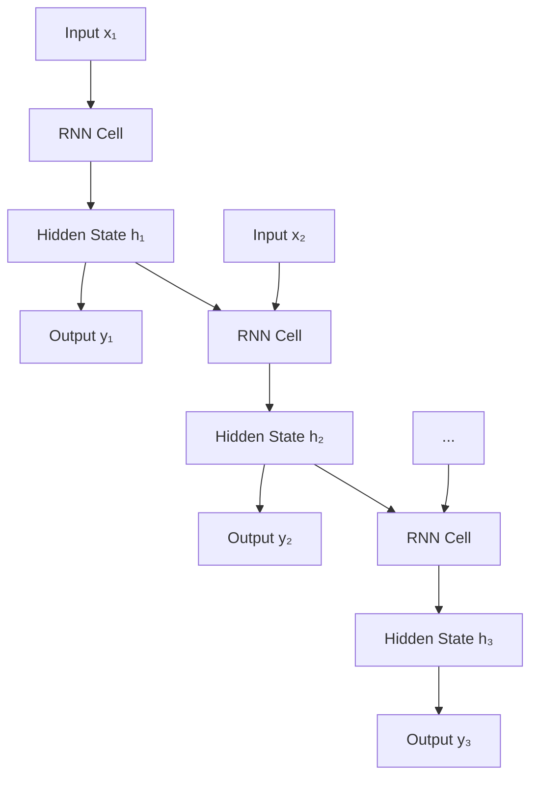
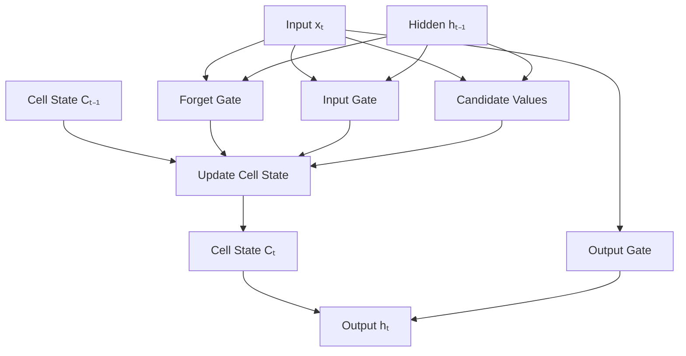

# Recurrent Neural Networks (RNN)

Recurrent Neural Networks excel at processing sequential data by maintaining internal memory of previous inputs. Unlike feedforward networks that treat each input independently, RNNs capture temporal dependencies, making them ideal for time series forecasting, natural language processing, and sequence generation tasks.

## The Recurrent Computation

RNNs process sequences one element at a time while maintaining a hidden state that carries information from previous steps.



### Mathematical Foundation

At each time step t:

**Hidden State Update:**
```
hₜ = activation(Wₕh × hₜ₋₁ + Wₕx × xₜ + bₕ)
```

**Output Computation:**
```
yₜ = activation(Wₒh × hₜ + bₒ)
```

**Key Components:**
- **Hidden State (hₜ)**: Memory of previous inputs
- **Weight Matrices**: Wₕh (recurrent), Wₕx (input), Wₒh (output)
- **Shared Parameters**: Same weights across all time steps

```python
import torch.nn as nn

class SimpleRNN(nn.Module):
    def __init__(self, input_size, hidden_size, output_size):
        super(SimpleRNN, self).__init__()
        self.hidden_size = hidden_size

        # RNN weights and biases
        self.i2h = nn.Linear(input_size + hidden_size, hidden_size)  # Input to hidden
        self.i2o = nn.Linear(input_size + hidden_size, output_size)  # Input to output, sometimes omitted

    def forward(self, input_seq, hidden=None):
        """
        Process a sequence of inputs
        input_seq: [batch_size, seq_len, input_size]
        """
        batch_size, seq_len, _ = input_seq.shape
        outputs = []
        hidden_states = []

        # Initialize hidden state
        if hidden is None:
            hidden = torch.zeros(batch_size, self.hidden_size)

        # Process each time step
        for t in range(seq_len):
            x_t = input_seq[:, t, :]  # Current input

            # Combine input and previous hidden
            combined = torch.cat([x_t, hidden], dim=1)

            # Update hidden state and compute output
            hidden = torch.tanh(self.i2h(combined))
            output = self.i2o(combined)

            outputs.append(output)
            hidden_states.append(hidden)

        return torch.stack(outputs, dim=1), torch.stack(hidden_states, dim=1)

    def initHidden(self, batch_size):
        return torch.zeros(batch_size, self.hidden_size)
```

## The Vanishing Gradient Problem

RNNs suffer from vanishing or exploding gradients during training, making them difficult to learn long-term dependencies.

### Why It Happens

**Chain Rule in RNNs:**
```
∂L/∂W = Σ Σ ... Σ ∂L/∂y₀ ⋯ ∂y₀/∂h₀ ⋯ ∂h₀/∂W
```

With repeated matrix multiplications, gradients either:
- Become very small (vanish) and stop flowing back
- Become very large (explode) and cause training instability

### Temporal Horizons

- **Short-term memory**: Well captured by basic RNNs
- **Long-term memory**: Lost due to vanishing gradients

## Long Short-Term Memory (LSTM)

LSTM networks address vanishing gradients through specialized memory cells and gating mechanisms.



### LSTM Cell Components

**Forget Gate:**
```
fₜ = σ(W_f × [hₜ₋₁, xₜ] + b_f)
```

**Input Gate:**
```
iₜ = σ(W_i × [hₜ₋₁, xₜ] + b_i)
```

**Candidate Values:**
```
~Cₜ = tanh(W_C × [hₜ₋₁, xₜ] + b_C)
```

**Cell State Update:**
```
Cₜ = fₜ × Cₜ₋₁ + iₜ × ~Cₜ
```

**Output Gate:**
```
oₜ = σ(W_o × [hₜ₋₁, xₜ] + b_o)
hₜ = oₜ × tanh(Cₜ)
```

**Key Innovation:**
- **Cell State**: Protected long-term memory pathway
- **Gates**: Control information flow (forget, input, output)
- **Peephole Connections**: Optional gates access cell state

```python
class LSTMCell(nn.Module):
    def __init__(self, input_size, hidden_size):
        super(LSTMCell, self).__init__()
        self.input_size = input_size
        self.hidden_size = hidden_size

        # Gates: forget, input, candidate, output
        self.x2f = nn.Linear(input_size, hidden_size)
        self.h2f = nn.Linear(hidden_size, hidden_size)

        self.x2i = nn.Linear(input_size, hidden_size)
        self.h2i = nn.Linear(hidden_size, hidden_size)

        self.x2c = nn.Linear(input_size, hidden_size)
        self.h2c = nn.Linear(hidden_size, hidden_size)

        self.x2o = nn.Linear(input_size, hidden_size)
        self.h2o = nn.Linear(hidden_size, hidden_size)

    def forward(self, x_t, h_prev, c_prev):
        # Forget gate
        f_t = torch.sigmoid(self.x2f(x_t) + self.h2f(h_prev))

        # Input gate
        i_t = torch.sigmoid(self.x2i(x_t) + self.h2i(h_prev))

        # Candidate values
        c_tilde = torch.tanh(self.x2c(x_t) + self.h2c(h_prev))

        # Cell state update
        c_t = f_t * c_prev + i_t * c_tilde

        # Output gate
        o_t = torch.sigmoid(self.x2o(x_t) + self.h2o(h_prev))

        # Hidden state
        h_t = o_t * torch.tanh(c_t)

        return h_t, c_t
```

## Gated Recurrent Unit (GRU)

GRUs simplify LSTMs while maintaining similar performance, using fewer parameters.

### GRU Mechanism

**Reset Gate:**
```
rₜ = σ(W_r × [hₜ₋₁, xₜ])
```

**Update Gate:**
```
zₜ = σ(W_z × [hₜ₋₁, xₜ])
```

**Candidate Hidden State:**
```
~hₜ = tanh(W × [rₜ × hₜ₋₁, xₜ])
```

**Hidden State Update:**
```
hₜ = zₜ × hₜ₋₁ + (1 - zₜ) × ~hₜ
```

**Key Differences:**
- No separate cell state (hidden and cell combined)
- Reset gate controls what to forget from previous
- Update gate balances previous vs candidate

```python
class GRUCell(nn.Module):
    def __init__(self, input_size, hidden_size):
        super(GRUCell, self).__init__()
        self.reset_gate = nn.Linear(input_size + hidden_size, hidden_size)
        self.update_gate = nn.Linear(input_size + hidden_size, hidden_size)
        self.candidate_gate = nn.Linear(input_size + hidden_size, hidden_size)

    def forward(self, x_t, h_prev):
        # Combine input and previous hidden
        combined = torch.cat([x_t, h_prev], dim=1)

        # Reset gate
        r_t = torch.sigmoid(self.reset_gate(combined))

        # Update gate
        z_t = torch.sigmoid(self.update_gate(combined))

        # Candidate hidden state (reset controls previous contribution)
        candidate_input = torch.cat([x_t, r_t * h_prev], dim=1)
        h_tilde = torch.tanh(self.candidate_gate(candidate_input))

        # Update hidden state
        h_t = z_t * h_prev + (1 - z_t) * h_tilde

        return h_t
```

### GRU vs LSTM

- **GRU**: 3 gates, ~75% fewer parameters
- **LSTM**: 4 gates, more expressive but complex
- **Performance**: Often similar, GRU generally faster

## Sequence Prediction & Time Series

RNNs excel at predicting future values in sequential data using various architectures.

### One-to-Many

Single input generates sequence output (e.g., image captioning)

```python
class ImageCaptioner(nn.Module):
    def __init__(self, image_feature_size, vocab_size, hidden_size):
        super().__init__()
        # CNN encoder (pre-trained)
        self.encoder = nn.Linear(image_feature_size, hidden_size)

        # RNN decoder
        self.embedding = nn.Embedding(vocab_size, hidden_size)
        self.rnn = nn.GRU(hidden_size, hidden_size)
        self.decoder = nn.Linear(hidden_size, vocab_size)

    def forward(self, image_features, captions):
        # Encode image
        h_0 = self.encoder(image_features).unsqueeze(0)  # [1, batch, hidden]

        # Decode caption
        embedded = self.embedding(captions)  # [seq_len, batch, hidden]
        rnn_out, _ = self.rnn(embedded, h_0)
        outputs = self.decoder(rnn_out)

        return outputs
```

### Many-to-One

Sequence input generates single output (e.g., sentiment analysis)

```python
class SentimentClassifier(nn.Module):
    def __init__(self, vocab_size, embedding_size, hidden_size, num_classes):
        super().__init__()
        self.embedding = nn.Embedding(vocab_size, embedding_size)
        self.rnn = nn.LSTM(embedding_size, hidden_size, batch_first=True)
        self.classifier = nn.Linear(hidden_size, num_classes)

    def forward(self, text_indices):
        # Embed text
        embedded = self.embedding(text_indices)  # [batch, seq_len, embed]

        # Process sequence
        rnn_out, (h_n, c_n) = self.rnn(embedded)

        # Use final hidden state
        final_hidden = h_n[-1]  # Last layer, last time step
        output = self.classifier(final_hidden)

        return output
```

### Many-to-Many

Sequence input, sequence output (e.g., machine translation)

```python
class Seq2Seq(nn.Module):
    def __init__(self, input_vocab, output_vocab, hidden_size):
        super().__init__()
        self.encoder = nn.GRU(input_vocab, hidden_size)
        self.decoder = nn.GRU(output_vocab, hidden_size)

        # Attention mechanism (could be added)
        self.attention = nn.Linear(hidden_size * 2, hidden_size)
        self.out = nn.Linear(hidden_size, output_vocab)

    def forward(self, src_seq, tgt_seq):
        # Encoder: process source sequence
        encoder_outputs, encoder_hidden = self.encoder(src_seq)

        # Decoder: generate target sequence
        decoder_outputs, _ = self.decoder(tgt_seq, encoder_hidden)

        # Apply attention (simplified)
        context = torch.mean(encoder_outputs, dim=0).unsqueeze(0)
        attended = self.attention(torch.cat([decoder_outputs, context], dim=-1))
        outputs = self.out(attended)

        return outputs
```

## Bidirectional RNNs

Process sequences in both directions to capture context from future elements.

```python
class BidirectionalLSTM(nn.Module):
    def __init__(self, input_size, hidden_size, num_layers=1):
        super().__init__()
        # Forward and backward LSTMs
        self.forward_lstm = nn.LSTM(input_size, hidden_size, num_layers,
                                   batch_first=True)
        self.backward_lstm = nn.LSTM(input_size, hidden_size, num_layers,
                                    batch_first=True)

        # Combine outputs
        self.fc = nn.Linear(hidden_size * 2, output_size)  # Bidirectional doubles hidden

    def forward(self, x):
        # Forward pass
        forward_out, _ = self.forward_lstm(x)

        # Backward pass (reverse sequence)
        x_reversed = torch.flip(x, dims=[1])
        backward_out, _ = self.backward_lstm(x_reversed)
        backward_out = torch.flip(backward_out, dims=[1])

        # Combine forward and backward
        combined = torch.cat([forward_out, backward_out], dim=-1)

        # Final classification
        output = self.fc(combined)
        return output
```

**Advantages:**
- Full context at each time step
- Better for tasks needing both past and future information
- Commonly used in NLP tasks like named entity recognition

## Advanced RNN Techniques

### Stacked RNNs

Multiple RNN layers for hierarchical learning.

```python
# Multiple layers
self.rnn = nn.LSTM(input_size, hidden_size, num_layers=3,
                   batch_first=True, dropout=0.2)
```

### Gradient Clipping

Prevent exploding gradients:

```python
# Clip gradients during training
torch.nn.utils.clip_grad_norm_(model.parameters(), max_norm=5.0)
```

### Teacher Forcing

Use ground truth instead of model predictions during training for stability.

```python
def train_step(model, input_seq, target_seq, teacher_forcing_ratio=0.5):
    model.train()
    outputs = []

    # Initialize decoder with encoder output
    decoder_input = target_seq[:, 0:1]  # Start token
    hidden = model.encoder(input_seq)

    for t in range(1, target_seq.size(1)):
        output, hidden = model.decoder(decoder_input, hidden)
        outputs.append(output)

        # Teacher forcing or model prediction
        if random.random() < teacher_forcing_ratio:
            decoder_input = target_seq[:, t:t+1]  # Ground truth
        else:
            decoder_input = output.argmax(dim=-1)  # Model prediction

    return torch.cat(outputs, dim=1)
```

## Applications & Use Cases

### Natural Language Processing

- **Language Modeling**: Predict next words in sequence
- **Named Entity Recognition**: Identify entities in text
- **Machine Translation**: Convert between languages
- **Question Answering**: Generate answers from context

### Time Series Analysis

- **Stock Price Prediction**: Forecast financial markets
- **Weather Forecasting**: Predict meteorological conditions
- **Speech Recognition**: Convert audio to text
- **Recommendation Systems**: Model user behavior sequences

### Sequential Decision Making

- **Game Playing**: Learn optimal move sequences
- **Robot Control**: Plan movement trajectories
- **Music Generation**: Create melodies and harmonies
- **Video Analysis**: Understand temporal patterns in videos

## Training Considerations

### Sequence Length Management

**Padding/Truncation:** Handle variable-length sequences

```python
from torch.nn.utils.rnn import pad_sequence, pack_padded_sequence

def collate_fn(batch):
    sequences, lengths = zip(*batch)
    # Pad sequences to same length
    padded_seqs = pad_sequence(sequences, batch_first=True, padding_value=0)
    lengths = torch.tensor(lengths)
    return padded_seqs, lengths

# Use in RNN with packing
packed_input = pack_padded_sequence(embeddings, lengths.cpu(),
                                   batch_first=True, enforce_sorted=False)
rnn_out, _ = rnn(packed_input)
# Unpack when done
unpacked, _ = pad_packed_sequence(rnn_out, batch_first=True)
```

### Regularization

**Dropout:** Apply to RNN outputs between layers

```python
self.rnn = nn.LSTM(input_size, hidden_size, dropout=0.3)
self.dropout = nn.Dropout(0.5)
```

### Hyperparameter Tuning

- **Hidden size**: 64-512 neurons (problem dependent)
- **Layers**: 1-3 layers (more may cause overfitting)
- **Learning rate**: Start with 0.001, use scheduler
- **Sequence length**: Balance memory vs model capacity

## Common Issues & Solutions

### Overfitting

- Use dropout between layers
- Add L2 regularization
- Reduce model complexity
- Increase training data

### Memory Constraints

- Process sequences in chunks
- Use gradient checkpointing
- Employ attention mechanisms (covered in transformer section)

### Training Instability

- Gradient clipping
- Proper initialization
- Layer normalization
- Smaller learning rates

RNNs opened the door to modeling sequential dependencies in machine learning. While LSTMs and GRUs solved immediate limitations, modern architectures like transformers have largely surpassed RNNs for many applications. However, RNNs remain valuable for understanding sequential processing fundamentals and specific tasks where their autoregressive nature provides advantages.
