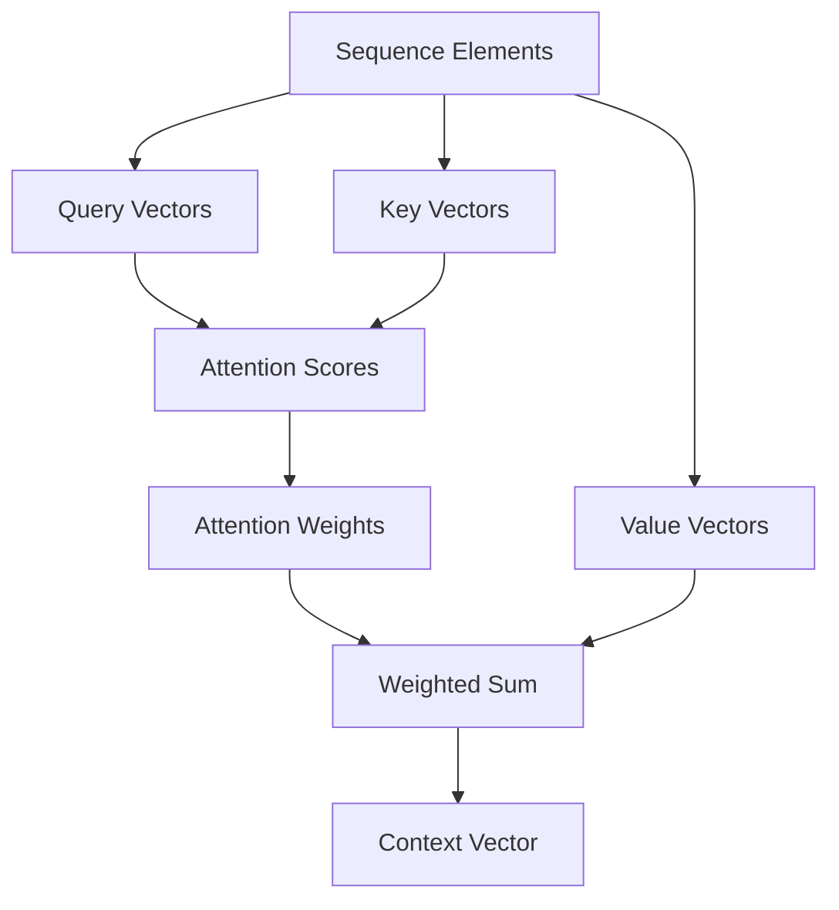

# Transformers & Attention Mechanisms

Transformers revolutionized machine learning by abandoning sequential processing in favor of attention mechanisms that directly model relationships between all elements in a sequence. This architecture has become the foundation of modern natural language processing systems, achieving unprecedented performance on tasks ranging from translation to text generation.

## The Attention Revolution

Traditional RNNs process sequences step-by-step, limiting parallelization and making long-range dependencies difficult to learn. Transformers introduced attention—a mechanism allowing each element to directly interact with all others, enabling truly parallel computation.



## Self-Attention & Multi-Head Attention

### Scaled Dot-Product Attention

**Core Formula:**
```
Attention(Q, K, V) = softmax(QK^T / √d_k)V
```

**Components:**
- **Query (Q)**: What we're looking for
- **Key (K)**: What we compare against
- **Value (V)**: What we retrieve
- **Scaling**: Prevents softmax saturation for large dimensions

```python
import torch
import torch.nn.functional as F

def scaled_dot_product_attention(query, key, value, mask=None):
    """
    Compute scaled dot-product attention
    query: [batch, seq_len, d_model]
    key: [batch, seq_len, d_model]
    value: [batch, seq_len, d_model]
    """
    # Compute attention scores
    scores = torch.matmul(query, key.transpose(-2, -1))  # [batch, seq_len, seq_len]
    scores = scores / (key.size(-1) ** 0.5)  # Scale by sqrt(d_k)

    # Apply mask (optional)
    if mask is not None:
        scores = scores.masked_fill(mask == 0, float('-inf'))

    # Compute attention weights
    attn_weights = F.softmax(scores, dim=-1)

    # Apply attention to values
    output = torch.matmul(attn_weights, value)

    return output, attn_weights
```

### Multi-Head Attention

Multiple attention computations allow the model to focus on different aspects:

```python
class MultiHeadAttention(nn.Module):
    def __init__(self, d_model, num_heads):
        super().__init__()
        assert d_model % num_heads == 0

        self.d_model = d_model
        self.num_heads = num_heads
        self.d_k = d_model // num_heads

        # Linear projections for Q, K, V
        self.W_Q = nn.Linear(d_model, d_model)
        self.W_K = nn.Linear(d_model, d_model)
        self.W_V = nn.Linear(d_model, d_model)

        # Output projection
        self.W_O = nn.Linear(d_model, d_model)

    def forward(self, query, key, value, mask=None):
        batch_size = query.size(0)

        # Linear projections and reshape [batch, seq, d_model] -> [batch, num_heads, seq, d_k]
        Q = self.W_Q(query).view(batch_size, -1, self.num_heads, self.d_k).transpose(1, 2)
        K = self.W_K(key).view(batch_size, -1, self.num_heads, self.d_k).transpose(1, 2)
        V = self.W_V(value).view(batch_size, -1, self.num_heads, self.d_k).transpose(1, 2)

        # Scaled dot-product attention for each head
        attn_output, attn_weights = scaled_dot_product_attention(Q, K, V, mask)

        # Concatenate heads and project
        attn_output = attn_output.transpose(1, 2).contiguous().view(batch_size, -1, self.d_model)
        output = self.W_O(attn_output)

        return output, attn_weights
```

## The Complete Transformer Architecture

### Encoder-Decoder Structure

```python
class Transformer(nn.Module):
    def __init__(self, src_vocab_size, tgt_vocab_size, d_model=512, num_heads=8, num_layers=6):
        super().__init__()

        # Input embeddings
        self.src_embedding = nn.Embedding(src_vocab_size, d_model)
        self.tgt_embedding = nn.Embedding(tgt_vocab_size, d_model)

        # Positional encoding
        self.positional_encoding = PositionalEncoding(d_model)

        # Encoder and decoder stacks
        self.encoder_layers = nn.ModuleList([
            EncoderLayer(d_model, num_heads) for _ in range(num_layers)
        ])
        self.decoder_layers = nn.ModuleList([
            DecoderLayer(d_model, num_heads) for _ in range(num_layers)
        ])

        # Output projection
        self.output_layer = nn.Linear(d_model, tgt_vocab_size)

        self.dropout = nn.Dropout(0.1)

    def forward(self, src_tokens, tgt_tokens, src_mask=None, tgt_mask=None):
        # Embed source and add positional encoding
        src_embed = self.dropout(self.positional_encoding(self.src_embedding(src_tokens)))

        # Encoder forward pass
        encoder_output = src_embed
        encoder_outputs = []  # Store intermediate representations
        for layer in self.encoder_layers:
            encoder_output = layer(encoder_output, src_mask)
            encoder_outputs.append(encoder_output)

        # Embed target and add positional encoding
        tgt_embed = self.dropout(self.positional_encoding(self.tgt_embedding(tgt_tokens)))

        # Decoder forward pass with cross-attention
        decoder_output = tgt_embed
        for layer in self.decoder_layers:
            decoder_output = layer(decoder_output, encoder_output, src_mask, tgt_mask)

        # Final output projection
        output = self.output_layer(decoder_output)

        return output
```

### Positional Encoding

Injects sequence position information since transformers lack recurrence:

```python
class PositionalEncoding(nn.Module):
    def __init__(self, d_model, max_len=5000):
        super().__init__()
        pe = torch.zeros(max_len, d_model)
        position = torch.arange(0, max_len, dtype=torch.float).unsqueeze(1)
        div_term = torch.exp(torch.arange(0, d_model, 2).float() * (-torch.log(torch.tensor(10000.0)) / d_model))

        pe[:, 0::2] = torch.sin(position * div_term)
        pe[:, 1::2] = torch.cos(position * div_term)

        pe = pe.unsqueeze(0).transpose(0, 1)
        self.register_buffer('pe', pe)

    def forward(self, x):
        return x + self.pe[:x.size(0), :]
```

### Encoder Layer

**Self-attention** followed by **feed-forward network**:

```python
class EncoderLayer(nn.Module):
    def __init__(self, d_model, num_heads, dim_feedforward=2048, dropout=0.1):
        super().__init__()
        self.self_attn = MultiHeadAttention(d_model, num_heads)
        self.feed_forward = nn.Sequential(
            nn.Linear(d_model, dim_feedforward),
            nn.ReLU(),
            nn.Dropout(dropout),
            nn.Linear(dim_feedforward, d_model)
        )

        self.norm1 = nn.LayerNorm(d_model)
        self.norm2 = nn.LayerNorm(d_model)
        self.dropout = nn.Dropout(dropout)

    def forward(self, src, src_mask=None):
        # Multi-head self-attention
        attn_out, _ = self.self_attn(src, src, src, src_mask)
        src = self.norm1(src + self.dropout(attn_out))

        # Feed-forward network
        ff_out = self.feed_forward(src)
        src = self.norm2(src + self.dropout(ff_out))

        return src
```

### Decoder Layer

**Masked self-attention**, **cross-attention** with encoder, then **feed-forward**:

```python
class DecoderLayer(nn.Module):
    def __init__(self, d_model, num_heads, dim_feedforward=2048, dropout=0.1):
        super().__init__()
        self.self_attn = MultiHeadAttention(d_model, num_heads)
        self.cross_attn = MultiHeadAttention(d_model, num_heads)
        self.feed_forward = nn.Sequential(
            nn.Linear(d_model, dim_feedforward),
            nn.ReLU(),
            nn.Dropout(dropout),
            nn.Linear(dim_feedforward, d_model)
        )

        self.norm1 = nn.LayerNorm(d_model)
        self.norm2 = nn.LayerNorm(d_model)
        self.norm3 = nn.LayerNorm(d_model)
        self.dropout = nn.Dropout(dropout)

    def forward(self, tgt, memory, tgt_mask=None, memory_mask=None):
        # Masked self-attention (prevent future tokens)
        attn_out, _ = self.self_attn(tgt, tgt, tgt, tgt_mask)
        tgt = self.norm1(tgt + self.dropout(attn_out))

        # Cross-attention with encoder output
        attn_out, _ = self.cross_attn(tgt, memory, memory, memory_mask)
        tgt = self.norm2(tgt + self.dropout(attn_out))

        # Feed-forward network
        ff_out = self.feed_forward(tgt)
        tgt = self.norm3(tgt + self.dropout(ff_out))

        return tgt
```

## BERT (Bidirectional Encoder Representations from Transformers)

Pre-trained on massive text corpora to learn contextual word representations:

**Key Features:**
- Bidirectional training (predicts both directions)
- Masked Language Modeling (MLM)
- Next Sentence Prediction (NSP)
- Fine-tuned for downstream tasks

```python
class BERT(nn.Module):
    def __init__(self, vocab_size, d_model=768, num_heads=12, num_layers=12):
        super().__init__()
        self.embedding = nn.Embedding(vocab_size, d_model)
        self.positional_encoding = PositionalEncoding(d_model)
        self.layers = nn.ModuleList([
            EncoderLayer(d_model, num_heads) for _ in range(num_layers)
        ])

        # Pre-training heads
        self.mlm_head = nn.Linear(d_model, vocab_size)  # Masked language modeling
        self.nsp_head = nn.Linear(d_model, 2)           # Next sentence prediction

    def forward(self, input_ids, attention_mask=None):
        # Embeddings
        x = self.embedding(input_ids)
        x = self.positional_encoding(x)

        # Encoder layers
        for layer in self.layers:
            x = layer(x, attention_mask)

        # Pre-training tasks
        mlm_logits = self.mlm_head(x)
        nsp_logits = self.nsp_head(x[:, 0])  # CLS token

        return mlm_logits, nsp_logits
```

## GPT (Generative Pre-trained Transformer)

Generative language model focused on next-token prediction:

**Architecture Differences:**
- Decoder-only (causal attention)
- No encoder modules
- Autoregressive generation
- Larger scale (GPT-3: 175B parameters)

```python
class GPT(nn.Module):
    def __init__(self, vocab_size, d_model=768, num_heads=12, num_layers=12):
        super().__init__()
        self.embedding = nn.Embedding(vocab_size, d_model)
        self.positional_encoding = PositionalEncoding(d_model)

        # Decoder layers (causal attention)
        self.layers = nn.ModuleList([
            CausalDecoderLayer(d_model, num_heads) for _ in range(num_layers)
        ])

        self.output_layer = nn.Linear(d_model, vocab_size)
        self.dropout = nn.Dropout(0.1)

    def forward(self, input_ids, attention_mask=None):
        x = self.dropout(self.positional_encoding(self.embedding(input_ids)))

        # Causal decoder layers
        causal_mask = self.generate_causal_mask(input_ids.size(1))
        for layer in self.layers:
            x = layer(x, causal_mask)

        logits = self.output_layer(x)
        return logits

    def generate_causal_mask(self, seq_len):
        mask = torch.triu(torch.ones(seq_len, seq_len), diagonal=1).bool()
        return ~mask  # True for allowed positions
```

## T5 (Text-to-Text Transfer Transformer)

Unifies multiple NLP tasks through text-to-text framework:

**Approach:**
- Prefixes specify task (e.g., "translate English to French:")
- Single model handles translation, summarization, Q&A
- Span corruption pre-training (similar to denoising)

## LLaMA (Large Language Model Meta AI)

Collection of foundational language models emphasizing:
- Efficient training and inference
- Open-source accessibility
- Strong performance across scales (7B to 65B parameters)
- Emphasis on safety and alignment

## Training Transformers

### Pre-training Objectives

**Masked Language Modeling (BERT-style):**
```python
def mlm_loss(predictions, targets, masked_positions):
    # Only compute loss on masked tokens
    loss = F.cross_entropy(
        predictions[masked_positions],
        targets[masked_positions],
        reduction='mean'
    )
    return loss
```

**Causal Language Modeling (GPT-style):**
```python
def clm_loss(logits, targets):
    # Shift predictions and targets
    shift_logits = logits[..., :-1, :].contiguous()
    shift_targets = targets[..., 1:].contiguous()

    loss = F.cross_entropy(
        shift_logits.view(-1, shift_logits.size(-1)),
        shift_targets.view(-1),
        ignore_index=-100  # Padding token
    )
    return loss
```

### Optimization Strategies

- **Mixed Precision Training**: Faster with less memory
- **Gradient Checkpointing**: Trade computation for memory
- **Parallel Training**: Data/model parallelism for large models

```python
from torch.cuda.amp import autocast, GradScaler

scaler = GradScaler()

def train_step(model, batch):
    with autocast():
        outputs = model(batch['input_ids'])
        loss = compute_loss(outputs, batch['labels'])

    scaler.scale(loss).backward()
    scaler.step(optimizer)
    scaler.update()
    optimizer.zero_grad()
```

## Inference & Generation

### Autoregressive Decoding

Generate sequences one token at a time:

```python
def generate_text(model, prompt, max_length=50, temperature=1.0):
    model.eval()
    tokens = tokenizer.encode(prompt)

    for _ in range(max_length):
        input_ids = torch.tensor([tokens]).to(device)
        with torch.no_grad():
            logits = model(input_ids)[:, -1, :]  # Last token predictions

        # Apply temperature
        logits /= temperature
        probs = F.softmax(logits, dim=-1)

        # Sample next token
        next_token = torch.multinomial(probs, 1).item()
        tokens.append(next_token)

        # Stop if EOS token
        if next_token == tokenizer.eos_token_id:
            break

    return tokenizer.decode(tokens)
```

### Beam Search

Explore multiple generation paths:

```python
class BeamSearch:
    def __init__(self, model, vocab_size, beam_width=5):
        self.model = model
        self.vocab_size = vocab_size
        self.beam_width = beam_width

    def search(self, input_ids, max_length):
        # Initialize beams
        beams = [(input_ids.clone(), 0.0)]  # (sequence, score)

        for _ in range(max_length):
            candidates = []

            for seq, score in beams:
                if seq[-1] == eos_token:
                    candidates.append((seq, score))
                    continue

                logits = self.model(seq.unsqueeze(0))[:, -1, :]
                probs = F.log_softmax(logits, dim=-1)[0]

                # Top-k candidates
                top_probs, top_tokens = probs.topk(self.beam_width)
                for prob, token in zip(top_probs, top_tokens):
                    new_seq = torch.cat([seq, token.unsqueeze(0)])
                    new_score = score + prob.item()
                    candidates.append((new_seq, new_score))

            # Keep top beams
            beams = sorted(candidates, key=lambda x: x[1], reverse=True)[:self.beam_width]

        return beams[0][0]  # Best sequence
```

## Challenges & Considerations

### Computational Requirements

- **Scale**: Modern models require massive compute resources
- **Memory**: Attention scales quadratically with sequence length
- **Training time**: Can take weeks on hundreds of GPUs

### Efficiency Improvements

- **Sparse Attention**: Attend to fewer tokens (Longformer, BigBird)
- **Linear Attention**: Approximate attention in O(n) time (Performer, Linformer)
- **Model Compression**: Quantization, pruning, distillation

### Attention Bottlenecks

**Memory Complexity:**
- Standard attention: O(n²) memory
- Linear attention: O(n) memory

```python
class LinformerAttention(nn.Module):
    """Linear complexity attention approximation"""

    def __init__(self, d_model, seq_len, num_heads, low_rank=128):
        super().__init__()
        self.num_heads = num_heads
        self.d_k = d_model // num_heads

        # Low-rank projections
        self.E = nn.Linear(seq_len, low_rank)
        self.F = nn.Linear(seq_len, low_rank)

    def forward(self, Q, K, V):
        # Project to lower dimension
        K_proj = self.E(K.transpose(-2, -1))  # [batch, heads, rank, d_k]
        V_proj = self.F(V.transpose(-2, -1))

        # Approximate attention
        attn = torch.matmul(Q, K_proj) / (self.d_k ** 0.5)  # [batch, heads, seq, rank]
        attn = F.softmax(attn, dim=-1)
        output = torch.matmul(attn, V_proj)  # [batch, heads, seq, d_k]

        return output
```

### Interpretability

Understanding attention weights and model decisions:

```python
# Analyze attention patterns
def visualize_attention(model, text, layer_idx=0, head_idx=0):
    model.eval()
    tokens = tokenizer.encode(text)
    input_ids = torch.tensor([tokens])

    with torch.no_grad():
        # Get attention weights
        attentions = model.extract_attentions(input_ids)

        attn_weights = attentions[layer_idx][0, head_idx]  # [seq_len, seq_len]

        # Visualize
        plt.imshow(attn_weights, cmap='viridis')
        plt.xticks(range(len(tokens)), [tokenizer.decode([t]) for t in tokens], rotation=90)
        plt.yticks(range(len(tokens)), [tokenizer.decode([t]) for t in tokens])
        plt.show()
```

## Multimodal Transformers

Extending beyond text to other modalities:

### Vision-Language Models (ViLT, CLIP)

Combine visual and textual understanding

### Audio Processing (HuBERT, Wav2Vec)

Process raw audio waveforms

### Multi-Task Learning

Single model handling diverse tasks with task-specific heads

Transformers have become the dominant architecture in modern machine learning, powering applications from language translation and code generation to drug discovery and autonomous systems. Their ability to capture complex relationships through attention mechanisms represents a fundamental breakthrough, enabling models that can learn from vast amounts of data while maintaining high performance on diverse tasks.
