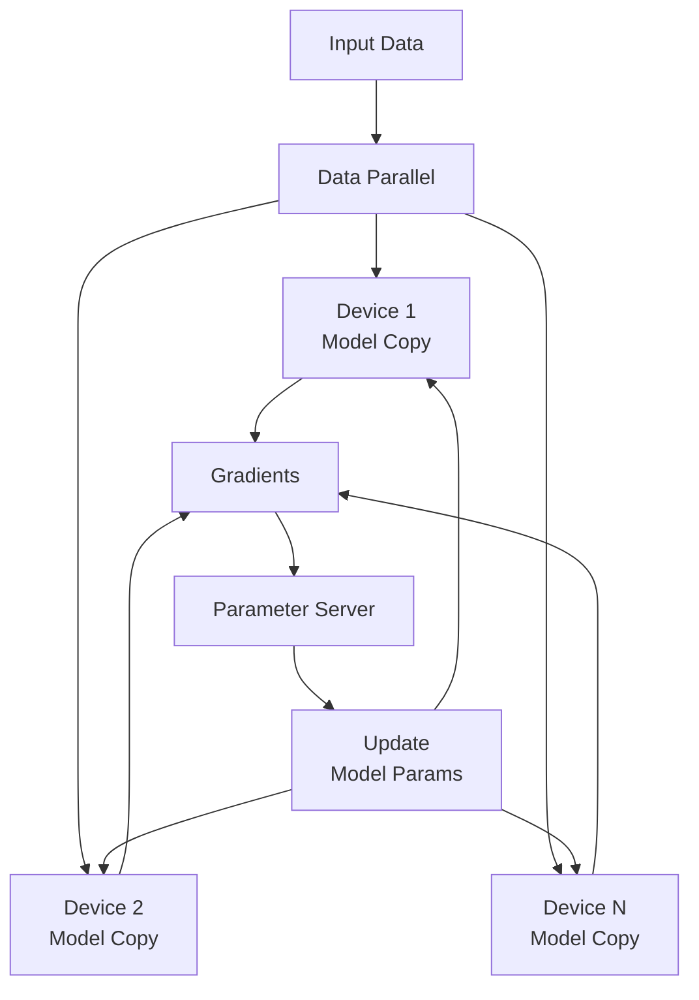
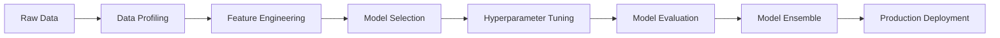

# Big Data & Scalable ML

Modern machine learning deals with massive datasets and computational demands requiring distributed systems and specialized architectures. This section covers techniques and frameworks for scaling ML workflows beyond single machines and toy datasets.

## Distributed Training

### Data Parallelism

**Model Parallelism vs Data Parallelism**:
- **Data Parallel**: Same model replicated across devices, different data batches
- **Model Parallel**: Model split across devices, same data flows through all



### Horovod

**Ring-AllReduce Strategy**: Efficient gradient averaging without central bottleneck

```python
import horovod.tensorflow as hvd
import tensorflow as tf

# Initialize Horovod
hvd.init()

# Pin GPU to each process
gpus = tf.config.experimental.list_physical_devices('GPU')
if gpus:
    tf.config.experimental.set_visible_devices(gpus[hvd.local_rank()], 'GPU')

# Build model
model = tf.keras.Sequential([
    tf.keras.layers.Dense(128, activation='relu'),
    tf.keras.layers.Dense(10, activation='softmax')
])

# Optimizer with Horovod wrapper
optimizer = tf.keras.optimizers.Adam(0.001 * hvd.size())
optimizer = hvd.DistributedOptimizer(optimizer)

# Compile model
model.compile(optimizer=optimizer,
             loss='sparse_categorical_crossentropy',
             metrics=['accuracy'],
             experimental_run_tf_function=False)

# Broadcast initial variables
@hvd.elastic.run
def train_step():
    # Training loop with horovod
    pass

# Run training
train_step()
```

**Elastic Training**: Dynamic cluster size adjustment during training

### TensorFlow Distributed Training

**MirroredStrategy**: Synchronous data parallel on multiple GPUs

```python
import tensorflow as tf

# Multi-GPU synchronous training
strategy = tf.distribute.MirroredStrategy()

with strategy.scope():
    model = tf.keras.Sequential([
        tf.keras.layers.Dense(128, activation='relu'),
        tf.keras.layers.Dense(10)
    ])

    optimizer = tf.keras.optimizers.Adam()
    loss_fn = tf.keras.losses.SparseCategoricalCrossentropy(from_logits=True)

    @tf.function
    def train_step(batch):
        with tf.GradientTape() as tape:
            predictions = model(batch['images'], training=True)
            loss = loss_fn(batch['labels'], predictions)

        gradients = tape.gradient(loss, model.trainable_variables)
        optimizer.apply_gradients(zip(gradients, model.trainable_variables))
        return loss

# Training loop
for epoch in range(num_epochs):
    for batch in dataset:
        strategy.run(train_step, args=(batch,))
```

**MultiWorkerMirroredStrategy**: Synchronous training across multiple machines

## ML on Spark

### MLlib Fundamentals

Apache Spark's machine learning library providing distributed algorithms

**DataFrame-based API**: Unified interface for different data sources

```python
from pyspark.ml import Pipeline
from pyspark.ml.classification import RandomForestClassifier
from pyspark.ml.feature import VectorAssembler, StringIndexer
from pyspark.ml.evaluation import BinaryClassificationEvaluator

# Prepare data
indexer = StringIndexer(inputCol="label", outputCol="label_index")
assembler = VectorAssembler(inputCols=feature_cols, outputCol="features")
rf = RandomForestClassifier(featuresCol="features", labelCol="label_index")

# Create pipeline
pipeline = Pipeline(stages=[indexer, assembler, rf])

# Train model
model = pipeline.fit(train_df)

# Make predictions
predictions = model.transform(test_df)

# Evaluate
evaluator = BinaryClassificationEvaluator(labelCol="label_index")
auc = evaluator.evaluate(predictions)
```

### Advanced Features

**Hyperparameter Tuning**: Distributed grid/random search

```python
from pyspark.ml.tuning import CrossValidator, ParamGridBuilder

# Define parameter grid
paramGrid = ParamGridBuilder() \
    .addGrid(rf.numTrees, [10, 20, 30]) \
    .addGrid(rf.maxDepth, [5, 10, 15]) \
    .build()

# Cross validation
cv = CrossValidator(estimator=pipeline,
                   evaluator=evaluator,
                   estimatorParamMaps=paramGrid,
                   numFolds=5)

# Train with cross validation
cvModel = cv.fit(train_df)
```

**Feature Engineering at Scale**: Distributed one-hot encoding, normalization

### Databricks Runtime ML

**Delta Lake Integration**: ACID transactions for ML metadata

**MLflow Integration**: Experiment tracking and model registry

```python
import mlflow.spark

# Log Spark ML model to MLflow
with mlflow.start_run():
    mlflow.log_param("num_trees", 100)
    mlflow.log_param("max_depth", 10)

    # Train and log model
    model = pipeline.fit(train_df)
    mlflow.spark.log_model(model, "model")

    # Log metrics
    predictions = model.transform(test_df)
    auc = evaluator.evaluate(predictions)
    mlflow.log_metric("auc", auc)
```

## AutoML & No-Code ML

### Automated Machine Learning

**AutoML Pipeline Components**:



### H2O.ai AutoML

Open-source automatic machine learning platform

```python
import h2o
from h2o.automl import H2OAutoML

# Initialize H2O
h2o.init()

# Load data
df = h2o.import_file("data.csv")
train, test = df.split_frame(ratios=[0.8])

# AutoML setup
aml = H2OAutoML(max_runtime_secs=600,  # 10 minutes
               max_models=20,
               stopping_metric="AUC",
               sort_metric="AUC")

# Train models
aml.train(y="target", training_frame=train)

# View leaderboard
lb = aml.leaderboard
print(lb)

# Get best model
best_model = aml.leader
predictions = best_model.predict(test)
```

**Algorithm Portfolio**: GLM, Random Forest, GBM, XGBoost, Deep Learning, Stacked Ensembles

### Google Cloud AutoML

**Vision API AutoML**: Custom image classification/regression

**Natural Language AutoML**: Custom text classification/sentiment

**Tables AutoML**: Structured data prediction

```python
from google.cloud import automl_v1beta1 as automl

# Create dataset
client = automl.AutoMlClient()
project_location = client.location_path(project_id, region)

dataset = {
    "display_name": "custom_dataset",
    "text_classification_dataset_metadata": {}
}

dataset = client.create_dataset(parent=project_location, dataset=dataset)

# Upload training data
# ... data upload code ...

# Train model
model = {
    "display_name": "custom_model",
    "text_classification_model_metadata": {
        "train_budget_milli_node_hours": 1000  # 1000 milli-hours = 1 hour
    }
}

operation = client.create_model(parent=project_location,
                               model=model,
                               dataset_id=dataset.name.split('/')[-1])

model = operation.result()
```

### AutoML Best Practices

**Dataset Requirements**:
- Minimum 100-1000 training examples depending on task
- Balanced data distribution when possible
- Clean, representative data

**Model Understanding**:
- Examine model explanations and feature importance
- Validate on held-out test set
- Monitor performance in production

**Cost-Performance Tradeoffs**:
- More training time often improves accuracy
- Consider prediction latency requirements
- Balance training budget with accuracy gains

## Production ML Serving

### Flask/FastAPI for ML APIs

**Flask Implementation**:

```python
from flask import Flask, request, jsonify
import joblib
import numpy as np

app = Flask(__name__)
model = joblib.load('model.pkl')

@app.route('/predict', methods=['POST'])
def predict():
    data = request.get_json()
    features = np.array(data['features']).reshape(1, -1)
    prediction = model.predict_proba(features)[0]
    return jsonify({'prediction': prediction.tolist()})

if __name__ == '__main__':
    app.run(host='0.0.0.0', port=5000)
```

**FastAPI with Async Support**:

```python
from fastapi import FastAPI
from pydantic import BaseModel
import joblib
import numpy as np

app = FastAPI(title="ML Prediction API")
model = joblib.load('model.pkl')

class PredictionRequest(BaseModel):
    features: list[float]

@app.post("/predict")
async def predict(request: PredictionRequest):
    features = np.array(request.features).reshape(1, -1)
    prediction = model.predict_proba(features)[0]
    return {"prediction": prediction.tolist()}

@app.get("/health")
async def health():
    return {"status": "healthy"}
```

### TensorFlow Serving

**Docker-based Model Serving**:

```yaml
# docker-compose.yml
version: '3.8'
services:
  tensorflow-serving:
    image: tensorflow/serving
    ports:
      - "8501:8501"
    volumes:
      - ./models:/models
    environment:
      - MODEL_NAME=my_model
      - MODEL_BASE_PATH=/models
```

**gRPC Client**:

```python
import grpc
import tensorflow as tf
from tensorflow_serving.apis import predict_pb2, prediction_service_pb2_grpc

def predict_grpc(model_name, signature_name, inputs):
    channel = grpc.insecure_channel('localhost:8500')
    stub = prediction_service_pb2_grpc.PredictionServiceStub(channel)

    request = predict_pb2.PredictRequest()
    request.model_spec.name = model_name
    request.model_spec.signature_name = signature_name

    for key, value in inputs.items():
        request.inputs[key].CopyFrom(tf.make_tensor_proto(value))

    result = stub.Predict(request)
    return result
```

### TorchServe

**PyTorch Model Serving**:

```python
# Create model archive
torch-model-archiver --model-name my_model \
                     --version 1.0 \
                     --serialized-file model.pth \
                     --handler handler.py \
                     --extra-files index_to_name.json \
                     --export-path model_store

# Start serving
torchserve --start --model-store model_store --models my_model.mar
```

**Custom Handler**:

```python
import torch
from ts.torch_handler.base_handler import BaseHandler

class ModelHandler(BaseHandler):
    def initialize(self, context):
        self.model = torch.load(context.manifest['model']['serializedFile'])
        self.model.eval()

    def preprocess(self, data):
        # Preprocessing logic
        return processed_data

    def inference(self, data):
        with torch.no_grad():
            outputs = self.model(data)
        return outputs

    def postprocess(self, data):
        # Postprocessing logic
        return result
```

## Cloud Deployment Architectures

### AWS SageMaker

**End-to-End ML Pipeline**:

```python
import boto3
from sagemaker import Session
from sagemaker.workflow.pipeline import Pipeline
from sagemaker.workflow.steps import TrainingStep, ModelStep

# Initialize SageMaker session
session = Session()

# Define training step
training_step = TrainingStep(
    name="TrainingStep",
    estimator=estimator,
    inputs={"training": training_data}
)

# Define model step
model_step = ModelStep(
    name="ModelStep",
    model=model,
    inputs=[training_step.properties.ModelArtifacts.S3ModelArtifacts]
)

# Create pipeline
pipeline = Pipeline(
    name="ML-Pipeline",
    steps=[training_step, model_step],
    sagemaker_session=session
)

# Execute pipeline
pipeline.upsert(role_arn=role)
execution = pipeline.start()
```

### GCP Vertex AI

**Managed ML Platform**:

```python
from google.cloud import aiplatform

# Initialize Vertex AI
aiplatform.init(project=project_id, location=region)

# Upload model
model = aiplatform.Model.upload(
    display_name="custom-model",
    artifact_uri="gs://bucket/model",
    serving_container_image_uri="gcr.io/cloud-aiplatform/prediction/tf2-cpu.2-8:latest"
)

# Deploy endpoint
endpoint = aiplatform.Endpoint.create(display_name="prediction-endpoint")
endpoint.deploy(model=model, machine_type="n1-standard-4")
```

### Azure ML

**Machine Learning Studio**:

```python
from azureml.core import Workspace, Experiment
from azureml.train.automl import AutoMLConfig

# Connect to workspace
ws = Workspace.from_config()

# Configure AutoML
automl_config = AutoMLConfig(
    task="classification",
    training_data=train_data,
    label_column_name="target",
    enable_early_stopping=True,
    featurization="auto",
    verbosity=1
)

# Submit experiment
experiment = Experiment(ws, "automl-experiment")
run = experiment.submit(automl_config)
```

## Scaling Considerations

### Data Management

**Parquet/ORC Formats**: Columnar storage for analytics

**Partitioning Strategies**:
- **Date-based**: For time series data
- **Hash-based**: For balanced distribution
- **Range-based**: For ordered data access

### Computational Scaling

**Vertical vs Horizontal**:
- **Vertical**: More powerful single machines
- **Horizontal**: Distributed across commodity hardware

**Cost Optimization**:
- Spot/preemptible instances for training
- Auto-scaling for prediction endpoints
- Caching layers for expensive computations

### Monitoring at Scale

**Key Metrics**:
- Training time and resource utilization
- Prediction latency and throughput
- Data drift and model decay
- System reliability and uptime

The future of ML lies in democratizing advanced capabilities through scalable systems and automated pipelines. Understanding these technologies enables reliable deployment of sophisticated models while maintaining efficiency and cost-effectiveness.
