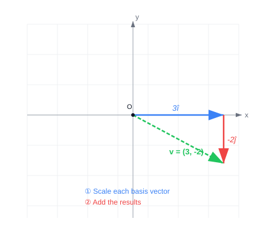
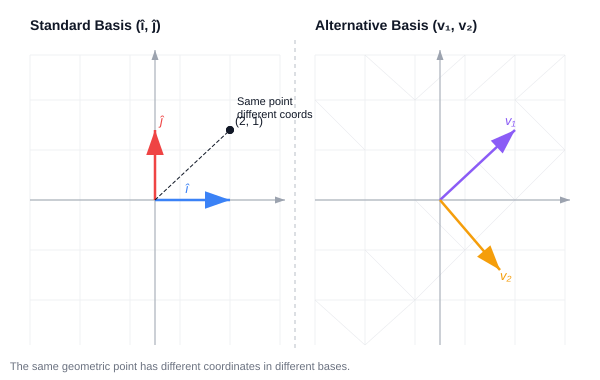
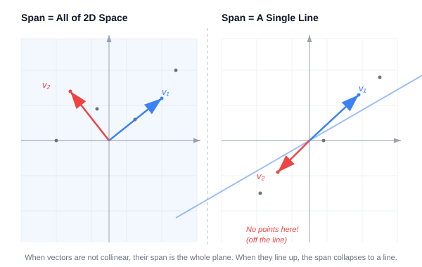

# Basis Vectors and Linear Combinations

## Hook: What Do Coordinates Really Mean?

When you see a pair of numbers like (3, -2) describing a vector, what are those numbers actually doing? The standard interpretation -- "3 units right, 2 units down" -- hides a deeper idea: each coordinate is a **scalar** that stretches or squishes a special vector, and the final vector is the sum of those scaled pieces.

## Intuition: Coordinates as Scalars

In the xy-coordinate system, there are two special vectors: **î** (i-hat), the unit vector pointing right with length 1, and **ĵ** (j-hat), the unit vector pointing up with length 1.

The x-coordinate scales î; the y-coordinate scales ĵ. The vector (3, -2) is really:

\[
3 \begin{bmatrix}1\\0\end{bmatrix} + (-2) \begin{bmatrix}0\\1\end{bmatrix}
\]

Three times î plus negative-two times ĵ. The coordinates are scalars, and the vector is the **sum of two scaled vectors**.

This way of combining vectors -- scaling each one and then adding -- is called a **linear combination**.

## Basis Vectors

The vectors î and ĵ are the **basis** of the standard coordinate system. They are what the coordinates actually scale. Any time you describe a vector numerically, you are implicitly choosing a basis.

But the standard basis is not the only choice. You could pick two different vectors -- say, one pointing up-right and another pointing down-right -- and use them as a new basis. By scaling those and adding, you can still reach every point in the plane. The mapping between pairs of numbers and points in space changes, but the system is just as valid.

## The Span of a Set of Vectors

The **span** of a set of vectors is the set of all possible linear combinations you can reach. If you have two vectors in 2D and you let the two scalars range freely, one of two things happens:

1. **Most pairs**: you can reach every point in the plane. Their span is all of 2D space.
2. **Collinear vectors**: if the two vectors point along the same line, their span is limited to that line through the origin.

In 3D, two non-collinear vectors span a flat plane through the origin. Add a third vector that is not already on that plane, and the span expands to all of 3D space -- the third vector sweeps the plane through the remaining dimension.

## Linear Dependence and Independence

If you have a set of vectors and one of them can be removed without reducing the span, the set is **linearly dependent**. This means at least one vector is redundant -- it can be expressed as a linear combination of the others.

If each vector adds a new dimension to the span, the set is **linearly independent**.

## The Definition of a Basis

A **basis** of a space is a set of linearly independent vectors that span that space. In 2D, this means:
- They span the full plane (you can reach any vector).
- They are linearly independent (neither is redundant -- neither lies in the span of the other).

The standard basis (î, ĵ) satisfies this, but so do many other pairs.

## Why It Matters

The choice of basis is everywhere in linear algebra. When you write a matrix, its columns are where the basis vectors land after a transformation. When you change coordinate systems, you are changing the basis. Eigenvectors are special because they form a basis where a transformation becomes a pure scaling. Understanding linear combinations and span is the foundation for all of these ideas.
