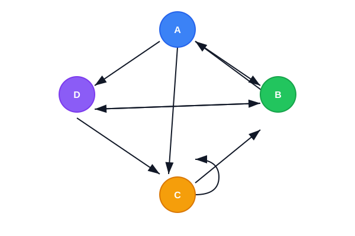

# PageRank

## Hook: How Does Google Rank the Web?

In 1998, Larry Page and colleagues published an algorithm that helped Google decide which order to display websites in search results. The central insight: a webpage's importance is related to its links to and from other webpages. And the math that makes it work comes from eigenvectors.

## Intuition: Procrastinating Pat

Imagine a person called Procrastinating Pat who opens a random webpage and clicks links at random, never typing a URL. Pat's time is distributed across the webpages of the Internet. The rank of a webpage -- its importance -- is the proportion of time we expect Pat to spend on it.

If many pages link to page X, Pat is more likely to end up there. If those pages are themselves important (high-rank), even more so. The rank of each page depends on the ranks of all other pages -- a self-referential problem that eigenvectors solve naturally.

## Building the Link Matrix

Consider a miniature Internet with four webpages -- A, B, C, D -- connected by links:

Each arrow represents a link from one page to another. A page's outgoing links are equally likely choices for Pat.

### Link Vectors

For page A, which links to B, C, and D (but not itself):

\[
L_A = \left(0,\ \frac{1}{3},\ \frac{1}{3},\ \frac{1}{3}\right)
\]

For page B, which links to A and D:

\[
L_B = \left(\frac{1}{2},\ 0,\ 0,\ \frac{1}{2}\right)
\]

For page C, which links to B and itself:

\[
L_C = \left(0,\ \frac{1}{2},\ \frac{1}{2},\ 0\right)
\]

For page D, which links to B and C:

\[
L_D = \left(0,\ \frac{1}{2},\ \frac{1}{2},\ 0\right)
\]

Each vector sums to 1 -- a probability distribution over where Pat goes next from that page.

### Assembling the Matrix

Arrange these link vectors as columns to form the **link matrix** \(L\):

\[
L = \begin{bmatrix}
0 & \frac{1}{2} & 0 & 0\\[4pt]
\frac{1}{3} & 0 & \frac{1}{2} & \frac{1}{2}\\[4pt]
\frac{1}{3} & 0 & \frac{1}{2} & \frac{1}{2}\\[4pt]
\frac{1}{3} & \frac{1}{2} & 0 & 0
\end{bmatrix}
\]

Column \(j\) describes the outgoing links from page \(j\). Row \(i\) describes the incoming links to page \(i\), normalized by the source page's total outgoing links.

## The Rank Equation

Let vector \(\mathbf r\) store the rank (importance) of each page. The rank of page A is the sum over all pages \(j\):

\[
r_A = \sum_{j=1}^{n} L_{Aj}\, r_j
\]

The rank of A is the sum of the ranks of all pages that link to it, weighted by how much each source page distributes to A.

Applied to all pages simultaneously:

\[
\mathbf r = L \mathbf r
\]

This is an **eigenvalue equation**: \(\mathbf r\) is an eigenvector of \(L\) with eigenvalue 1.

## Power Iteration

We don't know \(\mathbf r\) in advance, so we start with a uniform guess and improve it iteratively:

\[
\mathbf r^{(0)} = \left(\frac{1}{4},\ \frac{1}{4},\ \frac{1}{4},\ \frac{1}{4}\right)^T
\]

Then repeatedly apply \(L\):

\[
\mathbf r^{(k+1)} = L \mathbf r^{(k)}
\]

Each multiplication updates \(\mathbf r\) toward the dominant eigenvector. After enough iterations, \(\mathbf r\) stops changing -- it satisfies \(\mathbf r = L\mathbf r\).

## Worked Example

Starting from the uniform guess, here is the iteration for the 4-page network:

| Iteration | \(r_A\) | \(r_B\) | \(r_C\) | \(r_D\) |
|-----------|---------|---------|---------|---------|
| 0 | 0.250 | 0.250 | 0.250 | 0.250 |
| 1 | 0.125 | 0.333 | 0.333 | 0.208 |
| 2 | 0.167 | 0.250 | 0.250 | 0.333 |
| 3 | 0.125 | 0.306 | 0.306 | 0.264 |
| 4 | 0.153 | 0.271 | 0.271 | 0.306 |
| 5 | 0.135 | 0.288 | 0.288 | 0.288 |
| 6 | 0.144 | 0.279 | 0.279 | 0.298 |
| 7 | 0.140 | 0.283 | 0.283 | 0.294 |
| 8 | 0.142 | 0.281 | 0.281 | 0.296 |
| 9 | 0.141 | 0.282 | 0.282 | 0.295 |
| 10 | 0.141 | 0.282 | 0.282 | 0.295 |

After about 10 iterations, the values converge:

\[
\mathbf r \approx \begin{pmatrix}0.12 & 0.24 & 0.24 & 0.40\end{pmatrix}^T
\]

The ranking: **D** (40%) > **B** = **C** (24% each) > **A** (12%).

## The Damping Factor

In reality, Pat sometimes gets bored and types a random URL instead of clicking a link. This is modelled by the **damping factor** \(d\) (typically \(d = 0.85\)):

\[
\mathbf r^{(k+1)} = d\, L \,\mathbf r^{(k)} + \frac{1-d}{n}\,\mathbf 1
\]

Here \(d\) is the probability Pat follows a link; \(1-d\) is the probability of jumping to a random page. This modification guarantees convergence and makes the algorithm robust to dead ends and cycles.

## Why It Matters

PageRank was a breakthrough because it turned web search into an eigenvector problem solvable at scale. The power method works well here for two reasons:

1. **The dominant eigenvector is the one we need** -- the link matrix's structure guarantees the eigenvalue-1 eigenvector gives the ranks.
2. **Sparsity** -- the real link matrix is almost entirely zeros (most pages don't link to most other pages), making multiplication efficient even for billions of pages.

The core idea -- ranking nodes by their position in a network using eigenvector centrality -- now appears in social network analysis, recommendation systems, citation analysis, and beyond.
