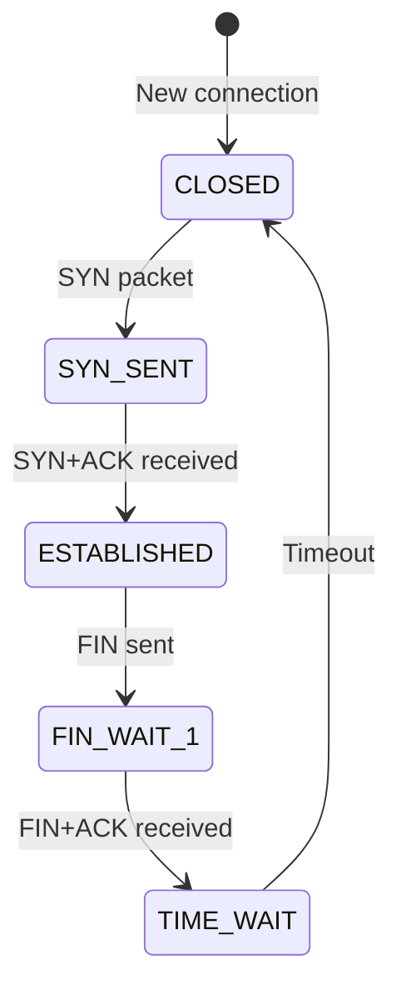
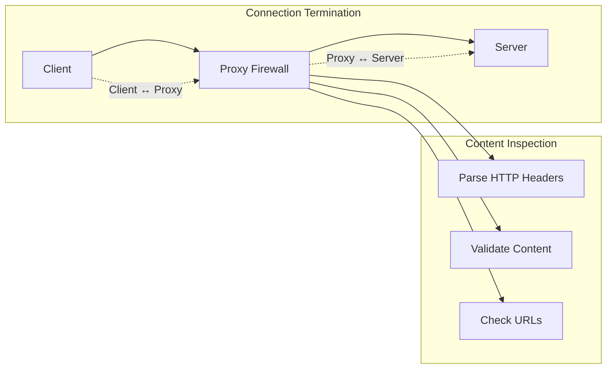
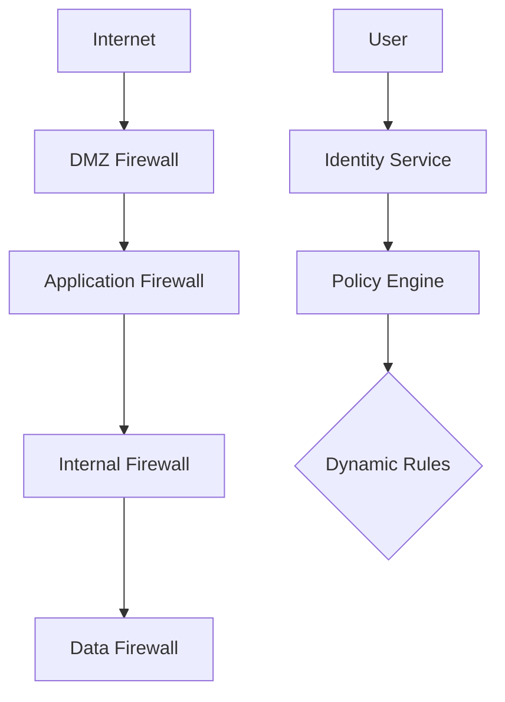

# Network Firewalls

Network firewalls are critical security devices that monitor and control incoming and outgoing network traffic based on predetermined security rules. They serve as a barrier between trusted internal networks and untrusted external networks, protecting systems from unauthorized access and malicious activities.

## Overview

Firewalls operate at multiple layers of the OSI model, from packet filtering (Layer 3/4) to application-level inspection (Layer 7). Modern firewalls combine multiple inspection technologies to provide comprehensive security while maintaining acceptable performance.

## Firewall Types

### Packet-Filtering Firewalls

Operate at Layer 3 and 4, examining packet headers for source/destination IP addresses, ports, and protocols:

```text
Incoming Packet: [192.168.1.100:34567 → 10.0.0.50:80, TCP SYN]
Firewall Rule: Allow TCP port 80 from any to web-server
Action: ALLOW packet through
```

**Characteristics:**
- Fast processing with minimal latency
- Stateless (no connection tracking)
- Limited security against sophisticated attacks

### Stateful Firewalls

Track connection state and maintain a state table for active connections:



**Advantages:**
- Context-aware filtering
- Protection against TCP SYN floods
- Dynamic port handling

### Application Layer Firewalls (Proxy Firewalls)

Inspect traffic at Layer 7, understanding application protocols:



**Types:**
- **Circuit-level proxy:** TCP handshake proxying
- **Application-level proxy:** Full protocol understanding
- **Reverse proxy:** Protects and load-balances servers

### Next-Generation Firewalls (NGFW)

Combine traditional firewall capabilities with advanced threat detection:

**Advanced Features:**
- Application awareness and control
- Intrusion prevention systems (IPS)
- SSL/TLS inspection
- User identity integration
- Advanced malware protection

## Firewall Deployment Architectures

### Perimeter Firewall

Traditional single firewall at network boundary:

```text
Internet ── [Firewall] ──┬─ DMZ (Web servers)
                        ├─ Internal Network
                        └─ Management Network
```

### Multi-Tier Architecture

Defense-in-depth with multiple firewall layers:

```text
Internet
    │
[Edge Firewall] ── Screening subnet
    │
[Internal Firewall] ── Protected servers
    │
[Data Firewall] ── Database servers
```

### Firewall Zones

Segment network into security zones with specific trust levels:

- **Internet Zone:** Untrusted traffic from internet
- **DMZ (Demilitarized Zone):** Public-facing servers
- **Internal Zone:** Trusted corporate network
- **Guest Zone:** Visitor network access
- **Management Zone:** Administrative systems

## Firewall Configuration

### Basic iptables (Linux)

```bash
# Default policies
iptables -P INPUT DROP
iptables -P FORWARD DROP
iptables -P OUTPUT ACCEPT

# Allow loopback traffic
iptables -A INPUT -i lo -j ACCEPT

# Allow established connections
iptables -A INPUT -m conntrack --ctstate ESTABLISHED,RELATED -j ACCEPT

# Allow SSH (limit rate)
iptables -A INPUT -p tcp --dport 22 -m conntrack --ctstate NEW -m limit --limit 3/min -j ACCEPT

# Allow HTTP/HTTPS
iptables -A INPUT -p tcp --dport 80 -j ACCEPT
iptables -A INPUT -p tcp --dport 443 -j ACCEPT

# Log dropped packets
iptables -A INPUT -j LOG --log-prefix "Dropped: "
```

### Cisco ASA Configuration

```bash
# Basic ASA configuration
interface GigabitEthernet0/0
 nameif outside
 security-level 0
 ip address dhcp

interface GigabitEthernet0/1
 nameif inside
 security-level 100
 ip address 192.168.1.1 255.255.255.0

# NAT configuration
object network internal-network
 subnet 192.168.1.0 255.255.255.0
 nat (inside,outside) dynamic interface

# Access rules
access-list outside-in extended permit tcp any host 203.0.113.10 eq www
access-list outside-in extended permit tcp any host 203.0.113.10 eq https

access-group outside-in in interface outside
```

### pfSense Configuration

```bash
# pfSense rules (shell access)
# Allow LAN traffic
pass in quick on $int_if from $lan_net to any flags S/SA keep state

# Allow web traffic
pass in quick on $ext_if proto tcp from any to $web_server port 80 flags S/SA keep state
pass in quick on $ext_if proto tcp from any to $web_server port 443 flags S/SA keep state

# Block everything else
block in on $ext_if from any to any
```

## Advanced Firewall Features

### Network Address Translation (NAT)

Translates between public and private IP addresses:

**Static NAT:**
```text
Inside Global: 203.0.113.10 → Inside Local: 192.168.1.10
(Web server always uses same public IP)
```

**Dynamic NAT:**
```text
Inside Global Pool: 203.0.113.1-203.0.113.10
Inside Local: 192.168.1.0/24
(Assigns available public IP from pool)
```

**Port Address Translation (PAT):**
```text
Internal clients share single public IP using different ports:
192.168.1.10:1025 → 203.0.113.1:5000
192.168.1.11:1025 → 203.0.113.1:5001
```

### Virtual Private Networks (VPN)

Create secure tunnels through firewalls:

**IPsec VPN:**
```bash
# StrongSwan configuration
conn myvpn
    keyexchange=ikev2
    left=192.168.1.1
    leftsubnet=192.168.1.0/24
    right=%any
    rightsubnet=10.0.0.0/24
    auto=start
```

**SSL VPN:**
```xml
<!-- OpenVPN configuration -->
<openvpn>
    <port>1194</port>
    <proto>tcp</proto>
    <dev>tun</dev>
    <server>10.8.0.0 255.255.255.0</server>
    <push>route 192.168.1.0 255.255.255.0</push>
</openvpn>
```

## Threat Detection and Prevention

### Intrusion Detection Systems (IDS)

Monitor network traffic for suspicious activities:

**Signature-based IDS:**
```text
Rule: "SQL Injection Attempt"
Pattern: /SELECT.*FROM.*WHERE.*OR.*=.*OR/i
Action: Alert and log
```

**Anomaly-based IDS:**
```text
Normal Traffic: 100 packets/sec from 192.168.1.100
Alert: 10,000 packets/sec from 192.168.1.100 (DOS attack)
```

### Intrusion Prevention Systems (IPS)

Active blocking of detected threats:

**IPS Actions:**
- Drop malicious packets
- Reset connections
- Blackhole attacker IP
- Rate limit traffic

### Anti-Malware Integration

Modern firewalls integrate with reputation databases:

```bash
# Snort rules for malware detection
alert tcp any any -> $HOME_NET any (msg:"Malware Download"; \
     content:"PE|00 00|"; content:"MZ"; distance:0; \
     classtype:trojan-activity; sid:2000001;)
```

## Firewall Troubleshooting

### Common Issues

1. **Blocked Legitimate Traffic**
   ```bash
   # Check firewall logs
   tail -f /var/log/firewall.log
   iptables -L -n -v
   ```

2. **Performance Degradation**
   ```bash
   # Monitor resource usage
   top
   iostat -x 1
   netstat -s | grep -i drop
   ```

3. **VPN Connection Failures**
   ```bash
   # Debug IKE negotiations
   ipsec statusall
   tcpdump -i eth0 port 500
   ```

4. **SSL Inspection Problems**
   ```
   - Certificate validation errors
   - Cipher suite mismatches
   - Client compatibility issues
   ```

### Diagnostic Commands

```bash
# Firewall diagnostic commands
iptables -L -n --line-numbers  # View rules with line numbers
iptables -t nat -L -n          # Show NAT rules
netfilter-persistent save      # Save current rules

# Traffic analysis
tcpdump -i eth0 -w capture.pcap 'host suspicious_ip'
wireshark capture.pcap

# Connection tracking
cat /proc/net/ip_conntrack | head -20
```

## Firewall Management and Monitoring

### Centralized Management

**Firewall Management Tools:**
- **Cisco ASDM (Adaptive Security Device Manager)**
- **pfSense Web Interface**
- **Untangle Platform**
- **Sophos Central**

### Monitoring and Logging

**Key Metrics to Monitor:**
- Connection throughput
- Blocked/allowed traffic ratios
- Top talkers (highest bandwidth users)
- Security events and alerts
- CPU/memory utilization

**Log Analysis:**
```bash
# Analyze firewall logs
grep "DROP" /var/log/messages | wc -l
grep "ACCEPT" /var/log/messages | awk '{print $8}' | sort | uniq -c | sort -nr | head -10
```

## Performance Optimization

### Hardware Acceleration

**ASIC (Application-Specific Integrated Circuits):**
- Hardware-based packet processing
- Wirespeed performance
- Dedicated security processing

### Session State Optimization

**Connection Caching:**
```bash
# Enable connection state sharing
iptables -A INPUT -m conntrack --ctstate ESTABLISHED,RELATED -j ACCEPT
```

### Traffic Shaping and QoS

**Prioritize Critical Traffic:**
```bash
# Mark VoIP traffic for priority
iptables -t mangle -A PREROUTING -p udp --dport 5060 -j MARK --set-mark 10

# Apply QoS queuing discipline
tc qdisc add dev eth0 root handle 1: htb default 30
tc class add dev eth0 parent 1: classid 1:10 htb rate 1mbit ceil 2mbit prio 1
```

## Cloud Firewall Considerations

### AWS Security Groups

```json
{
  "GroupName": "web-servers",
  "Description": "Security group for web servers",
  "VpcId": "vpc-12345678",
  "IpPermissions": [
    {
      "IpProtocol": "tcp",
      "FromPort": 80,
      "ToPort": 80,
      "IpRanges": [{"CidrIp": "0.0.0.0/0"}]
    }
  ]
}
```

### Azure Network Security Groups

```json
{
  "name": "web-nsg",
  "properties": {
    "securityRules": [
      {
        "name": "Allow-HTTP",
        "properties": {
          "priority": 100,
          "direction": "Inbound",
          "access": "Allow",
          "protocol": "Tcp",
          "sourcePortRange": "*",
          "destinationPortRange": "80",
          "sourceAddressPrefix": "*",
          "destinationAddressPrefix": "*"
        }
      }
    ]
  }
}
```

### Serverless Firewall (AWS WAF)

```json
{
  "Rules": [
    {
      "Name": "SQLInjection",
      "Priority": 1,
      "Statement": {
        "SqlInjectionMatchStatement": {
          "FieldToMatch": {
            "Body": {}
          }
        }
      },
      "Action": {"Block": {}}
    }
  ]
}
```

## Code Examples

### Python Firewall Monitoring

```python
#!/usr/bin/env python3
"""
Firewall log monitoring and analysis
"""

import re
import time
from collections import defaultdict, deque
from pathlib import Path

class FirewallMonitor:
    def __init__(self, log_file):
        self.log_file = Path(log_file)
        self.stats = defaultdict(int)
        self.recent_blocks = deque(maxlen=100)

        # Common attack patterns
        self.attack_patterns = {
            'syn_flood': re.compile(r'SYN.*URG.*PSH.*FIN'),
            'port_scan': re.compile(r'(TCP|UDP).*NULL.*scan'),
            'sql_injection': re.compile(r'(UNION|SELECT|\%27|\')', re.IGNORECASE),
            'xss': re.compile(r'(<script|javascript:|on\w+\s*=)', re.IGNORECASE)
        }

    def parse_log_line(self, line):
        """Parse individual log entries"""
        # Extract key information (adjust regex based on log format)
        match = re.search(r'(\d{4}-\d{2}-\d{2} \d{2}:\d{2}:\d{2}).*(DROP|ACCEPT|REJECT).*SRC=(\d+\.\d+\.\d+\.\d+).*DST=(\d+\.\d+\.\d+\.\d+).*PROTO=(\w+)', line)
        if match:
            timestamp, action, src_ip, dst_ip, protocol = match.groups()
            return {
                'timestamp': timestamp,
                'action': action,
                'src_ip': src_ip,
                'dst_ip': dst_ip,
                'protocol': protocol
            }
        return None

    def analyze_line(self, log_entry):
        """Analyze log entry for threats"""
        self.stats['total_packets'] += 1

        if log_entry['action'] == 'DROP':
            self.stats['dropped_packets'] += 1
            self.recent_blocks.append(log_entry)

            # Check for attack patterns
            line_str = ' '.join(log_entry.values())
            for attack_type, pattern in self.attack_patterns.items():
                if pattern.search(line_str):
                    self.stats[f'{attack_type}_attacks'] += 1
                    print(f"⚠️  {attack_type.upper()} detected from {log_entry['src_ip']}")

    def get_top_attackers(self):
        """Get most active blocked IPs"""
        attackers = defaultdict(int)
        for block in self.recent_blocks:
            attackers[block['src_ip']] += 1
        return sorted(attackers.items(), key=lambda x: x[1], reverse=True)

    def monitor_logs(self):
        """Monitor log file in real-time"""
        try:
            with open(self.log_file, 'r') as f:
                # Seek to end of file
                f.seek(0, 2)

                while True:
                    line = f.readline()
                    if line:
                        entry = self.parse_log_line(line)
                        if entry:
                            self.analyze_line(entry)
                    else:
                        time.sleep(1)  # Wait for new lines
        except KeyboardInterrupt:
            self.print_report()

    def print_report(self):
        """Print monitoring summary"""
        print("\n🔥 Firewall Monitoring Report")
        print("=" * 40)
        for key, value in self.stats.items():
            print("40")

        print("\n🎯 Top Attackers:")
        for ip, count in self.get_top_attackers()[:5]:
            print("20")

# Usage
monitor = FirewallMonitor('/var/log/firewall.log')
print("Monitoring firewall logs... Ctrl+C to stop")
monitor.monitor_logs()
```

### Bash: Firewall Rule Management

```bash
#!/bin/bash
# Firewall rule management script

set -e

# Configuration
FIREWALL_CHAIN="CUSTOM_CHAIN"
LOG_PREFIX="FIREWALL: "

# Colors for output
RED='\033[0;31m'
GREEN='\033[0;32m'
YELLOW='\033[1;33m'
NC='\033[0m' # No Color

log() {
    echo -e "${GREEN}[$(date +'%Y-%m-%d %H:%M:%S')] $1${NC}"
}

error() {
    echo -e "${RED}ERROR: $1${NC}" >&2
}

warning() {
    echo -e "${YELLOW}WARNING: $1${NC}"
}

# Check if running as root
check_root() {
    if [[ $EUID -ne 0 ]]; then
        error "This script must be run as root"
        exit 1
    fi
}

# Create custom chain
create_chain() {
    log "Creating custom firewall chain: $FIREWALL_CHAIN"
    iptables -t filter -N $FIREWALL_CHAIN 2>/dev/null || warning "Chain already exists"

    # Return to INPUT chain if not matched
    iptables -A $FIREWALL_CHAIN -j RETURN
}

# Add basic security rules
add_basic_rules() {
    log "Adding basic security rules"

    # Drop invalid packets
    iptables -A $FIREWALL_CHAIN -m conntrack --ctstate INVALID -j DROP

    # Allow loopback
    iptables -A $FIREWALL_CHAIN -i lo -j ACCEPT

    # Allow established connections
    iptables -A $FIREWALL_CHAIN -m conntrack --ctstate ESTABLISHED,RELATED -j ACCEPT

    # Rate limit new connections
    iptables -A $FIREWALL_CHAIN -p tcp --syn -m limit --limit 10/second -j ACCEPT
    iptables -A $FIREWALL_CHAIN -p tcp --syn -j DROP
}

# Add service rules
add_service_rule() {
    local service=$1
    local port=$2
    local protocol=${3:-tcp}

    log "Adding rule for $service (port $port/$protocol)"
    iptables -A $FIREWALL_CHAIN -p $protocol --dport $port -j ACCEPT
}

# Enable logging
enable_logging() {
    log "Enabling firewall logging"

    # Log dropped packets
    iptables -A $FIREWALL_CHAIN -j LOG --log-prefix "$LOG_PREFIX" --log-level info

    # Create logrotate configuration
    cat > /etc/logrotate.d/firewall << EOF
/var/log/firewall.log {
    daily
    rotate 30
    compress
    missingok
    notifempty
    create 0644 root root
    postrotate
        systemctl reload rsyslog
    endscript
}
EOF
}

# Clean up iptables rules
cleanup() {
    log "Removing custom firewall rules"
    iptables -F $FIREWALL_CHAIN 2>/dev/null || true
    iptables -X $FIREWALL_CHAIN 2>/dev/null || true
    iptables -D INPUT -j $FIREWALL_CHAIN 2>/dev/null || true
}

# Show current rules
show_rules() {
    echo "Current firewall rules:"
    iptables -L -n -v
}

# Main function
main() {
    local action=$1

    case $action in
        start)
            check_root
            cleanup
            create_chain
            add_basic_rules

            # Add common services
            add_service_rule "SSH" 22
            add_service_rule "HTTP" 80
            add_service_rule "HTTPS" 443
            add_service_rule "DNS" 53 udp

            # Insert chain into INPUT
            iptables -I INPUT -j $FIREWALL_CHAIN
            enable_logging

            log "Firewall rules activated"
            show_rules
            ;;

        stop)
            check_root
            cleanup
            log "Firewall rules deactivated"
            ;;

        status)
            show_rules
            ;;

        *)
            echo "Usage: $0 {start|stop|status}"
            exit 1
            ;;
    esac
}

main "$@"
```

### Python: Network Security Policy Engine

```python
#!/usr/bin/env python3
"""
Advanced firewall policy engine with rule optimization
"""

import ipaddress
import json
from typing import List, Dict, Optional
from dataclasses import dataclass, asdict

@dataclass
class FirewallRule:
    name: str
    action: str  # ALLOW, DENY, LOG
    protocol: str  # tcp, udp, icmp, any
    source_ip: str
    destination_ip: str
    source_port: Optional[int] = None
    destination_port: Optional[int] = None
    priority: int = 1000

    def match_packet(self, packet: Dict) -> bool:
        """Check if rule matches packet"""
        try:
            # IP matching
            if not self._ip_match(packet['src_ip'], self.source_ip):
                return False
            if not self._ip_match(packet['dst_ip'], self.destination_ip):
                return False

            # Protocol matching
            if self.protocol != 'any' and packet['protocol'].lower() != self.protocol:
                return False

            # Port matching
            if self.source_port and packet.get('src_port') != self.source_port:
                return False
            if self.destination_port and packet.get('dst_port') != self.destination_port:
                return False

            return True
        except KeyError:
            return False

    def _ip_match(self, packet_ip: str, rule_ip: str) -> bool:
        """Match IP address or subnet"""
        try:
            if '/' in rule_ip:
                # Subnet matching
                return ipaddress.ip_address(packet_ip) in ipaddress.ip_network(rule_ip)
            else:
                # Exact match
                return packet_ip == rule_ip
        except ValueError:
            return False

class FirewallPolicyEngine:
    def __init__(self):
        self.rules: List[FirewallRule] = []
        self.stats = {
            'packets_processed': 0,
            'packets_allowed': 0,
            'packets_denied': 0,
            'packets_logged': 0
        }

    def add_rule(self, rule: FirewallRule):
        """Add rule and sort by priority"""
        self.rules.append(rule)
        self.rules.sort(key=lambda r: r.priority)

    def load_rules_from_json(self, filename: str):
        """Load rules from JSON file"""
        try:
            with open(filename, 'r') as f:
                rules_data = json.load(f)

            for rule_data in rules_data:
                rule = FirewallRule(**rule_data)
                self.add_rule(rule)

            print(f"Loaded {len(rules_data)} rules from {filename}")
        except FileNotFoundError:
            print(f"Rules file {filename} not found")

    def evaluate_packet(self, packet: Dict) -> str:
        """Evaluate packet against rules"""
        self.stats['packets_processed'] += 1

        for rule in self.rules:
            if rule.match_packet(packet):
                if rule.action == 'ALLOW':
                    self.stats['packets_allowed'] += 1
                    return 'ALLOW'
                elif rule.action == 'DENY':
                    self.stats['packets_denied'] += 1
                    return 'DENY'
                elif rule.action == 'LOG':
                    self.stats['packets_logged'] += 1
                    print(f"LOG: {packet} matched rule '{rule.name}'")
                    continue  # Continue checking other rules

        # Default deny
        self.stats['packets_denied'] += 1
        return 'DENY'

    def optimize_rules(self):
        """Optimize rule set by removing redundant rules"""
        optimized_rules = []
        covered_ranges = set()

        # Sort by priority and specificity
        sorted_rules = sorted(self.rules, key=lambda r: (r.priority, -len(r.source_ip), -len(r.destination_ip)))

        for rule in sorted_rules:
            # Check if rule is covered by existing optimized rules
            rule_covered = False
            for opt_rule in optimized_rules:
                if self._rule_covers(opt_rule, rule):
                    rule_covered = True
                    break

            if not rule_covered:
                optimized_rules.append(rule)

        self.rules = optimized_rules
        print(f"Optimized to {len(optimized_rules)} rules")

    def _rule_covers(self, covering_rule: FirewallRule, covered_rule: FirewallRule) -> bool:
        """Check if one rule covers another"""
        if (covering_rule.action != covered_rule.action or
            covering_rule.protocol != 'any' and covering_rule.protocol != covered_rule.protocol):
            return False

        # Simple coverage check (can be enhanced)
        return (covering_rule.source_ip in covered_rule.source_ip or
                covered_rule.source_ip in covering_rule.source_ip)

    def get_stats(self) -> Dict:
        """Get firewall statistics"""
        return self.stats.copy()

    def reset_stats(self):
        """Reset statistics counters"""
        self.stats = {k: 0 for k in self.stats.keys()}

# Example usage
def main():
    engine = FirewallPolicyEngine()

    # Load rules
    engine.load_rules_from_json('firewall_rules.json')

    # Add some example rules programmatically
    rules = [
        FirewallRule("allow_internal", "ALLOW", "any", "192.168.1.0/24", "192.168.1.0/24", priority=100),
        FirewallRule("allow_http", "ALLOW", "tcp", "0.0.0.0/0", "192.168.1.10", destination_port=80, priority=200),
        FirewallRule("allow_https", "ALLOW", "tcp", "0.0.0.0/0", "192.168.1.10", destination_port=443, priority=200),
        FirewallRule("allow_ssh", "ALLOW", "tcp", "10.0.0.0/8", "192.168.1.0/24", destination_port=22, priority=300),
        FirewallRule("log_suspicious", "LOG", "tcp", "0.0.0.0/0", "192.168.1.0/24", source_port=23, priority=50),
        FirewallRule("deny_all", "DENY", "any", "0.0.0.0/0", "0.0.0.0/0", priority=1000),
    ]

    for rule in rules:
        engine.add_rule(rule)

    # Process sample packets
    test_packets = [
        {'src_ip': '192.168.1.100', 'dst_ip': '192.168.1.200', 'protocol': 'tcp', 'src_port': 50000, 'dst_port': 80},
        {'src_ip': '10.0.0.50', 'dst_ip': '192.168.1.10', 'protocol': 'tcp', 'src_port': 40000, 'dst_port': 22},
        {'src_ip': '203.0.113.10', 'dst_ip': '192.168.1.10', 'protocol': 'tcp', 'src_port': 50000, 'dst_port': 80},
        {'src_ip': '10.10.10.10', 'dst_ip': '192.168.1.20', 'protocol': 'tcp', 'src_port': 1200, 'dst_port': 23},
    ]

    for packet in test_packets:
        action = engine.evaluate_packet(packet)
        print(f"Packet {packet['src_ip']}:{packet.get('src_port', 'N/A')} -> {packet['dst_ip']}:{packet.get('dst_port', 'N/A')} ({packet['protocol']}): {action}")

    print(f"\nFirewall Stats: {engine.get_stats()}")

    # Optimize rules
    print("\nOptimizing rules...")
    engine.optimize_rules()
    print(f"Optimized rule count: {len(engine.rules)}")

if __name__ == "__main__":
    main()
```

## Security Best Practices

### Firewall Deployment

1. **Defense in Depth:** Multiple firewall layers
2. **Rule Ordering:** Most specific rules first
3. **Regular Audits:** Review and update rules periodically
4. **Minimal Exposure:** Block everything by default
5. **Logging:** Enable comprehensive logging and monitoring

### Rule Management

1. **Naming Conventions:** Clear, descriptive rule names
2. **Documentation:**Document purpose and business justification
3. **Testing:** Test rules before deployment
4. **Backup:** Regular rule set backups
5. **Version Control:** Track rule set changes

### Network Segmentation

**Zero Trust Model:**


### Incident Response

**Firewall Incident Handling:**
1. Identify compromised systems
2. Block malicious traffic at perimeter
3. Implement temporary rules
4. Investigate root cause
5. Update permanent rules
6. Document incident

Network firewalls remain the cornerstone of network security, evolving from simple packet filters to sophisticated, application-aware security platforms that protect against a wide range of cyber threats while supporting modern network architectures and cloud deployments.
