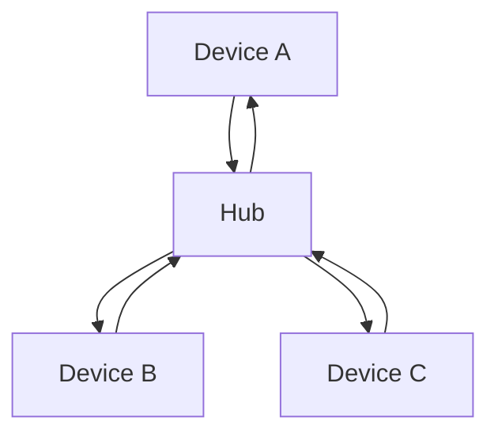
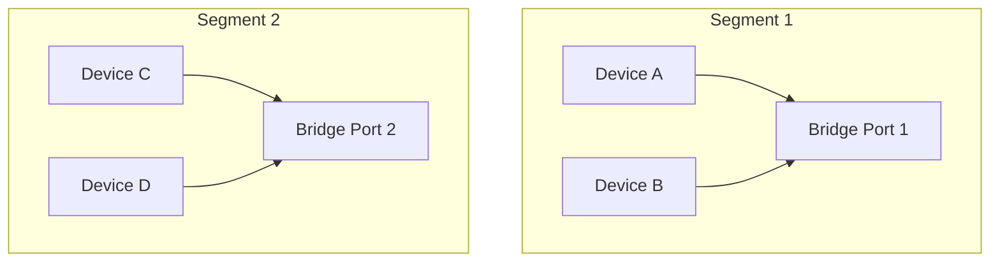
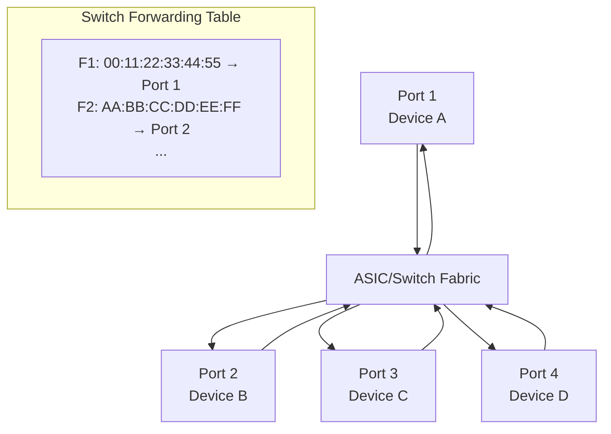

# Hubs vs Bridges vs Switches

This guide compares fundamental network devices that operate at different layers of the OSI model, focusing on their roles in network connectivity, traffic handling, and performance characteristics.

## Overview

| Device | OSI Layer     | Function            | Key Characteristic     |
| ------ | ------------- | ------------------- | ---------------------- |
| Hub    | 1 (Physical)  | Broadcast repeater  | Passive forwarding     |
| Bridge | 2 (Data Link) | Frame filtering     | Intelligent forwarding |
| Switch | 2 (Data Link) | Multi-port bridging | Hardware acceleration  |

## Network Hubs

**Layer 1 devices** that act as multi-port repeaters. Hubs receive data on one port and broadcast it to all other ports (except the receiving port).

### How Hubs Work



- **Incoming Signal**: Hubs receive electrical signals on one port
- **Broadcast**: Regenerate and send the signal to all other ports
- **Collision Domain**: All ports share the same collision domain
- **Bandwidth**: Shared bandwidth among all connected devices

### Characteristics

**Advantages:**
- Inexpensive
- Simple installation
- No configuration required

**Disadvantages:**
- Creates network congestion
- No traffic filtering
- Security risks (all traffic visible)
- Half-duplex operation only

### Use Cases

- Small home networks
- Legacy network setups
- Temporary network expansion

## Network Bridges

**Layer 2 devices** that connect multiple network segments while maintaining separate collision domains. Bridges learn MAC addresses and make intelligent forwarding decisions to filter unnecessary traffic.

### How Bridges Work



**Key Processes:**
- **MAC Learning**: Learns MAC addresses of devices on each port
- **Filtering**: Forwards frames only to the appropriate segment
- **Loop Prevention**: STP (Spanning Tree Protocol) prevents loops

### Bridge Types

**Transparent Bridges:**
- Invisible to network devices
- Learns MAC addresses automatically
- Most common type

**Source Route Bridges:**
- Requires source routing information
- Used in token ring networks

### Characteristics

**Advantages:**
- Traffic isolation between segments
- Automatic learning and filtering
- Breaks up collision domains
- Cost-effective segmentation

**Disadvantages:**
- Limited scalability (typically 2-4 ports)
- Slower than switches
- No VLAN support typically

## Network Switches

**Layer 2 devices** that provide hardware-accelerated multi-port bridging. Modern switches combine the best of bridges with much higher performance and port density.

### How Switches Work



**Key Components:**
- **Switch Fabric**: High-speed internal backplane
- **ASICs**: Application-specific integrated circuits for fast forwarding
- **CAM Table**: Content-addressable memory for MAC address lookups
- **VLAN Support**: Virtual LAN segmentation

### Switching Methods

**Store-and-Forward:**
- Entire frame buffered before forwarding
- Error checking and filtering
- Higher latency but better reliability

**Cut-through:**
- Forwards frame after destination MAC is read
- Lower latency but potential error propagation

**Fragment-Free:**
- Compromise between cut-through and store-and-forward
- Checks for collisions before forwarding

### Layer 2 vs Layer 3 Switching

| Feature           | Layer 2 Switch        | Layer 3 Switch               |
| ----------------- | --------------------- | ---------------------------- |
| Primary Function  | MAC address switching | IP routing                   |
| Header Processing | MAC addresses         | IP addresses + MAC addresses |
| Routing           | No                    | Yes (limited)                |
| VLAN Support      | Native                | Advanced                     |
| Throughput        | Higher (ASIC-based)   | Lower (CPU-based)            |

## Detailed Comparison

### Traffic Handling

**Hubs:**
- Broadcast all traffic to all ports
- No intelligence in forwarding decisions
- Creates single broadcast domain

**Bridges:**
- Learns source MAC addresses
- Builds forwarding table
- Filters unicast traffic
- Floods unknown unicast and broadcast

**Switches:**
- Advanced forwarding table (CAM)
- ASIC-based hardware acceleration
- Micro-segmentation per port
- Full-duplex operation
- Support for advanced features (QoS, PoE)

### Performance Metrics

| Metric            | Hub              | Bridge                  | Switch                  |
| ----------------- | ---------------- | ----------------------- | ----------------------- |
| Ports             | 4-16             | 2-4                     | 8-48+                   |
| Throughput        | Shared bandwidth | Full bandwidth per port | Full bandwidth per port |
| Latency           | Low              | Medium                  | Very low                |
| Collision Domains | 1 shared         | Multiple                | One per port            |
| Broadcast Domains | 1                | 1                       | 1 (without VLANs)       |

### Security Considerations

**Hubs:**
- All traffic visible to all devices
- Easy wiretapping with protocol analyzers
- No traffic isolation

**Bridges:**
- Traffic isolated between ports
- Can provide basic segmentation
- Limited security features

**Switches:**
- Port-based security (port security, 802.1X)
- VLANs for traffic segmentation
- DHCP snooping, ARP inspection
- Advanced security features

### Modern Usage

**Hubs:**
- Largely obsolete in enterprise networks
- Used only for specific testing or legacy support

**Bridges:**
- Still used for specific segmentation needs
- Wireless bridges for extending networks
- Bridging virtual machines to physical networks

**Switches:**
- Core of modern Ethernet networks
- Campus and data center switching
- Software-defined networking (SDN) extensions

## Configuration Examples

### Bridge Configuration

```bash
# Linux bridge setup
sudo brctl addbr br0
sudo brctl addif br0 eth0
sudo brctl addif br0 eth1
sudo ifconfig br0 up
```

### Switch VLAN Configuration

```bash
# Cisco switch VLAN configuration
vlan 10
    name Accounting
!
interface GigabitEthernet0/1
    switchport mode access
    switchport access vlan 10
!
interface GigabitEthernet0/24
    switchport mode trunk
    switchport trunk allowed vlan 1,10
```

## Summary

- **Choose hubs** for simple, temporary, or very low-budget solutions where security and performance aren't concerns
- **Choose bridges** for basic network segmentation in small networks or specific bridging application
- **Choose switches** for modern network infrastructure requiring high performance, security, and scalability
