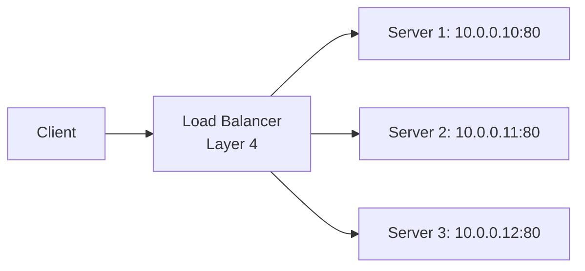
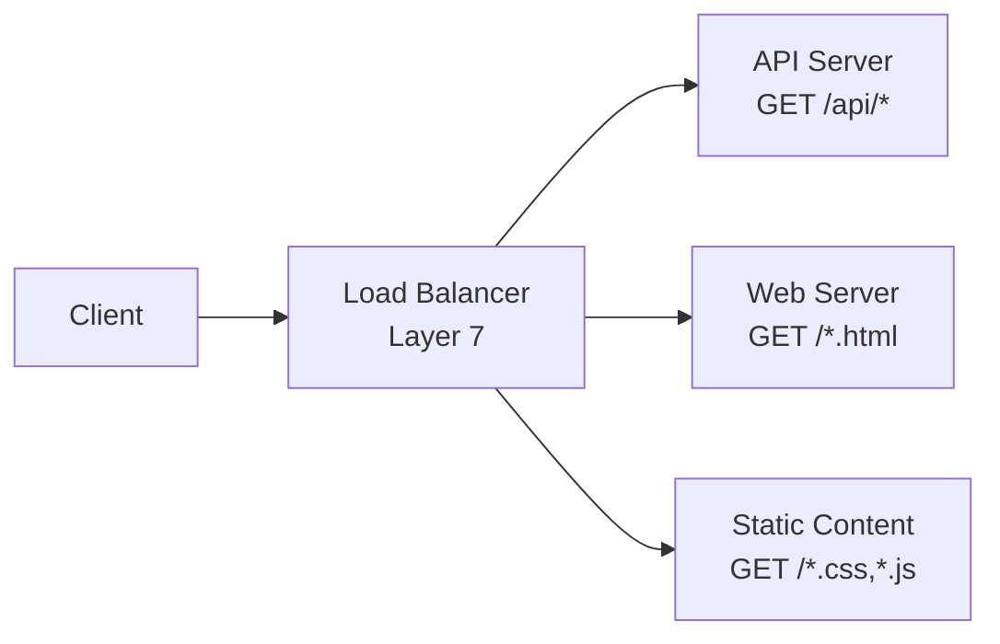
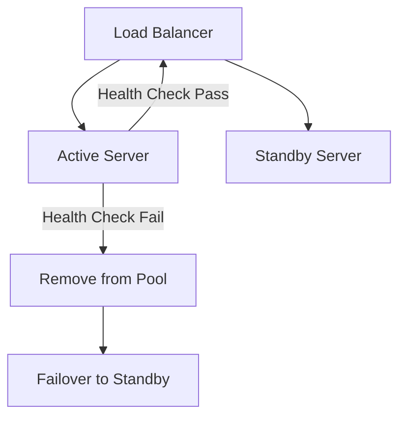
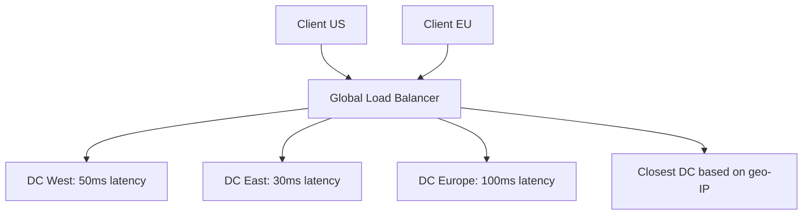
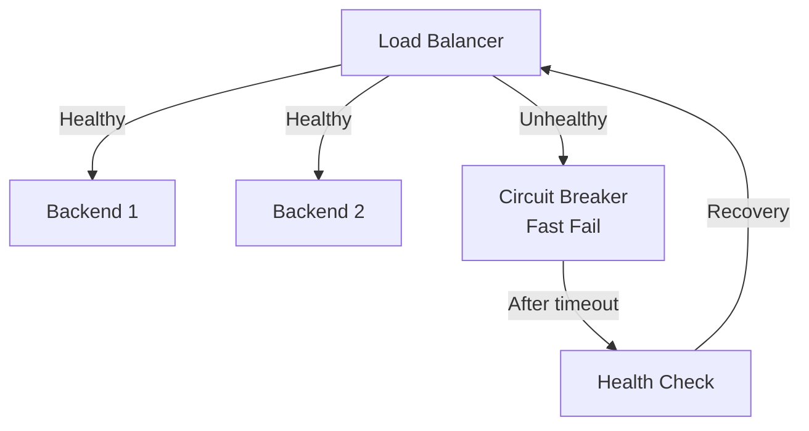

# Load Balancers

Load balancers distribute network traffic across multiple servers to ensure application availability, scalability, and optimal resource utilization. They act as intermediaries between clients and servers, preventing single points of failure and enabling high availability.

## Load Balancer Types

### Layer 4 Load Balancers

Operate at the Transport layer, making forwarding decisions based on IP addresses and TCP/UDP port numbers:



**Advantages:**
- High performance (hardware acceleration)
- Protocol agnostic
- Low latency

### Layer 7 Load Balancers

Intelligent application layer balancing with content-based routing:



**Features:**
- URL-based routing
- Content-type inspection
- Session persistence
- SSL termination

### Application Load Balancers vs Network Load Balancers

| Feature         | Application LB        | Network LB   |
| --------------- | --------------------- | ------------ |
| **Layer**       | 7 (HTTP/HTTPS)        | 4 (TCP/UDP)  |
| **Routing**     | Path, host, headers   | IP, port     |
| **SSL**         | Termination, bridging | Pass-through |
| **Performance** | Lower                 | Higher       |
| **Cost**        | Higher                | Lower        |

## Load Balancing Algorithms

### Round Robin

Distributes requests sequentially across servers:

```yaml
Servers: [A, B, C]
Requests: 1→A, 2→B, 3→C, 4→A, 5→B, 6→C
```

**Use Cases:** Uniform server capacity, stateless applications

### Least Connections

Routes to server with fewest active connections:

```yaml
# Server Status:
A: 3 connections
B: 8 connections
C: 5 connections

New request → A (least loaded)
```

**Best For:** Variable request processing times

### IP Hash

Routes based on client IP hash for session persistence:

```bash
# Consistent hashing
hash(client_ip) % server_count = server_index

Client 192.168.1.1 → always Server A
Client 192.168.1.2 → always Server B
```

**Benefits:**
- Session affinity without cookies
- Cache locality

### Weighted Round Robin

Assigns different capacities to servers:

```yaml
Servers with weights:
A: weight 3
B: weight 2
C: weight 1

Distribution: A,A,A,B,B,C,A,A,A,B,B,...
```

**Use case:** Mixed server capabilities

## Load Balancer Configuration

### HAProxy Example

```bash
# /etc/haproxy/haproxy.cfg
frontend http_front
    bind *:80
    default_backend http_back

backend http_back
    balance roundrobin
    server web1 10.0.0.10:80 check
    server web2 10.0.0.11:80 check
    server web3 10.0.0.12:80 check
```

### NGINX Load Balancing

```nginx
# /etc/nginx/nginx.conf
upstream backend {
    least_conn;
    server backend1.example.com:80 weight=3;
    server backend2.example.com:80 weight=2;
    server backend3.example.com:80 backup;
}

server {
    location / {
        proxy_pass http://backend;
    }
}
```

## SSL/TLS Termination

Offloading encryption/decryption from application servers:

```mermaid
graph LR
    Client[Client<br/>HTTPS] --> LB[Load Balancer<br/>SSL Termination]
    LB --> Servers[Servers<br/>HTTP]

    LB -.->Keys.-> Cert[Certificates]
```

**Benefits:**
- Reduced server CPU load
- Centralized certificate management
- Improved performance

### SSL Configuration

```bash
# HAProxy SSL termination
frontend https_front
    bind *:443 ssl crt /etc/ssl/certs/server.pem
    reqadd X-Forwarded-Proto:\ https
    default_backend http_back

backend http_back
    server web1 10.0.0.10:80 check
```

## Session Persistence

Maintaining client-server affinity across requests:

### Session Cookies

```http
# Server response
Set-Cookie: SESSIONID=abc123; Path=/; HttpOnly

# Load balancer reads cookie for routing
```

### Source IP Affinity

```yaml
# Nginx configuration
upstream backend {
    ip_hash;
    server backend1:80;
    server backend2:80;
}
```

## Health Checks and Failover

### Active Health Monitoring

```yaml
# HTTP health check configuration
health_check:
  path: /health
  interval: 30s
  timeout: 5s
  unhealthy_threshold: 3
  healthy_threshold: 2
```

### Automated Failover



## Global Server Load Balancing (GSLB)

Distributing traffic across geographic locations:



### Geolocation-Based Routing

```bash
# DNS-based GSLB
www.example.com IN CNAME us-west.example.com
www.example.com IN CNAME us-east.example.com

# Client resolution based on location
```

## Monitoring and Analytics

### Key Metrics

- **Throughput:** Requests per second
- **Latency:** Response time distribution
- **Error Rates:** 4xx/5xx percentages
- **Server Utilization:** CPU, memory, connections

### Logging Formats

```log
# Load balancer access log
192.168.1.100 - - [10/Oct/2023:13:55:36] "GET /api/v1/users HTTP/1.1" 200 234 "-" "Mozilla/5.0" backend1 0.034 0.032
```

**Fields:**
1. Client IP
2. Timestamps
3. HTTP request
4. Response status/code
5. Bytes transferred
6. User agent
7. Backend server
8. Request time
9. Upstream response time

## Common Load Balancing Patterns

### Blue-Green Deployment

Routing traffic between two identical environments:

```yaml
# Production routing
version: blue
backends:
  blue: [server1, server2, server3]  # 100% traffic
  green: [server4, server5, server6] # 0% traffic
```

### Canary Deployments

Gradual traffic shifting to new version:

```yaml
# Percentage-based routing
backends:
  stable: [server1, server2] weight: 90
  canary: [server3] weight: 10
```

### Circuit Breaker Pattern

Automatic failure isolation:



## Cloud Load Balancing

### AWS Elastic Load Balancing

```hcl
# Terraform ELB configuration
resource "aws_lb" "app_lb" {
  name               = "app-load-balancer"
  internal           = false
  load_balancer_type = "application"
  security_groups    = [aws_security_group.lb_sg.id]
  subnets            = aws_subnet.public.*.id

  enable_deletion_protection = true

  tags = {
    Environment = "production"
  }
}

resource "aws_lb_target_group" "app_tg" {
  name     = "app-target-group"
  port     = 80
  protocol = "HTTP"
  vpc_id   = aws_vpc.main.id

  health_check {
    enabled             = true
    healthy_threshold   = 2
    interval            = 30
    matcher             = "200"
    path                = "/health"
    port                = "traffic-port"
    protocol            = "HTTP"
    timeout             = 5
    unhealthy_threshold = 2
  }
}
```

Load balancers are essential for building resilient, high-performance applications. They provide the foundation for horizontal scaling, ensuring applications can handle increased traffic while maintaining availability and optimal user experience.
