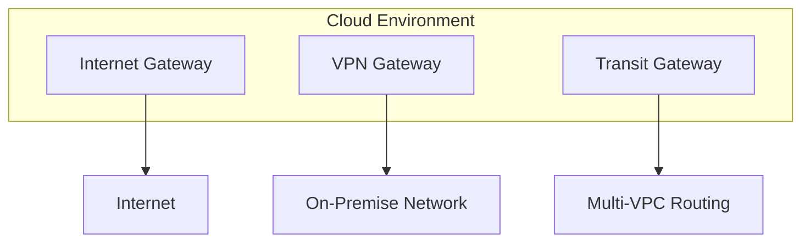

# Modems & Gateways

This guide covers the functions, types, and implementation of modems and gateways in network infrastructure. These devices bridge different network technologies and provide essential connectivity functions.

## Modems

**Modems (MOdulator-DEModulator)** are devices that convert digital data from computers into analog signals for transmission over analog communication lines, and vice versa.

### How Modems Work

**Modulation Process:**


**Demodulation Process:**


### Types of Modems

#### Dial-up Modems

**PSTN (Public Switched Telephone Network) Modems:**
- Connect via telephone lines
- Speed up to 56 Kbps
- Discontinued in most areas

#### DSL Modems

**Digital Subscriber Line Modems:**
- Use existing telephone lines
- Asymmetric DSL (ADSL): Faster download than upload
- Symmetric DSL (SDSL): Equal up/down speeds
- Very High Speed DSL (VDSL): Highest speeds

```bash
# Typical DSL modem configuration
Internet --> DSL
DSL --> Splitter
Splitter --> Phone
Splitter --> DSL Modem
DSL Modem --> Router
```

#### Cable Modems

**Cable Television Network Modems:**
- Use cable TV infrastructure
- Shared bandwidth with neighbors
- DOCSIS (Data Over Cable Service Interface Specification)
- Speeds up to 1 Gbps in modern implementations

#### Fiber Optic Modems

**Optical Network Terminals (ONTs):**
- Convert optical signals to electrical
- Passive Optical Networks (PON) technology
- GPON (Gigabit PON) or XGS-PON (10G PON)

### Modem Standards

| Standard   | Speed                    | Technology | Status   |
| ---------- | ------------------------ | ---------- | -------- |
| V.34       | 33.6 Kbps                | Dial-up    | Obsolete |
| ADSL       | 24 Mbps down/1 Mbps up   | DSL        | Common   |
| ADSL2+     | 24 Mbps down/1 Mbps up   | DSL        | Common   |
| VDSL       | 100 Mbps down/16 Mbps up | DSL        | Current  |
| DOCSIS 3.0 | 1 Gbps shared            | Cable      | Current  |
| DOCSIS 3.1 | 10 Gbps shared           | Cable      | Current  |
| GPON       | 2.5 Gbps/1.25 Gbps       | Fiber      | Current  |
| XGS-PON    | 10 Gbps/2.5 Gbps         | Fiber      | Latest   |

## Gateways

**Gateways** are network devices that connect different network protocols and architectures. They act as "protocol translators" between incompatible networks.

### Types of Gateways

#### Protocol Gateways

**Transport Layer Gateways:**
- Connect different transport protocols
- Example: TCP/IP to SNA (Systems Network Architecture)

#### Application Gateways

**Proxy Gateways:**
- Application-level protocol translation
- Content filtering and caching
- Security functions

#### Residential Gateways

**Home Network Gateways (CPE - Customer Premise Equipment):**
- Router + modem functionality
- DHCP server
- NAT implementation
- Firewall capabilities

#### Voice Gateways

**VoIP Gateways:**
- Convert circuit-switched voice to IP
- Support analog/digital phone interfaces
- Transcoding capabilities

### Gateway Functions

#### Network Address Translation

```bash
# Example NAT Gateway configuration
iptables -t nat -A POSTROUTING -o eth0 -j MASQUERADE
```

- Private to public IP translation
- Port address translation (PAT)
- Overload protection

#### Protocol Translation

**Common Gateway Protocols:**
- SMTP Gateway: Email format conversion
- HTTP Gateway: Web protocol translation
- FTP Gateway: File protocol adaptation

#### Security Functions

**Gateway Security Features:**
- Packet filtering
- Intrusion detection
- VPN termination
- SSL/TLS offloading

## Gateway vs Router

| Feature            | Gateway                  | Router                 |
| ------------------ | ------------------------ | ---------------------- |
| Layer              | Application/Presentation | Network                |
| Function           | Protocol conversion      | Path determination     |
| Intelligence       | High (application aware) | Medium (network aware) |
| Configuration      | Complex                  | Moderate               |
| Performance Impact | Higher latency           | Lower latency          |

## Implementation Examples

### Residential Gateway Setup

```bash
# Basic home gateway configuration
# 1. Configure WAN interface
ifconfig eth0 192.168.1.1 netmask 255.255.255.0 up

# 2. Enable NAT
iptables -t nat -A POSTROUTING -o eth0 -j MASQUERADE

# 3. Configure DHCP server
dhcpd -cf /etc/dhcp/dhcpd.conf

# 4. Enable routing
echo 1 > /proc/sys/net/ipv4/ip_forward
```

### Enterprise Gateway Configuration

**Cisco Gateway Configuration:**
```bash
# VoIP Gateway setup
voice-card 0
  codec g711ulaw
!
dial-peer voice 100 voip
  destination-pattern 1000
  session target ipv4:192.168.1.10
!
telephony-service
  max-ephones 10
  max-dn 20
```

### Gateway Performance Metrics

**Key Performance Indicators:**
- **Throughput**: Data transfer rate capability
- **Latency**: Processing delay in packet forwarding
- **Concurrent Sessions**: Maximum simultaneous connections
- **Packet Loss**: Error rate during transmission
- **Jitter**: Variation in latency

**Typical Gateway Specifications:**

| Device Type        | Throughput    | Concurrent Sessions | Typical Use     |
| ------------------ | ------------- | ------------------- | --------------- |
| Home Gateway       | 100-1000 Mbps | 50-200              | Residential     |
| SMB Gateway        | 1-10 Gbps     | 500-2000            | Small Business  |
| Enterprise Gateway | 10-40 Gbps    | 10,000+             | Corporate       |
| Carrier Gateway    | 100+ Gbps     | 100,000+            | ISP/Data Center |

## Common Issues and Troubleshooting

### Modem Issues

**Sync Problems:**
```bash
# Check DSL sync
adsl-status
# Expected output: trained, sync speed up/down
```

**Common Modem Problems:**
- No dial tone (dial-up)
- Sync errors (DSL)
- Signal attenuation (cable)
- Firmware corruption

### Gateway Issues

**Configuration Issues:**
- Incorrect IP addressing
- Firewall rule conflicts
- Routing table problems

**Performance Issues:**
- High CPU utilization
- Memory exhaustion
- Buffer overflow

**Troubleshooting Commands:**
```bash
# Check gateway routes
netstat -rn

# Monitor gateway traffic
iptables -L -n -v

# Check log files
tail -f /var/log/messages
```

## Security Considerations

### Modem Security

**Threats:**
- War driving (wireless modem attacks)
- modem signal theft
- Default password exploitation

**Best Practices:**
- Change default passwords
- Enable encryption (WPA3 for wireless)
- Regular firmware updates
- Disable remote management

### Gateway Security

**Protection Mechanisms:**
- Access control lists
- Intrusion prevention systems
- SSL/TLS termination
- Content inspection

**Gateway Hardening:**
```bash
# Disable unnecessary services
systemctl disable telnet
systemctl disable ftp

# Configure secure access
sshd_config: PermitRootLogin no
```

## Modern Deployments

### Software-Defined Gateways

**SDN Gateway Functions:**
- Virtual network functions (VNF)
- Dynamic service chaining
- Policy-based routing

### Cloud Gateways

**Cloud Networking Gateways:**
- AWS Internet Gateway
- GCP Cloud Router
- Azure Virtual Network Gateway



### IoT Gateways

**IoT Protocol Translation:**
- MQTT to HTTP conversion
- CoAP to MQTT bridging
- Bluetooth LE to IP networking

## Summary

- **Choose modems** for converting between digital and analog signals over various media (telephone, cable, fiber)
- **Choose gateways** for connecting incompatible networks, protocols, or architectures

Key selection criteria include:
- **Performance requirements**: Throughput, latency, concurrent sessions
- **Protocol support**: Required translation functions
- **Security features**: Filtering, encryption, access control
- **Deployment environment**: Home, enterprise, or cloud

The ongoing convergence of these devices into integrated CPE (Customer Premise Equipment) continues to blur traditional distinctions between modems and gateways.
