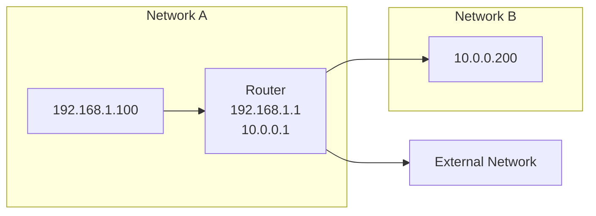
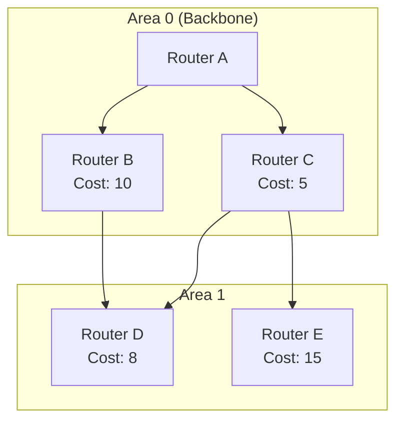
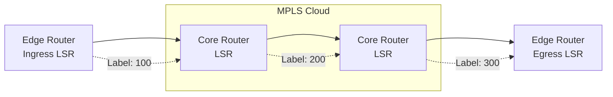

# Network Routers

Network routers are Layer 3 (Network Layer) devices that connect different networks and make intelligent forwarding decisions based on IP addresses. They serve as the backbone of the internet and enterprise networks, directing traffic between disparate network segments.

## Overview

Routers operate at Layer 3 of the OSI model, reading IP packet headers to determine the optimal path for data transmission. Unlike switches that work within a single network segment, routers connect multiple networks and handle inter-network communication.

## Router Functionality

### Packet Forwarding

Routers use routing tables to determine the best path for packet delivery:



### Routing Table Structure

```text
Routing Table for Router R1:
===========================================================================
Destination      Next Hop        Interface       Metric
0.0.0.0/0        203.0.113.1     eth0            1       # Default Route
192.168.1.0/24   0.0.0.0         eth1            0       # Connected Route
10.0.0.0/8       192.168.2.2     eth0            2       # Static Route
172.16.0.0/16    10.0.0.254      eth2            3       # Dynamic Route
===========================================================================
```

## Router Types

### Core Routers

High-performance routers handling backbone network traffic:

```text
Internet Backbone
     |
     | 100Gbps+ Links
     v
[Core Router] <---> [Core Router]
     |
     +--> Enterprise Networks
     +--> ISP Networks
     +--> CDN Networks
```

**Characteristics:**
- OC-192/STM-64 speeds (10Gbps+)
- Carrier-grade reliability (99.999% uptime)
- Advanced MPLS capabilities

### Edge Routers

Connect enterprise networks to the internet:

```text
Enterprise Network ───┬─ [Edge Router] ──── Internet
                     │
                     └─ Security Features:
                        - NAT
                        - Firewall
                        - VPN Termination
                        - QoS
```

**Functions:**
- Internet gateway
- Traffic policing
- Protocol termination

### Branch Office Routers

Small to medium-sized routers for remote locations:

**Features:**
- WAN connectivity (T1/E1, DSL, Cable)
- VPN capabilities
- Basic routing protocols
- SD-WAN support

## Routing Protocols

### Static Routing

Manually configured routes requiring no dynamic updates:

```bash
# Linux static routes
ip route add 192.168.2.0/24 via 10.0.0.1 dev eth0
ip route add 0.0.0.0/0 via 203.0.113.1 dev eth0  # Default route

# Cisco static route
ip route 192.168.2.0 255.255.255.0 10.0.0.1
```

**Advantages:**
- Predictable traffic paths
- No protocol overhead
- Enhanced security

**Disadvantages:**
- Manual configuration required
- No automatic failover
- Scalability issues in large networks

### Dynamic Routing Protocols

#### Distance-Vector Protocols

RIP (Routing Information Protocol):

```text
Router A Routing Table:
Destination: 10.0.0.0/8  Next Hop: Router B  Metric: 2
Destination: 172.16.0.0/16  Next Hop: Router C  Metric: 1
```

**RIP Versions:**
- **RIPv1:** Classful routing, no subnet mask information
- **RIPv2:** Classless routing, supports VLSM and authentication
- **RIPng:** IPv6 support

**Problems:**
- Slow convergence (up to 180 seconds)
- Count-to-infinity (maximum hop count 15)
- Routing loops possible

#### Link-State Protocols

OSPF (Open Shortest Path First):



**OSPF Features:**
- Fast convergence using Dijkstra's algorithm
- Support for areas for scalability
- Authentication and security
- Load balancing across equal-cost paths

### Interior vs. Exterior Protocols

- **Interior Gateway Protocols (IGP):** OSPF, EIGRP, RIP (within AS)
- **Exterior Gateway Protocols (Exterior Gateway Protocols):** BGP (between AS)

## BGP (Border Gateway Protocol)

The protocol that makes the internet work:

```text
AS 65001 ── BGP ── AS 65002 ── BGP ── AS 65003
     │                    │                    │
     └─ Router A          └─ Router B          └─ Router C
        peering                    peering
```

### BGP Path Attributes

- **AS Path:** Sequence of AS numbers
- **Next Hop:** IP address of the border router
- **MED (Multi-Exit Discriminator):** Suggests preferred entry point
- **Local Preference:** Preferred outbound path
- **Community:** Grouping mechanism for route policies

### BGP Configuration Example

```bash
router bgp 65001
 neighbor 10.0.0.1 remote-as 65002
 neighbor 10.0.0.1 description "Peer with ISP"
 neighbor 10.0.0.1 soft-reconfiguration inbound
 !
 address-family ipv4
  network 192.168.1.0 mask 255.255.255.0
  neighbor 10.0.0.1 activate
 exit-address-family
```

## NAT (Network Address Translation)

Translates between private and public IP addresses:

### Types of NAT

**Static NAT:** One-to-one mapping for servers
```text
Private IP: 192.168.1.10 → Public IP: 203.0.113.10
```

**Dynamic NAT:** Many-to-many mapping using a pool
```text
Private IPs: 192.168.1.10-192.168.1.20 → Public Pool: 203.0.113.1-203.0.113.10
```

**PAT (Port Address Translation):** Many-to-one with port differentiation
```text
192.168.1.10:1025 → 203.0.113.1:5000
192.168.1.11:1025 → 203.0.113.1:5001
```

### NAT Configuration

```bash
# Cisco NAT Configuration
ip nat inside source list 1 interface GigabitEthernet0/0 overload
access-list 1 permit 192.168.1.0 0.0.0.255

interface GigabitEthernet0/0
 ip address 203.0.113.1 255.255.255.0
 ip nat outside

interface GigabitEthernet0/1
 ip address 192.168.1.1 255.255.255.0
 ip nat inside
```

## Router Security

### Access Control Lists (ACLs)

Filter traffic based on IP addresses, protocols, and ports:

**Standard ACL (1-99):**
```bash
access-list 10 deny 192.168.1.10
access-list 10 permit 192.168.1.0 0.0.0.255

interface GigabitEthernet0/0
 ip access-group 10 out
```

**Extended ACL (100-199):**
```bash
access-list 101 permit tcp any host 192.168.1.100 eq 80
access-list 101 permit tcp any host 192.168.1.100 eq 443
access-list 101 deny ip any any

interface GigabitEthernet0/0
 ip access-group 101 in
```

### Control Plane Policing (CoPP)

Protects router CPU from overwhelming traffic:

```bash
# Protect against DoS attacks
ip access-list extended CoPP
 permit ospf host 10.0.0.1 any
 permit tcp 192.168.0.0 0.0.255.255 any eq 22
 deny ip any any

class-map CoPP-class
 match access-group name CoPP

policy-map CoPP-policy
 class CoPP-class
  police 64000 conform-action transmit exceed-action drop

control-plane
 service-policy input CoPP-policy
```

## QoS (Quality of Service)

Prioritizes critical network traffic:

### Classification and Marking

```bash
# Cisco QoS Configuration
class-map match-all VOICE
 match ip dscp ef

class-map match-all VIDEO
 match ip dscp af41

policy-map QoS-Policy
 class VOICE
  priority percent 30
 class VIDEO
  bandwidth percent 25
  set dscp af31
 class class-default
  fair-queue

interface GigabitEthernet0/0
 service-policy output QoS-Policy
```

### Queuing Mechanisms

- **FIFO:** First In, First Out
- **PQ:** Priority Queuing
- **CQ:** Custom Queuing
- **WFQ:** Weighted Fair Queuing
- **CBWFQ:** Class-Based Weighted Fair Queuing

## MPLS (Multiprotocol Label Switching)

Creates virtual links between routers for efficient traffic engineering:



### MPLS Operation

1. **Ingress LER:** Assigns initial label based on destination
2. **LSR:** Forwards packets based on label (not IP lookup)
3. **Egress LER:** Removes label and routes normally

**Benefits:**
- Traffic engineering without IP address changes
- Faster forwarding (label switching vs. route lookup)
- VPN support (Layer 3 MPLS VPN)

## IPv6 Routing

Modern routing with expanded address space:

### IPv6 Routing Protocols

- **RIPng:** IPv6 version of RIP
- **OSPFv3:** IPv6 OSPF with area support
- **EIGRP for IPv6:** Enhanced Interior Gateway Routing Protocol
- **BGP4+:** BGP with IPv6 support

### IPv6 Static Route Example

```bash
# IPv6 static route configuration
ipv6 route 2001:db8:1::/48 2001:db8:2::1 ethernet0
```

## Router Troubleshooting

### Common Issues

1. **Routing Loops**
   ```bash
   # Check routing table for duplicate routes
   show ip route
   ```

2. **Asymmetric Routing**
   ```bash
   # Verify return path
   traceroute source-interface
   ```

3. **Memory Exhaustion**
   ```bash
   # Monitor memory usage
   show processes memory
   ```

4. **High CPU Utilization**
   ```bash
   # Identify process consuming CPU
   show processes cpu sorted
   ```

### Diagnostic Commands

```bash
# Comprehensive router diagnostics
show ip route
show ip protocols
show cdp neighbors
show interfaces
show ip bgp summary
ping
traceroute
debug ip routing
```

## Code Examples

### Python: Router Configuration Backup

```python
#!/usr/bin/env python3
"""
Automated Router Configuration Backup
"""

import paramiko
import datetime
from pathlib import Path

class RouterBackup:
    def __init__(self, router_list):
        self.routers = router_list

    def backup_config(self, hostname, username, password):
        try:
            ssh = paramiko.SSHClient()
            ssh.set_missing_host_key_policy(paramiko.AutoAddPolicy())
            ssh.connect(hostname, username=username, password=password)

            # Execute commands to get configuration
            commands = [
                "terminal length 0",  # No paging
                "show running-config"
            ]

            config_lines = []
            for cmd in commands:
                stdin, stdout, stderr = ssh.exec_command(cmd)
                config_lines.extend(stdout.read().decode().split('\n'))

            timestamp = datetime.datetime.now().strftime("%Y%m%d_%H%M%S")
            filename = f"backup_{hostname}_{timestamp}.txt"

            Path("backups").mkdir(exist_ok=True)
            with open(f"backups/{filename}", 'w') as f:
                f.write('\n'.join(config_lines))

            ssh.close()
            return f"Backup saved: {filename}"

        except Exception as e:
            return f"Backup failed for {hostname}: {str(e)}"

    def backup_all(self):
        results = []
        for router in self.routers:
            result = self.backup_config(
                router['ip'],
                router['username'],
                router['password']
            )
            results.append(result)
        return results

# Usage
routers = [
    {'ip': '192.168.1.1', 'username': 'admin', 'password': 'cisco123'},
    {'ip': '192.168.1.2', 'username': 'admin', 'password': 'cisco123'},
 ]

backup = RouterBackup(routers)
results = backup.backup_all()
for result in results:
    print(result)
```

### Ansible: Router Interface Configuration

```yaml
---
# Ansible playbook for router interface configuration
- name: Configure Router Interfaces
  hosts: routers
  gather_facts: false
  tasks:
    - name: Configure GigabitEthernet interface
      ios_config:
        lines:
          - description {{ interface.description }}
          - ip address {{ interface.ip }} {{ interface.mask }}
          - no shutdown
        parents: interface {{ interface.name }}

    - name: Configure BGP
      ios_config:
        lines:
          - network {{ bgp.network }} mask {{ bgp.mask }}
        parents: router bgp {{ bgp.asn }}

    - name: Configure static route
      ios_static_route:
        address: "{{ route.destination }}"
        mask: "{{ route.mask }}"
        next_hop: "{{ route.next_hop }}"
        state: present
```

### Network Simulation (Python)

```python
# Simplified Router Simulation
class Router:
    def __init__(self, name, interfaces):
        self.name = name
        self.routing_table = {}
        self.interfaces = interfaces  # {interface_name: ip_address}

    def add_route(self, destination, next_hop, metric=1):
        """Add a route to routing table"""
        self.routing_table[destination] = {
            'next_hop': next_hop,
            'metric': metric,
            'interface': self.get_interface_for_next_hop(next_hop)
        }

    def get_interface_for_next_hop(self, next_hop):
        """Determine which interface to use for next hop"""
        for interface, ip in self.interfaces.items():
            network = '.'.join(ip.split('.')[:3]) + '.0/24'
            if self.ip_in_network(next_hop, network):
                return interface
        return None

    def ip_in_network(self, ip, network):
        """Check if IP is in network (simplified)"""
        ip_parts = [int(x) for x in ip.split('.')]
        network_parts = [int(x) for x in network.split('/')[0].split('.')]
        return ip_parts[:3] == network_parts[:3]

    def forward_packet(self, packet):
        """Forward packet based on routing table"""
        destination = packet['destination']
        best_route = None

        # Find best route (longest match, lowest metric)
        for route_dest, route_info in self.routing_table.items():
            if self.destination_matches(destination, route_dest):
                if best_route is None or route_info['metric'] < best_route[1]['metric']:
                    best_route = (route_dest, route_info)

        if best_route:
            packet['next_hop'] = best_route[1]['next_hop']
            packet['out_interface'] = best_route[1]['interface']
            return f"Routing packet to {packet['next_hop']} via {packet['out_interface']}"
        else:
            return "Packet dropped - no route found"

    def destination_matches(self, destination, route_dest):
        """Simple longest prefix match (simplified)"""
        if '/' in route_dest:
            network, mask = route_dest.split('/')
            mask_bits = int(mask)
            # Simplified matching
            return destination.startswith('.'.join(network.split('.')[:mask_bits//8]))
        return destination == route_dest

# Create router network
router1 = Router("R1", {"eth0": "192.168.1.1", "eth1": "10.0.0.1"})
router1.add_route("192.168.2.0/24", "10.0.0.2")
router1.add_route("0.0.0.0/0", "203.0.113.1")  # Default route

# Test packet forwarding
packet = {'source': '192.168.1.100', 'destination': '192.168.2.50', 'data': '...'}
result = router1.forward_packet(packet)
print(result)
```

## Best Practices

1. **Network Segmentation:** Use VLANs and subnets appropriately
2. **Redundancy:** Implement multiple paths and failover mechanisms
3. **Monitoring:** Use SNMP and NetFlow for monitoring and troubleshooting
4. **Documentation:** Maintain up-to-date network diagrams and configurations
5. **Security:** Implement ACLs, authentication, and encryption
6. **Performance Tuning:** Monitor and optimize routing protocols and link utilization
7. **Regular Backups:** Automated configuration backups for disaster recovery

Routers are the cornerstone of network infrastructure, responsible for the reliable, efficient, and secure routing of traffic across complex networks. Mastering routing protocols, security mechanisms, and troubleshooting techniques is essential for network administrators and architects tasked with building and maintaining robust network environments.
