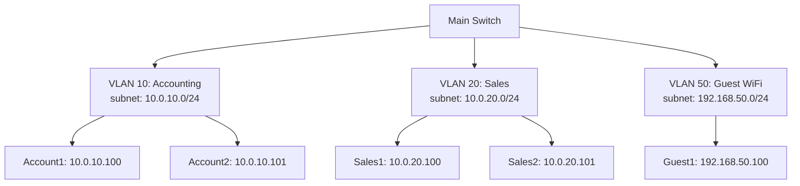
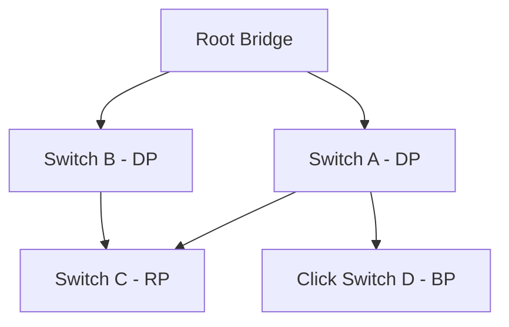

# Network Switches

Network switches are fundamental Layer 2 (Data Link) devices that connect multiple devices within a local area network (LAN). They intelligently forward data based on MAC addresses, creating efficient communication paths between devices.

## Overview

Unlike hubs that broadcast traffic to all ports, switches maintain a MAC address table to selectively forward frames only to the intended destination, dramatically improving network performance and security.

## Switching Mechanisms

### Store-and-Forward Switching

The most common switching mechanism where the switch receives the entire frame before forwarding it:

```mermaid
sequenceDiagram
    participant Source
    participant Switch
    participant Destination

    Source->>Switch: Frame (check CRC)
    Switch->>)Switch: Full frame buffering
    Switch->>Destination: Forward to correct port
```

**Advantages:**
- Highest reliability (discards corrupted frames)
- Supports full-duplex communication
- Error checking capability

**Disadvantages:**
- Higher latency due to frame buffering
- More complex hardware required

### Cut-Through Switching

Begins forwarding the frame as soon as the destination address is read (first 6-8 bytes):

```text
Frame Header | Destination MAC | Source MAC | ...
--------^-----------------------------^
         |
    Forwarding begins here
```

**Advantages:**
- Lowest latency (reduced buffering time)
- Lower hardware complexity

**Disadvantages:**
- Cannot check for frame errors (potential Increase in network noise)
- No support for advanced features requiring full frame analysis

### Fragment-Free Switching

Hybrid approach reading the first 64 bytes before forwarding:

**Benefits:**
- Reduced latency compared to store-and-forward
- Catches most collision fragments while maintaining decent error detection
- Balanced performance/reliability

## Switch Types

### Unmanaged Switches

Basic plug-and-play switches with no configuration capabilities:

```text
STP Controlled Networks ─┬─ Port 1: Device A
                        ├─ Port 2: Device B
                        └─ Port 3: Device C
```

**Characteristics:**
- Zero configuration required
- Affordable cost
- Limited scalability for complex networks

### Managed Switches

Highly configurable switches supporting advanced networking features:

**Web-based Management:**
```bash
# Cisco Switch Web Interface Example
http://192.168.1.1
- VLAN Configuration
- Port Security
- QoS Settings
```

**Command-line Interface (CLI) Management:**
```bash
# IOS CLI Examples
conf t
interface GigabitEthernet0/1
switchport mode access
switchport access vlan 10
spanning-tree portfast
end
```

## VLANs (Virtual LANs)

VLANs segment broadcast domains within a physical network, improving security, performance, and management. VLANs logically segment devices regardless of physical location, those on different floors or buildings can belong to the same VLAN while being on the island from other network traffic.



### VLAN Types

**Data VLANs (User VLANs):** Carry user-generated traffic (VLAN 1-1005)
**Voice VLANs:** Dedicated bandwidth for VoIP traffic
**Management VLANs:** Control plane traffic for switch management
**Native VLANs:** Untagged traffic on trunk ports

### VLAN Configuration Example

```bash
# Create VLANs
vlan 10
name Accounting
exit
vlan 20
name Sales

# Configure trunk ports (multiple VLANs)
interface GigabitEthernet0/24
switchport mode trunk
switchport trunk allowed vlan 10,20
switchport trunk native vlan 1

# Configure access ports (single VLAN)
interface GigabitEthernet0/5
switchport mode access
switchport access vlan 10
```

## Port Security

Prevents unauthorized devices from connecting to the network by limiting MAC addresses per port:

```bash
# Configure port security
interface GigabitEthernet0/10
switchport mode access
switchport port-security
switchport port-security maximum 2
switchport port-security violation restrict
switchport port-security mac-address sticky

# View security violations
show port-security interface gi0/10
```

**Violation Modes:**
- **restrict:** Drops packets, increments counter, but allows monitoring
- **protect:** Drops packets without notification
- **shutdown:** Shuts down port until manual intervention

## Spanning Tree Protocol (STP)

IEEE 802.1D standard preventing Layer 2 loops while maintaining redundancy. Without STP, broadcast storms can cripple networks. STP automatically creates a loop-free topology by designating primary and alternative paths, ensuring efficient data flow and preventing network congestion.



**Key Concepts:**
- **Root Bridge:** Lowest Bridge ID (priority + MAC)
- **Designated Port (DP):** Forwarding port on segment
- **Root Port (RP):** Directly connects to root
- **Blocking Port (BP):** Disabled to prevent loops

### Rapid Spanning Tree (RSTP - 802.1w)

Enhanced version with faster convergence:
- Edge ports for direct device connections
- Alternate and backup ports for redundancy
- Sub-second convergence in most scenarios

## Power over Ethernet (PoE)

Delivers power alongside data on standard Ethernet cables, eliminating need for separate power connections:

```text
Cat6 Cable
├── Power Pins: 4,5(V+) 7,8(V-)
├── Data Pins: 1,2,3,6 (100Mbps)
└── Enhanced: 1,2,3,6 + 4,5,7,8 (1Gbps)
```

**IEEE Standards:**
- **802.3af (PoE):** Up to 15.4W
- **802.3at (PoE+):** Up to 25.5W (Type 2)
- **802.3bt (4PPoE):** Up to 60W (Type 3), 100W (Type 4)

## Troubleshooting Switches

### Common Issues

1. **Broadcast Storms**
   ```bash
   # Check for spanning tree loops
   show spanning-tree active
   ```

2. **DUPLEX Mismatches**
   ```bash
   # Verify port settings
   show interfaces status
   ```

3. **MAC Address Table Problems**
   ```bash
   # Clear and rebuild table
   clear mac address-table dynamic
   ```

4. **VLAN Configuration Issues**
   ```bash
   # Check VLAN configuration
   show vlan brief
   show interfaces trunk
   ```

### Diagnostic Commands

```bash
# Comprehensive switch diagnostics
show interfaces
show mac address-table
show spanning-tree summary
show vlan
show port-security
show power inline
```

## Performance Optimization

### Strategies
1. **Port Fast:** Immediately bring ports to forwarding state
2. **EtherChannel/LACP:** Aggregate bandwidth across multiple ports
3. **QoS Configuration:** Prioritize critical traffic
4. **Jumbo Frame Support:** Increase MTU for higher throughput

In modern networks, the switch has evolved beyond a simple Layer 2 device. Many implementations now incorporate Layer 3 capabilities, advanced security features, and intelligent traffic management. As network complexity continues to grow, switches play an increasingly pivotal role in maintaining high-performance, secure, and scalable network infrastructures. This comprehensive approach ensures that switches can adapt to diverse networking environments, supporting everything from small office setups to expansive enterprise networks.

## Code Examples

### Python: Switch Configuration Script

```python
#!/usr/bin/env python3
"""
Cisco Switch Configuration Automation
"""

import paramiko
import time

class SwitchConfigurator:
    def __init__(self, hostname, username, password):
        self.ssh = paramiko.SSHClient()
        self.ssh.set_missing_host_key_policy(paramiko.AutoAddPolicy())
        self.ssh.connect(hostname, username=username, password=password)

    def configure_vlan(self, vlan_id, name):
        commands = [
            "conf t",
            f"vlan {vlan_id}",
            f"name {name}",
            "exit",
            "end",
            "wr mem"
        ]

        for cmd in commands:
            stdin, stdout, stderr = self.ssh.exec_command(cmd)
            time.sleep(0.5)

        return "VLAN configuration completed"

    def close(self):
        self.ssh.close()

# Usage
config = SwitchConfigurator("192.168.1.1", "admin", "password")
config.configure_vlan(100, "Development")
config.close()
```

### JavaScript: Network Monitoring Dashboard

```javascript
// Switch Port Monitoring (Pseudo-code)
class SwitchMonitor {
    async getPortStatus(switchIP) {
        try {
            const apiUrl = `https://${switchIP}/api/ports/status`;
            const response = await fetch(apiUrl, {
                headers: {
                    'Authorization': 'Bearer ' + this.token
                }
            });
            const ports = await response.json();

            return ports.map(port => ({
                interface: port.name,
                status: port.link ? 'CONNECTED' : 'DISCONNECTED',
                speed: port.speed + 'Mbps',
                vlan: port.vlan
            }));

        } catch (error) {
            console.error('API Error:', error);
        }
    }

    // Real-time monitoring
    startMonitoring(callback) {
        setInterval(async () => {
            const status = await this.getPortStatus(this.switchIP);
            callback(status);
        }, this.interval);
    }
}
```

### Best Practices

1. **Regular Firmware Updates:** Maintain security and compatibility
2. **Documentation:** Track all configurations for disaster recovery
3. **Monitoring:** Implement SNMP for proactive issue detection
4. **Redundancy:** Use multiple switches with proper STP configuration
5. **Security:** Enable port security and 802.1X authentication

Switches form the foundation of modern networks. Mastering their configuration, troubleshooting, and optimization ensures reliable, secure, and high-performance network infrastructure.
