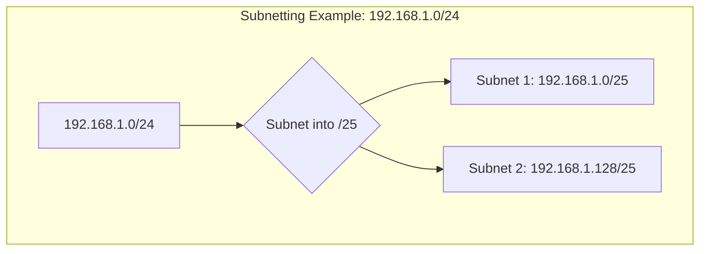

# IP Addressing

An **Internet Protocol (IP) address** is a numerical label assigned to each device connected to a computer network that uses the Internet Protocol for communication. An IP address serves two main functions: host or network interface identification and location addressing.

## IPv4 vs. IPv6

There are two versions of IP addresses in use today: IPv4 and IPv6.

### IPv4

- **Format**: A 32-bit address, written as four decimal numbers separated by periods (e.g., `192.168.1.1`).
- **Address Space**: Approximately 4.3 billion addresses.
- **Structure**: Divided into a network portion and a host portion.

### IPv6

- **Format**: A 128-bit address, written as eight groups of four hexadecimal digits separated by colons (e.g., `2001:0db8:85a3:0000:0000:8a2e:0370:7334`).
- **Address Space**: Approximately 340 undecillion (3.4 x 10^38) addresses, providing a virtually unlimited number of unique addresses.
- **Features**: Includes improvements such as simplified headers, better support for mobile devices, and built-in security (IPsec).

| Feature | IPv4 | IPv6 |
|---|---|---|
| **Address Size** | 32-bit | 128-bit |
| **Address Format** | Dotted decimal | Hexadecimal with colons |
| **Address Space** | ~4.3 billion | ~340 undecillion |
| **Security** | Optional (IPsec) | Built-in (IPsec) |
| **Header** | Complex | Simplified |

## Subnetting and CIDR Notation

**Subnetting** is the process of dividing a single, large network into smaller, more manageable sub-networks, or subnets. This is done by "borrowing" bits from the host portion of the IP address to create a subnet portion.

**Classless Inter-Domain Routing (CIDR)** is a method for allocating IP addresses and for IP routing. It replaces the older classful network design. CIDR notation is a compact representation of an IP address and its associated routing prefix. It is written as the IP address, followed by a forward slash, and then the number of bits in the prefix (e.g., `192.168.1.0/24`).

- **/24 Subnet**:
    - **Network**: `11111111.11111111.11111111.00000000` (255.255.255.0)
    - **Hosts**: 2^8 - 2 = 254
- **/25 Subnet**:
    - **Network**: `11111111.11111111.11111111.10000000` (255.255.255.128)
    - **Hosts**: 2^7 - 2 = 126

## Private vs. Public IPs

IP addresses are also categorized as either private or public.

### Private IPs

- **Purpose**: Used within a local area network (LAN) and are not routable on the public internet.
- **Ranges**:
    - **Class A**: `10.0.0.0` to `10.255.255.255`
    - **Class B**: `172.16.0.0` to `172.31.255.255`
    - **Class C**: `192.168.0.0` to `192.168.255.255`
- **NAT**: Network Address Translation (NAT) is used to allow devices with private IPs to access the internet.

### Public IPs

- **Purpose**: Routable on the public internet and are assigned by Internet Service Providers (ISPs).
- **Uniqueness**: Each public IP address is globally unique.
