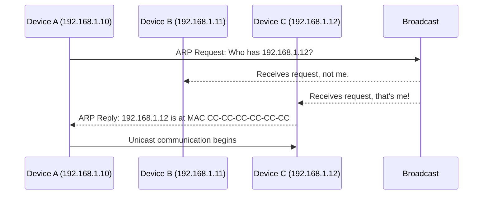

# MAC Address & ARP

While IP addresses handle the logical addressing on a network, **MAC (Media Access Control) addresses** are used for physical addressing at the Data Link Layer. The **Address Resolution Protocol (ARP)** is the bridge between these two addressing schemes.

## MAC Address

A **MAC address** is a unique identifier assigned to a network interface controller (NIC) for use as a network address in communications within a network segment. It is a 48-bit address, typically written as six groups of two hexadecimal digits, separated by hyphens or colons (e.g., `00-1A-2B-3C-4D-5E`).

- **Uniqueness**: MAC addresses are intended to be globally unique and are usually hard-coded into the network hardware by the manufacturer.
- **OUI**: The first half of a MAC address is the **Organizationally Unique Identifier (OUI)**, which identifies the manufacturer of the device.

## Address Resolution Protocol (ARP)

**ARP** is a protocol used to map a network layer address (like an IP address) to a data link layer address (like a MAC address). When a device wants to communicate with another device on the same local network, it knows the IP address of the destination but needs the MAC address to create the Ethernet frame.

### How ARP Works

1.  **ARP Request**: The source device sends a broadcast ARP request message to the entire local network, asking "Who has this IP address?"
2.  **ARP Reply**: The device with the matching IP address sends a unicast ARP reply message back to the source, containing its MAC address.
3.  **ARP Cache**: The source device stores the IP-to-MAC address mapping in its ARP cache for future use.

## ARP Spoofing & Security

**ARP spoofing** (or ARP poisoning) is a type of attack in which an attacker sends falsified ARP messages over a local area network. This results in the linking of an attacker's MAC address with the IP address of a legitimate computer or server on the network.

- **Man-in-the-Middle Attack**: Once the attacker's MAC address is linked to a legitimate IP address, the attacker can intercept, modify, or stop data in transit.
- **Denial of Service**: ARP spoofing can also be used to create a denial-of-service attack by linking a non-existent MAC address to the IP address of the default gateway.

### Security Measures

- **Static ARP Entries**: Manually configuring static ARP entries in the ARP cache can prevent devices from listening to malicious ARP replies.
- **Dynamic ARP Inspection (DAI)**: A security feature on some switches that validates ARP packets before updating the ARP cache.
- **Port Security**: Configuring switches to limit the number of MAC addresses that can be learned on a given port.
