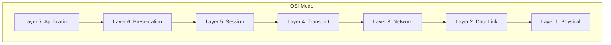

# The OSI Model

The **Open Systems Interconnection (OSI) model** is a conceptual framework that standardizes the functions of a telecommunication or computing system in seven abstract layers. It was developed to ensure diverse systems could communicate seamlessly. While the TCP/IP model is more practical and widely implemented, the OSI model remains an essential educational tool for understanding network architecture.

## The 7 Layers of the OSI Model

The OSI model is structured into seven layers, each responsible for a specific set of tasks. Data flows down the stack on the sending host and up the stack on the receiving host.



### 1. Physical Layer

The **Physical Layer** is the lowest layer and deals with the physical connection between devices. It is responsible for the transmission and reception of unstructured raw data between a device and a physical transmission medium.

- **Key Responsibilities**:
    - **Bit-level transmission**: Transmits bits as electrical, radio, or light signals.
    - **Hardware specifications**: Defines characteristics of cables, connectors, and network interface cards (NICs).
    - **Topology**: Defines the physical layout of the network (e.g., bus, star, ring).
- **Example**: Ethernet cables, fiber optic cables, hubs.

### 2. Data Link Layer

The **Data Link Layer** provides node-to-node data transfer—a link between two directly connected nodes. It detects and possibly corrects errors that may occur in the Physical Layer.

- **Key Responsibilities**:
    - **Framing**: Organizes bits into frames.
    - **Physical Addressing**: Adds a header to the frame to define the sender and receiver (MAC addresses).
    - **Flow Control**: Manages the rate of data transmission.
    - **Error Control**: Detects and re-transmits damaged or lost frames.
- **Sublayers**:
    - **LLC (Logical Link Control)**: Identifies network layer protocols and encapsulates them.
    - **MAC (Media Access Control)**: Controls how devices in a network gain access to the medium and permits the transmission of data.
- **Example**: Switches, bridges, MAC addresses.

### 3. Network Layer

The **Network Layer** is responsible for packet forwarding, including routing through intermediate routers. It handles the addressing and routing of data across a large network.

- **Key Responsibilities**:
    - **Logical Addressing**: Assigns logical addresses (e.g., IP addresses) to identify hosts on a network.
    - **Routing**: Determines the best path to move data from source to destination.
    - **Packetizing**: Creates packets from the segments coming from the Transport Layer.
- **Example**: Routers, IP addresses.

### 4. Transport Layer

The **Transport Layer** provides reliable or unreliable delivery of data segments between points on a network, including segmentation, acknowledgment, and multiplexing.

- **Key Responsibilities**:
    - **Segmentation and Reassembly**: Breaks down large data into smaller segments and reassembles them at the destination.
    - **Connection Control**: Can be connection-oriented (TCP) or connectionless (UDP).
    - **Flow Control**: Manages data flow to prevent congestion.
    - **Error Control**: Ensures complete data transfer.
- **Protocols**: TCP (Transmission Control Protocol), UDP (User Datagram Protocol).

### 5. Session Layer

The **Session Layer** manages sessions between end-user application processes. It establishes, manages, and terminates connections (sessions) between applications.

- **Key Responsibilities**:
    - **Session Management**: Establishes, maintains, and terminates sessions.
    - **Synchronization**: Adds checkpoints into a stream of data for synchronization.
    - **Dialog Control**: Allows systems to communicate in either half-duplex or full-duplex.
- **Example**: APIs, NetBIOS.

### 6. Presentation Layer

The **Presentation Layer** translates data between the application layer and the network format. It is sometimes called the "syntax layer."

- **Key Responsibilities**:
    - **Translation**: Converts data between different data formats (e.g., ASCII to EBCDIC).
    - **Encryption and Decryption**: Handles encryption and decryption of data for security.
    - **Compression**: Compresses data to reduce the number of bits to be transmitted.
- **Example**: SSL/TLS, JPEG, MPEG.

### 7. Application Layer

The **Application Layer** is the topmost layer and is what the end-user sees. It provides services for an end-user application such as a web browser or email client.

- **Key Responsibilities**:
    - **End-User Services**: Provides protocols that allow software to send and receive information and present meaningful data to users.
    - **Resource Sharing**: Enables sharing of resources like files and printers.
- **Protocols**: HTTP, FTP, SMTP, DNS.

## Encapsulation and Decapsulation

**Encapsulation** is the process of adding headers and trailers to data as it moves down the OSI stack from the Application Layer to the Physical Layer. Each layer adds its own control information.

**Decapsulation** is the reverse process, where headers and trailers are removed as data moves up the stack on the receiving end.

```mermaid
graph TD
    subgraph Sender (Encapsulation)
        A[Application Data] -->|L7 Header| P[Presentation Data]
        P -->|L6 Header| S[Session Data]
        S -->|L5 Header| T[Transport Segment]
        T -->|L4 Header| N[Network Packet]
        N -->|L3 Header| D[Data Link Frame]
        D -->|L2 Header/Trailer| Ph[Physical Bits]
    end

    subgraph Receiver (Decapsulation)
        Ph_r[Physical Bits] -->|L2 Header/Trailer| D_r[Data Link Frame]
        D_r -->|L3 Header| N_r[Network Packet]
        N_r -->|L4 Header| T_r[Transport Segment]
        T_r -->|L5 Header| S_r[Session Data]
        S_r -->|L6 Header| P_r[Presentation Data]
        P_r -->|L7 Header| A_r[Application Data]
    end

    Ph --> TransmissionMedium --> Ph_r
```

| Layer | Data Unit | Encapsulation Process |
|---|---|---|
| 7. Application | Data | User data is created. |
| 6. Presentation | Data | Data is formatted, encrypted, and compressed. |
| 5. Session | Data | A session is established. |
| 4. Transport | Segment/Datagram | Data is broken into segments; TCP/UDP header is added. |
| 3. Network | Packet | Segment is encapsulated into a packet; IP header is added. |
| 2. Data Link | Frame | Packet is encapsulated into a frame; MAC header and trailer are added. |
| 1. Physical | Bits | Frame is converted into bits for transmission. |

## OSI vs. TCP/IP Model

The TCP/IP model is a more practical, streamlined alternative to the OSI model. It consists of four layers.

| OSI Model Layer | TCP/IP Model Layer |
|---|---|
| 7. Application | \multirow{3}{*}{Application} |
| 6. Presentation | |
| 5. Session | |
| 4. Transport | Transport |
| 3. Network | Internet |
| 2. Data Link | \multirow{2}{*}{Network Access} |
| 1. Physical | |

- **Key Differences**:
    - **Layers**: OSI has 7 layers, while TCP/IP has 4.
    - **Implementation**: TCP/IP is the model used for the modern internet, whereas OSI is a conceptual model.
    - **Protocol Dependency**: The OSI model is protocol-independent, while the TCP/IP model is more protocol-specific.
