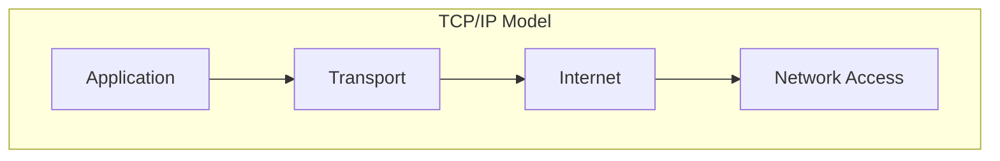
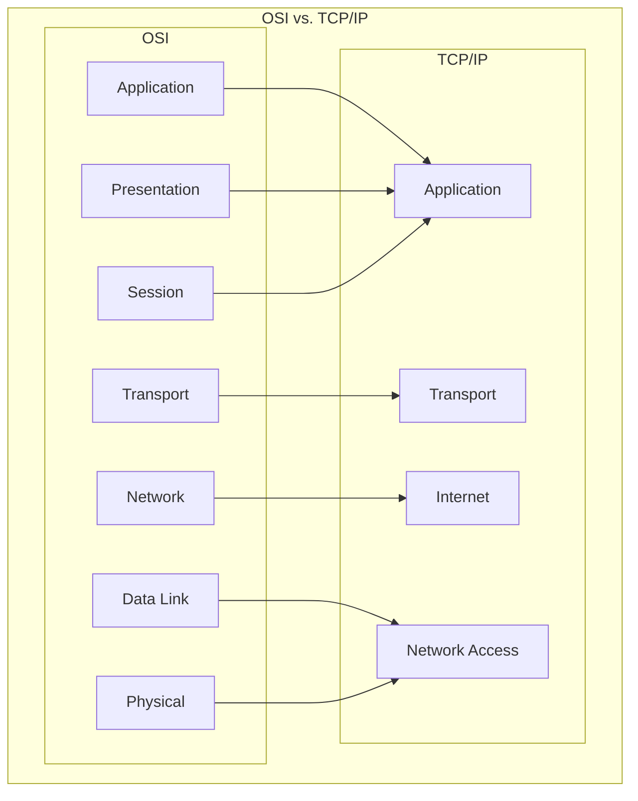

# The TCP/IP Model

The **TCP/IP model** is a four-layer conceptual framework that provides a basis for modern network communication. Unlike the seven-layer OSI model, which is more of a theoretical standard, the TCP/IP model is a practical model that describes the protocols that form the basis of the internet.

## The 4 Layers of the TCP/IP Model

The model is divided into four layers, each with a specific set of responsibilities.

### 1. Network Access Layer

The **Network Access Layer** (or Link Layer) is the lowest layer of the TCP/IP model. It corresponds to the Physical and Data Link layers of the OSI model. This layer is responsible for the physical transmission of data and defines how data is physically sent through the network.

- **Key Responsibilities**:
    - **Hardware Addressing**: Uses MAC addresses to identify devices on a local network.
    - **Physical Transmission**: Transmits bits over a physical medium (e.g., Ethernet, Wi-Fi).
    - **Framing**: Organizes bits into frames.
- **Protocols**: Ethernet, Wi-Fi, ARP.

### 2. Internet Layer

The **Internet Layer** maps to the Network Layer of the OSI model. It is responsible for logical addressing, routing, and packet forwarding.

- **Key Responsibilities**:
    - **Logical Addressing**: Uses IP addresses to identify hosts on the network.
    - **Routing**: Determines the best path for data to travel across the network.
    - **Packetizing**: Encapsulates data into IP packets.
- **Protocols**: IP (Internet Protocol), ICMP (Internet Control Message Protocol).

### 3. Transport Layer

The **Transport Layer** corresponds to the Transport Layer of the OSI model. It provides end-to-end communication services for applications.

- **Key Responsibilities**:
    - **Connection Management**: Provides connection-oriented (TCP) and connectionless (UDP) services.
    - **Reliability**: Ensures data is delivered accurately and in order (TCP).
    - **Flow Control**: Manages the rate of data transmission.
- **Protocols**: TCP (Transmission Control Protocol), UDP (User Datagram Protocol).

### 4. Application Layer

The **Application Layer** is the top layer of the TCP/IP model. It combines the responsibilities of the Application, Presentation, and Session layers of the OSI model. This layer provides protocols that allow applications to communicate over the network.

- **Key Responsibilities**:
    - **User-facing services**: Provides protocols for services like web browsing, email, and file transfer.
    - **Data Representation**: Handles data formatting, encoding, and encryption.
    - **Session Management**: Manages communication sessions between applications.
- **Protocols**: HTTP, HTTPS, FTP, SMTP, DNS.

## Comparison with the OSI Model

The TCP/IP and OSI models have some key differences:

| Feature | TCP/IP Model | OSI Model |
|---|---|---|
| **Layers** | 4 layers | 7 layers |
| **Implementation** | Practical model, used for the internet | Theoretical model, used for teaching |
| **Protocol Dependency** | More protocol-specific | Protocol-independent |
| **Development** | Developed alongside its protocols | Developed before its protocols |

