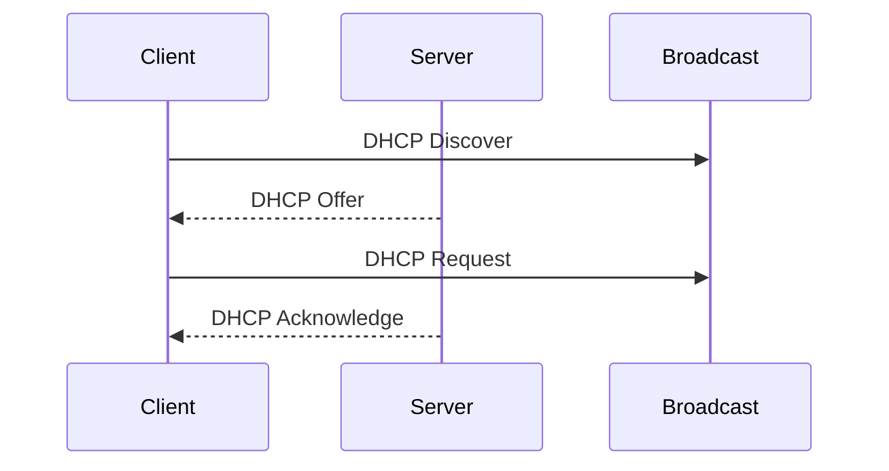

# DHCP (Dynamic Host Configuration Protocol)

**DHCP (Dynamic Host Configuration Protocol)** is a network management protocol used on IP networks for automatically assigning IP addresses and other communication parameters to devices connected to the network. Without DHCP, network administrators would have to manually configure every device that joins the network.

## The DORA Process

When a device connects to a network, it goes through a four-step process to obtain an IP address from a DHCP server. This is known as the DORA process: **Discover, Offer, Request, and Acknowledge**.

1.  **Discover**: The client device sends a broadcast message to the network to find a DHCP server.
2.  **Offer**: Any DHCP server on the network that receives the discover message can respond with a DHCP offer message, which includes an available IP address and other configuration information.
3.  **Request**: The client receives one or more offer messages and chooses one. It then sends a broadcast request message to the network, requesting the offered IP address.
4.  **Acknowledge**: The DHCP server that made the offer responds with an acknowledge message, confirming the IP address lease.

## IP Lease and Renewal Process

An IP address assigned by a DHCP server is only leased for a specific period of time. This lease time is configured by the network administrator.

- **T1 (Renewal Time)**: When 50% of the lease time has expired, the client will attempt to renew its lease with the original DHCP server.
- **T2 (Rebinding Time)**: If the client is unable to renew its lease with the original server, it will wait until 87.5% of the lease time has expired. At this point, it will enter a rebinding state and try to contact any available DHCP server to obtain a new lease.
- **Lease Expiration**: If the lease expires and the client has not been able to renew it, the client must stop using the IP address and begin the DORA process again.

## Static vs. Dynamic IP Assignment

- **Dynamic IP Assignment**: This is the most common method, where the DHCP server automatically assigns an available IP address from a pool of addresses. This is efficient for networks where devices are frequently joining and leaving.
- **Static IP Assignment (or DHCP Reservation)**: In this method, the DHCP server is configured to always assign the same IP address to a specific device. This is done by mapping the device's MAC address to a specific IP address. This is useful for devices like servers and printers that need to have a consistent IP address.
