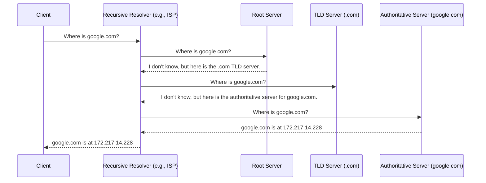

# DNS (Domain Name System)

The **Domain Name System (DNS)** is the phonebook of the internet. Humans access information online through domain names, like `google.com` or `amazon.com`. Web browsers, however, interact through Internet Protocol (IP) addresses. DNS translates domain names to IP addresses so browsers can load internet resources.

## The DNS Resolution Process

When you type a domain name into your browser, a series of steps are taken to resolve that domain name to an IP address.

1.  **User to Recursive Resolver**: The user's computer sends a query to a recursive DNS resolver (usually provided by the ISP).
2.  **Recursive Resolver to Root Server**: The recursive resolver queries a DNS root server.
3.  **Root Server to TLD Server**: The root server responds with the address of a Top-Level Domain (TLD) DNS server (e.g., `.com`, `.org`).
4.  **Recursive Resolver to TLD Server**: The recursive resolver then queries the TLD server.
5.  **TLD Server to Authoritative Server**: The TLD server responds with the IP address of the domain’s authoritative DNS server.
6.  **Recursive Resolver to Authoritative Server**: The recursive resolver queries the authoritative DNS server.
7.  **Authoritative Server to Recursive Resolver**: The authoritative DNS server responds with the IP address of the domain.
8.  **Recursive Resolver to User**: The recursive resolver returns the IP address to the user's computer.

## Recursive vs. Iterative DNS Queries

- **Recursive Query**: In a recursive query, the DNS client requires that the DNS server respond with either the requested resource record or an error message if the record is not found. The server cannot just return a pointer to another server.
- **Iterative Query**: In an iterative query, the DNS server is not required to provide a complete answer. If the DNS server does not have the answer, it can return a pointer to another DNS server that may have the answer.

In the example above, the query from the client to the recursive resolver is **recursive**, while the queries from the recursive resolver to the other servers are **iterative**.

## Common DNS Record Types

DNS servers create a DNS record to provide important information about a domain or hostname.

- **A Record**: The most common type of DNS record, it maps a domain name to an IPv4 address.
- **AAAA Record**: Maps a domain name to an IPv6 address.
- **CNAME Record**: (Canonical Name) Forwards one domain or subdomain to another domain, does NOT provide an IP address.
- **MX Record**: (Mail Exchanger) Directs mail to an email server.
- **TXT Record**: Lets an admin store text notes in the record. Often used for email security (SPF, DKIM, DMARC).
- **NS Record**: (Name Server) Indicates which DNS server is authoritative for that domain.
- **SOA Record**: (Start of Authority) Contains important information about the domain, such as the email address of the administrator, when the domain was last updated, and how long the server should wait between refreshes.
