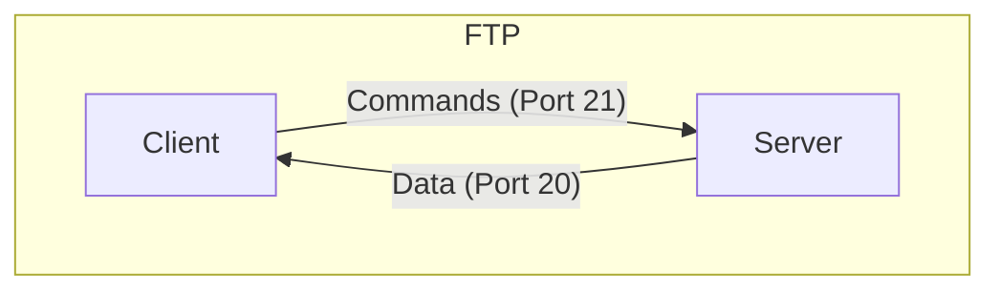
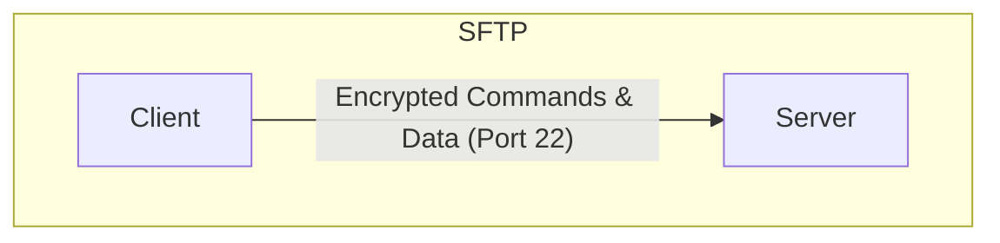

# FTP & SFTP (File Transfer Protocols)

**FTP (File Transfer Protocol)** and **SFTP (SSH File Transfer Protocol)** are both used to transfer files between a client and a server. However, they are fundamentally different protocols with different levels of security.

## FTP (File Transfer Protocol)

FTP is a client-server protocol that has been in use since the 1970s. It operates on two separate channels:

- **Command Channel (Port 21)**: Used for sending commands and receiving responses.
- **Data Channel (Port 20 in active mode)**: Used for transferring the actual files.

FTP is inherently insecure as it transmits data, including usernames and passwords, in plain text.

## SFTP (SSH File Transfer Protocol)

SFTP is not FTP run over SSH. It is a completely different protocol that was designed from the ground up to be secure. SFTP runs over the SSH protocol and uses a single, secure channel for all communication.

- **Single Channel (Port 22)**: All data, including authentication information and the files being transferred, is encrypted and sent over a single channel.

## Key Differences

| Feature | FTP | SFTP |
|---|---|---|
| **Security** | Insecure (plain text) | Secure (encrypted) |
| **Protocol** | FTP | SSH |
| **Ports** | 21 (command), 20 (data) | 22 (single channel) |
| **Channels** | Two separate channels | Single channel |

Due to its lack of security, FTP should be avoided in favor of more secure protocols like SFTP or FTPS (FTP over SSL/TLS).
