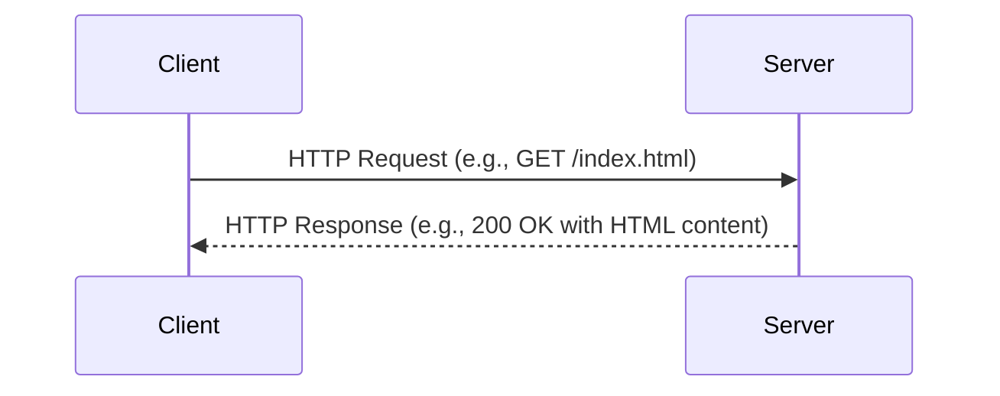

# HTTP & HTTPS

**HTTP (Hypertext Transfer Protocol)** is the foundation of data communication for the World Wide Web. It is an application-layer protocol for transmitting hypermedia documents, such as HTML. **HTTPS (HTTP Secure)** is the secure version of HTTP, where the communication is encrypted using SSL/TLS.

## HTTP Request/Response Cycle

Communication between a client (e.g., a web browser) and a server is done through a series of request-response messages.

## HTTP Methods

HTTP defines a set of request methods to indicate the desired action to be performed for a given resource.

- **GET**: Requests a representation of the specified resource. Requests using GET should only retrieve data.
- **POST**: Submits an entity to the specified resource, often causing a change in state or side effects on the server.
- **PUT**: Replaces all current representations of the target resource with the request payload.
- **DELETE**: Deletes the specified resource.
- **PATCH**: Applies partial modifications to a resource.
- **HEAD**: Asks for a response identical to that of a GET request, but without the response body.
- **OPTIONS**: Describes the communication options for the target resource.

## HTTP Status Codes

HTTP status codes are issued by a server in response to a client's request made to the server. They are grouped into five classes:

- **1xx (Informational)**: The request was received, continuing process.
- **2xx (Successful)**: The request was successfully received, understood, and accepted.
    - `200 OK`: The request has succeeded.
    - `201 Created`: The request has been fulfilled and has resulted in one or more new resources being created.
    - `204 No Content`: The server has successfully fulfilled the request and that there is no additional content to send in the response payload body.
- **3xx (Redirection)**: Further action needs to be taken in order to complete the request.
    - `301 Moved Permanently`: The target resource has been assigned a new permanent URI.
    - `302 Found`: The target resource resides temporarily under a different URI.
- **4xx (Client Error)**: The request contains bad syntax or cannot be fulfilled.
    - `400 Bad Request`: The server cannot or will not process the request due to something that is perceived to be a client error.
    - `401 Unauthorized`: The client must authenticate itself to get the requested response.
    - `403 Forbidden`: The client does not have access rights to the content.
    - `404 Not Found`: The server can not find the requested resource.
- **5xx (Server Error)**: The server failed to fulfill an apparently valid request.
    - `500 Internal Server Error`: The server has encountered a situation it doesn't know how to handle.
    - `503 Service Unavailable`: The server is not ready to handle the request.

## SSL/TLS Encryption

HTTPS uses an encryption protocol to encrypt communications. The protocol is called **Transport Layer Security (TLS)**, although it was formerly known as **Secure Sockets Layer (SSL)**. The protocol secures communications by using what’s known as an asymmetric public key infrastructure. This type of security system uses two different keys to encrypt communications between two parties:

1.  **Private Key**: This key is controlled by the owner of a website and it’s kept private.
2.  **Public Key**: This key is available to everyone who wants to interact with the server in a way that’s secure.

When a user connects to a website via HTTPS, the server sends its public key to the client. The client and server then go through a process called a **TLS handshake**, which involves the client generating a session key that is encrypted with the server's public key. This session key is then used for all communication during the session.
