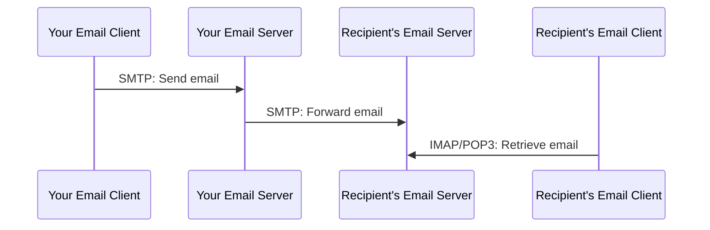

# SMTP, IMAP & POP3 (Email Protocols)

Sending and receiving emails involves a set of protocols that work together. **SMTP (Simple Mail Transfer Protocol)** is used for sending emails, while **IMAP (Internet Message Access Protocol)** and **POP3 (Post Office Protocol v3)** are used for receiving emails.

## SMTP (Simple Mail Transfer Protocol)

SMTP is the standard protocol for sending emails. When you send an email, your email client communicates with your email server using SMTP. The email server then uses SMTP to send the email to the recipient's email server.

- **Port**: 25 (insecure), 587 (secure with STARTTLS), 465 (secure with SSL/TLS)

## IMAP (Internet Message Access Protocol)

IMAP is a protocol for retrieving emails from a mail server. With IMAP, emails are stored on the server, and you can access them from multiple devices. Any changes you make (e.g., reading an email, deleting an email) are synchronized across all devices.

- **Port**: 143 (insecure), 993 (secure with SSL/TLS)

## POP3 (Post Office Protocol v3)

POP3 is another protocol for retrieving emails. Unlike IMAP, POP3 downloads emails from the server to a single device and then deletes them from the server. This means that you can only access your emails from that one device.

- **Port**: 110 (insecure), 995 (secure with SSL/TLS)

## Email Protocol Flow

## Key Differences

| Feature | SMTP | IMAP | POP3 |
|---|---|---|---|
| **Purpose** | Sending emails | Receiving emails | Receiving emails |
| **Storage** | N/A | Emails stored on server | Emails downloaded to client |
| **Multi-device access** | N/A | Yes | No |
| **Synchronization** | N/A | Yes | No |
