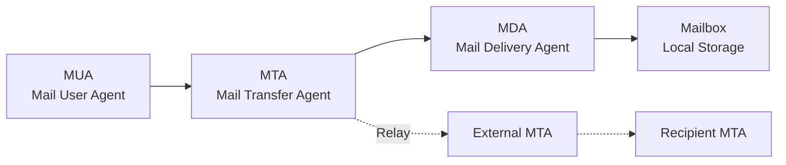

# Simple Mail Transfer Protocol (SMTP)

SMTP (Simple Mail Transfer Protocol) is the standard protocol for electronic mail transmission across the Internet. Operating at the Application layer, SMTP defines how email messages are transmitted between mail servers and acts as the backbone of the global email delivery system.

## Overview

SMTP was first defined in RFC 821 (1982) and updated in RFC 5321, establishing the foundation for email communication. The protocol handles the delivery of email messages from a mail client to a mail server, and between mail servers for final delivery to recipients.

## SMTP Architecture

### Email Delivery Flow



**Components:**
- **MUA (Mail User Agent):** Email client (Outlook, Thunderbird, mail apps)
- **MTA (Mail Transfer Agent):** Server sending/receiving mail (Postfix, Sendmail, Exchange)
- **MDA (Mail Delivery Agent):** Local delivery to user mailbox (Dovecot, Cyrus IMAP)
- **Mail Relay:** Intermediate servers forwarding messages

## SMTP Protocol Fundamentals

### Connection Establishment

SMTP operates over TCP port 25 (standard), 587 (submission), or 465 (SMTPS):

```text
Client: 220 server.example.com ESMTP Postfix
Server: HELO client.example.com
Client: 250 server.example.com
Server: MAIL FROM:<sender@example.com>
Client: 250 2.1.0 Ok
Server: RCPT TO:<recipient@domain.com>
Client: 250 2.1.5 Ok
Server: DATA
Client: 354 End data with <CR><LF>.<CR><LF>
Server: Subject: Test Message
Server: From: sender@example.com
Server: To: recipient@domain.com
Server:
Server: This is a test message.
Server: .
Client: 250 2.0.0 Ok: queued as 12345678
Server: QUIT
Client: 221 2.0.0 Bye
```

### SMTP Commands

| Command     | Description         | Example                       |
| ----------- | ------------------- | ----------------------------- |
| `HELO/EHLO` | Initiate connection | `EHLO client.example.com`     |
| `MAIL FROM` | Specify sender      | `MAIL FROM:<user@domain.com>` |
| `RCPT TO`   | Specify recipient   | `RCPT TO:<user@domain.com>`   |
| `DATA`      | Message content     | `DATA`                        |
| `QUIT`      | End connection      | `QUIT`                        |
| `RSET`      | Reset session       | `RSET`                        |
| `VRFY`      | Verify user         | `VRFY user@domain.com`        |
| `EXPN`      | Expand mailing list | `EXPN list@domain.com`        |

## Extended SMTP (ESMTP)

Modern SMTP implementation with enhanced capabilities:

```text
Server: 220 server.example.com ESMTP Postfix
Client: EHLO client.example.com
Server: 250-server.example.com
       250-PIPELINING
       250-SIZE 10240000
       250-VRFY
       250-ETRN
       250-STARTTLS
       250-AUTH PLAIN LOGIN DIGEST-MD5 CRAM-MD5
       250-ENHANCEDSTATUSCODES
       250-8BITMIME
       250 DSN
```

### ESMTP Extensions

- **STARTTLS:** Upgrade to secure connection
- **AUTH:** Authentication mechanisms
- **SIZE:** Maximum message size
- **PIPELINING:** Send multiple commands without waiting
- **8BITMIME:** Support 8-bit character sets
- **DSN:** Delivery Status Notifications

## SMTP Authentication

### AUTH Command

Client authentication before sending messages:

```text
Server: 250-AUTH PLAIN LOGIN DIGEST-MD5 CRAM-MD5
Client: AUTH LOGIN
Server: 334 VXNlciBOYW1l
Client: dXNlcg== (base64 encoded username)
Server: 334 UGFzc3dvcmQ=
Client: cGFzcw== (base64 encoded password)
Server: 235 2.7.0 Authentication successful
```

### Authentication Methods

1. **PLAIN:** Username and password in base64
2. **LOGIN:** Two-step username/password exchange
3. **CRAM-MD5:** Challenge-response authentication
4. **DIGEST-MD5:** Enhanced challenge-response
5. **NTLM:** Windows domain authentication
6. **GSSAPI:** Kerberos authentication

## Message Format

### RFC 5322 Email Structure

```
Return-Path: <sender@example.com>
Received: by server.example.com (Postfix) with ESMTP
        for <recipient@example.com>; Mon, 01 Jan 2024 12:00:00 +0000
From: Sender Name <sender@example.com>
To: Recipient Name <recipient@domain.com>
Subject: Email Subject Line
Date: Mon, 01 Jan 2024 12:00:00 +0000
Message-ID: <unique-id@server.example.com>
Content-Type: text/plain; charset=UTF-8

Message body text goes here.

This is a multi-line message.
```

### MIME Multipart Messages

Email with attachments and HTML content:

```
Content-Type: multipart/mixed; boundary="boundary123"

--boundary123
Content-Type: text/html; charset=UTF-8

<html><body><h1>HTML Email</h1></body></html>

--boundary123
Content-Type: application/pdf; name="document.pdf"
Content-Disposition: attachment; filename="document.pdf"
Content-Transfer-Encoding: base64

[Base64 encoded PDF content]

--boundary123--
```

## SMTP Security Vulnerabilities

### Open Relay Attack

Misconfigured SMTP servers forwarding spam:

**Prevention:** Disable relaying for external domains

```bash
# Postfix main.cf
smtpd_relay_restrictions = permit_mynetworks, reject_unauth_destination
```

### Email Spoofing

Forged sender addresses:

**Prevention:**
- SPF (Sender Policy Framework)
- DKIM (DomainKeys Identified Mail)
- DMARC (Domain-based Message Authentication)

### Man-in-the-Middle Attacks

Intercepting email content:

**Prevention:**
- STARTTLS for encryption
- Certificate validation
- Mutual TLS authentication

## Mail Server Configuration

### Postfix SMTP Server

```bash
# /etc/postfix/main.cf
myhostname = mail.example.com
mydomain = example.com
myorigin = $mydomain

inet_interfaces = all
inet_protocols = ipv4

# TLS Configuration
smtpd_tls_cert_file = /etc/ssl/certs/mail.crt
smtpd_tls_key_file = /etc/ssl/private/mail.key
smtpd_use_tls = yes
smtpd_tls_auth_only = yes

# Authentication
smtpd_sasl_auth_enable = yes
smtpd_sasl_type = dovecot
smtpd_sasl_path = private/auth

# Restrictions
smtpd_recipient_restrictions = permit_sasl_authenticated, permit_mynetworks, reject_unauth_destination
```

### Sendmail Configuration

```bash
# sendmail.mc
define(`SMART_HOST', `smtp.gmail.com')dnl
define(`confAUTH_MECHANISMS', `EXTERNAL GSSAPI DIGEST-MD5 CRAM-MD5 LOGIN PLAIN')dnl
define(`RELAY_MAILER_ARGS', `TCP $h 587')dnl
define(`ESMTP_MAILER_ARGS', `TCP $h 587')dnl
include(`/etc/mail/trustauth.mc')dnl
```

### Exim SMTP Server

```bash
# exim.conf
primary_hostname = mail.example.com

tls_certificate
