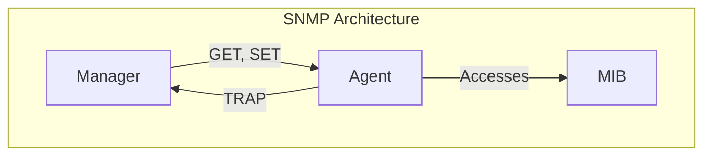

# SNMP (Simple Network Management Protocol)

**SNMP (Simple Network Management Protocol)** is an application-layer protocol used for managing and monitoring network devices on an IP network. It allows network administrators to manage network performance, find and solve network problems, and plan for network growth.

## SNMP Components

SNMP has three main components:

- **SNMP Manager**: A centralized system that monitors and controls a network of managed devices. It is typically a computer running network management software.
- **SNMP Agent**: A software module that runs on a managed device (e.g., a router, switch, or server) and collects and stores management information.
- **Management Information Base (MIB)**: A hierarchical database of information that is specific to a managed device. The MIB defines the properties of the managed object within the device.

## Basic SNMP Commands

SNMP communication is done through a set of basic commands:

- **GET**: A request sent by the manager to the agent to retrieve one or more values from the MIB.
- **SET**: A request sent by the manager to the agent to modify a value in the MIB.
- **TRAP**: An unsolicited message sent by the agent to the manager to report a significant event, such as an error or a change in state.

There are different versions of SNMP, with SNMPv3 being the most secure as it provides authentication and encryption.
