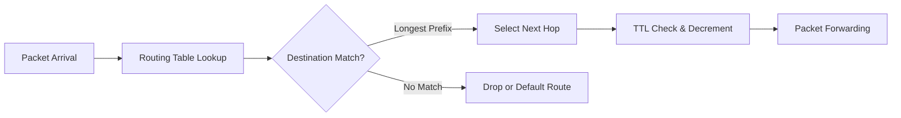

## Overview

Routing and switching form the core of network infrastructure, determining how data packets are forwarded from source to destination across networks. Routing decides the path through interconnected networks, while switching handles data forwarding within local network segments. Together, they enable scalable, efficient, and reliable communication in enterprise, service provider, and cloud environments.

This section covers fundamental routing principles, dynamic routing protocols, network address translation, virtual LAN technologies, and advanced switching concepts that form the backbone of modern networking.

## Routing Fundamentals

### Routing Concepts

**Routing** is the process of selecting a path for traffic in a network or between networks. Routes can be determined by:

- **Static Routing**: Manually configured paths that don't change automatically
- **Dynamic Routing**: Protocols that automatically learn and adapt to network topology changes
- **Policy-Based Routing**: Routing decisions based on criteria beyond destination address

### Packet Forwarding Process

When a packet arrives at a router:

1. **Ingress Interface**: Packet enters through a network interface
2. **Packet Header Analysis**: Router examines destination address and routing table
3. **Next Hop Selection**: Router determines best interface/path for forwarding
4. **Packet Modification**: TTL decrement, checksum recalculation if needed
5. **Egress Interface**: Packet exits through selected interface toward destination



## Switching Architecture

### Layer 2 Switching

Switches operate at the data link layer, using MAC addresses for forwarding decisions:

- **Address Learning**: Dynamically learns MAC addresses and associated ports
- **Forwarding Table**: CAM (Content Addressable Memory) stores MAC-to-port mappings
- **Flooding**: When destination MAC is unknown, packets are flooded to all ports
- **Filtering**: Unnecessary traffic is filtered, rogue packets are dropped

#### Switching Methods

- **Store-and-Forward**: Entire frame received before forwarding, enables error checking
- **Cut-Through**: Forwards frame as soon as destination address is received, lower latency
- **Fragment-Free**: Compromise approach checking for collisions before forwarding

### VLAN Technologies

Virtual Local Area Networks allow network administrators to logically segment broadcast domains:

#### VLAN Advantages

- **Broadcast Control**: Limits broadcast traffic to VLAN members
- **Security Isolation**: Traffic separation between different security zones
- **Administrative Flexibility**: Logical grouping independent of physical location
- **Resource Optimization**: Better bandwidth utilization and network management

#### VLAN Types

- **Port-Based VLANs**: Ports assigned to specific VLANs
- **Tagged VLANs (802.1Q)**: Frames tagged with VLAN identifier
- **Voice VLANs**: Dedicated VLANs for IP telephony traffic
- **Native VLANs**: Untagged traffic processing in trunk ports

### Spanning Tree Protocol (STP)

STP prevents switching loops in redundant Layer 2 topologies:

- **Loop Detection**: Identifies and blocks redundant paths
- **Root Bridge Election**: Selects root switch based on bridge priority/MAC
- **Path Cost Calculation**: Determines best paths to root bridge
- **Port States**: Blocking, Listening, Learning, Forwarding states for topology stability

```bash
# Cisco STP configuration
spanning-tree mode rapid-pvst
spanning-tree vlan 10 priority 4096  # Root bridge for VLAN 10
```

## Network Address Translation (NAT)

NAT enables private network addressing while interfacing with public networks:

### NAT Types

#### Static NAT

One-to-one mapping between private and public addresses:

- **Port Forwarding**: Directs specific ports to internal hosts
- **VPN Passthrough**: Maintains VPN connections through NAT
- **Load Balancing**: Distributes traffic across multiple internal servers

#### Dynamic NAT

Pool-based address translation for outbound connections:

- **PAT (Port Address Translation)**: Multiple internal hosts share single public IP
- **Address Pool Management**: Automatic assignment from configured pools
- **NAT Table**: Tracks active translations with timeout management

```bash
# Example NAT configuration (Cisco IOS)
ip nat inside source list 1 interface GigabitEthernet0/0 overload
access-list 1 permit 192.168.1.0 0.0.0.255
```

### NAT Challenges

- **Application Compatibility**: NAT traversal issues with VoIP and gaming
- **Security Implications**: Hides internal topology but can complicate debugging
- **Performance Overhead**: Translation table lookups add processing overhead
- **Logging Limitations**: NAT complicates IP-based tracking and forensics

## Routing Protocols

### Interior Gateway Protocols (IGP)

Used within autonomous systems:

#### OSPF (Open Shortest Path First)

Link-state routing protocol with fast convergence:

- **Link-State Database**: Complete network topology knowledge
- **Dijkstra's Algorithm**: SPF calculation for shortest paths
- **Area Hierarchy**: Scalable design with backbone and non-backbone areas
- **Authentication**: MD5 or SHA authentication for route security

```bash
# OSPF router configuration
router ospf 1
  network 192.168.1.0 0.0.0.255 area 0
  area 0 authentication message-digest
```

#### RIP (Routing Information Protocol)

Distance-vector protocol for small networks:

- **Hop Count Metric**: Maximum 15 hops (16 considered infinity)
- **Update Timers**: 30-second updates, 180-second timeout
- **Split Horizon**: Prevents routing loops by not advertising routes back to source
- **Poison Reverse**: Advertises unreachable routes with infinite metric

### Exterior Gateway Protocol (EGP)

#### BGP (Border Gateway Protocol)

Path-vector protocol for inter-domain routing:

- **AS Path Attribute**: Tracks autonomous systems path
- **Policy-Based Routing**: Extensive filtering and manipulation capabilities
- **Route Reflectors**: Scale iBGP by reducing mesh requirements
- **Communities**: Tagging routes for policy application

```bash
# BGP router configuration
router bgp 65001
  neighbor 192.168.1.1 remote-as 65002
  neighbor 192.168.1.1 route-map OUTBOUND out
  address-family ipv4 unicast
    redistribute connected
```

## Multiprotocol Label Switching (MPLS)

Advanced forwarding technology combining Layer 2 and Layer 3 capabilities:

### MPLS Architecture

- **Label Edge Routers (LERs)**: Attach/Remove MPLS labels at network edges
- **Label Switch Routers (LSRs)**: Forward packets based on labels
- **Forwarding Equivalence Class (FEC)**: Group of packets sharing same forwarding treatment

### Label Operations

1. **Label Push**: Adds label at ingress LER
2. **Label Swap**: Changes label at each LSR hop
3. **Label Pop**: Removes label at egress LER

### MPLS Applications

#### Traffic Engineering

- **Explicit Routing**: Pre-defined paths for traffic optimization
- **Load Balancing**: Distributing traffic across multiple paths
- **Fast Reroute**: Sub-50ms protection switching for link failures

#### VPN Services

- **Layer 3 VPNs**: MPLS-based VPN connectivity between sites
- **Layer 2 VPNs**: Point-to-point and multipoint Ethernet services
- **QoS Support**: Differential treatment based on CoS markings

## Network Management and Monitoring

### Routing Information Bases

- **RIB (Routing Information Base)**: Complete routing table maintained by router
- **FIB (Forwarding Information Base)**: Hardware-forwarding table for fast lookups
- **Adjacency Table**: Information about neighboring devices for link-state protocols

### Monitoring and Troubleshooting

#### Routing Protocol Monitoring

```bash
# OSPF neighbor monitoring
show ip ospf neighbor

# BGP peer status
show ip bgp summary

# Routing table inspection
show ip route
```

#### Packet Capture and Analysis

- **Traceroute**: Discovering path and latency between source and destination
- **MTR (My TraceRoute)**: Continuous path monitoring with statistics
- **NetFlow**: Detailed traffic flow information for capacity planning

## Future Developments

### Software-Defined Networking (SDN)

Centralized control plane separation from data plane:

- **OpenFlow Protocol**: Standardized communication between controller and switches
- **Centralized Policies**: Network-wide policy enforcement from single controller
- **Dynamic Provisioning**: Automated network configuration changes

### Segment Routing

Source-based routing using modern network protocols:

- **SR-MPLS**: MPLS-based segment routing implementation
- **SRv6**: IPv6 data plane extensions for segment routing
- **Traffic Engineering**: Explicit path control without RSVP-TE complexity

Routing and switching technologies continue to evolve, incorporating software-defined principles, automation, and intelligence to meet growing network demands for speed, reliability, and security.
