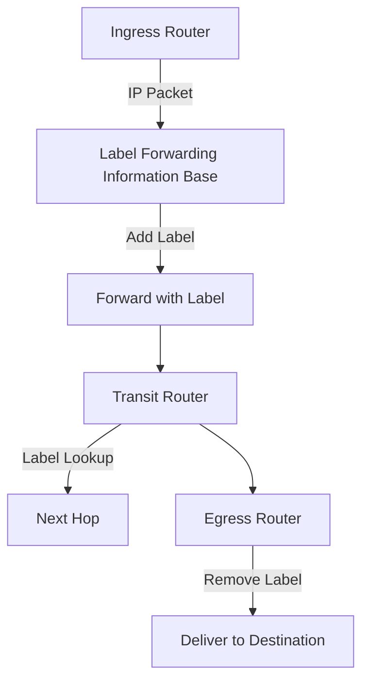
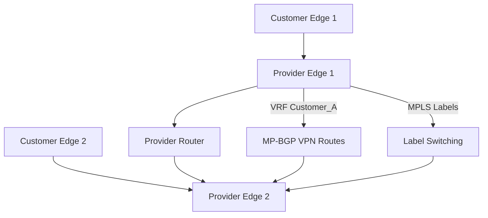
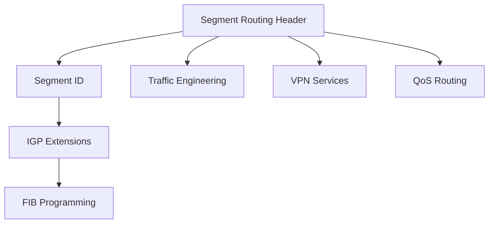

# MPLS (Multiprotocol Label Switching)

MPLS is a routing technique that directs data from one node to the next based on short path labels rather than long network addresses. It provides efficient packet forwarding, traffic engineering capabilities, and enables various applications like VPNs, TE tunnels, and QoS routing.

## MPLS Fundamentals

### How MPLS Works

Instead of routing lookups at each hop, MPLS uses label switching:



### MPLS Packet Structure

**Label format (32 bits):**
```
  0                   1                   2                   3
  0 1 2 3 4 5 6 7 8 9 0 1 2 3 4 5 6 7 8 9 0 1 2 3 4 5 6 7 8 9 0 1
 +-+-+-+-+-+-+-+-+-+-+-+-+-+-+-+-+-+-+-+-+-+-+-+-+-+-+-+-+-+-+-+-+
 |                Label                 | Exp |S|       TTL     |
 +-+-+-+-+-+-+-+-+-+-+-+-+-+-+-+-+-+-+-+-+-+-+-+-+-+-+-+-+-+-+-+-+
```

**Fields:**
- **Label (20 bits):** Forwarding identifier
- **Exp (3 bits):** Experimental/Class of Service
- **S (1 bit):** Bottom of Stack flag
- **TTL (8 bits):** Time to Live

### Label Distribution Protocols

**LDP (Label Distribution Protocol):**
```bash
# Standard MPLS label distribution
Router(config)# mpls ip
Router(config)# mpls label protocol ldp
Router(config)# interface GigabitEthernet0/0
Router(config-if)# mpls ip
```

**RSVP-TE (Resource Reservation Protocol - Traffic Engineering):**
```bash
# For traffic engineering tunnels
Router(config)# ip rsvp bandwidth
Router(config)# interface GigabitEthernet0/0
Router(config-if)# ip rsvp bandwidth 10000
```

## MPLS Applications

### Layer 3 VPNs

**MPLS L3VPN Architecture:**


**VRF Configuration:**
```bash
# Provider Edge router
Router(config)# ip vrf Customer_A
Router(config-vrf)# rd 65000:100
Router(config-vrf)# route-target export 65000:100
Router(config-vrf)# route-target import 65000:100

Router(config)# interface GigabitEthernet0/1
Router(config-if)# ip vrf forwarding Customer_A
Router(config-if)# ip address 192.168.1.1 255.255.255.0
```

### Traffic Engineering Tunnels

**MPLS-TE Benefits:**
- Explicit path control
- Bandwidth reservation
- Fast rerouting (FRR)
- Load balancing

**TE Tunnel Configuration:**
```bash
# Configure traffic engineering
Router(config)# mpls traffic-eng tunnels

# Define tunnel interface
Router(config)# interface Tunnel100
Router(config-if)# ip unnumbered Loopback0
Router(config-if)# tunnel destination 192.168.1.2
Router(config-if)# tunnel mode mpls traffic-eng
Router(config-if)# tunnel mpls traffic-eng path-option 10 explicit path1
```

**Explicit Path Definition:**
```bash
Router(config)# ip explicit-path name path1 enable
Router(config-ip-expl-path)# next-address 10.1.1.2
Router(config-ip-expl-path)# next-address 10.1.2.2
Router(config-ip-expl-path)# next-address 192.168.1.2
```

### MPLS VPN Types

| **        | VPN Type                        | Characteristics        | Use Case |
| --------- | ------------------------------- | ---------------------- |
| **L3VPN** | IP routing isolation using VRFs | Full mesh connectivity |
| **L2VPN** | Ethernet layer isolation        | Extension of LANs      |
| **VPLS**  | Multipoint Ethernet bridging    | LAN-like connectivity  |
| **VPWS**  | Point-to-point Ethernet         | WAN emulation          |

## MPLS QoS

### QoS with Exp Bits

**Label Stack QoS:**
```yaml
# Top label: Forwarding
# Bottom label: QoS marking
Label Stack:
- Label 100 (Forwarding)
- Label 200 (QoS) - Exp bits set for priority
```

**DiffServ Integration:**
```bash
# MPLS Exp bits mapping
Router(config)# mpls qos map exp 0 to dscp 0
Router(config)# mpls qos map exp 1 to dscp 8
Router(config)# mpls qos map exp 2 to dscp 16
Router(config)# mpls qos map exp 3 to dscp 24
```

**Traffic Policing and Shaping:**
```bash
# Per-VRF traffic policing
Router(config)# policy-map MPLS_QOS
Router(config-pmap)# class VOICE
Router(config-pmap-c)# police cir 2000000 bc 62500
Router(config-pmap-c)# set mpls experimental imposition 5
```

## MPLS Troubleshooting

### Label Switching Path Verification

**Check LSP status:**
```bash
# Ping with MPLS labels
ping mpls ipv4 192.168.1.2/32 verbose
```

**Traceroute with MPLS:**
```bash
trace mpls ipv4 192.168.1.2/32 verbose
```

**LSP Output:**
```
Type escape sequence to abort.
Mapping IPv4 with prefix 192.168.1.2/32, to 192.168.1.2
  Codes: '!' - success, 'Q' - request not sent, '.' - timeout,
        'L' - labeled output interface, 'B' - unlabeled output interface,
        'D' - DS Map mismatch, 'F' - no FEC mapping, 'f' - FEC mismatch,
        'M' - malformed request, 'm' - unsupported tlvs, 'N' - no label entry,
        'P' - no rx intf label prot, 'p' - premature termination of LSP,
        'R' - transit router, 'I' - unknown upstream index,
        'l' - Label stack, 'd' - DS Map mismatch, 'X' - unknown return code,
        'x' - return code 0

Type escape sequence to abort.
  0 10.0.0.1 MRU 1500 [Labels: implicit-null Exp: 0] 32 ms
  1 192.168.1.2 40 ms
```

### Common MPLS Issues

**PHP (Penultimate Hop Popping):**
```bash
# Check if PHP is enabled
show mpls interfaces detail

# Disable PHP for debugging
Router(config-if)# no mpls ip propagate-ttl
```

**Label Space Exhaustion:**
```bash
# Check allocated labels
show mpls forwarding-table | include ^[0-9]

# Increase label space
Router(config)# mpls label range 1000 1999
```

**MTU Issues:**
```bash
# Check MPLS MTU
show mpls interfaces | include MTU

# Set MPLS MTU
Router(config-if)# mpls mtu 1512
```

## MPLS Security

### Label Tampering Protection

MPLS doesn't inherently provide security but can enhance overall network security:

```yaml
# Security benefits:
- Label switching hides IP addresses
- L3VPN provides isolation
- Traffic engineering prevents bottlenecks
- Fast rerouting provides resiliency
```

### MPLS Security Threats

**Label Spoofing Attacks:**
- Attackers inject malicious MPLS labels
- **Prevention:** Label validation, secure protocols

**VPN Attacks:**
- Route leaks between VPNs
- **Prevention:** Route target filtering, RTBH

**DoS Attacks:**
- Label flooding
- **Prevention:** Rate limiting on LDP/RSVP

## Segment Routing (SR)

### SR-MPLS Evolution

Modern evolution of MPLS with simplified operations:



**SR Advantages:**
- Source routing model
- Reduced signaling protocols
- Easier network management
- Integration with SDN

**Segment Types:**
```yaml
# Node SID: Identifies specific router
SID 16001 (Node A)

# Adjacency SID: Identifies specific link
SID 24001 (Link to next-hop)

# Binding SID: Represents complex path
SID 50000 (TE tunnel representation)
```

### SR Configuration

**ISIS Segment Routing:**
```bash
# Enable SR
Router(config)# router isis 1
Router(config-router)# segment-routing mpls

# Configure node SID
Router(config)# interface Loopback0
Router(config-if)# ipv6 router isis 1
Router(config-if)# segment-routing mpls
Router(config-if)# index 1
```

## MPLS in Modern Networks

### MPLS as Transport

MPLS often serves as the underlying transport technology:

```yaml
# Layers above MPLS:
L2: Ethernet services (EVPN, VPLS)
L3: IP/MPLS VPNs, 6PE/6VPE
Transport: MPLS-TP, MPLS OAM
```

### SDN and MPLS Integration

**SDN Controllers managing MPLS:**
- PCEP (Path Computation Element Protocol)
- BGP-LS (Link State Distribution)
- ONOS, OpenDaylight MPLS applications

**BGP SRTE:**
```bash
# Source-routed TE tunnels via BGP
Router(config)# router bgp 65000
Router(config-router)# segment-routing traffic-eng
Router(config-router)# neighbor x.x.x.x segment-routing sr-te
```

MPLS continues to be a cornerstone of service provider networks, enabling efficient traffic management, guaranteed service levels, and complex network topologies that scale to internet proportions.
