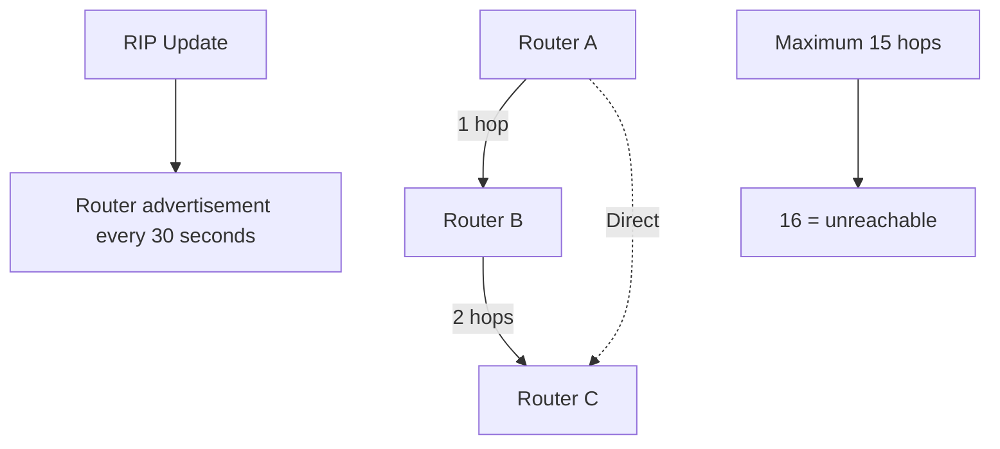
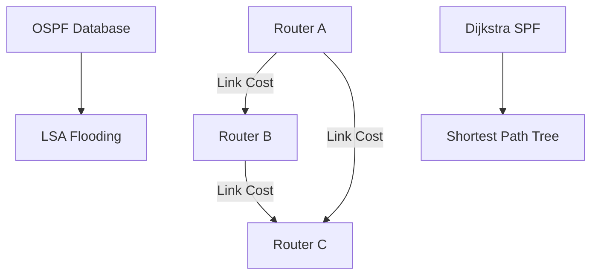
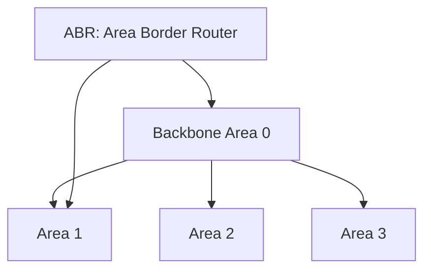
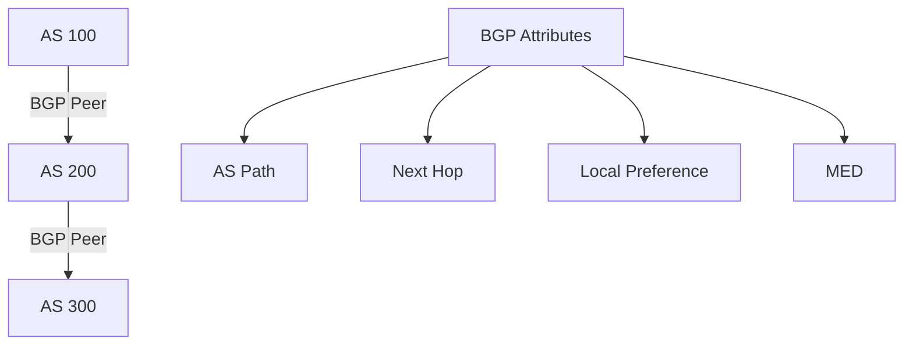

# Dynamic Routing Protocols

Dynamic routing protocols automatically discover network routes and adapt to topology changes. They exchange routing information between routers to maintain optimal path selection and network convergence.

## RIP (Routing Information Protocol)

Distance-vector protocol using hop count as the routing metric:



### RIP v2 Configuration

**Cisco IOS:**
```bash
Router(config)# router rip
Router(config-router)# version 2
Router(config-router)# network 192.168.1.0
Router(config-router)# network 192.168.2.0
Router(config-router)# no auto-summary
```

**Key Features:**
- **Algorithm:** Bellman-Ford
- **Metric:** Hop count (1-15)
- **Update Timer:** 30 seconds
- **Invalid Timer:** 180 seconds
- **Hold Down:** 180 seconds
- **Flush Timer:** 240 seconds

### RIP Limitations

- Slow convergence
- Count-to-infinity problem (solved by split horizon, poison reverse)
- Limited scalability (max 15 hops)
- Bandwidth intensive (periodic updates)

## OSPF (Open Shortest Path First)

Link-state protocol using Dijkstra's algorithm for shortest path calculation:



### OSPF Areas

Hierarchical design to improve scalability:



### OSPF Configuration

**Single Area:**
```bash
Router(config)# router ospf 1
Router(config-router)# network 192.168.1.0 0.0.0.255 area 0
Router(config-router)# network 10.0.0.0 0.0.0.3 area 0
```

**Multi-Area:**
```bash
# Backbone router
Router(config)# router ospf 1
Router(config-router)# network 192.168.1.0 0.0.0.255 area 0

# Area router
Router(config)# router ospf 1
Router(config-router)# network 192.168.2.0 0.0.0.255 area 1
```

### OSPF Features

- **Metric:** Cost (bandwidth-based by default)
- **Convergence:** Fast (link-state updates)
- **Scalability:** Area hierarchy
- **Authentication:** MD5 or clear text
- **DR/BDR:** Designated Router election on multi-access segments

## BGP (Border Gateway Protocol)

Path-vector protocol for inter-domain routing:



### eBGP vs iBGP

**eBGP (External BGP):**
- Between different Autonomous Systems
- Advertises routes between organizations

**iBGP (Internal BGP):**
- Within same Autonomous System
- Full mesh requirement for consistent routing

### BGP Configuration

**Basic eBGP:**
```bash
Router(config)# router bgp 65001
Router(config-router)# neighbor 192.168.1.2 remote-as 65002
Router(config-router)# network 10.1.1.0 mask 255.255.255.0
```

**BGP Attributes:**
```bash
# Local preference (higher = preferred)
Router(config)# router bgp 65001
Router(config-router)# bgp default local-preference 200

# AS path prepending (discourage selection)
Router(config-router)# neighbor 192.168.1.2 route-map PREPEND out
Router(config)# route-map PREPEND permit 10
Router(config-route-map)# set as-path prepend 65001 65001
```

### BGP Path Selection

BGP uses attributes to select best path:

1. Highest Weight (Cisco proprietary)
2. Highest Local Preference
3. Locally originated routes
4. Shortest AS Path
5. Lowest Origin type (IGP < EGP < Incomplete)
6. Lowest MED (Multi-Exit Discriminator)
7. eBGP over iBGP
8. Lowest IGP metric to next-hop
9. Oldest route (for stability)
10. Lowest Router ID

## Protocol Comparison

| Feature         | RIP             | OSPF           | BGP            |
| --------------- | --------------- | -------------- | -------------- |
| **Type**        | Distance Vector | Link State     | Path Vector    |
| **Algorithm**   | Bellman-Ford    | Dijkstra SPF   | Path Vector    |
| **Metric**      | Hop Count       | Cost           | Attributes     |
| **Convergence** | Slow            | Fast           | Variable       |
| **Scalability** | Small networks  | Large networks | Internet scale |
| **Use Case**    | Simple LAN      | Enterprise     | ISP/Global     |

## Route Redistribution

Injecting routes from one protocol into another:

```bash
# Redistribute OSPF into RIP
Router(config)# router rip
Router(config-router)# redistribute ospf 1 metric 2

# Redistribute static routes into OSPF
Router(config)# router ospf 1
Router(config-router)# redistribute static subnets

# Redistribute BGP into OSPF
Router(config)# router ospf 1
Router(config-router)# redistribute bgp 65001 subnets
```

## Troubleshooting

### RIP Issues

```bash
# Check RIP neighbors
show ip rip database

# Debug RIP updates
debug ip rip

# Verify RIP routes
show ip route rip
```

### OSPF Issues

```bash
# Check OSPF neighbors
show ip ospf neighbor

# Verify OSPF database
show ip ospf database

# Check OSPF interface
show ip ospf interface

# Debug OSPF packets
debug ip ospf packet
```

### BGP Issues

```bash
# Check BGP peers
show ip bgp summary

# Verify BGP routes
show ip bgp

# Debug BGP updates
debug ip bgp updates

# Check BGP neighbors
show ip bgp neighbors
```

Routing protocols form the intelligence layer of modern networks, enabling automatic route discovery, optimal path selection, and network resilience through dynamic adaptation to topology changes.
