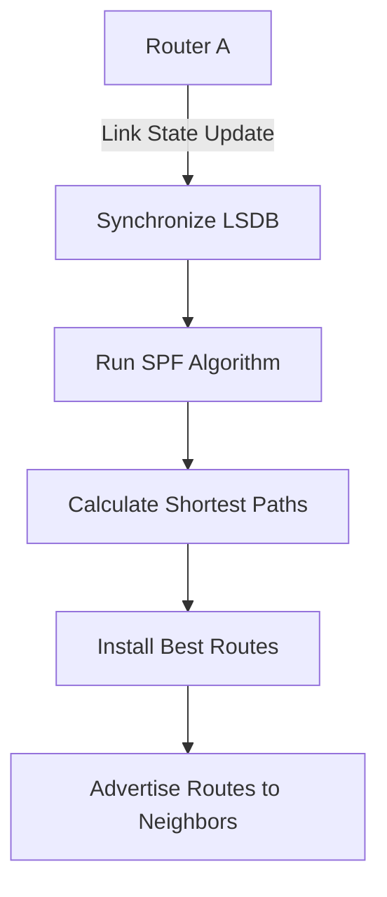

## Overview

Static and dynamic routing represent the two fundamental approaches for determining packet forwarding paths in networks. Static routing uses manually configured routes that remain fixed unless changed by network administrators, while dynamic routing automatically learns and adapts to network topology changes through routing protocols. Choosing between these approaches depends on network size, complexity, administrative resources, and operational requirements.

## Static Routing

Static routing involves manually configuring routes in router routing tables. These routes remain unchanged until explicitly modified by network administrators.

### Static Route Configuration

#### Basic Static Route Syntax

```bash
# Cisco IOS static route
ip route prefix mask next-hop [administrative-distance] [permanent]

# Examples:
ip route 192.168.2.0 255.255.255.0 10.1.1.1  # Basic route
ip route 0.0.0.0 0.0.0.0 203.0.113.1        # Default route
ip route 172.16.0.0 255.255.0.0 Serial0/0   # Direct interface route
```

#### Route Types

- **Direct Routes**: Automatically learned when interface is configured with IP
- **Connected Routes**: Manually configured static routes to directly connected networks
- **Remote Routes**: Static routes pointing to non-adjacent networks via next-hop
- **Default Routes**: Catch-all routes for traffic to unknown destinations (0.0.0.0/0)

### Static Route Properties

#### Administrative Distance

Routers use administrative distance to determine route preference when multiple sources provide routes:

| Route Source  | Administrative Distance |
| ------------- | ----------------------- |
| Connected     | 0                       |
| Static        | 1                       |
| EIGRP Summary | 5                       |
| EBGP          | 20                      |
| OSPF          | 110                     |
| RIP           | 120                     |
| IBGP          | 200                     |

Lower administrative distance indicates higher preference.

#### Route Metrics

Static routes can include optional metrics for load balancing and preference:

- **Administrative Distance**: Route source trustworthiness (1-255)
- **Metric**: Path cost for equal-cost multipath routing
- **Permanent**: Route persists during interface down events

### Static Route Scenarios

#### Stub Networks

Small remote networks with single path to central site:

```bash
# Branch office router with static routes
ip route 10.0.0.0 255.0.0.0 192.168.1.1  # Route to headquarters
ip route 0.0.0.0 0.0.0.0 192.168.1.1    # Default route
```

#### Fixed Topologies

Networks where topology changes are infrequent or undesirable:

- **DMZ Networks**: Security zones with predictable traffic flows
- **Management Networks**: Separated management infrastructure
- **High-Security Environments**: Where dynamic routing protocols pose security risks

#### Traffic Engineering

Manual control over traffic paths for optimization:

```bash
# Load balancing with static routes
ip route 10.2.2.0 255.255.255.0 10.1.1.2 10  # Primary path (AD=10)
ip route 10.2.2.0 255.255.255.0 10.1.1.3 20  # Backup path (AD=20)
```

## Dynamic Routing

Dynamic routing protocols automatically discover network topology, calculate optimal paths, advertise routes to neighbors, and adapt to network changes.

### Route Discovery Process

Dynamic routing protocols exchange route information through periodic updates or event-driven notifications:

1. **Neighbor Discovery**: Protocols establish peering relationships with adjacent routers
2. **Route Exchange**: Routers share routing tables or link-state information
3. **Metric Calculation**: Paths rated using distance, bandwidth, delay, or policy criteria
4. **Best Path Selection**: Routing algorithm determines optimal routes
5. **Route Propagation**: Selected routes distributed to other routers

### Routing Protocol Classification

#### Distance Vector Protocols

Routers exchange distance (hop count) and direction information:

- **RIP (Routing Information Protocol)**: Uses hop count as metric
- **Distance**: Number of routers to destination
- **Direction**: Next hop toward destination
- **Update Frequency**: Periodic broadcasting of entire routing table

#### Link State Protocols

Routers maintain complete network topology database:

- **OSPF (Open Shortest Path First)**: Link-state protocol with Dijkstra SPF
- **Link State**: Network topology shared between all routers
- **Shortest Path**: SPF algorithm calculates optimal routes
- **Area Hierarchy**: Scalable design with backbone and non-backbone areas



#### Path Vector Protocols

Track AS path information for inter-domain routing:

- **BGP (Border Gateway Protocol)**: Path vector protocol for internet routing
- **AS Path**: List of autonomous systems traversed
- **Policy Control**: Extensive filtering and manipulation capabilities
- **Scalability**: Route propagation controlled through route policies

### Convergence Time

Time required for all routers to learn about topology changes:

| Protocol | Typical Convergence | Comments                       |
| -------- | ------------------- | ------------------------------ |
| Static   | Manual              | No convergence needed          |
| RIP v1   | 180 seconds         | Slow recovery from failures    |
| RIP v2   | 30-180 seconds      | Improved version with VLSM     |
| OSPF     | < 30 seconds        | Fast convergence, event-driven |
| EIGRP    | < 10 seconds        | Fastest IGP convergence        |
| BGP      | 30-120 seconds      | Depends on network size        |

## Comparison: Static vs Dynamic Routing

### Configuration and Management

#### Administrative Overhead

- **Static Routes**: Manual configuration, maintenance, and troubleshooting
- **Dynamic Routes**: Automatic discovery and maintenance, requiring protocol knowledge

#### Scalability Considerations

- **Static Routes**: Suitable for small networks (< 10 routers)
- **Dynamic Routes**: Scales to thousands of routers through hierarchical design

### Reliability and Performance

#### Network Changes

- **Static Routes**: Must manually update for every topology change
- **Dynamic Routes**: Automatically adapt to network failures and additions

#### Convergence and Performance

- **Static Routes**: Immediate forwarding, no protocol overhead
- **Dynamic Routes**: Routing protocol CPU/bandwidth overhead, convergence delays

### Security Aspects

#### Route Authorization

- **Static Routes**: Controlled by administrative access
- **Dynamic Routes**: Authentication protects against unauthorized route injection

#### Attack Vectors

- **Static Routes**: Less susceptible to routing protocol attacks
- **Dynamic Routes**: Vulnerable to poisoning, hijacking, and DDoS attacks

### Use Case Comparison

#### When to Use Static Routing

- **Small Networks**: Single path or few routers
- **Stub Networks**: Networks with single exit point
- **Security Requirements**: Where routing protocol attacks are a concern
- **Fixed Infrastructure**: Environments where topology changes are rare
- **Resource Constraints**: Devices incapable of running routing protocols

#### When to Use Dynamic Routing

- **Large Networks**: Complex topologies with hundreds of routers
- **Redundant Paths**: Networks requiring automatic failover
- **Variable Topology**: Cloud environments, campus networks, VPNs
- **Service Provider Networks**: Where high availability is critical
- **Automatic Discovery**: Networks expanding or contracting frequently

### Hybrid Approaches

Combining static and dynamic routing in the same network:

#### Redistribution

Static routes redistributed into dynamic routing protocols:

```bash
# Redistribute static routes into OSPF
router ospf 1
  redistribute static metric 100 subnets
```

#### Route Filtering

Controlling which routes are advertised or accepted:

```bash
# OSPF route filtering
access-list 10 permit 192.168.1.0
access-list 10 deny any

router ospf 1
  distribute-list 10 out
```

## Implementation Best Practices

### Static Route Guidelines

1. **Documentation**: Maintain detailed route documentation with change history
2. **Monitoring**: Implement route tracking and alerting for static route failures
3. **Security**: Use secure management protocols for route administration
4. **Testing**: Validate static routes after network changes

### Dynamic Routing Deployment

1. **Protocol Selection**: Choose appropriate protocol based on network requirements
2. **Authentication**: Enable authentication on all routing protocol communications
3. **Security Policies**: Implement route filtering and access control lists
4. **Monitoring**: Deploy robust monitoring for routing protocol health

### Troubleshooting Common Issues

#### Static Route Problems

- **Incorrect Next-Hop**: Verify next-hop reachability and ARP resolution
- **Subnet Mask Issues**: Ensure mask matches destination network boundaries
- **Administrative Distance**: Check if static routes are overshadowed by dynamic routes
- **Recursive Routing**: Avoid routes pointing to interfaces that need routes to resolve

#### Dynamic Routing Issues

- **Neighbor Adjacency**: Verify protocol-specific neighbor establishment
- **Route Advertisement**: Check network statements and redistribution configurations
- **Metric Problems**: Ensure metrics allow proper path selection
- **Convergence Delays**: Monitor protocol timers and network bandwidth

## Performance Implications

### Resource Usage Comparison

| Metric           | Static Routing   | Dynamic Routing   |
| ---------------- | ---------------- | ----------------- |
| CPU Usage        | Minimal          | Moderate-High     |
| Memory Usage     | Low              | High (RIB, LSDB)  |
| Bandwidth Usage  | Zero             | Protocol overhead |
| Convergence Time | Instant (manual) | Seconds-minutes   |

### Network Design Impact

- **Static Networks**: Predictable behavior, easier capacity planning
- **Dynamic Networks**: Flexible scaling, automatic optimization
- **Hybrid Networks**: Combines predictability with automation advantages

## Migration Strategies

### Static to Dynamic Migration

1. **Assessment**: Evaluate current static route configurations
2. **Topology Analysis**: Identify optimal protocol choice and area boundaries
3. **Gradual Implementation**: Enable dynamic routing alongside static routes
4. **Verification**: Test convergence behavior and route preference
5. **Cutover**: Remove static routes after successful dynamic routing verification

### Dynamic to Static Migration

1. **Use Case Evaluation**: Confirm static routing meets operational requirements
2. **Route Extraction**: Capture current best routes from dynamic table
3. **Static Configuration**: Convert dynamic routes to static entries
4. **Fallback Planning**: Configure floating static routes if needed
5. **Protocol Removal**: Disable dynamic routing after static route verification

## Future Considerations

### Software-Defined Networking

SDN enables centralized control plane with distributed data forwarding:

- **Centralized Route Control**: Routing decisions from SDN controller
- **Network Programmability**: API-driven route configuration
- **Integration Capabilities**: SDN controllers can manage both static and dynamic routing

### Intent-Based Networking

Networks configured by business intent rather than explicit routes:

- **Automation**: Self-configuring and optimizing routing based on policies
- **Assurance**: Continuous verification that routing meets business requirements
- **Analytics**: Route analytics for proactive optimization and troubleshooting

Both static and dynamic routing remain essential tools in network engineering, with the choice depending on specific organizational requirements, network characteristics, and operational capabilities. Understanding when and how to implement each approach is crucial for building reliable, scalable, and maintainable networks.
