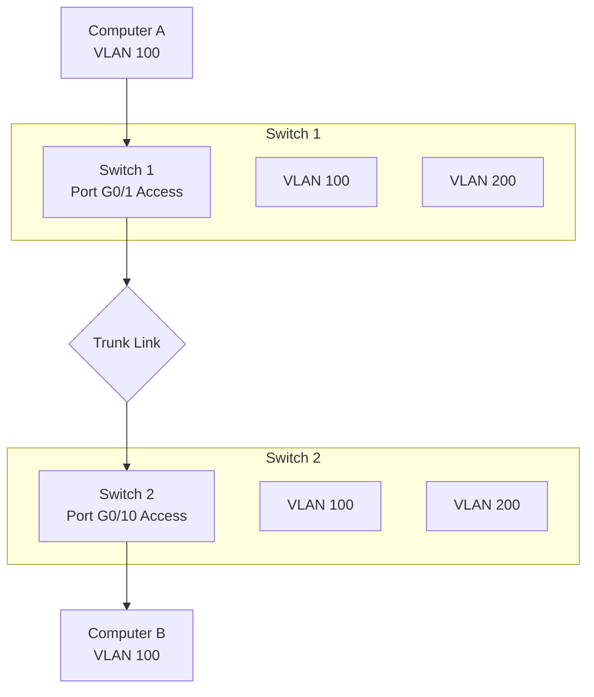
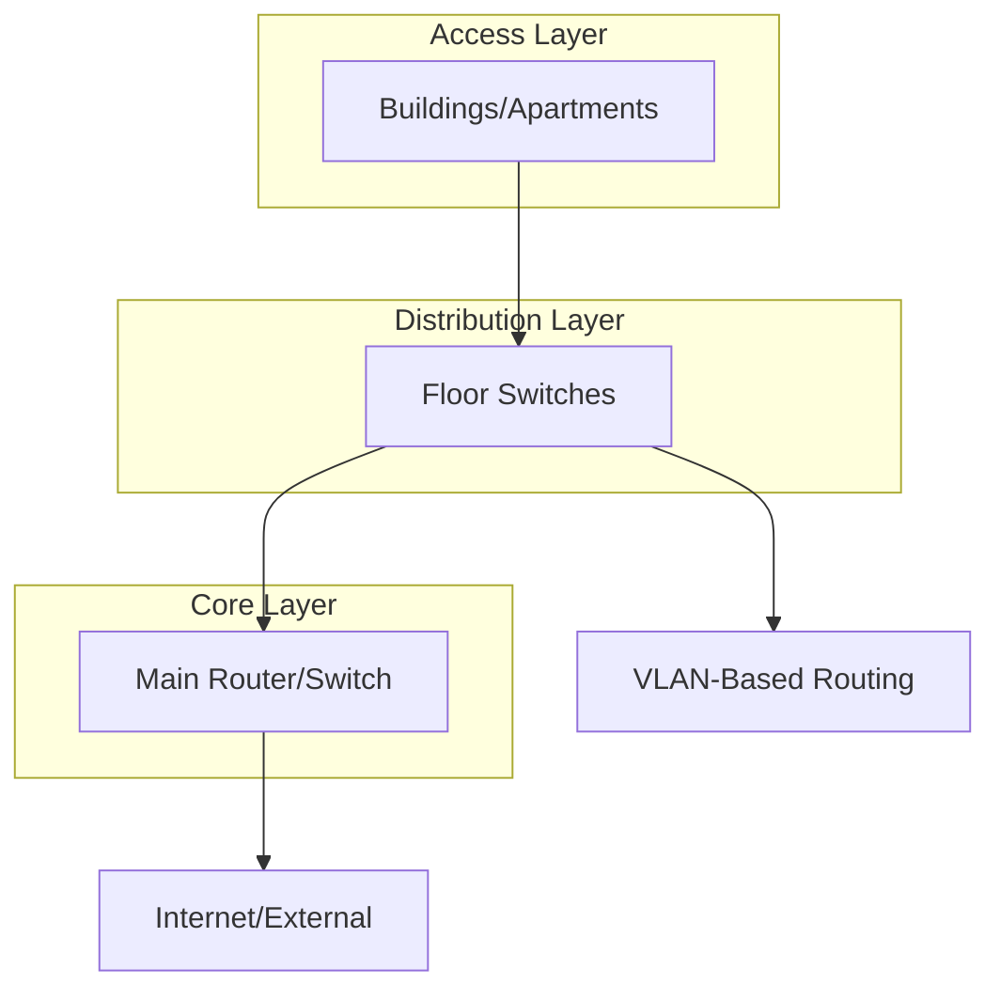

# VLANs & Trunking

Virtual LANs (VLANs) and trunking represent fundamental networking concepts that enable efficient network segmentation and management. By creating logical broadcast domains within a physical network infrastructure, VLANs provide the flexibility to group devices regardless of their physical location while maintaining security and performance. This document explores the architecture, implementation, and practical applications of VLANs and trunking protocols.

## What are VLANs?

A Virtual LAN (VLAN) is a logical grouping of network devices that behave as if they are physically connected to the same network segment, regardless of their actual physical location. VLANs operate at Layer 2 of the OSI model and enable you to partition a single physical network into multiple isolated broadcast domains.

**Core Benefits:**
- Enhanced security through network segmentation
- Reduced broadcast traffic and improved performance
- Flexible device grouping independent of physical topology
- Simplified network management and troubleshooting
- Efficient use of network resources

## VLAN Types

### Data VLANs

Data VLANs carry user-generated traffic for normal network operations. These are typically assigned unique identifiers and configured with specific security policies.

### Voice VLANs (VoIP)

Dedicated VLANs optimized for voice over IP traffic, ensuring quality of service requirements for VoIP applications. These VLANs often include:

- Priority tagging for latency-sensitive packets
- Dedicated bandwidth allocation
- Auto-configuration through LLDP-MED

### Management VLANs

Specialized VLANs used for network device management, carrying protocols like SSH, SNMP, and telnet. Management VLAN access is typically restricted and monitored.

### Default/Native VLAN

VLAN 1, the default native VLAN on most switches. While functional, it's often avoided in production due to security concerns, with administrators creating custom native VLANs instead.

## VLAN Implementation

### VLAN Configuration

Creating VLANs involves defining the VLAN identifier and assigning descriptive names:

```bash
# Cisco VLAN configuration
switch(config)# vlan 100
switch(config-vlan)# name Engineering-Dept
switch(config-vlan)# exit

# Huawei VLAN configuration
[Huawei] vlan 100
[Huawei-vlan100] name Engineering-Dept
[Huawei-vlan100] quit
```

### Port Assignment Modes

#### Access Ports

Access ports connect end-user devices and belong to a single VLAN. These ports tag all ingress traffic with their assigned VLAN ID and remove tags on egress.

```bash
# Assigning a port to VLAN 100 (Access mode)
switch(config)# interface g0/1
switch(config-if)# switchport mode access
switch(config-if)# switchport access vlan 100
```

#### Trunk Ports

Trunk ports carry multiple VLANs between switches or network devices. They use encapsulation protocols to differentiate VLAN traffic.

```bash
# Configuring trunk port
switch(config)# interface g0/24
switch(config-if)# switchport mode trunk
switch(config-if)# switchport trunk allowed vlan 100,200,300
```

## Trunking Protocols

### IEEE 802.1Q (Dot1Q)

The industry-standard trunking protocol that inserts a 4-byte VLAN tag into the Ethernet frame header. This tag includes:

- **TPID (Tag Protocol Identifier):** 0x8100 indicating 802.1Q tagging
- **Priority (3 bits):** For Quality of Service (802.1p)
- **CFI (Canonical Format Indicator):** For Token Ring compatibility
- **VID (VLAN ID - 12 bits):** Identifies the VLAN (1-4094)

```bash
# Setting native VLAN on trunk (untagged traffic)
switch(config-if)# switchport trunk native vlan 10
```

### ISL (Inter-Switch Link)

Cisco's proprietary trunking protocol that encapsulates the entire Ethernet frame with a 26-byte header. Though less common today, it's still found in legacy Cisco environments.

## VLAN Communication Across Switches

For VLANs to span multiple switches, trunk links must be established. Here's how traffic flows between devices in different VLANs on separate switches:



## Inter-VLAN Routing

### Router-on-a-Stick

A single router interface connected via trunk link to handle inter-VLAN communication:

```bash
# Router sub-interface configuration
router(config)# interface g0/0
router(config-if)# no shutdown
router(config-if)# interface g0/0.100
router(config-if)# encapsulation dot1Q 100
router(config-if)# ip address 192.168.100.1 255.255.255.0
router(config-if)# exit
router(config)# interface g0/0.200
router(config-if)# encapsulation dot1Q 200
router(config-if)# ip address 192.168.200.1 255.255.255.0
```

### Layer 3 Switches

Modern switches with routing capabilities provide much higher performance for inter-VLAN routing:

```bash
# Layer 3 switch SVIs (Switched Virtual Interfaces)
switch(config)# interface vlan 100
switch(config-if)# ip address 192.168.100.1 255.255.255.0
switch(config-if)# no shutdown

switch(config)# interface vlan 200
switch(config-if)# ip address 192.168.200.1 255.255.255.0
switch(config-if)# no shutdown
```

## VLAN Security Considerations

### VLAN Hopping Attacks

**Switch Spoofing:**
Attackers attempt to impersonate trunk ports by sending DTP (Dynamic Trunking Protocol) frames.

**Prevention:**
```bash
# Disable DTP on non-trunk ports
switch(config-if)# switchport nonegotiate
```

**Double Tagging (802.1Q Tunneling):**
An advanced attack where attackers add two VLAN tags to bypass trunk restrictions.

**Prevention:**
- Avoid using native VLAN 1
- Implement private VLANs
- Use dedicated VLAN access control lists (VACLs)

### Private VLANs

Private VLANs extend isolation by creating secondary VLANs within a primary VLAN:

- **Primary VLAN:** Contains promiscuous ports
- **Secondary VLANs:** Isolated and Community types
- **Isolated VLANs:** Ports can only communicate with promiscuous ports
- **Community VLANs:** Ports can communicate with each other and promiscuous ports

## VLAN Management and Monitoring

### VLAN Database

Switches maintain VLAN databases containing VLAN IDs, names, and member ports:

```bash
# Viewing VLAN database
switch# show vlan brief

# Output example:
VLAN Name                             Status    Ports
---- -------------------------------- --------- -------------------------------
1    default                          active    Gi0/1, Gi0/9
100  Engineering                     active    Gi0/2, Gi0/3, Gi0/4
200  Marketing                        active    Gi0/5, Gi0/6
```

### VLAN Trunking Protocol (VTP)

Cisco's VLAN management protocol that propagates VLAN configuration changes across switches in a domain:

- **VTP Server:** Can create, modify, and delete VLANs
- **VTP Client:** Receives VLAN information and applies it
- **VTP Transparent:** Forwards VTP advertisements but maintains local VLAN database

```bash
# VTP configuration
switch(config)# vtp mode server
switch(config)# vtp domain MyCompany
switch(config)# vtp password SecurePass
```

## Troubleshooting VLAN Issues

### Common Problems

1. **VLAN Mismatch:** Mismatched VLAN configurations between switches
2. **Trunk Issues:** Native VLAN mismatches or trunk negotiation failures
3. **STP Problems:** Spanning Tree Protocol blocking desired paths
4. **IP Configuration:** Incorrect subnetting in inter-VLAN routing

### Diagnostic Commands

```bash
# Check trunk status
switch# show interfaces trunk

# Verify VLAN membership
switch# show vlan id 100

# Test connectivity
switch# ping vlan 200
```

## Real-World VLAN Deployment

### Enterprise Network Segmentation

Large organizations use VLANs extensively:

- **Departmental VLANs:** Sales, Engineering, HR each get dedicated VLANs
- **Guest Networks:** Isolated internet-only access for visitors
- **VoIP Networks:** Dedicated voice traffic with QoS policies
- **Printer VLANs:** Shared printing resources with controlled access

### Campus Network Design

University campuses often implement hierarchical VLAN designs:



### Data Center VLANs

Modern data centers use VLANs strategically:

- **Server VLANs:** Grouping application and database servers
- **Management VLANs:** Out-of-band management interfaces
- **Storage VLANs:** SAN and NAS network isolation
- **Migration VLANs:** During server or application moves

## Best Practices

1. **Document Everything:** Maintain detailed VLAN documentation
2. **Plan Before Implementation:** Design VLAN structure carefully
3. **Secure VLAN Boundaries:** Don't rely on VLANs as security boundaries alone
4. **Monitor Traffic:** Use appropriate monitoring tools
5. **Regular Maintenance:** Audit and update VLAN configurations
6. **Avoid VLAN 1:** Use custom native VLANs for security

## Future of VLANs

While VLANs remain crucial for Layer 2 segmentation, newer technologies are emerging:

- **VXLAN (Virtual Extensible LAN):** Overlays Layer 2 over Layer 3
- **EVPN (Ethernet VPN):** Modern approach to VLAN extension
- **Software-Defined Networking (SDN):** Programmatic VLAN management

VLANs continue to be the foundation of network segmentation, providing the logical separation that modern applications and security practices depend upon. Understanding their implementation and management remains essential for network professionals building robust, scalable infrastructures.
