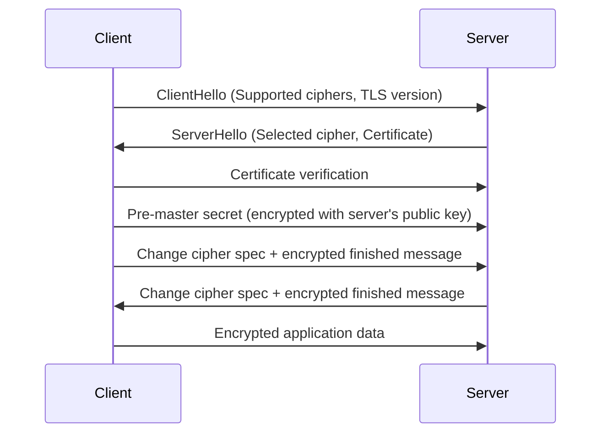
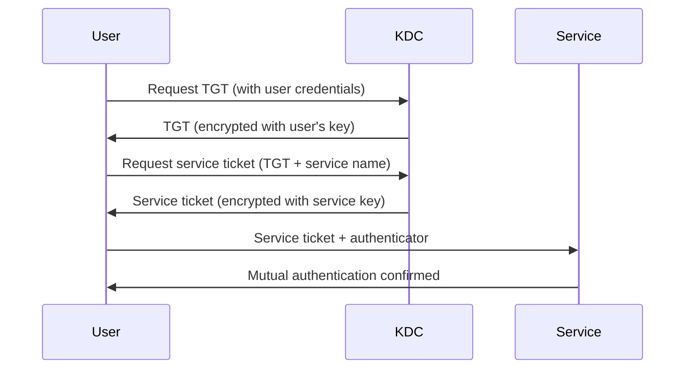

# Network Security

This section provides comprehensive coverage of network security principles, protocols, and best practices essential for protecting modern networks against evolving cyber threats.

## Overview

Network security encompasses the policies, technologies, and practices designed to prevent unauthorized access, misuse, modification, or denial of computer networks and network-accessible resources. As networks become increasingly complex and interconnected, effective security strategies are critical for business continuity and data protection.

## Core Security Concepts

### CIA Triad

The fundamental principles of information security:

- **Confidentiality:** Ensures information is accessible only to authorized parties
- **Integrity:** Protects information from unauthorized modification or tampering
- **Availability:** Ensures information and resources remain accessible to authorized users

### AAA Framework

**Authentication, Authorization, and Accounting:**

- **Authentication:** Verifies user identity through credentials, biometrics, or certificates
- **Authorization:** Grants appropriate access levels based on identity and role
- **Accounting:** Records and monitors resource usage for auditing and billing

## Security Architecture

### Defense in Depth

Multi-layered security approach:

```text
┌─────────────────────────────────────────┐
│            Network Perimeter            │
│   ┌─────────────────────────────────┐   │
│   │       Internet Firewall        │   │
│   └─────────────────────────────────┘   │
│                 │                       │
│   ┌─────────────────────────────────┐   │
│   │        DMZ (Web Servers)        │   │
│   └─────────────────────────────────┘   │
│                 │                       │
│   ┌─────────────────────────────────┐   │
│   │    Internal Firewall Layer     │   │
│   └─────────────────────────────────┘   │
│                 │                       │
│   ┌─────────────────────────────────┐   │
│   │   Application Server Layer     │   │
│   └─────────────────────────────────┘   │
│                 │                       │
│   ┌─────────────────────────────────┐   │
│   │      Database Server Layer     │   │
│   └─────────────────────────────────┘   │
└─────────────────────────────────────────┘
```

### Zero Trust Model

Never trust, always verify:

**Core Principles:**
- Assume breach mentality
- Verify all access attempts
- Least privilege access
- Micro-segmentation
- Continuous monitoring

## Security Protocols

### Encryption Protocols

#### TLS/SSL (Transport Layer Security/Secure Sockets Layer)

End-to-end encryption for secure communications:



### Authentication Protocols

#### Kerberos

Network authentication protocol providing mutual authentication:



#### OAuth 2.0

Authorization framework for delegated access:

**Grant Types:**
- Authorization Code Grant (Web applications)
- Implicit Grant (Single-page apps)
- Resource Owner Password Credentials
- Client Credentials Grant

## Threat Landscape

### Common Attack Vectors

#### Network Layer Attacks

**Man-in-the-Middle (MitM):**
```text
Attacker intercepts traffic between client and server:
Client ── (clear) ── Attacker ── (clear) ── Server
                          │
                       (decrypts/reads/modifies)
```

**Prevention:**
- Certificate pinning
- Mutual TLS authentication
- VPN usage

#### Application Layer Attacks

**SQL Injection:**
```sql
-- Vulnerable code:
SELECT * FROM users WHERE username = '$username' AND password = '$password'

-- Attack payload:
' OR '1'='1'; --
-- Results in: SELECT * FROM users WHERE username = '' OR '1'='1'; -- AND password = ''
```

**Command Injection:**
```bash
# Vulnerable PHP code:
system("ping " . $_GET['host']);

# Attack: ?host=127.0.0.1; rm -rf /
# Results in: ping 127.0.0.1; rm -rf /
```

### Advanced Persistent Threats (APTs)

Sophisticated, long-term attacks targeting specific organizations:

**Stages:**
1. Reconnaissance and initial compromise
2. Establishing foothold and persistence
3. Privilege escalation
4. Internal reconnaissance
5. Lateral movement
6. Data exfiltration
7. Covering tracks

## Cryptography Fundamentals

### Symmetric Encryption

**AES (Advanced Encryption Standard):**
```python
from cryptography.fernet import Fernet

# Generate key
key = Fernet.generate_key()
cipher = Fernet(key)

# Encrypt
message = b"Hello, World!"
encrypted = cipher.encrypt(message)

# Decrypt
decrypted = cipher.decrypt(encrypted)
```

### Asymmetric Encryption

**RSA Algorithm:**
```python
from cryptography.hazmat.primitives import serialization, asymmetric
from cryptography.hazmat.backends import default_backend

# Generate key pair
private_key = asymmetric.rsa.generate_private_key(
    public_exponent=65537,
    key_size=2048,
    backend=default_backend()
)

public_key = private_key.public_key()

# Serialize keys
pem_private = private_key.private_bytes(
    encoding=serialization.Encoding.PEM,
    format=serialization.PrivateFormat.PKCS8,
    encryption_algorithm=serialization.NoEncryption()
)
```

### Key Exchange

**Diffie-Hellman Key Exchange:**
```text
Alice and Bob agree on public parameters:
- Prime number: p = 23
- Generator: g = 5

Alice chooses: a = 4 (private)
Bob chooses: b = 3 (private)

Alice computes and sends: A = g^a mod p = 5^4 mod 23 = 4
Bob computes and sends: B = g^b mod p = 5^3 mod 23 = 10

Shared secret:
Alice: B^a mod p = 10^4 mod 23 = 18
Bob: A^b mod p = 4^3 mod 23 = 18
```

## Identity and Access Management (IAM)

### Role-Based Access Control (RBAC)

Users assigned roles, roles granted permissions:

```json
{
  "roles": {
    "admin": {
      "permissions": ["read", "write", "delete", "manage-users"]
    },
    "developer": {
      "permissions": ["read", "write", "deploy"]
    },
    "auditor": {
      "permissions": ["read", "audit"]
    }
  },
  "users": {
    "alice": ["admin"],
    "bob": ["developer", "auditor"],
    "charlie": ["developer"]
  }
}
```

### Attribute-Based Access Control (ABAC)

Access decisions based on attributes of user, resource, and environment:

**Decision Function:**
```javascript
function evaluateAccess(user, resource, action, environment) {
    // User attributes: role, department, clearance
    // Resource attributes: classification, owner
    // Environment attributes: time, location, device

    if (user.clearance < resource.classification) {
        return DENY;
    }

    if (environment.time > '18:00' && action === 'write') {
        return DENY;
    }

    if (environment.location !== 'office' && resource.classification === 'high') {
        return DENY;
    }

    return ALLOW;
}
```

## Network Security Monitoring

### Intrusion Detection Systems (IDS)

**Host-based IDS (HIDS):**
- Monitors individual system activity
- Detects unauthorized file modifications
- Tracks system calls and privilege escalation

**Network-based IDS (NIDS):**
- Monitors network traffic patterns
- Signature-based and anomaly-based detection
- Real-time alerting and blocking

### Security Information and Event Management (SIEM)

Centralized logging and correlation:

```sql
-- SIEM query example
SELECT
    source_ip,
    destination_ip,
    event_type,
    COUNT(*) as frequency,
    MAX(timestamp) as last_seen
FROM security_events
WHERE timestamp > NOW() - INTERVAL '1 hour'
    AND event_type IN ('failed_login', 'port_scan', 'malware_detected')
GROUP BY source_ip, destination_ip, event_type
HAVING COUNT(*) > 5
ORDER BY frequency DESC
```

## Compliance and Standards

### Common Security Frameworks

**NIST Cybersecurity Framework:**
- Identify: Asset management, risk assessment
- Protect: Access control, data security
- Detect: Security monitoring, anomaly detection
- Respond: Incident response, communication
- Recover: Restore capabilities, lesson learned

**ISO 27001:**
- Information security management system
- Risk assessment and treatment
- Security controls implementation
- Continuous improvement

### Industry-Specific Standards

**PCI DSS (Payment Card Industry):**
- Cardholder data protection
- Network segmentation requirements
- Access control measures
- Monitoring and testing

**HIPAA (Health Information Privacy):**
- Protected health information safeguards
- Breach notification requirements
- Business associate agreements
- Technical and administrative safeguards

## Cloud Security Concerns

### Shared Responsibility Model

```text
┌─────────────────────────────────────────┐
│             CUSTOMER                    │
│   ◇ Data & configurations               │
│   ◇ Access management                  │
│   ◇ Encryption keys                    │
│   ◇ Client-side data integrity         │
└─────────────────────────────────────────┘
                  │
                  │  SHARED
                  ▼
┌─────────────────────────────────────────┐
│             CLOUD PROVIDER              │
│   ◇ Physical infrastructure            │
│   ◇ Network infrastructure             │
│   ◇ Virtualization layer               │
│   ◇ Server-side encryption             │
└─────────────────────────────────────────┘
```

### Common Cloud Security Issues

- **Data Breaches:** Misconfigured storage buckets
- **Account Compromise:** Weak authentication, key management
- **Insecure APIs:** Poor API security design
- **Denial of Service:** Insufficient rate limiting
- **Compliance:** Data residency and sovereignty issues

## Emerging Security Technologies

### Software-Defined Perimeter (SDP)

Dynamic network access control:

**SDP Operation:**
1. Device posture assessment
2. Identity verification
2. Dynamic policy application
3. Connection brokering

### Zero-Trust Network Access (ZTNA)

Secure access to private applications:

**Key Features:**
- Identity-driven access
- Device health checking
- Least-privilege connectivity
- Continuous trust evaluation

### AI-Driven Security

Machine learning for threat detection:

**Applications:**
- Anomaly detection in user behavior
- Automated incident response
- Predictive threat modeling
- Malware classification

## Code Examples

### Python: TLS Certificate Validation

```python
#!/usr/bin/env python3
"""
TLS certificate validation and SSL connection analysis
"""

import ssl
import socket
import OpenSSL
from cryptography import x509
from cryptography.hazmat.backends import default_backend

class TLSAnalyzer:
    def __init__(self, host, port=443):
        self.host = host
        self.port = port

    def get_certificate_info(self):
        """Retrieve and analyze certificate information"""
        try:
            # Create SSL context
            context = ssl.create_default_context()
            context.check_hostname = True
            context.verify_mode = ssl.CERT_REQUIRED

            with socket.create_connection((self.host, self.port)) as sock:
                with context.wrap_socket(sock, server_hostname=self.host) as ssock:
                    cert = ssock.getpeercert()

                    return {
                        'subject': dict(x[0] for x in cert['subject']),
                        'issuer': dict(x[0] for x in cert['issuer']),
                        'version': cert['version'],
                        'serialNumber': cert['serialNumber'],
                        'notBefore': cert['notBefore'],
                        'notAfter': cert['notAfter'],
                        'subjectAltNames': cert.get('subjectAltName', [])
                    }

        except Exception as e:
            return f"Certificate error: {str(e)}"

    def check_certificate_validity(self):
        """Check if certificate is valid"""
        try:
            cert_info = self.get_certificate_info()

            if isinstance(cert_info, str):
                return False, cert_info

            # Parse dates (simplified check)
            from datetime import datetime
            not_after = datetime.strptime(cert_info['notAfter'], '%b %d %H:%M:%S %Y GMT')
            now = datetime.utcnow()

            if now > not_after:
                return False, "Certificate expired"
            elif (not_after - now).days < 30:
                return False, "Certificate expires soon"

            return True, "Certificate is valid"

        except Exception as e:
            return False, f"Validation error: {str(e)}"

    def analyze_cipher_suite(self):
        """Analyze negotiated cipher suite"""
        try:
            context = ssl.create_default_context()
            context.check_hostname = True
            context.verify_mode = ssl.CERT_REQUIRED

            with socket.create_connection((self.host, self.port)) as sock:
                with context.wrap_socket(sock, server_hostname=self.host) as ssock:
                    cipher = ssock.cipher()

                    # Cipher suite analysis
                    cipher_name = cipher[0]
                    protocol = cipher[1]
                    key_size = cipher[2]

                    security_level = "LOW"
                    if key_size >= 256:
                        security_level = "HIGH"
                    elif key_size >= 128:
                        security_level = "MEDIUM"

                    return {
                        'cipher': cipher_name,
                        'protocol': protocol,
                        'key_size': key_size,
                        'security_level': security_level,
                        'vulnerabilities': []  # Could check against known vulnerable ciphers
                    }

        except Exception as e:
            return f"Cipher analysis error: {str(e)}"

def demonstrate_certificate_analysis():
    """Demonstrate certificate analysis"""
    analyzer = TLSAnalyzer('github.com')

    print("Certificate Information:")
    cert_info = analyzer.get_certificate_info()
    if isinstance(cert_info, dict):
        print(f"Subject: {cert_info['subject']}")
        print(f"Issuer: {cert_info['issuer']}")
        print(f"Expires: {cert_info['notAfter']}")
        print(f"Alt Names: {cert_info['subjectAltNames']}")
    else:
        print(cert_info)

    print("\nCertificate Validity Check:")
    valid, message = analyzer.check_certificate_validity()
    print(f"Valid: {valid} - {message}")

    print("\nCipher Suite Analysis:")
    cipher_info = analyzer.analyze_cipher_suite()
    if isinstance(cipher_info, dict):
        print(f"Cipher: {cipher_info['cipher']}")
        print(f"Protocol: {cipher_info['protocol']}")
        print(f"Key Size: {cipher_info['key_size']} bits")
        print(f"Security Level: {cipher_info['security_level']}")
    else:
        print(cipher_info)

if __name__ == "__main__":
    demonstrate_certificate_analysis()
```

### Python: Basic IDS Implementation

```python
#!/usr/bin/env python3
"""
Basic intrusion detection system with packet analysis
"""

import socket
import struct
import threading
import time
from collections import defaultdict, deque
import re

class SimpleIDS:
    def __init__(self, interface='eth0'):
        self.interface = interface
        self.sock = None
        self.running = False

        # Statistics
        self.stats = defaultdict(int)

        # Recent events (sliding window)
        self.recent_events = deque(maxlen=1000)

        # Attack patterns
        self.attack_patterns = {
            'syn_flood': {
                'pattern': lambda pkt: pkt.get('syn') and not pkt.get('ack'),
                'threshold': 100,  # SYN packets per minute from same source
                'window': 60,
                'description': 'SYN flood attack detected'
            },
            'port_scan': {
                'pattern': lambda pkt: pkt.get('tcp') and not pkt.get('ack'),
                'threshold': 50,  # Unique port scans per minute
                'window': 60,
                'description': 'Port scan detected'
            },
            'smurf_attack': {
                'pattern': lambda pkt: pkt.get('icmp_echo') and pkt.get('broadcast_dst'),
                'threshold': 10,  # ICMP echo requests to broadcast
                'window': 60,
                'description': 'Smurf attack detected'
            }
        }

        # Source tracking
        self.source_activity = defaultdict(lambda: {
            'syn_count': 0,
            'ports_scanned': set(),
            'icmp_broadcast': 0,
            'last_seen': time.time()
        })

    def create_raw_socket(self):
        """Create raw socket for packet capture"""
        try:
            self.sock = socket.socket(socket.AF_INET, socket.SOCK_RAW, socket.IPPROTO_TCP)
            self.sock.setblocking(False)
            return True
        except PermissionError:
            print("ERROR: Raw socket requires root privileges")
            return False

    def parse_ip_header(self, data):
        """Parse IP header (simplified)"""
        if len(data) < 20:
            return None

        header = struct.unpack('!BBHHHBBH4s4s', data[:20])

        ip_header = {
            'version': (header[0] & 0xF0) >> 4,
            'tos': header[1],
            'total_length': header[2],
            'identification': header[3],
            'fragment_offset': header[4] & 0x1FFF,
            'ttl': header[5],
            'protocol': header[6],
            'checksum': header[7],
            'src_addr': socket.inet_ntoa(header[8]),
            'dst_addr': socket.inet_ntoa(header[9])
        }

        return ip_header, data[20:]

    def parse_tcp_header(self, data):
        """Parse TCP header"""
        if len(data) < 20:
            return None

        header = struct.unpack('!HHLLBBHHH', data[:20])

        tcp_header = {
            'src_port': header[0],
            'dst_port': header[1],
            'seq_num': header[2],
            'ack_num': header[3],
            'data_offset': (header[4] & 0xF0) >> 4,
            'flags': header[5],
            'window_size': header[6],
            'syn': bool(header[5] & 0x02),
            'ack': bool(header[5] & 0x10),
            'rst': bool(header[5] & 0x04),
            'psh': bool(header[5] & 0x08),
            'fin': bool(header[5] & 0x01)
        }

        return tcp_header, data[20:]

    def parse_icmp_header(self, data):
        """Parse ICMP header"""
        if len(data) < 4:
            return None

        header = struct.unpack('!BBH', data[:4])

        icmp_header = {
            'type': header[0],
            'code': header[1],
            'checksum': header[2],
            'echo_request': header[0] == 8,
            'echo_reply': header[0] == 0
        }

        return icmp_header

    def detect_attacks(self, packet):
        """Detect various attack patterns"""
        alerts = []
        src_ip = packet.get('src_addr')
        current_time = time.time()

        # Update source activity
        src_data = self.source_activity[src_ip]

        # SYN flood detection
        if packet.get('syn') and not packet.get('ack'):
            src_data['syn_count'] += 1

        # Port scan detection
        if packet.get('tcp'):
            src_data['ports_scanned'].add(packet.get('dst_port', 0))

        # Broadcast ICMP detection
        if packet.get('icmp_echo'):
            # Check if destination is broadcast (simplified)
            dst_ip = packet.get('dst_addr', '')
            if dst_ip.endswith('255'):
                src_data['icmp_broadcast'] += 1

        src_data['last_seen'] = current_time

        # Check thresholds
        for attack_name, config in self.attack_patterns.items():
            if config['pattern'](packet):
                # Count events in time window
                window_start = current_time - config['window']
                recent_count = sum(1 for event in self.recent_events
                                 if (event['time'] > window_start and
                                     event['src'] == src_ip and
                                     event['type'] == attack_name))

                if recent_count >= config['threshold']:
                    alerts.append({
                        'type': attack_name,
                        'description': config['description'],
                        'source': src_ip,
                        'timestamp': current_time
                    })

                    # Log event
                    self.recent_events.append({
                        'type': attack_name,
                        'src': src_ip,
                        'time': current_time
                    })

        return alerts

    def analyze_packet(self, raw_data):
        """Analyze captured packet"""
        try:
            ip_header, data = self.parse_ip_header(raw_data)
            if not ip_header:
                return

            packet = {
                'src_addr': ip_header['src_addr'],
                'dst_addr': ip_header['dst_addr'],
                'protocol': ip_header['protocol']
            }

            # Protocol-specific parsing
            if ip_header['protocol'] == 6:  # TCP
                tcp_header, _ = self.parse_tcp_header(data)
                if tcp_header:
                    packet.update(tcp_header)
                    packet['tcp'] = True
            elif ip_header['protocol'] == 1:  # ICMP
                icmp_header = self.parse_icmp_header(data)
                if icmp_header:
                    packet.update(icmp_header)
                    packet['icmp'] = True
                    packet['icmp_echo'] = icmp_header.get('echo_request')

            # Detect attacks
            alerts = self.detect_attacks(packet)
            for alert in alerts:
                print(f"🚨 ALERT: {alert['description']} from {alert['source']}")

            # Update statistics
            self.stats['packets_analyzed'] += 1

        except Exception as e:
            self.stats['parse_errors'] += 1

    def monitor_traffic(self):
        """Main monitoring loop"""
        print(f"Starting IDS monitoring on interface...")

        if not self.create_raw_socket():
            return

        self.running = True

        try:
            while self.running:
                try:
                    raw_data = self.sock.recv(65535)
                    self.analyze_packet(raw_data)
                except BlockingIOError:
                    time.sleep(0.01)  # Small delay when no packets
                except Exception as e:
                    print(f"Error receiving packet: {e}")

        except KeyboardInterrupt:
            print("\nStopping IDS monitoring...")
        finally:
            if self.sock:
                self.sock.close()

    def print_stats(self):
        """Print monitoring statistics"""
        print("\n" + "="*50)
        print("IDS MONITORING STATISTICS")
        print("="*50)
        for key, value in self.stats.items():
            print("30")
        print(f"Active source IPs tracked: {len(self.source_activity)}")
        print(f"Recent alerts: {len([e for e in self.recent_events if time.time() - e['time'] < 3600])} (last hour)")

def main():
    ids = SimpleIDS()

    # Start monitoring in background thread
    monitor_thread = threading.Thread(target=ids.monitor_traffic, daemon=True)
    monitor_thread.start()

    print("IDS is monitoring traffic. Press Ctrl+C to stop...")

    try:
        while True:
            time.sleep(10)  # Print stats every 10 seconds
            ids.print_stats()
    except KeyboardInterrupt:
        ids.running = False
        monitor_thread.join()
        ids.print_stats()
        print("\nMonitoring stopped.")

if __name__ == "__main__":
    main()
```

## Best Practices

### Security Implementation

1. **Layered Defense:** Multiple security controls at different layers
2. **Regular Audits:** Periodic security assessment and penetration testing
3. **Employee Training:** Security awareness and incident reporting
4. **Incident Response:** Documented procedures for handling breaches
5. **Continuous Monitoring:** Real-time threat detection and response

### Risk Management

1. **Asset Classification:** Identify and prioritize critical assets
2. **Threat Modeling:** Identify potential threats and attack vectors
3. **Vulnerability Assessment:** Regular scanning and patching
4. **Business Continuity:** Disaster recovery and business continuity plans

### Compliance and Governance

1. **Policy Development:** Clear security policies and procedures
2. **Access Controls:** Principle of least privilege
3. **Change Management:** Controlled system and configuration changes
4. **Audit Logging:** Comprehensive audit trails for all security events

Network security is a complex, evolving field requiring constant vigilance and adaptation. Understanding fundamental concepts, implementing appropriate controls, and staying informed about emerging threats are essential for maintaining a secure network environment.


