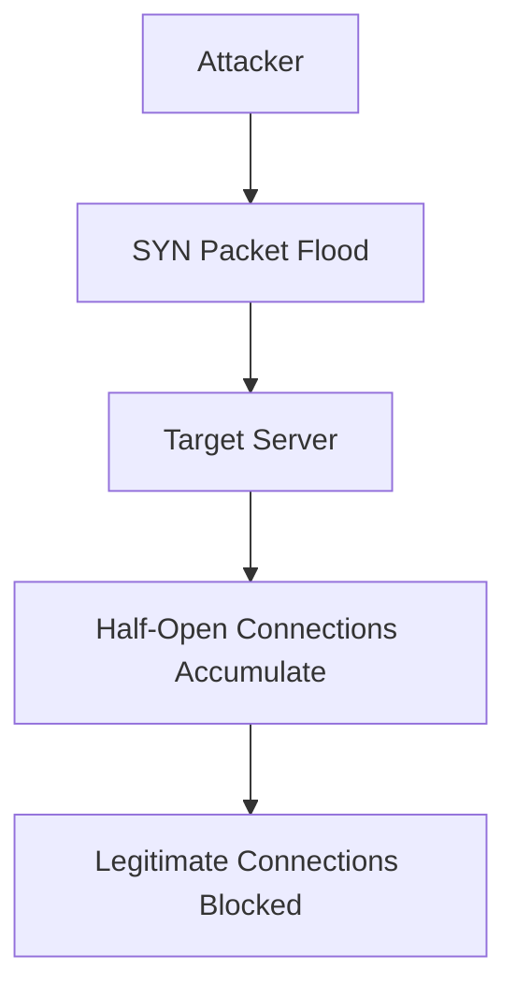

## Overview

Distributed Denial of Service (DDoS) attacks represent one of the most significant threats to network availability and business continuity. These attacks overwhelm target systems with massive traffic volumes, rendering services inaccessible to legitimate users. Understanding attack vectors, implementation methods, and comprehensive mitigation strategies is crucial for maintaining resilient network infrastructure.

## Understanding DDoS Attacks

A DDoS attack is a malicious attempt to disrupt normal traffic flow to a targeted server, service, or network by overwhelming it with Internet traffic. Unlike traditional DoS attacks that originate from a single source, DDoS attacks leverage multiple compromised devices (botnets) distributed across the internet.

### Attack Characteristics

- **Distributed Nature**: Attack traffic originates from thousands or millions of sources
- **Volume Overload**: Legitimate traffic is drowned out by malicious requests
- **Service Disruption**: Targets become unavailable to legitimate users
- **Financial Impact**: Downtime can cost businesses thousands per minute

## Types of DDoS Attacks

### Volumetric Attacks

Volumetric attacks aim to consume network bandwidth capacity, preventing legitimate traffic from reaching the target.

#### UDP Flood

- **UDP Datagrams**: Sending large volumes of User Datagram Protocol packets
- **Amplification**: Using spoofed source IP addresses to multiply attack traffic
- **Bots**: Compromised devices continuously send UDP packets to random ports

**Example Amplification Techniques:**
- **NTP Amplification**: Exploiting Network Time Protocol servers
- **DNS Amplification**: Using DNS resolvers to multiply request size
- **Memcached Amplification**: Leveraging in-memory caching systems

#### ICMP Flood (Ping Flood)

- **ICMP Echo Requests**: Overwhelming targets with ping requests
- **Broadcast Networks**: Amplifying through network broadcast replies
- **Resource Consumption**: Exhausting target's processing capacity

### Protocol Attacks

Protocol attacks exploit weaknesses in network protocol implementations to consume server resources.

#### SYN Flood

- **TCP handshake exploitation**: Sending SYN packets without completing handshake
- **Backlog Queue**: Filling connection queues on target servers
- **Resource Exhaustion**: Preventing legitimate connection establishment

**TCP Three-Way Handshake Exploitation:**


#### ACK Flood

- **ACK Packets**: Sending acknowledgment packets without matching connections
- **Stateful Inspection**: Forcing firewalls to track nonexistent connections
- **Resource Consumption**: CPU cycles spent processing invalid packets

#### RST/FIN Flood

- **Connection Termination**: Flooding with TCP reset or finish packets
- **Session Disruption**: Terminating established connections prematurely
- **Connection Hunting**: Targeting specific active connections

### Application Layer Attacks

Application-layer attacks target specific web applications and APIs, mimicking legitimate user behavior.

#### HTTP Flood

- **GET/POST Requests**: Overwhelming web servers with HTTP requests
- **Slowloris Attack**: Keeping connections open with partial requests
- **RUDY Attack**: Sending partial POST requests to maintain connections

#### DNS Flood

- **Query Flooding**: Overloading DNS servers with resolution requests
- **NXDOMAIN Attacks**: Requesting non-existent domain names
- **DNS Amplification**: Using DNS servers to multiply traffic volume

#### NTP Monlist Attack

- **NTP Service Exploitation**: Querying NTP servers for peer lists
- **Data Amplification**: Servers returning large response packets
- **Reflection Attack**: Spoofed source IPs multiply response traffic

## Attack Tools and Methods

### Botnet Infrastructure

Modern DDoS attacks rely on compromised IoT devices, computers, and servers organized into botnets.

#### Common Botnet Types

- **Mirai Variants**: IoT device-based botnets targeting smart cameras and routers
- **Booter/Stresser Services**: Commercial DDoS-for-hire platforms
- **Cloud-Based Botnets**: Utilizing cloud computing resources for scale
- **Script Kiddie Tools**: LOIC/HOIC for smaller-scale attacks

### Command and Control (C2)

Botnets use various communication methods to coordinate attacks:

- **IRC Channels**: Traditional Internet Relay Chat command channels
- **HTTP/HTTPS**: Web-based command distribution
- **P2P Networks**: Decentralized peer-to-peer control structures
- **DNS Tunneling**: Hiding commands within DNS queries

## Mitigation Strategies

### Layer 4-7 Protection

#### Traffic Filtering

- **Rate Limiting**: Constraining request rates per IP address
- **Geographic Filtering**: Blocking traffic from known malicious regions
- **Protocol Filtering**: Restricting allowed protocols and ports

#### Access Control Lists (ACLs)

- **Network ACLs**: Router-level traffic filtering
- **Firewall Rules**: Application-aware traffic control
- **Web Application Firewalls (WAF)**: Layer 7 protection against application attacks

### DDoS Mitigation Services

#### Cloud-Based Protection

- **Content Delivery Networks (CDNs)**: Distributed traffic absorption
- **Cloudflare Spectrum**: DDoS protection across all ports
- **Akamai Kona Site Defender**: Enterprise-grade DDoS mitigation

#### Specialized Providers

- **Scrubbing Centers**: Traffic cleaning facilities redirecting malicious traffic
- **On-Premise Appliances**: Hardware-based mitigation devices
- **Hybrid Approaches**: Combining cloud and local protection

### Rate Limiting and Throttling

#### Token Bucket Algorithm

Allows bursts of traffic while maintaining average rate limits:

```python
class TokenBucket:
    def __init__(self, capacity, fill_rate):
        self.capacity = capacity
        self.fill_rate = fill_rate
        self.tokens = capacity
        self.last_update = time.time()

    def consume(self, tokens):
        now = time.time()
        elapsed = now - self.last_update
        self.tokens = min(self.capacity, self.tokens + elapsed * self.fill_rate)
        self.last_update = now

        if self.tokens >= tokens:
            self.tokens -= tokens
            return True
        return False
```

#### Leaky Bucket Algorithm

Smoother rate limiting but less tolerant of bursts:

**Pros:** Even traffic flow, resource protection
**Cons:** May drop legitimate burst traffic

### Traffic Engineering

#### BGP Flowspec

Using Border Gateway Protocol extensions for traffic filtering:

```bash
# BGP Flowspec rule example
route-map DDoS-FLOW permit 10
 match ip address DDoS-ACL
 match ip flowspec dst-port eq 80
 set ip next-hop 192.0.2.1
```

#### Traffic Diversion

- **Blackholing**: Routing malicious traffic to null interfaces
- **Sinkholing**: Redirecting attack traffic to controlled destinations
- **Greylisting**: Temporary blocking of suspicious traffic sources

## Detection and Monitoring

### Traffic Anomaly Detection

#### Statistical Analysis

- **Traffic Volume Monitoring**: Baseline vs actual traffic comparison
- **Protocol Distribution**: Unusual protocol mix analysis
- **Packet Size Analysis**: Identifying amplification attack characteristics

#### Machine Learning Detection

- **Supervised Models**: Training on historical attack patterns
- **Unsupervised Models**: Discovering unknown attack signatures
- **Real-Time Classification**: Automated threat categorization

### Network Telemetry

#### NetFlow/IPFIX

Collecting traffic flow data for analysis:

- **Flow Records**: Source/destination IP, ports, protocol, byte counts
- **Sampling Techniques**: Analyzing representative traffic samples
- **Flow Aggregation**: Summarizing traffic patterns

#### Deep Packet Inspection (DPI)

- **Payload Analysis**: Examining packet contents for attack signatures
- **Protocol Validation**: Ensuring traffic conforms to protocol standards
- **Application Fingerprinting**: Identifying specific application-level attacks

## Incident Response

### Automated Response Systems

#### Real-Time Mitigation

- **Traffic Scrubbing**: Automatically filtering malicious traffic
- **Rate Adjustment**: Dynamic rate limiting based on thresholds
- **Resource Scaling**: Auto-scaling infrastructure during attacks

#### Alert Systems

- **Multi-Channel Notifications**: Email, SMS, Slack, PagerDuty
- **Escalation Policies**: Automated incident progression
- **Stakeholder Communication**: Keeping leadership informed

### Forensic Analysis

#### Post-Attack Investigation

- **Traffic Pattern Analysis**: Understanding attack characteristics
- **Source Attribution**: Identifying attack origins (when possible)
- **Impact Assessment**: Evaluating business and operational damage

#### Evidence Collection

- **Packet Captures**: Preserving attack traffic samples
- **Log Analysis**: Correlating events across systems
- **Chain of Custody**: Maintaining evidence integrity for legal proceedings

## Best Practices

### Planning and Preparation

#### Risk Assessment

1. **Asset Valuation**: Identifying critical network resources
2. **Threat Modeling**: Understanding potential attack vectors
3. **Business Impact Analysis**: Estimating damage from service disruption

#### Resilience Design

1. **Redundancy Planning**: Multiple data centers and connectivity paths
2. **Capacity Planning**: Over-provisioning for attack absorption
3. **Auto-Scaling**: Automated resource allocation during surges

### Implementation Guidelines

#### Multi-Layer Defense

- **Prevention**: Proactive security measures
- **Detection**: Real-time monitoring and alerting
- **Mitigation**: Active response and recovery
- **Analysis**: Post-incident learning and improvement

#### Service Provider Coordination

- **ISP Collaboration**: Working with upstream providers
- **Law Enforcement**: Reporting attacks to appropriate authorities
- **Industry Intelligence**: Sharing threat information with peers

### Maintenance and Testing

#### Regular Testing

- **Penetration Testing**: Simulating DDoS scenarios
- **Red Team Exercises**: Comprehensive attack simulations
- **Failover Testing**: Verifying backup systems function correctly

#### Staff Training

- **Security Awareness**: Educating staff about DDoS risks
- **Response Training**: Practicing incident response procedures
- **Technical Proficiency**: Maintaining expert-level DDoS knowledge

## Advanced Mitigation Techniques

### AI-Powered Protection

#### Machine Learning Models

- **Traffic Classification**: Distinguishing attack from legitimate traffic
- **Behavioral Analysis**: Establishing normal vs anomalous patterns
- **Predictive Analytics**: Forecasting potential attack escalation

#### Adaptive Defense

- **Dynamic Thresholds**: Adjusting protection levels based on traffic patterns
- **Self-Learning Systems**: Improving detection accuracy over time
- **Collaborative Filtering**: Sharing intelligence across customer networks

### Blockchain-Based DDoS Protection

Emerging technology using decentralized networks:

- **Decentralized Scrubbing**: Distributed traffic cleaning across blockchain nodes
- **Consensus-Based Filtering**: Community-verified traffic decisions
- **Cryptographic Verification**: Ensuring traffic legitimacy through blockchain proofs

## Key Considerations

### Cost-Benefit Analysis

#### Economic Impact

- **Direct Costs**: Mitigation service fees and infrastructure upgrades
- **Indirect Costs**: Lost productivity and reputation damage
- **Opportunity Costs**: Foregone business during extended attacks

#### Return on Investment

- **Attack Prevention Value**: Cost savings from avoided downtime
- **Insurance Premiums**: Potential reductions in cyber insurance costs
- **Competitive Advantage**: Maintaining service reliability for customers

### Legal and Ethical Implications

#### Attribution Challenges

- **Multiple Jurisdictions**: Attacks may cross international boundaries
- **Proof Requirements**: Establishing attack attribution for legal action
- **Privacy Concerns**: Traffic analysis may reveal user data

#### International Cooperation

- **Information Sharing**: Collaboration between countries on cyber threats
- **Law Enforcement Integration**: Working with international agencies
- **Private-Public Partnerships**: Industry cooperation with government agencies

### Future Trends

#### Emerging Attack Vectors

- **IoT DDoS**: Leveraging billions of connected devices
- **5G Exploitation**: High-bandwidth mobile networks for amplification
- **Application-Level Attacks**: Sophisticated web application targeting
- **Quantum Computing**: Potential weakening of current encryption

#### Defense Evolution

- **AI-Driven Security**: Intelligent automated response systems
- **Edge Computing Protection**: Distributed defense architectures
- **Zero Trust Integration**: Assuming compromise and continuous verification
- **Blockchain Security**: Decentralized protection paradigms

DDoS attacks continue to evolve in sophistication and scale, requiring organizations to maintain comprehensive, multi-layered protection strategies. Investment in robust mitigation capabilities, continuous monitoring, and regular testing forms the foundation of effective DDoS defense in modern network environments.
