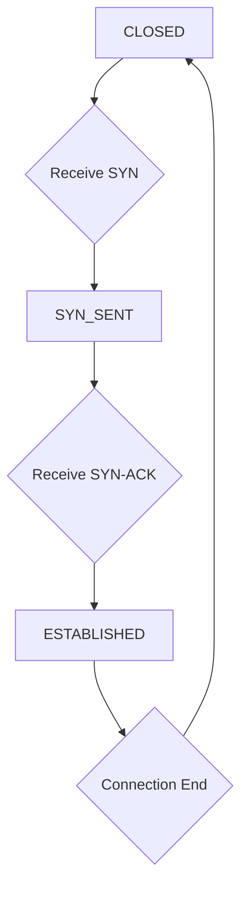

## Overview

Firewalls and Virtual Private Networks (VPNs) are fundamental components of network security, working together to protect networks from unauthorized access and ensure secure communication over potentially insecure channels. This section explores how firewalls inspect and control network traffic, while VPNs create encrypted tunnels for remote access and inter-network connectivity.

## Network Firewalls

A firewall is a network security device or software that monitors and controls incoming and outgoing network traffic based on predetermined security rules. It acts as a barrier between a trusted internal network and an untrusted external network, typically the internet.

### Types of Firewalls

#### Packet-Filtering Firewalls

Packet-filtering firewalls operate at the network layer (Layer 3) of the OSI model and examine individual packets based on:

- **Source IP Address**: Origin of the packet
- **Destination IP Address**: Intended recipient
- **Source Port**: Originating port number (for TCP/UDP)
- **Destination Port**: Target port number
- **Protocol**: TCP, UDP, ICMP, etc.

**Advantages:**
- Fast performance due to minimal processing
- Low resource requirements
- Transparency to applications

**Limitations:**
- Cannot inspect payload content
- No concept of connection state
- Vulnerable to IP spoofing attacks

```bash
# Example iptables rule (Linux packet filtering)
iptables -A INPUT -p tcp --dport 80 -j ACCEPT
iptables -A INPUT -p tcp --dport 22 -j DROP
```

#### Stateful Inspection Firewalls

Stateful firewalls track the state of active connections and make decisions based on the connection's context rather than individual packets.

**Key Characteristics:**
- Maintains a state table of active connections
- Understands TCP connection states (SYN, SYN-ACK, ACK, etc.)
- Can detect and block malformed packets
- Prevents unauthorized session hijacking

**Example TCP State Tracking:**


### Next-Generation Firewalls (NGFW)

NGFW combines traditional firewall functionality with advanced security features:

- **Application-Aware Filtering**: Recognizes and controls specific applications
- **Intrusion Prevention System (IPS)**: Active blocking of malicious traffic
- **Deep Packet Inspection (DPI)**: Examines packet contents beyond headers
- **SSL/TLS Inspection**: Decrypts and inspects encrypted traffic
- **User Identity Integration**: Access control based on user credentials

## Virtual Private Networks (VPNs)

VPNs create secure, encrypted connections over public networks, extending private networks across the internet.

### VPN Technologies

#### IPsec VPN

Internet Protocol Security (IPsec) operates at the network layer:

- **Authentication Header (AH)**: Provides integrity and authentication
- **Encapsulating Security Payload (ESP)**: Provides confidentiality, integrity, and authentication
- **Internet Key Exchange (IKE)**: Manages encryption keys and security associations

**IPsec Modes:**
- **Transport Mode**: Encrypts only the payload
- **Tunnel Mode**: Encrypts entire IP packets

```bash
# Example IPsec VPN configuration (StrongSwan)
conn office-vpn
    keyexchange=ikev2
    left=192.168.1.1
    right=10.0.0.1
    leftsubnet=192.168.0.0/24
    rightsubnet=10.0.0.0/24
    auto=start
```

#### SSL/TLS VPN

SSL/TLS VPNs operate at the application layer, providing secure remote access:

- **Clientless Access**: Browser-based access without client software
- **Full Tunneling**: All traffic routed through VPN
- **Split Tunneling**: Selective traffic routing

**Benefits:**
- No special client software required
- Works through firewalls and proxies
- Strong encryption (AES-256)

#### WireGuard

A modern VPN protocol known for simplicity and high performance:

- **Cryptokey Routing**: Uses public keys for peer identification
- **Noise Protocol Framework**: Provides authenticated encryption
- **Cross-Platform**: Available on Linux, Windows, macOS, Android, iOS

```ini
# Example WireGuard configuration
[Interface]
PrivateKey = <client-private-key>
Address = 10.0.0.2/24

[Peer]
PublicKey = <server-public-key>
Endpoint = server.example.com:51820
AllowedIPs = 0.0.0.0/0
```

### VPN Types by Connectivity

#### Remote Access VPN

Allows individual users to securely connect to a corporate network:

- **Client-to-Site**: Remote user connects to central VPN server
- **Always-On**: Automatic connection when device boots

#### Site-to-Site VPN

Connects entire networks (branch offices to headquarters):

- **Intranet VPN**: Connects multiple corporate sites
- **Extranet VPN**: Connects business partners

#### Cloud VPN

Integrates cloud resources with on-premises networks:

- **AWS VPN Gateway**: Managed VPN service for AWS connectivity
- **Azure VPN Gateway**: Microsoft's cloud VPN solution

## Firewall-VPN Integration

### VPN Gateways

Combines firewall and VPN functionality in a single device:

- **Unified Security Management**: Single console for all security policies
- **NAT Traversal**: Handles IP address translation challenges
- **Quality of Service (QoS)**: Prioritizes VPN traffic

### Security Considerations

#### Authentication Methods

- **Username/Password**: Basic but vulnerable to brute force
- **Certificate-Based**: Public key infrastructure (PKI) authentication
- **Multi-Factor Authentication (MFA)**: Additional security layer
- **Biometric Authentication**: Fingerprint or facial recognition

#### Encryption Standards

- **AES (Advanced Encryption Standard)**: 128, 192, or 256-bit keys
- **3DES (Triple DES)**: Legacy encryption, being phased out
- **ChaCha20-Poly1305**: Modern alternative, faster on mobile devices

### Common Security Issues

#### VPN Vulnerabilities

- **Man-in-the-Middle Attacks**: Intercepting unencrypted traffic
- **Weak Authentication**: Poor password policies
- **DNS Leaks**: VPN failure exposing DNS queries
- **IPv6 Leaks**: Modern devices leaking IPv6 traffic

#### Mitigation Strategies

- **Regular Certificate Rotation**: Prevents long-term credential compromise
- **Kill Switch**: Automatic disconnection on VPN failure
- **DNS Protection**: Force all DNS queries through VPN
- **IPv6 Blocking**: Prevent IPv6 traffic leaks

## Practical Implementation

### Firewall Rule Configuration

```bash
# Allow SSH from specific IP range
firewall-cmd --zone=public --add-rich-rule='rule family="ipv4" source address="192.168.1.0/24" service name="ssh" accept'

# Block all incoming traffic except established connections
iptables -P INPUT DROP
iptables -A INPUT -m conntrack --ctstate ESTABLISHED,RELATED -j ACCEPT
iptables -A INPUT -i lo -j ACCEPT
```

### VPN Setup Example

```bash
# OpenVPN server configuration
port 1194
proto tcp
dev tun
ca ca.crt
cert server.crt
key server.key
dh dh2048.pem
server 10.8.0.0 255.255.255.0
push "redirect-gateway def1 bypass-dhcp"
push "dhcp-option DNS 8.8.8.8"
push "dhcp-option DNS 8.8.4.4"
keepalive 10 120
cipher AES-256-CBC
user nobody
group nogroup
persist-key
persist-tun
status openvpn-status.log
verb 3
```

## Key Considerations

### Performance Impact

- **Firewall Latency**: Packet inspection adds processing overhead
- **VPN Throughput**: Encryption/decryption consumes CPU resources
- **Hardware Acceleration**: Dedicated crypto processors improve performance

### Scalability

- **Connection Limits**: Maximum concurrent VPN connections
- **Bandwidth Management**: Traffic shaping and prioritization
- **Load Balancing**: Distributing VPN connections across multiple devices

### Compliance and Standards

- **PCI DSS**: Payment Card Industry Data Security Standard
- **HIPAA**: Health Insurance Portability and Accountability Act
- **GDPR**: General Data Protection Regulation compliance

Firewalls and VPNs remain critical components of comprehensive network security strategies, providing both access control and secure connectivity. Modern implementations must evolve with emerging threats, incorporating advanced inspection capabilities and robust encryption methods.
