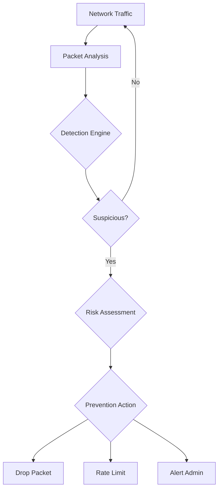

## Overview

Intrusion Detection Systems (IDS) and Intrusion Prevention Systems (IPS) are critical security technologies that monitor network traffic and system activities for malicious activities or policy violations. While IDS focuses on detection and alerting, IPS extends this capability to actively block or prevent detected threats. Together, they form a layered defense strategy against evolving cyber threats.

## Intrusion Detection Systems (IDS)

An IDS is a security solution that monitors network traffic or system activities for suspicious behavior and alerts administrators to potential security incidents. It acts as a "security camera" that records and reports unusual activities but does not intervene directly.

### Types of IDS

#### Network-Based IDS (NIDS)

NIDS monitors and analyzes network traffic at strategic points within the network infrastructure:

**Deployment Locations:**
- **Network Segments**: Monitoring major traffic pathways
- **Network Perimeter**: Protecting external boundaries
- **Internal Networks**: Detecting lateral movement threats
- **DMZ Zones**: Protecting publicly accessible servers

**Data Sources:**
- Packet captures from network interfaces
- Deep packet inspection of traffic contents
- Protocol analysis for anomalies
- Flow data aggregation

#### Host-Based IDS (HIDS)

HIDS operates on individual host systems, monitoring system calls, file system changes, and local network activity:

**Key Monitoring Areas:**
- **System Calls**: Tracking kernel-level operations
- **File Integrity**: Detecting changes to critical files
- **Log Analysis**: Reviewing system and application logs
- **Process Activity**: Monitoring running processes for anomalies

**Advantages:**
- Detailed host-specific context
- Detection of internal threats
- Immune to network encryption effects

```bash
# Example OSSEC HIDS configuration
<localfile>
    <log_format>syslog</log_format>
    <location>/var/log/auth.log</location>
</localfile>

<rules>
    <rule id="1001" level="5">
        <if_sid>500</if_sid>
        <match>authentication failure</match>
        <description>SSH authentication failure</description>
    </rule>
</rules>
```

### Detection Methods

#### Signature-Based Detection

Signature-based IDS compares observed activities against known attack patterns stored in a database:

- **Exact Matching**: Identifying known malware signatures
- **Pattern Recognition**: Detecting specific exploit sequences
- **String Matching**: Searching for known malicious code fragments

**Advantages:**
- High accuracy for known threats
- Low false positive rates
- Fast processing and minimal resources

**Limitations:**
- Cannot detect zero-day attacks
- Requires frequent signature updates
- Ineffective against polymorphic malware

#### Anomaly-Based Detection

Anomaly detection establishes "normal" behavior baselines and flags deviations:

- **Statistical Analysis**: Using mathematical models of normal behavior
- **Machine Learning**: AI-powered pattern recognition
- **Threshold-Based**: Alerting when metrics exceed predefined bounds

**Machine Learning Approaches:**
- **Supervised Learning**: Training on labeled normal/abnormal data
- **Unsupervised Learning**: Discovering patterns in unlabeled data
- **Reinforcement Learning**: Adapting to changing environments

**Example Statistical Model:**
```
Normal CPU Usage: μ = 45%, σ = 10%
Threshold: Alert if usage > μ + 3σ (= 75%)
```

#### Behavior-Based Detection

Behavior-based systems monitor activities that indicate malicious intent rather than specific signatures:

- **Heuristic Analysis**: Applying rules about suspicious behavior
- **Sandboxing**: Isolating and observing potentially dangerous processes
- **Reputation Analysis**: Evaluating file and IP address reputations

## Intrusion Prevention Systems (IPS)

IPS extends IDS capabilities by automatically responding to detected threats, preventing them from succeeding rather than just alerting about them.

### Types of IPS

#### Network-Based IPS (NIPS)

NIPS sits inline with network traffic, actively inspecting and blocking malicious packets:

- **Real-Time Analysis**: Inspecting traffic as it passes through
- **Active Response**: Dropping or modifying suspicious packets
- **Traffic Shaping**: Prioritizing legitimate traffic during attacks

**Response Actions:**
- **Packet Dropping**: Discarding malicious packets
- **Connection Reset**: Terminating suspicious TCP connections
- **Traffic Rate Limiting**: Reducing bandwidth for attacking hosts
- **Shunning**: Blacklisting attacker IP addresses

#### Host-Based IPS (HIPS)

HIPS operates on individual systems, monitoring and preventing malicious host activities:

- **System Call Interception**: Blocking dangerous kernel operations
- **Application Behavior**: Monitoring program actions for violations
- **File Protection**: Preventing unauthorized file modifications

### Integration with IDS

Many modern systems combine IDS and IPS functionalities:

#### Hybrid Systems (IDPS)

- **Detection First**: Analyze traffic patterns
- **Prevention Second**: Take action based on analysis
- **Adaptive Responses**: Adjusting prevention strength based on confidence levels

**Workflow Example:**


## Detection Techniques

### Advanced Persistent Threat (APT) Detection

Specialized techniques for detecting sophisticated, long-term attacks:

- **Lateral Movement Detection**: Identifying attempts to spread within networks
- **Command and Control (C2) Communication**: Recognizing botnet communications
- **Data Exfiltration**: Monitoring unusual outbound traffic patterns

### Zero-Day Attack Detection

Strategies for identifying previously unknown threats:

- **Machine Learning Models**: Training on general attack characteristics
- **Behavioral Analysis**: Looking for unusual system behaviors
- **Reputation Systems**: Evaluating unknown files against community intelligence

## Implementation Considerations

### Deployment Architectures

#### Inline vs Passive Deployment

- **Inline Deployment**: IPS sits directly in traffic path
  - Immediate prevention capabilities
  - Potential for blocking legitimate traffic (false positives)
  - May introduce latency

- **Passive Deployment**: IDS monitors traffic copies
  - No impact on network performance
  - No false positives can block legitimate traffic
  - Requires separate prevention mechanisms

#### Distributed vs Centralized

- **Distributed IDS/IPS**: Sensors at multiple network points
  - Better coverage and scalability
  - Coordination challenges
  - Higher management complexity

- **Centralized Management**: Single console for all sensors
  - Unified policy management
  - Correlated threat intelligence
  - Single point of failure concern

### Performance Optimization

#### Traffic Handling

- **High-Speed Networks**: Multi-gigabit throughput requirements
- **Traffic Sampling**: Analyzing representative subsets
- **Load Balancing**: Distributing analysis across multiple systems

#### Resource Management

- **Signature Optimization**: Efficient pattern matching algorithms
- **Memory Usage**: Streamlined detection engine memory footprint
- **CPU Acceleration**: Hardware-assisted pattern matching

### Signature Management

#### Update Strategies

- **Automated Updates**: Regular signature database refresh
- **Staged Deployment**: Testing updates before production deployment
- **Custom Signatures**: Creating organization-specific detection rules

**Custom Signature Example (Snort):**
```
alert tcp any any -> $HTTP_SERVERS $HTTP_PORTS (msg:"SQL Injection Attempt"; \
pcre:"/union.*select/i"; sid:1000001; rev:1;)
```

## Response and Integration

### Alert Management

#### Alert Classification

- **False Positives**: Legitimate activities flagged as threats
- **True Positives**: Actual malicious activities detected
- **False Negatives**: Threats not detected by the system
- **True Negatives**: Correctly identified normal activities

#### Correlation and Context

- **Event Correlation**: Connecting related security events
- **Threat Intelligence Integration**: Enriching alerts with external data
- **Risk Assessment**: Evaluating threat severity and business impact

### Integration with Other Security Controls

#### SIEM Integration

Security Information and Event Management systems provide unified analysis:

- **Log Aggregation**: Collecting IDS/IPS logs with other security data
- **Correlation Rules**: Identifying complex attack patterns
- **Automated Response**: Orchestrating coordinated defense actions

#### Endpoint Protection Platform (EPP) Coordination

- **Host-Based IPS**: Complementing network-level protection
- **EDR Integration**: Providing detailed host context to network alerts
- **Unified Policies**: Consistent security rules across network and endpoints

## Key Considerations

### Effectiveness Metrics

#### Detection Accuracy

- **True Positive Rate (TPR)**: Percentage of threats correctly detected
- **False Positive Rate (FPR)**: Legitimate activities incorrectly flagged
- **Precision and Recall**: Balancing detection coverage vs alert quality

#### Performance Metrics

- **Throughput**: Amount of traffic processed without degradation
- **Latency**: Processing delay introduced by the system
- **Resource Utilization**: CPU, memory, and storage requirements

### Challenges and Limitations

#### Encrypted Traffic

- **SSL/TLS Inspection**: Decrypting traffic for analysis (requires keys)
- **Encrypted Channel Detection**: Identifying malicious patterns in metadata
- **Performance Impact**: CPU-intensive decryption and re-encryption

#### Advanced Threats

- **Polymorphic Malware**: Code that changes to avoid signature detection
- **Fileless Attacks**: Memory-resident threats with no disk signatures
- **Living-off-the-Land**: Using legitimate tools for malicious purposes

#### Operational Challenges

- **Alert Fatigue**: High false positive rates overwhelming analysts
- **Maintenance Overhead**: Regular updates and tuning requirements
- **Integration Complexity**: Coordinating with other security tools

## Best Practices

### Deployment Guidelines

1. **Risk Assessment**: Understanding specific network threats and vulnerabilities
2. **Pilot Testing**: Evaluating performance in non-production environments
3. **Phased Rollout**: Gradual deployment with monitoring and adjustments
4. **Documentation**: Clear policies for alert handling and response procedures

### Tuning and Optimization

1. **Baseline Establishment**: Learning normal network behavior over time
2. **Threshold Adjustment**: Fine-tuning sensitivity based on environment
3. **Whitelisting**: Excluding known legitimate traffic from inspection
4. **Regular Review**: Periodic evaluation and adjustment of rules and signatures

### Maintenance and Enhancement

1. **Regular Audits**: Reviewing system effectiveness and configuration
2. **Staff Training**: Ensuring security teams understand system capabilities
3. **Vendor Coordination**: Staying current with security intelligence updates
4. **Technology Refresh**: Planning for system upgrades and replacements

IDS and IPS systems provide essential visibility and protection capabilities, but their effectiveness depends on proper implementation, continuous tuning, and integration with broader security strategies. Modern deployments increasingly leverage machine learning and AI to improve detection accuracy and reduce operational overhead.
