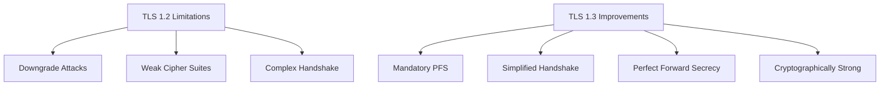

## Overview

Secure Sockets Layer (SSL) and its successor Transport Layer Security (TLS) are the cornerstone protocols for securing internet communications, providing confidentiality, integrity, and authentication. These protocols encrypt data in transit between applications, websites, and users, ensuring that sensitive information like passwords, credit card numbers, and personal data remain secure from eavesdropping and tampering.

## Protocol Evolution

### SSL Development History

SSL was developed by Netscape in the mid-1990s:

- **SSL 1.0**: Never publicly released due to security flaws
- **SSL 2.0 (1995)**: First public version with major vulnerabilities
- **SSL 3.0 (1996)**: Addressed SSL 2.0 weaknesses but still deprecated
- **Transition to TLS**: IETF took over standardization from Netscape

### TLS Standardization

TLS built upon SSL while maintaining backward compatibility:

- **TLS 1.0 (1999)**: RFC 2246, significant improvements over SSL 3.0
- **TLS 1.1 (2006)**: RFC 4346, added protection against certain attacks
- **TLS 1.2 (2008)**: RFC 5246, major improvements in cipher suites and security
- **TLS 1.3 (2018)**: RFC 8446, substantial security and performance enhancements

## TLS Protocol Architecture

TLS operates as a layered protocol between the application layer and transport layer:

```
+-------------------------+
|      Application        |
+-------------------------+
| Presentation/Encryption |
|         (TLS)           |
+-------------------------+
|      Transport          |
|       (TCP/UDP)         |
+-------------------------+
|       Network           |
+-------------------------+
```

### Subprotocols

TLS consists of four main subprotocols:

- **Handshake Protocol**: Establishes secure connection parameters
- **Record Protocol**: Provides confidentiality and message integrity
- **Alert Protocol**: Signals protocol errors and warnings
- **Change Cipher Spec Protocol**: Signals cipher suite changes

## TLS Handshake Process

The handshake establishes cryptographic parameters for secure communication:

### TLS 1.2 Handshake Flow

```
Client                    Server
  |                         |
  |      ClientHello       -->  (Protocol version, cipher suites, random)
  |                         |
  |                         <--   ServerHello (Chosen cipher suite, random, server cert)
  |                         |     Certificate*
  |                         |     ServerKeyExchange*
  |                         |     CertificateRequest*
  |
  |    Client Certificate* -->     (Client cert if requested)
  |    ClientKeyExchange   -->     (Pre-master secret exchange)
  |    CertificateVerify*  -->     (Proof of certificate ownership)
  |    ChangeCipherSpec    -->     (Activate negotiated parameters)
  |    Finished            -->     (Verify handshake integrity)
  |
  |                         <--   ChangeCipherSpec
  |                         <--   Finished
  |
  |  Encrypted data can    |
  |     now flow           |
```

#### Handshake Message Details

- **ClientHello**: Lists client's capabilities and preferences
- **ServerHello**: Selects protocol parameters and cipher suite
- **Certificate**: Server presents its certificate chain
- **ServerKeyExchange**: Provides key exchange parameters for certain cipher suites
- **ClientKeyExchange**: Client sends encrypted pre-master secret

### TLS 1.3 Simplified Handshake

TLS 1.3 reduced handshake complexity and latency:

```
Client                    Server
  |            ClientHello    -->  (Key Share extension)
  |                         |
  |                         <--   ServerHello
  |                         |     EncryptedExtensions
  |                         |     Certificate
  |                         |     CertificateVerify
  |                         |     Finished
  |
  |        Finished         -->     (Verify server authentication)
  |
  |   Application Data     <-->    (0-RTT or 1-RTT data)
```

**Key Improvements:**
- **1-RTT Handshake**: Full authentication in one round trip
- **0-RTT Resumption**: Encrypted data in zero round trips for resumption
- **Forward Secrecy**: Mandatory for all cipher suites

## Cryptographic Operations

### Key Exchange Methods

#### RSA Key Exchange (Legacy)

- **Server Certificate**: Contains RSA public key
- **Pre-Master Secret**: Client generates and encrypts with server's public key
- **Master Secret Derivation**: Both sides derive symmetric keys

#### Diffie-Hellman Key Exchange

**Ephemeral Diffie-Hellman (DHE):**
- **Fresh Parameters**: New DH parameters for each handshake
- **Perfect Forward Secrecy**: Past sessions protected even if private key compromised
- **Computational Overhead**: More expensive than RSA exchange

**Elliptic Curve Diffie-Hellman (ECDHE):**
- **Smaller Key Sizes**: Equivalent security with smaller keys (P-256 ≈ 3072-bit RSA)
- **Faster Operations**: More efficient cryptographic operations

### Authentication

#### Client Certificate Authentication

- **Server Requests Certificate**: Server sends CertificateRequest message
- **Client Responds**: Client sends certificate if available
- **Server Validates**: Server verifies certificate and client possession

```
# Example: MTLS (Mutual TLS)
# Server configuration
ssl_verify_client on;
ssl_client_certificate /path/to/ca.pem;

# Client configuration
curl --cert client.pem --key client.key https://server.example.com/
```

#### Certificate Validation

- **Signature Verification**: Validate certificate chain to trusted root
- **Revocation Checking**: OCSP or CRL verification
- **Name Matching**: Ensure certificate matches domain/identity

## Cipher Suites

Cipher suites define the cryptographic algorithms used in a TLS connection:

### Suite Structure

**Format:** `TLS_[KeyExchange]_[Authentication]_[Cipher]_[Hash]`

**Example:** `TLS_ECDHE_RSA_WITH_AES_128_GCM_SHA256`

- **TLS**: Protocol version
- **ECDHE**: Ephemeral Elliptic Curve Diffie-Hellman key exchange
- **RSA**: RSA authentication (certificate signature)
- **AES_128_GCM**: AES encryption with 128-bit key in Galois/Counter Mode
- **SHA256**: SHA-256 hash for integrity

### Forward Secrecy

Cipher suites providing forward secrecy ensure past communications remain secure:

```bash
# Forward secrecy cipher suites
TLS_ECDHE_RSA_WITH_AES_128_GCM_SHA256
TLS_ECDHE_RSA_WITH_AES_256_GCM_SHA384
TLS_DHE_RSA_WITH_AES_128_GCM_SHA256
TLS_DHE_RSA_WITH_AES_256_GCM_SHA384
```

### TLS 1.3 Cipher Suites

Simplified format with mandatory forward secrecy:

```bash
# TLS 1.3 cipher suites
TLS_AES_128_GCM_SHA256
TLS_AES_256_GCM_SHA384
TLS_CHACHA20_POLY1305_SHA256
```

## Certificate Management

### Certificate Types

#### Server Certificates

- **Domain Validation (DV)**: Basic domain ownership verification
- **Organization Validation (OV)**: Business identity verification
- **Extended Validation (EV)**: Highest trust level with company validation

#### Client Certificates

- **Personal Certificates**: Individual user authentication
- **Device Certificates**: Machine or device identity
- **Application Certificates**: Service-to-service authentication

### Certificate Lifecycles

#### Enrollment

```bash
# Certificate request generation
openssl req -new -newkey rsa:2048 -nodes -keyout server.key -out server.csr \
  -subj "/C=US/ST=State/L=City/O=Organization/CN=example.com"

# Certificate issuance (CA)
openssl x509 -req -in server.csr -CA ca.pem -CAkey ca.key -CAcreateserial \
  -out server.crt -days 365 -sha256
```

#### Renewal and Rotation

- **Automated Renewal**: ACME protocol (Let's Encrypt)
- **Key Rotation**: Generating new key pairs periodically
- **Certificate Pinning**: Avoiding reliance on CA trust for specific certificates

## SSL/TLS Security Considerations

### Protocol Attacks

#### POODLE Attack

Padding Oracle On Downgraded Legacy Encryption:

- **Affected**: SSL 3.0 and TLS 1.0 implementation weaknesses
- **Mitigation**: Disable SSL 3.0, implement proper padding validation
- **Current Status**: No longer applicable to modern deployments

#### Heartbleed

OpenSSL library vulnerability:

- **Impact**: Memory leak exposing sensitive data
- **Affected Versions**: OpenSSL 1.0.1 through 1.0.1f
- **Mitigation**: Upgrade OpenSSL, regenerate affected certificates and keys

#### BEAST Attack

Browser Exploit Against SSL/TLS:

- **Method**: Exploits CBC mode padding to decrypt cookies
- **Mitigation**: TLS 1.1+ fixes, prioritize GCM mode cipher suites

#### DROWN Attack

Decrypting RSA with Obsolete and Weakened Encryption:

- **Cross-Protocol Attack**: Uses SSLv2 to break TLS encryption
- **Mitigation**: Disable SSLv2, use RSA key exchange with PFS

### Current Best Practices

#### Configuration Recommendations

```nginx
# Strong TLS configuration (nginx example)
ssl_protocols TLSv1.2 TLSv1.3;
ssl_ciphers ECDHE-RSA-AES128-GCM-SHA256:ECDHE-RSA-AES256-GCM-SHA384;

ssl_prefer_server_ciphers off;  # Client cipher preferences in TLS 1.3
ssl_session_cache shared:SSL:10m;
ssl_session_timeout 10m;

# HSTS header
add_header Strict-Transport-Security "max-age=63072000; includeSubDomains; preload";

# Certificate settings
ssl_certificate /path/to/fullchain.pem;
ssl_certificate_key /path/to/privkey.pem;

# OCSP stapling
ssl_stapling on;
ssl_stapling_verify on;
ssl_trusted_certificate /path/to/chain.pem;
```

### SSL Stripping Prevention

Defending against downgrade attacks:

- **HSTS (HTTP Strict Transport Security)**: Forces HTTPS usage
- **HSTS Preloading**: Browsers preloaded with HTTPS sites
- **Certificate Pinning**: Validates certificates against expected fingerprints

### TLS 1.3 Security Features

Major security improvements in TLS 1.3:



## Performance Optimization

### Connection Reuse

#### Session Resumption

- **Session IDs**: Resuming previous TLS sessions with same session keys
- **Session Tickets**: Stateless session resumption using encrypted ticket
- **PSKs**: Pre-shared keys for zero-RTT resumption

#### Connection Pooling

- **HTTP/2**: Multiplexed connections over single TLS connection
- **Connection Reuse**: Maintaining persistent TLS connections
- **Early Data**: Sending application data in first flight (0-RTT)

### Cryptographic Acceleration

#### Hardware Acceleration

- **AES-NI**: Intel's AES acceleration instructions
- **ECC Acceleration**: Hardware support for elliptic curve operations
- **Offloading**: SSL/TLS termination on dedicated hardware/devices

### Certificate Optimization

#### OCSP Stapling

Server obtains OCSP response and includes it in handshake:

```nginx
# OCSP stapling configuration
ssl_stapling on;
ssl_stapling_verify on;
resolver 8.8.8.8 8.8.4.4 valid=300s;
resolver_timeout 5s;
```

Benefits:
- Eliminates client OCSP requests
- Faster handshakes
- Improved privacy

#### Certificate Compression

Reducing certificate transmission size in TLS 1.3:

- **Brotli Compression**: General-purpose compression algorithm
- **Certificate-Only Compression**: Compress certificate but not handshake messages
- **Size Reduction**: Up to 85% reduction in certificate size

## Monitoring and Troubleshooting

### TLS Connection Analysis

#### Diagnostic Tools

```bash
# Test TLS connection
openssl s_client -connect example.com:443 -servername example.com -tls1_3

# SSL Labs test
curl https://www.ssllabs.com/ssltest/analyze.html?d=example.com

# Cipher suite enumeration
nmap --script ssl-enum-ciphers -p 443 example.com
```

#### Common Issues

- **Certificate Chain Problems**: Missing intermediate certificates
- **Protocol Mismatch**: Client and server don't support common TLS version
- **Cipher Suite Negotiation**: No mutually supported cipher suites
- **OCSP/CRL Issues**: Certificate revocation checking failures

### Security Monitoring

#### Certificate Expiry Monitoring

- **Automated Alerts**: Notifications before certificate expiration
- **Certificate Transparency Logs**: Monitoring for unauthorized certificates
- **HSTS Preload Monitoring**: Ensuring domain inclusion in preload lists

#### TLS Traffic Analysis

- **DPI (Deep Packet Inspection)**: Analyzing encrypted traffic patterns
- **TLS Fingerprinting**: Identifying applications by TLS characteristics
- **Anomaly Detection**: Detecting unusual TLS handshake patterns

## Future of TLS

### Post-Quantum TLS

Preparing for quantum computing threats:

#### Hybrid Cryptography

- **Classical + PQ Algorithms**: Combining existing and quantum-resistant algorithms
- **Migration Path**: Smooth transition to post-quantum cryptography
- **Key Encapsulation Mechanisms**: X25519 + Kyber for hybrid key exchange

### TLS 2.0 Development

Emerging standards for enhanced security:

- **Delegated Credentials**: Shorter-lived credentials for improved revocation
- **GREASE**: Generate Random Extensions And Sustain Extensibility
- **Certificate Authority Authorization**: CAA records for DNS-based CA authorization

### Zero Trust Integration

Aligning TLS with zero trust architectures:

- **Identity-Aware Proxies**: Making routing decisions based on user identity
- **Continuous Authentication**: Re-evaluating access throughout session
- **Micro-Segmentation**: TLS-based isolation between application components

SSL/TLS remains the fundamental protocol securing internet communications, continuously evolving to address new threats and performance requirements. Understanding these protocols in depth is crucial for implementing robust security in modern network architectures.
