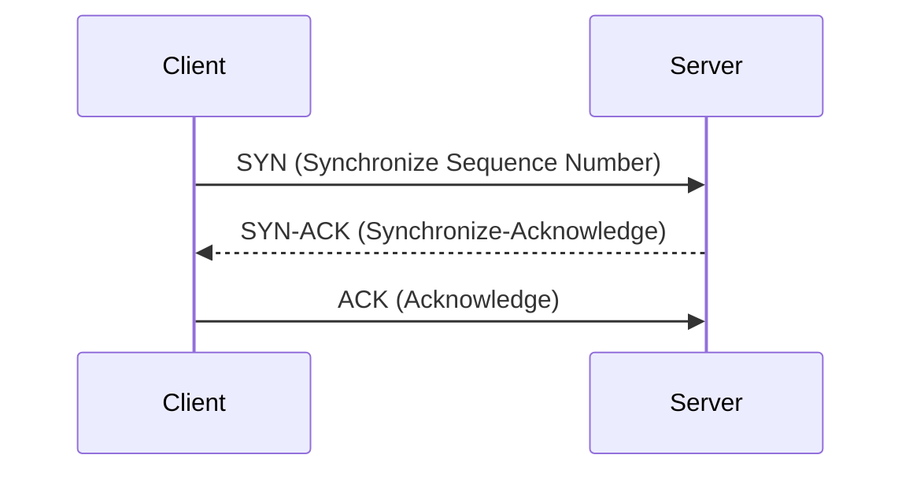

# TCP (Transmission Control Protocol)

**TCP (Transmission Control Protocol)** is a core protocol of the Internet Protocol Suite. It is a connection-oriented protocol that provides reliable, ordered, and error-checked delivery of a stream of octets between applications running on hosts communicating over an IP network.

## TCP 3-Way Handshake

Before data can be exchanged, TCP establishes a connection using a three-way handshake:

1.  **SYN**: The client sends a SYN packet to the server to initiate a connection.
2.  **SYN-ACK**: The server receives the SYN packet, acknowledges it with a SYN-ACK packet, and sends its own SYN to the client.
3.  **ACK**: The client receives the SYN-ACK packet and acknowledges it with an ACK packet. At this point, the connection is established.

## TCP Congestion Control

TCP employs several mechanisms to prevent network congestion and ensure fair usage of network resources:

-   **Slow Start**: When a TCP connection begins, the congestion window (cwnd) starts small and increases exponentially with each successful acknowledgment. This allows TCP to probe the network's capacity.
-   **Congestion Avoidance**: Once the congestion window reaches a certain threshold, it switches to a linear increase, adding one segment per round-trip time. This is a more conservative approach to avoid overwhelming the network.
-   **Fast Retransmit**: If a sender receives three duplicate ACKs for the same data segment, it assumes that segment is lost and retransmits it immediately without waiting for a retransmission timeout.
-   **Fast Recovery**: After a fast retransmit, TCP enters fast recovery, where it halves the congestion window and then continues with congestion avoidance.

## Connection-Oriented vs. Connectionless

-   **Connection-Oriented**: TCP is a connection-oriented protocol, meaning it establishes a dedicated logical connection between the sender and receiver before any data is transmitted. This ensures reliable delivery, ordered packets, and error checking.
-   **Connectionless**: In contrast, connectionless protocols (like UDP) do not establish a connection beforehand. They simply send data packets without any guarantee of delivery or order.
