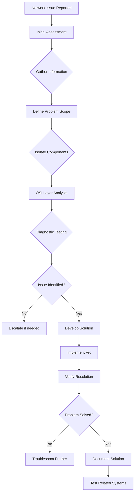
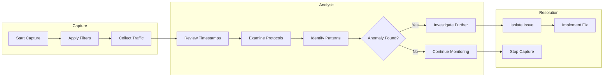
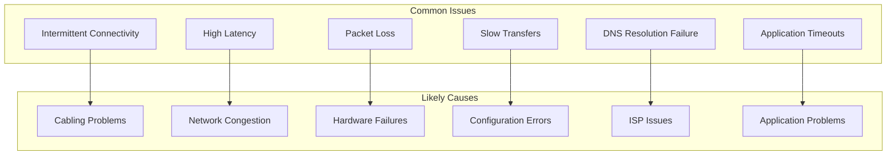

# Network Troubleshooting

This section provides systematic approaches and essential tools for diagnosing, troubleshooting, and resolving network-related problems. Effective troubleshooting requires understanding both the theoretical framework of network operations and practical diagnostic techniques. Whether dealing with connectivity issues, performance problems, or security concerns, these methodologies and tools form the foundation of network maintenance and problem resolution.

## Overview

Network troubleshooting is both an art and a science, requiring methodical investigation combined with deep understanding of network protocols and infrastructure. Modern networks depend on reliable connectivity, making the ability to quickly identify and resolve issues critical for business continuity.

This section covers essential troubleshooting methodologies, diagnostic tools, traffic analysis techniques, and common problem patterns. By mastering these skills, network engineers can minimize downtime, optimize performance, and ensure network reliability.

## Troubleshooting Methodology

### Systematic Problem Resolution

Effective network troubleshooting follows structured approaches:

**Problem Identification:**
- **Gather Information**: Collect symptoms, error messages, and affected systems
- **Reproduce the Issue**: Confirm problem conditions and triggers
- **Define Scope**: Determine if issue is isolated or widespread

**Root Cause Analysis:**
- **Layer-by-Layer Investigation**: OSI model-guided troubleshooting
- **Divide and Conquer**: Narrow down possibilities systematically
- **Hypothesize and Test**: Form theories and validate with diagnostics

**Resolution and Verification:**
- **Implement Fixes**: Apply solutions systematically
- **Test Thoroughly**: Verify resolution across all affected systems
- **Document Findings**: Record problem and solution for future reference



## Basic Connectivity Diagnostics

### Ping and Traceroute Analysis

**Ping Diagnostics:**
- **Packet Loss Detection**: Identify dropped packets between hosts
- **Latency Measurement**: Measure round-trip time for connectivity
- **MTU Discovery**: Determine maximum transmission unit between hosts

**Traceroute Investigation:**
- **Path Discovery**: Map network path to destination
- **Hop-by-Hop Analysis**: Identify where packets are dropped or delayed
- **Path Changes**: Detect routing instabilities or ISP issues

**Common Ping Patterns:**
```bash
# Normal response
64 bytes from 8.8.8.8: icmp_seq=1 ttl=57 time=12.3 ms

# Packet loss indication
ping: sendto: Host is down

# High latency
64 bytes from 10.0.0.1: icmp_seq=1 ttl=64 time=500.0 ms
```

### Network Statistics and Port Scanning

**Netstat Network Analysis:**
- **Active Connections**: View established and listening ports
- **Routing Tables**: Examine system routing configuration
- **Interface Statistics**: Monitor packet counts and errors

**Nmap Network Discovery:**
- **Host Discovery**: Identify active devices on network
- **Service Detection**: Determine running services and versions
- **OS Fingerprinting**: Identify operating systems remotely
- **Vulnerability Scanning**: Detect potential security weaknesses

```bash
# Basic host discovery
nmap -sn 192.168.1.0/24

# Service and version detection
nmap -sV -O 192.168.1.1

# Network scanning with aggressive timing
nmap -T4 -A 192.168.1.0/24
```

## Traffic Capture and Analysis

### Wireshark Packet Analysis

**Traffic Capture Fundamentals:**
- **Capture Filters**: Limit captured traffic for focus
- **Display Filters**: Filter displayed packets for analysis
- **Protocol Dissector**: Deep inspection of protocol fields

**Common Analysis Scenarios:**
- **Connection Issues**: TCP handshake analysis for failed connections
- **Slow Performance**: Packet timing and retransmission examination
- **Security Incidents**: Anomaly detection in traffic patterns

**Packet Analysis Workflow:**


### Advanced Packet Examination

**TCP Stream Reassembly:**
- **Conversational Flow**: Reconstruct complete data streams
- **Sequence Number Analysis**: Detect missing or reordered packets
- **Window Size Monitoring**: Identify throughput limitations

**Protocol-Specific Analysis:**
- **HTTP Troubleshooting**: Examine request/response cycles
- **DNS Resolution**: Track name resolution processes
- **VPN Connectivity**: Analyze tunnel establishment failures

## Performance Monitoring and Latency Analysis

### Network Latency and Jitter Measurement

**Latency Components:**
- **Propagation Delay**: Time for signal to travel physical distance
- **Transmission Delay**: Time to push data onto network
- **Processing Delay**: Time for devices to process packets
- **Queuing Delay**: Time packets wait in buffers

**Jitter Analysis:**
- **Jitter Calculation**: Statistical variation in packet delay
- **Quality Impact**: Effects on VoIP, video, and real-time applications
- **Buffer Requirements**: Sizing playback buffers for variable latency

**Measurement Techniques:**
```bash
# Round-trip time measurement
ping -c 10 google.com

# Real-time latency monitoring
mtr google.com

# Packet capture timing analysis
tshark -r capture.pcap -T fields -e frame.time_relative
```

### Quality of Service (QoS) Diagnostics

**QoS Parameter Monitoring:**
- **Packet Loss**: Identification of dropped packets
- **Bandwidth Utilization**: Measurement of link consumption
- **Error Rates**: Tracking of corrupted packets

**Application Performance:**
- **VoIP Quality**: MOS scores for voice call quality
- **Video Streaming**: Buffering events and quality degradation
- **Interactive Applications**: Responsiveness and user experience metrics

## Common Network Issues and Patterns

### Connectivity Problems

**Physical Layer Issues:**
- **Cable Faults**: Broken or damaged network cables
- **Hardware Failures**: Faulty NICs, switches, or connectors
- **EMI Interference**: Electrical interference disrupting signals

**Network Layer Problems:**
- **Routing Issues**: Missing or incorrect routes
- **IP Configuration**: Wrong IP addresses, subnet masks, gateways
- **DNS Failures**: Name resolution problems

**Application Layer Concerns:**
- **Service Unavailability**: Applications not responding
- **Authentication Issues**: Login and access problems
- **Certificate Errors**: SSL/TLS related connectivity issues

### Performance Bottlenecks

**Capacity Limitations:**
- **Bandwidth Saturation**: Link utilization exceeding capacity
- **Buffer Overflows**: Device buffers filling up and dropping packets
- **CPU Limitations**: Network devices running out of processing capacity

**Configuration Issues:**
- **Duplex Mismatches**: Speed/duplex negotiation problems
- **MTU Mismatches**: Maximum transmission unit inconsistencies
- **QoS Misconfiguration**: Traffic prioritization problems



### Wireless-Specific Troubleshooting

**Wi-Fi Connectivity Issues:**
- **Signal Strength**: Weak signals causing connection drops
- **Channel Interference**: Overlapping wireless channels
- **Authentication Problems**: WPA/WPA2/WPA3 configuration issues

**Mobile Connectivity:**
- **4G/5G Signal Issues**: Poor cellular coverage
- **SIM Card Problems**: Card damage or configuration errors
- **Network Registration**: Device not properly attached to carrier network

## Security Incident Response

### Intrusion Detection

**IDS/IPS Alert Analysis:**
- **Signature-Based Detection**: Known attack pattern recognition
- **Anomaly-Based Detection**: Unusual traffic behavior identification
- **Heuristics Analysis**: Advanced threat pattern detection

**Behavioral Analysis:**
- **Traffic Profiling**: Baseline behavior comparison
- **Connection Anomalies**: Unusual source/destination pairs
- **Volume Spikes**: Sudden increases in traffic levels

### Forensics and Log Analysis

**System Log Examination:**
- **Event Correlation**: Connect related log entries across systems
- **Timeline Reconstruction**: Chronological event sequencing
- **Evidence Preservation**: Maintaining forensic integrity

**Network Forensic Tools:**
- **Netflow Analysis**: Traffic flow pattern examination
- **Packet Reconstruction**: Rebuilding complete sessions from fragments
- **Malware Analysis**: Extracting indicators from captured traffic

## Automation and Monitoring

### Scripting Diagnostics

**Automated Testing Scripts:**
```bash
#!/bin/bash
# Automated connectivity test
TARGETS=("google.com" "8.8.8.8" "192.168.1.1")
LOG_FILE="/var/log/network_health.log"

for target in "${TARGETS[@]}"; do
    echo "$(date): Testing connectivity to $target" >> $LOG_FILE
    ping -c 3 $target >> $LOG_FILE 2>&1
    traceroute -m 10 $target >> $LOG_FILE 2>&1
    echo "----------------------------------------" >> $LOG_FILE
done
```

### Continuous Monitoring

**Network Monitoring Best Practices:**
- **Baseline Establishment**: Normal network behavior profiling
- **Threshold Setting**: Alert triggers for performance deviations
- **Automated Remediation**: Scripted responses to common issues

**Monitoring Tools Integration:**
- **SNMP Pollers**: Device health and performance monitoring
- **NetFlow Collectors**: Traffic pattern and utilization tracking
- **Log Aggregation**: Centralized logging and correlation

## Best Practices for Network Engineers

### Documentation and Preparation

- **Network Diagrams**: Keep accurate topology documentation
- **Configuration Backups**: Regular backups of device configurations
- **Change Management**: Track and approve network modifications
- **Runbooks**: Documented procedures for common problems

### Proactive Maintenance

- **Regular Audits**: Periodic network health assessments
- **Firmware Updates**: Keep network devices current with patches
- **Capacity Planning**: Monitor utilization and plan for growth
- **Redundancy Testing**: Verify failover mechanisms function correctly

### Skill Development

- **Tool Proficiency**: Master both basic and advanced diagnostic tools
- **Protocol Knowledge**: Deep understanding of network protocol operations
- **Vendor Specifics**: Familiarity with equipment from different manufacturers
- **Soft Skills**: Communication and coordination during incident response

Network troubleshooting is an essential skill for maintaining reliable and efficient network infrastructure. By combining systematic methodologies with powerful diagnostic tools, network engineers can quickly identify and resolve issues, minimizing business impact and maintaining optimal network performance.


