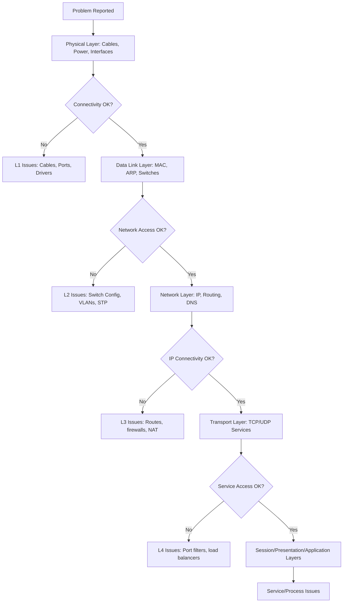

# Common Network Issues & Debugging

This guide provides systematic approaches to identify, diagnose, and resolve common network issues. Network troubleshooting requires methodical investigation, from physical connections to application-level problems.

## Network Troubleshooting Methodology

### The OSI Model Approach



### Systematic Investigation Steps

1. **Gather Information**
   - Problem description and symptoms
   - Environment details (OS, network config)
   - Recent changes
   - Affected users/systems

2. **Establish Scope**
   - Local or remote issue?
   - Single system or network-wide?
   - Intermittent or persistent?

3. **Physical Layer Checks**
   - Cable connections and status lights
   - Power status of devices
   - Interface errors and statistics

4. **Layer-by-Layer Testing**
   - Basic connectivity (ping, ARP)
   - DNS resolution
   - Routing verification
   - Service availability

5. **Configuration Review**
   - Network settings accuracy
   - Security policy conflicts
   - Resource conflicts

## Connectivity Issues

### No Network Connectivity

**Symptoms:** Unable to access any network resource, no IP address, unable to ping gateway

**Common Causes:**
- Physical cable disconnection
- Network adapter disabled
- DHCP server unreachable
- IP configuration errors

**Diagnostic Commands:**

**Windows:**
```cmd
ipconfig /all
ipconfig /release
ipconfig /renew
```

**Linux:**
```bash
ip addr show
nmcli connection show
journalctl -u NetworkManager
```

### Limited Network Connectivity

**Symptoms:** Can ping local devices but not internet, DNS failures

**Common Causes:**
- DNS server issues
- Default gateway misconfiguration
- Firewall blocking traffic
- Routing problems

**Troubleshooting:**
```bash
# Test local connectivity
ping 127.0.0.1          # Loopback test
ping <local_ip>         # Local interface
ping <gateway_ip>       # Default gateway

# Test DNS resolution
nslookup google.com
dig google.com

# Check routing
netstat -rn
route print
```

### Periodic Connectivity Drops

**Symptoms:** Intermittent connection loss, wireless disconnections

**Possible Causes:**
- DHCP lease expiration
- Wireless interference
- ARP table corruption
- Power management issues

**Advanced Diagnosis:**
```bash
# Monitor interface status continuously
watch -n 1 "ip link show"

# Check for DHCP renewals
dhcpdump -i eth0

# ARP table monitoring
arp -a
```

## Performance Issues

### Slow Network Speed

**Symptoms:** Downloads/uploads slower than expected

**Diagnostic Approach:**

```bash
# Bandwidth testing
iperf3 -c <server_ip> -P 4

# Network congestion check
ping -f <target>  # Flood ping for loss
ping -c 100 -s 1500 <target>  # MTU/Jumbo frame issues

# Interface utilization
ifstat -i eth0 1
```

**Potential Issues:**
- Network congestion
- MTU mismatches
- Duplex speed negotiation
- QoS policy interference

### High Latency and Jitter

**Symptoms:** Delayed response, poor VoIP quality

**Measurement Tools:**
```bash
# Latency and jitter testing
ping -c 100 <target>

# Advanced network testing
mtr --report <target>    # Multi-hop traceroute

# TCP latency
curl -w "@curl-format.txt" -o /dev/null -s http://example.com
```

**Latency Analysis:**
- Round-trip time (RTT)
- Variation between measurements
- Per-hop delays in traceroutes

### Packet Loss

**Symptoms:** Dropped connections, corrupted downloads

**Detection and Analysis:**
```bash
# Packet loss testing
ping -c 100 -i 0.1 <target>

# UDP packet loss simulation
iperf3 -u -c <server> -b 1M -t 30

# TCP retransmission check
netstat -s | grep retransmitted
```

## DNS Issues

### DNS Resolution Failures

**Symptoms:** Cannot resolve hostnames, "host not found" errors

**Common Causes:**
- DNS server unreachable
- Incorrect DNS configuration
- DNS cache corruption
- Firewall blocking DNS (UDP 53)

**DNS Troubleshooting:**
```bash
# Check DNS servers
cat /etc/resolv.conf

# Test DNS resolution
nslookup google.com
dig @8.8.8.8 google.com

# Clear DNS cache
# Linux
systemd-resolve --flush-caches
# Windows
ipconfig /flushdns
# macOS
dscacheutil -flushcache
```

### DNS Hijacking/Spoofing

**Symptoms:** Redirected to wrong sites, malicious content

**Detection:**
```bash
# Check for DNS tampering
dig +trace google.com

# DNSSEC validation
dig +dnssec google.com
```

## Routing Problems

### Routing Loops

**Symptoms:** High latency, duplicate packets in captures

**Detection:**
```bash
# Traceroute analysis
traceroute <target>
mtr <target>

# Routing table verification
netstat -rn
ip route show

# BGP issues (if applicable)
show ip bgp summary
```

### Asymmetric Routing

**Symptoms:** One-way communications, FTP issues

**Diagnosis:**
```bash
# Path verification in both directions
traceroute -n <source> <destination>
traceroute -n <destination> <source>

# Check for asymmetric routing
tcpdump -i eth0 host <remote_ip>
```

## Wireless Network Issues

### Wi-Fi Connection Problems

**Symptoms:** Cannot connect, frequent disconnects, poor signal

**Wireless Diagnosis:**
```bash
# Signal strength
iwconfig wlan0

# Available networks
iwlist wlan0 scan

# Connection status
wpa_cli status
```

**Common Issues:**
- SSID not found
- Authentication failures
- IP assignment problems
- Channel interference

### Roaming Failures

**Symptoms:** Disconnects when moving between access points

**Troubleshooting:**
```bash
# Check signal overlap
iwlist wlan0 scan | grep -A 5 -B 5 SSID

# Roaming configuration
wpa_cli roam <bssid>
```

## Security-Related Issues

### Firewall Problems

**Symptoms:** Blocked legitimate traffic, application failures

**Firewall Diagnosis:**
```bash
# Check iptables rules
iptables -L -n -v

# Check firewalld status
firewall-cmd --list-all

# Windows firewall
netsh advfirewall show currentprofile
```

### VPN Connectivity Issues

**Symptoms:** Cannot establish VPN tunnel

**VPN Troubleshooting:**
```bash
# Check VPN service status
systemctl status openvpn

# VPN connection testing
ping -I tun0 <remote_ip>

# VPN logs
journalctl -u openvpn@client
```

### Certificate Issues

**Symptoms:** SSL/TLS handshake failures

**Certificate Verification:**
```bash
# Certificate chain validation
openssl s_client -connect example.com:443 -showcerts

# Certificate expiry check
openssl x509 -in cert.pem -text -noout | grep "Not Before\|Not After"
```

## Application-Specific Issues

### Web Server Problems

**Symptoms:** Website unreachable, but server pingable

**Diagnosis:**
```bash
# Service check
curl -I http://localhost
curl -k https://localhost

# Port availability
netstat -tlnp | grep :80
netstat -tlnp | grep :443

# Web server logs
tail -f /var/log/nginx/error.log
tail -f /var/log/apache2/error.log
```

### Email Delivery Issues

**Symptoms:** Emails not sending/receiving

**Email Troubleshootings:**
```bash
# SMTP test
telnet mail.example.com 25
HELO test
MAIL FROM:<sender@example.com>
RCPT TO:<recipient@example.com>
DATA
Subject: Test
Test message
.
QUIT

# DNS MX records
dig MX example.com

# Mail server logs
tail -f /var/log/mail.log
```

## Advanced Diagnostic Tools

### Packet Capture and Analysis

```bash
# Basic capture
tcpdump -i eth0 -w capture.pcap

# Specific protocol capture
tcpdump -i eth0 tcp port 80 -w web_traffic.pcap

# Analyze with Wireshark filters
# http.response.code != 200
# tcp.analysis.retransmission
# dns.flags.rcode != 0
```

### Network Performance Measurement

```bash
# Bandwidth testing
speedtest-cli

# Network quality metrics
iperf3 -s    # Server mode
iperf3 -c <server_ip>  # Client mode

# Path characteristics
pathchar <target>
pchar <target>
```

### System Resource Monitoring

```bash
# Network interface statistics
ip -s link show eth0

# System-wide network stats
ss -tuln
netstat -i

# Process network usage
nethogs
```

## Automated Network Testing

### Scripted Health Checks

```bash
#!/bin/bash
# Basic network health check script

echo "=== Network Health Check ==="

# Interface status
echo "1. Network Interfaces:"
ip link show | grep -E "UP|DOWN"

# IP configuration
echo -e "\n2. IP Configuration:"
ip addr show | grep inet

# Connectivity tests
echo -e "\n3. Connectivity Tests:"
ping -c 1 8.8.8.8 >/dev/null && echo "✓ Internet connectivity" || echo "✗ No internet"
ping -c 1 google.com >/dev/null && echo "✓ DNS resolution" || echo "✗ DNS issues"

# Service checks
echo -e "\n4. Service Availability:"
nc -z 8.8.8.8 53 && echo "✓ DNS service" || echo "✗ DNS service down"
nc -z google.com 80 && echo "✓ HTTP service" || echo "✗ HTTP service down"

echo -e "\nHealth check complete."
```

## Preventive Maintenance

### Network Monitoring Strategies

**Continuous Monitoring:**
- Network utilization baselines
- Error rate tracking
- Performance threshold alerts
- Log file analysis

**Regular Maintenance Tasks:**
- Firmware updates
- Cable testing and replacement
- Configuration backups
- Security policy reviews

### Documentation Importance

**Network Documentation Should Include:**
- Network diagrams
- IP address schemes
- Configuration backups
- Contact information
- Change logs

## Common Problem Patterns

### Network Change Issues
- **Recent Changes:** Rollback recent modifications
- **Testing Procedures:** Validate changes in staging first

### Environmental Factors
- **Temperature:** Networking equipment overheating
- **Power:** Unstable power supplies affecting switches/routers
- **EMI:** Electromagnetic interference from nearby devices

### Vendor-Specific Issues
- **Hardware Bugs:** Known issues with specific firmware versions
- **Software Conflicts:** Incompatible device drivers or applications

## Summary

Network troubleshooting requires a structured approach:

1. **Define the problem** clearly and reproduce the issue
2. **Gather data** systematically from physical to application layers
3. **Isolate the problem** through incremental testing
4. **Apply solutions** methodically and verify fixes
5. **Document** solutions and preventive measures

**Key Tools by Problem Type:**

| Problem Type | Primary Tools       | Secondary Tools         |
| ------------ | ------------------- | ----------------------- |
| Connectivity | ping, traceroute    | arp, ipconfig           |
| Performance  | iperf3, speedtest   | mtr, ifstat             |
| DNS Issues   | nslookup, dig       | host, drill             |
| Packet Loss  | ping flood, iperf3  | tcpdump, wireshark      |
| Routing      | traceroute, netstat | mtr, route              |
| Security     | iptables, netstat   | tcpdump, nmap           |
| Wireless     | iwconfig, iwlist    | wpa_cli, wireless-tools |

**Emergency Response Checklist:**
- [ ] Verify physical connections and power
- [ ] Check recent changes and logs
- [ ] Test internal vs external connectivity
- [ ] Confirm DNS resolution
- [ ] Validate firewall and security settings
- [ ] Contact appropriate support teams
